# LACT 单像素恒星强度干涉：从源模型到图像重建的完整计算流程

本文说明当前统一版本实际计算的物理量、参数来源和数值结果。全文按因果顺序组织：一个参数只在定义后使用，同一个物理量始终使用同一符号。

```text
源的归一化空间亮度 I(l,m) 与总星光通量
  → 连续理论复可见度 V(u,v) 和功率可见度 P(u,v)=|V|²
  → 32 台望远镜随时间变化的 (u,v,w) 采样坐标
  → 每台望远镜的恒星、NSB 和暗计数率
  → 光谱相干尺度 τ_eff
  → 光学时间核、SPE、采样和电子学共同塑造完整相关峰
  → 短波形标定峰模板 k(τ) 与噪声协方差 Σ
  → GLS 从完整相关峰估计 P(u,v) 及其不确定度
  → 按 1/T 缩放协方差，得到分钟至小时级充分统计量
  → 全阵列稀疏 UV 数据
  → 无相位、带约束的图像重建
```

对应实现如下：

- 当前完整论文报告 notebook：[`notebooks/sii_complete_waveform_report.ipynb`](notebooks/sii_complete_waveform_report.ipynb)
- 波形 GLS 验证 notebook：[`notebooks/waveform_gls_validation.ipynb`](notebooks/waveform_gls_validation.ipynb)
- 原解析扫描 notebook：[`notebooks/lact_sii_paper_simulation.ipynb`](notebooks/lact_sii_paper_simulation.ipynb)
- 统一模拟模块：[`python/sii_unified.py`](python/sii_unified.py)
- 独立重建模块：[`python/sii_reconstruction.py`](python/sii_reconstruction.py)
- 自动测试：[`tests/test_sii_unified.py`](tests/test_sii_unified.py)

本文原有图 1–7 来自解析长曝光 notebook；图 8、8a 和 9 来自波形
GLS 方法验证；图 10–25、图27、图29及参数影响表来自当前完整论文报告 notebook
从头重算。两条路径的区别会在第 8 节明确列出，不能混用其误差数值。
全部随机实验使用固定种子，图片不是手工示意图。

当前重建默认使用绝对误差似然和非负流量参数化。附录D保留新旧统计方法的同数据对照，
附录E单独检查有限波形标定误差与数值参数化；不以重建图更漂亮作为正确性标准。
本报告包含未收敛的敏感性实验和未恢复成功的凌日结果，相关限制在图注与附录中明确保留。

为避免缩写造成歧义：HBT 指 Hanbury Brown–Twiss 二阶强度相关；PE 或 p.e. 指一个光电子；SPE 指单光电子脉冲；NSB 指夜天光背景；ADC 指模数转换器；DC 指 Davies–Cotton 反射镜结构；PDE 指光子探测效率；PSF 指点扩散函数；FWHM 指半高全宽；mas 指毫角秒，$1\,\mathrm{mas}=10^{-3}$ 角秒。SNR 指信噪比，即信号期望值与其标准差之比。

---

## 0. 先明确模拟的三个层次

完整模拟包含三个不同层次，不能把它们混成一个步骤。

1. **天空真值层**：给定恒星在天空中的强度分布，计算任意空间频率处应有的理论 $P(u,v)=|V(u,v)|^2$。
2. **几何采样层**：望远镜坐标、源方向和观测时间决定理论 UV 平面上哪些点被采样。这个坐标本身与光学结构和电子学无关。
3. **测量层**：星光、夜天光背景、光学到达时间展宽、SiPM、SPE 波形、采样和电子学决定每个 UV 点测得多准，以及未校正时是否被衰减。

因此，“UV 点在哪里”和“这个点的数值及误差是多少”是两件事：前者由阵列几何决定，后者才由源和仪器决定。

### 0.1 全文统一使用的核心符号

下表先定义会贯穿全文的量；局部参数仍会在首次出现的步骤中解释。

| 符号 | 定义 | 单位 |
|---|---|---|
| $I(l,m)$ | 天空切平面上的归一化空间亮度 | $\mathrm{rad}^{-2}$ |
| $V(u,v)$ | 归一化复可见度 | 无量纲 |
| $P(u,v)$ | 功率可见度，定义为 $|V(u,v)|^2$ | 无量纲 |
| $\lambda_0$ | 窄带滤光片中心波长 | m |
| $\Delta\lambda$ | 滤光片的等效波长宽度；当前用 FWHM 近似 | m |
| $\Delta\nu$ | 与 $\Delta\lambda$ 对应的光学频率带宽 | Hz |
| $\tau_{\rm eff}$ | 未被电子学分辨的 HBT 峰的有效相干面积 | s |
| $K_{\rm opt}(t)$ | 单镜归一化光学到达时间核 | $\mathrm{s}^{-1}$ |
| $h_{\rm SPE}(t)$ | 一个光电子产生的实测单 PE 电压脉冲 | V |
| $B_{\rm eff}$ | 实际时间响应在最优相关器中的有效相关带宽 | Hz |
| $\boldsymbol c$ | 多个滞后位置组成的实测互相关向量 | 无量纲 |
| $\boldsymbol k$ | 单位 $P$ 对应的完整相关峰模板 | 无量纲 |
| $\boldsymbol\Sigma$ | $P=0$ 时相关向量的噪声协方差 | 无量纲平方 |
| $r_{\star,i}$ | 第 $i$ 台望远镜探测到的恒星光电子率 | $\mathrm{s}^{-1}$ |
| $r_{{\rm tot},i}$ | 第 $i$ 台望远镜探测到的总光电子率 | $\mathrm{s}^{-1}$ |
| $T_{\rm rec}$ | 一次显式短波形的有效记录时长 | s |
| $T_{\rm block}$ | 用于波形 GLS 标定的一个短数据块时长 | s |
| $T_{\rm seg}$ | 一个长曝光统计时间段的积分时长 | s |
| $F_{\rm EN}$ | 归一化单 PE 电荷的均方根；双通道相关的 SNR 惩罚为 $F_{\rm EN}^2$ | 无量纲 |

其中 $\tau_{\rm eff}$ 描述飞秒量级的光场相干，$K_{\rm opt}$ 描述纳秒量级的光路传播展宽，$h_{\rm SPE}$ 描述约百纳秒的电子脉冲。三者的来源和用途完全不同，后文会分别推导。

---

## 1. 生成源的空间强度模型

### 1.1 形态和总亮度分开描述

令 $l$ 和 $m$ 分别表示相对相位中心在东西、南北方向的小角偏移，单位为弧度。在小视场近似下，可分别理解为 $\Delta\alpha\cos\delta$ 和 $\Delta\delta$，其中 $\alpha$ 是赤经，$\delta$ 是赤纬。

用 $I(l,m)$ 表示源的**归一化形态**，规定

$$
\iint I(l,m)\,dl\,dm=1.
$$

这样，$I$ 只决定源长什么样；总 AB 星等 $m_{\rm AB}$ 单独决定到达望远镜的总星光通量。这个分离避免把“形态归一化”和“光子数”重复计算。

当前默认源由两颗均匀圆盘组成：

$$
I(l,m)=\frac{I_1(l-l_1,m-m_1)+r_F I_2(l-l_2,m-m_2)}{1+r_F},
$$

其中 $(l_k,m_k)$ 是第 $k$ 颗星的中心位置，$I_k$ 是积分归一化为 1 的圆盘亮度，$r_F=F_2/F_1$ 是次星和主星的总流量比。默认案例使用：

- 总亮度 $m_{\rm AB}=2$；
- 两星中心分离角 $s=0.20\,\mathrm{mas}$；
- 位置角 $\mathrm{PA}=35^\circ$，从北向东计算；
- 流量比 $r_F=0.55$；
- 主星角直径 $0.060\,\mathrm{mas}$，次星角直径 $0.040\,\mathrm{mas}$。

离散天图只用于显示真值和检验重建；理论可见度使用解析圆盘公式，因此不会受天图像素大小限制。

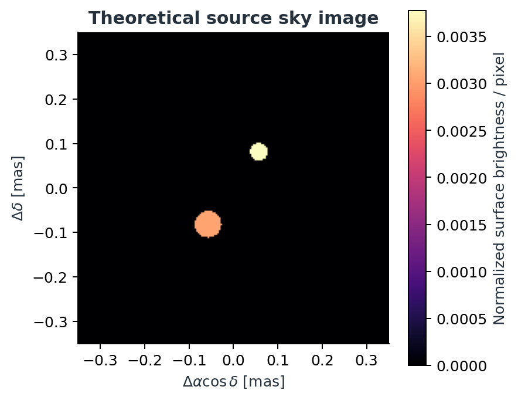

**图 1。** 默认双星的归一化空间亮度。横轴为 $\Delta\alpha\cos\delta$，纵轴为 $\Delta\delta$，单位均为 mas。

### 1.2 用同一接口描述椭圆源和凌日源

完整报告还加入两个解析源模型。均匀椭圆用长轴直径
$\theta_{\rm maj}$、短轴直径 $\theta_{\rm min}$ 和位置角
$\mathrm{PA}$ 描述。先把 $(u,v)$ 旋转到椭圆主轴方向：

$$
u'=u\sin\mathrm{PA}+v\cos\mathrm{PA},\qquad
v'=u\cos\mathrm{PA}-v\sin\mathrm{PA},
$$

再定义

$$
x=\pi\sqrt{(\theta_{\rm maj}u')^2+(\theta_{\rm min}v')^2},
\qquad
V_{\rm ellipse}=\frac{2J_1(x)}{x}.
$$

凌日模型是一颗均匀恒星圆盘减去一个完全位于星盘内的不透明行星圆盘。
令恒星和行星的角直径分别为 $\theta_\star$ 和 $\theta_p$，行星相对
恒星中心的位置为 $(l_p,m_p)$，遮挡面积比例为
$f_p=(\theta_p/\theta_\star)^2$，则归一化复可见度是

$$
V_{\rm transit}(u,v)=
\frac{V_\star(q)-f_pV_p(q)e^{-2\pi i(ul_p+vm_p)}}{1-f_p}.
$$

这里假定星盘表面亮度均匀、行星完全进入星盘，不包含临边昏暗和部分入凌。
三个模型都通过 `source_visibility(...)` 进入同一 UV、波形和重建流程，
因此后面的比较不会为不同源使用不同噪声定义。

---

## 2. 从源模型得到连续理论 UV 平面

### 2.1 归一化复可见度

van Cittert–Zernike 定理把空间亮度和复可见度联系起来：

$$
V(u,v)=\iint I(l,m)
\exp[-2\pi i(ul+vm)]\,dl\,dm.
$$

由于第 1 节已经令 $\iint I\,dl\,dm=1$，此处不再需要分母；若使用未归一化天图，则应再除以总亮度积分。$u$ 和 $v$ 是以波长为单位的投影基线，因此是无量纲空间频率。

强度干涉不直接给出 $V$ 的相位，而是测量

$$
P(u,v)\equiv |V(u,v)|^2.
$$

全文后续统一用 $P$ 表示功率可见度。

### 2.2 均匀圆盘和双星解析式

角直径为 $\theta$ 的均匀圆盘在径向空间频率 $q_{\rm uv}=\sqrt{u^2+v^2}$ 处的可见度为

$$
V_{\rm disk}(q_{\rm uv};\theta)=
\frac{2J_1(\pi\theta q_{\rm uv})}{\pi\theta q_{\rm uv}},
$$

其中 $J_1$ 是第一类一阶贝塞尔函数，$\theta$ 必须用弧度表示。

两颗圆盘组成的双星可见度为

$$
V(u,v)=
\frac{
V_1(q_{\rm uv})e^{-2\pi i(ul_1+vm_1)}+
r_F V_2(q_{\rm uv})e^{-2\pi i(ul_2+vm_2)}
}{1+r_F}.
$$

分离角主要决定 UV 平面中条纹的间距，位置角决定条纹方向，恒星直径决定长基线处的圆盘包络，流量比决定条纹调制度。

### 2.3 为什么要同时画正、负基线

真实亮度 $I(l,m)$ 满足 Hermitian 对称性：

$$
V(-u,-v)=V^*(u,v),
$$

所以

$$
P(-u,-v)=P(u,v).
$$

这是关于原点的中心对称。程序把每个 $(u,v)$ 和 $(-u,-v)$ 用相同显著度绘制，因为两者表示同一条无序基线的共轭点，不是两个独立测量。图上有时看起来更像左右对称，是阵列布局投影、源赤纬、时角范围和双星位置角共同形成的视觉效果；地球自转让各基线沿轨迹移动，但不会把数学上的中心对称改成单纯镜面对称。

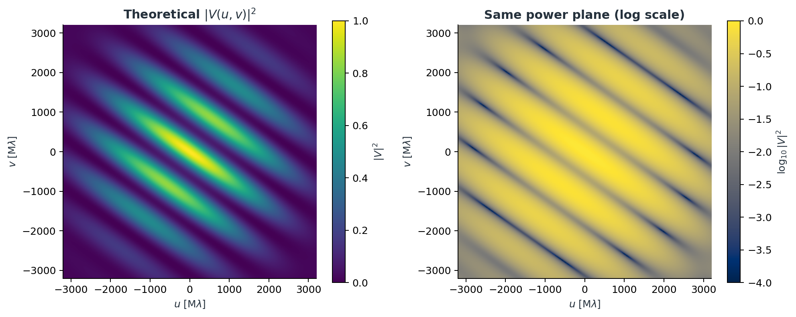

**图 2。** 连续理论 $P(u,v)$。此图只由源模型决定，还没有加入阵列采样或仪器噪声。

---

## 3. 用 32 台望远镜和观测时间生成 UVW

### 3.1 物理基线

令第 $i$ 台望远镜在站点局部东、北、天顶坐标系中的位置为

$$
\mathbf r_i=(E_i,N_i,U_i),
$$

单位为 m。望远镜 $i$ 到 $j$ 的有向物理基线是

$$
\mathbf B_{ij}=\mathbf r_j-\mathbf r_i=(B_E,B_N,B_U).
$$

32 台望远镜共有

$$
N_{\rm bl}=\frac{32\times31}{2}=496
$$

条不重复基线；$N_{\rm bl}$ 表示基线数。

### 3.2 源方向和地球自转

令 $H$ 为源时角，定义为

$$
H(t)=\mathrm{LST}(t)-\alpha,
$$

其中 $\mathrm{LST}$ 是当地恒星时，$\alpha$ 是源赤经，$t$ 是观测时刻。站点纬度记作 $\phi$，源赤纬记作 $\delta$。

在东、北、天顶坐标系中，指向源的单位向量为

$$
\hat{\mathbf s}=
\begin{bmatrix}
\cos\delta\sin H\\
\sin\delta\cos\phi-\cos\delta\cos H\sin\phi\\
\sin\delta\sin\phi+\cos\delta\cos H\cos\phi
\end{bmatrix}.
$$

天空切平面上的两个正交单位向量定义为

$$
\hat{\mathbf u}=
\begin{bmatrix}
\cos H\\
\sin\phi\sin H\\
-\cos\phi\sin H
\end{bmatrix},
$$

$$
\hat{\mathbf v}=
\begin{bmatrix}
-\sin\delta\sin H\\
\cos\delta\cos\phi+\sin\delta\cos H\sin\phi\\
\cos\delta\sin\phi-\sin\delta\cos H\cos\phi
\end{bmatrix}.
$$

于是以 m 为单位的投影坐标为

$$
u_m=\mathbf B_{ij}\cdot\hat{\mathbf u},\qquad
v_m=\mathbf B_{ij}\cdot\hat{\mathbf v},\qquad
w_m=\mathbf B_{ij}\cdot\hat{\mathbf s}.
$$

选择滤光片中心波长 $\lambda_0$ 后，理论可见度所需的无量纲空间频率为

$$
u=\frac{u_m}{\lambda_0},\qquad
v=\frac{v_m}{\lambda_0}.
$$

$w_m$ 是沿视线方向的基线分量，不进入二维天图的 $P(u,v)$，但决定两台望远镜的几何到达时延：

$$
\tau_g=\frac{w_m}{c},
$$

其中 $c=299\,792\,458\ \mathrm{m\,s^{-1}}$ 是真空光速。

### 3.3 观测时间增加的作用

随着 $H(t)$ 改变，同一物理基线在 UV 平面上画出地球自转轨迹。更长的单夜观测同时带来两种收益：

1. 轨迹更长，方向覆盖通常更完整；
2. 对同一统计量累积更久，随机误差按 $T^{-1/2}$ 下降。

但低高度角处的大气消光、背景、滤光片角响应和光学 PSF 可能变差，因此程序设置最低高度角门槛，而不是无条件使用地平线附近数据。跨夜重复相同时角主要提高统计量，不会创造全新的 UV 轨迹。

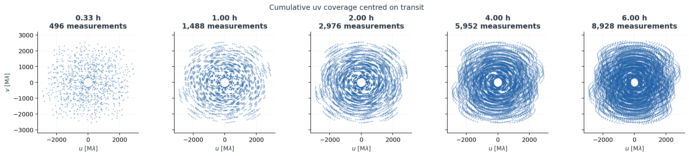

**图 3。** 不同观测时长下 32 台望远镜的累计几何 UV 覆盖。该图只表示采样位置；正、负基线显著度相同。

---

## 4. 从 AB 星等得到单镜光电子率

这一节先确定每台望远镜每秒收到多少恒星和背景光电子。只有先有光电子率，后面才能推导相关对数和 SNR。

### 4.1 光学频带

当前模拟场景选择的中心波长为

$$
\lambda_0=400\ \mathrm{nm},
$$

并假设一个等效宽度为

$$
\Delta\lambda=2\ \mathrm{nm}.
$$

这里必须区分“LACT 当前已有硬件”和“SII 性能研究的场景参数”：main 提供了镜面、滤光片透过率和 PDE 曲线在 400 nm 附近的响应，但没有提供一片已经确定用于恒星强度干涉、等效带宽恰好为 2 nm 的实物窄带滤光片。因此 $\lambda_0=400\ \mathrm{nm}$、$\Delta\lambda=2\ \mathrm{nm}$ 目前是可替换的 SII 基准假设，不是 LACT 已定型滤光片的实测结论。

SII 常使用 nm 量级或更窄的光学通道，原因包括延长光学相干时间、抑制 NSB、减轻宽带色散和允许多个独立光谱通道分别相关。但“单通道越窄，理想 SNR 就越高”并不成立：在平坦连续谱和散粒噪声极限下，窄带使 $r_\star\propto\Delta\nu$ 下降，同时使 $\tau_{\rm eff}\propto1/\Delta\nu$ 上升，因此 $r_\star\tau_{\rm eff}$ 近似不变。真实系统中 NSB、谱线、PDE、电子噪声、计数率饱和和滤光片角响应会打破这种理想抵消，所以最终带宽需要扫描优化，不能把 2 nm 当成普适最优值。

窄带近似下，波长宽度对应的光学频率带宽为

$$
\Delta\nu\simeq
\left|\frac{d\nu}{d\lambda}\right|_{\lambda_0}\Delta\lambda
=\frac{c\,\Delta\lambda}{\lambda_0^2}.
$$

代入当前参数得到

$$
\Delta\nu=3.7474\times10^{12}\ \mathrm{Hz}
=3.7474\ \mathrm{THz}.
$$

$\Delta\nu$ 是**光学频带宽度**，不是 ADC 或相关器带宽。它同时进入第 4.2 节的光子率和第 5.2 节的相干面积；附录 A 给出为什么 $\int|g^{(1)}|^2d\tau\propto1/\Delta\nu$ 的完整推导。

### 4.2 AB 星等和恒星光电子率

AB 星等 $m_{\rm AB}$ 对应的谱能流密度为

$$
F_\nu=3631\ \mathrm{Jy}\times10^{-0.4m_{\rm AB}},
$$

其中 $1\ \mathrm{Jy}=10^{-26}\ \mathrm{W\,m^{-2}\,Hz^{-1}}$。中心波长处单个光子的能量为

$$
E_\gamma=h\nu_0=\frac{hc}{\lambda_0},
$$

其中 $h$ 是普朗克常数，$\nu_0=c/\lambda_0$ 是中心光频率。因此入射光子谱密度为

$$
n_\nu=\frac{F_\nu}{E_\gamma},
$$

单位是 $\mathrm{s^{-1}\,m^{-2}\,Hz^{-1}}$。

令 $A_{\rm col}$ 表示遮挡后用于归一化的收集面积，$\eta_{\rm det}$ 表示从该面积到中心像素产生光电子的总探测效率。窄带内近似不变时，第 $i$ 台望远镜的恒星光电子率为

$$
r_{\star,i}=A_{{\rm col},i}\,\eta_{{\rm det},i}\,n_\nu\,\Delta\nu.
$$

当前 400 nm 单像素光追给出中心像素有效探测面积 $5.92276\ \mathrm{m^2}$；再乘当前上游大气/未单列传输因子 $0.7836336$，得到净面积效率乘积

$$
A_{\rm col}\eta_{\rm det}=4.64128\ \mathrm{m^2}.
$$

代码为兼容 main 配置，将它写成

$$
A_{\rm col}=24.57686\ \mathrm{m^2},\qquad
\eta_{\rm det}=0.188847,
$$

两种写法的乘积完全相同。默认 $m_{\rm AB}=2$ 时得到

$$
r_\star=2.01548\times10^8\ \mathrm{s^{-1}}
=201.548\ \mathrm{MHz}.
$$

这里的 MHz 表示“每秒百万个光电子”，不是电子带宽。

### 4.3 NSB、暗计数和总计数率

令 $r_{{\rm NSB},i}$ 为单像素夜天光背景光电子率，$r_{{\rm dark},i}$ 为 SiPM 暗计数率。总光电子率为

$$
r_{{\rm tot},i}=r_{\star,i}+r_{{\rm NSB},i}+r_{{\rm dark},i}.
$$

当前 main 的宽带相机响应和暗夜天空模型积分给出

$$
r_{\rm NSB}=70.5275\ \mathrm{MHz},
$$

这个数并不是经过假设 2 nm SII 窄带片后的 NSB。当前 notebook 将它保留为保守背景压力值，所以时间响应研究仍有效，但光谱灵敏度不是最终自洽硬件预测。最终版本需要定义同一个总光谱响应 $T(\lambda)$，并用它分别积分恒星和 NSB；在此之前，不应把 70.5275 MHz 称为“2 nm 通道的背景率”。

暗计数因尚无本型号实测输入而暂设为

$$
r_{\rm dark}=0.
$$

所以默认单镜总率为

$$
r_{\rm tot}=272.075\ \mathrm{MHz}.
$$

恒星光子、NSB 和暗计数都按 Poisson 点过程产生，因此每台望远镜自身的光子数涨落已包含。NSB 和暗计数增加分母中的总散粒噪声，但不产生跨望远镜的天体 HBT 信号。

---

## 5. 光学频带如何决定 HBT 信号面积

### 5.1 从二阶相关到功率可见度

令 $J_i(t)$ 是第 $i$ 台望远镜的瞬时探测强度，$\delta J_i(t)=J_i(t)-\langle J_i\rangle$ 是强度涨落。使用 $J$ 是为了不与第 1 节的天空亮度 $I(l,m)$ 混淆。归一化二阶相关定义为

$$
g_{ij}^{(2)}(\tau)-1=
\frac{\langle\delta J_i(t)\,\delta J_j(t+\tau)\rangle}
{\langle J_i\rangle\langle J_j\rangle},
$$

其中 $\tau$ 是两路信号的相对时间延迟。对混乱热光，Siegert 关系给出

$$
g_{ij}^{(2)}(\tau)-1
=P(u,v)\,|g^{(1)}(\tau)|^2
$$

的单偏振理想形式，其中 $g^{(1)}(\tau)$ 是归一化时间一阶相干函数。实际系统把多个不可区分偏振模式和非矩形光谱合并后，最稳定的量不是无法被 ns 电子学直接分辨的峰高，而是峰面积。

### 5.2 有效相干面积 $\tau_{\rm eff}$

本文定义

$$
\tau_{\rm eff}
\equiv p_{\rm pol}
\int_{-\infty}^{\infty}|g^{(1)}(\tau)|^2\,d\tau
=\frac{p_{\rm pol}s_{\rm spec}}{\Delta\nu}.
$$

这里严格出现的是 $1/\Delta\nu$，不是直接的 $1/\Delta\lambda$。二者只通过窄带近似

$$
\frac{1}{\Delta\nu}\simeq
\frac{\lambda_0^2}{c\,\Delta\lambda}
$$

相互转换。直观上，频谱越宽，包含的不同光频越多，它们在延迟轴上越快失相干，所以相关峰越窄；频谱越窄，相关峰越宽。附录 A 从归一化矩形频谱的傅里叶变换和 Parseval 定理完整推导这个关系。

这里：

- $p_{\rm pol}$ 是偏振稀释因子；当前探测两种互不相干偏振，总计数率不分偏振，因此 $p_{\rm pol}=0.5$；
- $s_{\rm spec}$ 是实际或假设的归一化谱形相对理想矩形频带的峰面积修正；当前基准模型假设 $s_{\rm spec}=0.842$，它尚不是 LACT 实物 SII 滤光片的标定值；
- $\Delta\nu$ 是第 4.1 节已经定义的光学频率带宽。

代入当前值：

$$
\tau_{\rm eff}
=\frac{0.5\times0.842}{3.7474\times10^{12}}
=1.12344\times10^{-13}\ \mathrm{s}
=112.344\ \mathrm{fs}.
$$

代码属性 `coherence_area_s` 就是这里唯一的 $\tau_{\rm eff}$。它有时间单位，是“理想 HBT 峰的有效积分面积”，不是 DC 光学到达时间 RMS，也不是 SPE 脉冲宽度。

### 5.3 物理相关对率

先说明“超额相关”是什么意思。若两台望远镜接收到完全独立的光子流，它们仍会偶然在同一时间窗内各记录到光电子，这形成一个很大的无相关本底。热光的光子聚束使两路强度涨落在正确几何延迟处多出一个很小的正协方差：

$$
\langle\delta I_i(t)\,\delta I_j(t+\tau_g)\rangle>0,
$$

其中 $\delta I_i=I_i-\langle I_i\rangle$ 是望远镜 $i$ 的去均值强度涨落，$\tau_g$ 是第 3.2 节定义的几何时延。“HBT 超额相关”就是这部分**高于两路独立光子偶然符合本底的相关量**；它不是凭空增加新的光子，也不是指某个光子被两台望远镜同时探测。

校正几何时延后，这个超额协方差可以等价写成恒星热光产生的额外相关光电子对率：

$$
R_{{\rm pair},ij}
=r_{\star,i}r_{\star,j}\,\tau_{\rm eff}\,P(u_{ij},v_{ij}).
$$

$R_{{\rm pair},ij}$ 的单位是 $\mathrm{s^{-1}}$。默认案例在一条过中天基线上有 $P\simeq0.149476$，从而

$$
R_{\rm pair}=682.15\ \mathrm{s^{-1}}.
$$

在短波形 Monte Carlo 中，程序用稀疏“共享相关对”实现这个二阶矩；`hbt_pair_id` 只是模拟标签，真实仪器不能逐个判断哪个光电子属于 HBT 超额项。真实测量只能从大量样本的平均协方差中估计这部分微小超额。

这条公式是短波形和长曝光模拟共同的物理起点。后面两条路径必须从同一个 $R_{\rm pair}$ 或等价的 $\tau_{\rm eff}$ 出发，才能保证闭合。

---

## 6. 仪器时间响应和有效相关带宽

第 5 节给出了 HBT 信号的总面积。本节回答：这个面积经过 DC 光学时间弥散、SiPM 脉冲和 ADC 后在时间轴上如何展开，以及它的统计信息还能保留多少。

### 6.1 单镜光学到达时间核

令 $K_{\rm opt}(t)$ 是一个瞬时入射光子到达单像素后产生光电子的归一化延迟概率密度，满足

$$
\int K_{\rm opt}(t)\,dt=1.
$$

当前核来自 main 的 400 nm、纯平行光、中心 24.4 mm 单像素、100 万光子完整光追。光追包含镜面分面、遮挡、PSF、相机几何、集光器、滤光片和 PDE。公共传播时间已减去，只保留相对展宽。当前得到

$$
\sigma_{\rm opt}=0.548827\ \mathrm{ns},
$$

其中 $\sigma_{\rm opt}$ 是 $K_{\rm opt}(t)$ 的标准差。两台相同望远镜的相对延迟核是两个单镜核的互相关；若只用 RMS 近似，其宽度为

$$
\sigma_{\rm pair}\simeq\sqrt{2}\,\sigma_{\rm opt}=0.776\ \mathrm{ns}.
$$

因此 DC 结构确实影响 HBT 峰形：它把相关峰展宽并降低未校正的零延迟峰高。但归一化光学核不改变第 5 节的总相关面积。

当前只使用轴上响应。不同天顶角、方位角下的光学 PSF、到达时间核和滤光片角响应尚无 main 标定文件，因此接口保留、修正量当前设为 0；这不能被表述为“已证明方向无关”。

### 6.2 实测单 PE 波形和 SiPM 电荷

令 $h_{\rm SPE}(t)$ 表示一个光电子对应的实测电压脉冲模板。当前模板来自 537 个干净单 PE 脉冲，时间支撑约从 $-40\ \mathrm{ns}$ 延伸到 $+170$ 至 $183\ \mathrm{ns}$。支撑长度表示脉冲尾部持续多久，不等于可用相关带宽的简单倒数。

每个光电子还抽取归一化电荷因子 $a_k$。规定 $\langle a_k\rangle=1$，并定义

$$
F_{\rm EN}\equiv\sqrt{\langle a_k^2\rangle}.
$$

$F_{\rm EN}$ 是归一化单 PE 电荷的均方根。单路散粒噪声方差乘以
$\langle a_k^2\rangle=F_{\rm EN}^2$；两路独立噪声乘积的标准差也因此
乘以 $F_{\rm EN}^2$，所以双通道相关的 SNR 惩罚因子是
$F_{\rm EN}^2$，不是 $F_{\rm EN}$。当前 537 个实测电荷样本给出

$$
F_{\rm EN}=1.016142.
$$

微单元恢复使用指数模型。若同一微单元距上次击中的间隔为 $\Delta t_{\rm cell}$，恢复电荷比例为

$$
f_{\rm rec}=1-\exp\left(-\frac{\Delta t_{\rm cell}}{\tau_{\rm rec}}\right),
$$

其中 $\tau_{\rm rec}$ 是微单元恢复时间，当前暂取 $10\ \mathrm{ns}$。一个像素有 270336 个微单元；默认总率下平均占用极低，所以该效应很小，但短波形逐击中模拟仍保留它。

### 6.3 ADC 时间网格

令 $\Delta t_{\rm samp}$ 为 ADC 采样间隔。main 当前给出

$$
\Delta t_{\rm samp}=4\ \mathrm{ns}.
$$

因此采样率和 Nyquist 频率分别为

$$
f_s=\frac{1}{\Delta t_{\rm samp}}=250\ \mathrm{MS/s},
$$

$$
f_{\rm Nyq}=\frac{f_s}{2}=125\ \mathrm{MHz}.
$$

$f_{\rm Nyq}$ 是任何数字相关器可利用的最高频率上限。main 尚未给出独立标定的前端模拟带宽、ADC 位数、满量程和电子噪声，因此当前计算中 ADC 量化与附加电子噪声关闭；接口保留，数值均为 0。

短记录不能只等于 170 ns SPE 长度，否则边界脉冲会被截断，也不足以统计相关波动。当前显式短波形使用有效记录时长

$$
T_{\rm rec}=2\ \mu\mathrm{s},
$$

对应 500 个 4 ns 采样点，并在有效区两侧额外生成光电子以覆盖完整 SPE 尾部。若目的是直接看物理强度干涉信号，2 µs 仍然太短；它的作用是检查链路和统计闭合。

### 6.4 从时间核推导 $B_{\rm eff}$

先定义光学时间核的傅里叶变换

$$
H_{\rm opt}(f)=\int K_{\rm opt}(t)e^{-2\pi ift}\,dt.
$$

对两台相同望远镜，HBT 交叉谱的光学时间响应为 $|H_{\rm opt}(f)|^2$。令 $S_{\rm shot}(f)$ 表示由恒星、NSB 和暗计数产生的散粒噪声功率谱，$S_{\rm add}(f)$ 表示与光子流无关的附加电子噪声功率谱，并定义散粒噪声占比

$$
\eta_{\rm shot}(f)=
\frac{S_{\rm shot}(f)}{S_{\rm shot}(f)+S_{\rm add}(f)}.
$$

$\eta_{\rm shot}(f)$ 介于 0 和 1；当前因 $S_{\rm add}=0$，所以 $\eta_{\rm shot}(f)=1$。

对于使用已知峰形的匹配相关器，本文把有效相关带宽定义为

$$
B_{\rm eff}\equiv
\int_0^{f_{\rm Nyq}}
|H_{\rm opt}(f)|^4\eta_{\rm shot}^2(f)\,df.
$$

这个定义的含义是：一个带宽为 $B_{\rm eff}$ 的理想矩形、散粒噪声受限相关器，与当前真实响应具有相同的 $\mathrm{SNR}^2$。四次方来自两步：两镜交叉谱先得到 $|H_{\rm opt}|^2$，匹配滤波的 $\mathrm{SNR}^2$ 再对信号谱的平方积分。

当前 $K_{\rm opt}$ 是光追得到的离散混合分布。notebook 先计算 $H_{\rm opt}(f)$，再从 0 到 $125\ \mathrm{MHz}$ 数值积分上式，得到

$$
\boxed{B_{\rm eff}=110.910\ \mathrm{MHz}}.
$$

所以 110.91 MHz 不是手工选择或拟合参数，而是以下输入共同决定的**理想匹配上限**：

1. 4 ns 采样给出的积分上限 $f_{\rm Nyq}=125\ \mathrm{MHz}$；
2. 100 万光子光追给出的 $H_{\rm opt}(f)$；
3. 当前附加电子噪声为 0，因此 $\eta_{\rm shot}(f)=1$。

等效地说，真实光学时间响应在这段频带内保留了约

$$
\frac{B_{\rm eff}}{f_{\rm Nyq}}=0.8873
$$

的匹配统计带宽。notebook 另外给出的 `rectangular_optical_retention=0.9407` 是 $|H_{\rm opt}|^2$ 的频带平均值，描述未匹配矩形零延迟峰高；它与积分 $|H_{\rm opt}|^4$ 定义的 $B_{\rm eff}/f_{\rm Nyq}$ 不是同一个量。

第 8.2 节将从计数统计推导出 $\mathrm{SNR}\propto\sqrt{B_{\rm eff}}$。该解析式用于检查量纲并给出理想最优处理的基准，不再直接决定新方法的最终误差。新方法让实测 SPE、光学核、采样和相关算法通过 $\boldsymbol k$ 与 $\boldsymbol\Sigma$ 自动进入结果。与无时间展宽的 125 MHz 上限相比，理想光学核使 SNR 乘以

$$
\sqrt{\frac{110.910}{125}}=0.942,
$$

即降低约 $5.8\%$；达到相同 SNR 所需的曝光时间增加为

$$
\frac{125}{110.910}=1.127,
$$

即约增加 $12.7\%$。这说明当前 $0.549\ \mathrm{ns}$ 单镜光学展宽有影响，但对匹配相关器不是灾难性的。若直接使用原始零延迟协方差，则实测长 SPE 尾部使带宽进一步降到下一节的 $B_{\rm raw}=14.02\ \mathrm{MHz}$，损失会大得多。

### 6.5 为什么 170 ns SPE 没把最优带宽降到几 MHz

令

$$
H_{\rm SPE}(f)=\int h_{\rm SPE}(t)e^{-2\pi ift}\,dt
$$

为实测 SPE 模板的傅里叶变换。在线性、稳定且散粒噪声占主导时，SPE 会同时滤波 HBT 信号和光子散粒噪声。若 $H_{\rm SPE}$ 和噪声谱被无限精确地知道，而且允许稳定白化，理想匹配相关器可在有响应的频率上做最优加权。因此 170 ns 尾部不应被简单替换成 $1/170\ \mathrm{ns}$ 的硬带宽；但有限标定、协方差正则化和不能稳定反卷积的弱频率会造成真实代价。图 8 的波形 GLS 正是对这个代价的直接测量。

但是，若直接取两条原始电压波形的零延迟协方差而不做匹配加权，长 SPE 尾部会显著增加相邻样点相关性。本文为这个原始估计器定义

$$
B_{\rm raw}\equiv
\frac{
\left[\int_0^{f_{\rm Nyq}}
|H_{\rm SPE}(f)|^2|H_{\rm opt}(f)|^2\,df\right]^2
}{
\int_0^{f_{\rm Nyq}}|H_{\rm SPE}(f)|^4\,df
}.
$$

当前实测 SPE、4 ns 采样和光学核给出

$$
B_{\rm raw}=14.0217\ \mathrm{MHz}.
$$

因此同样积分时间下，原始零延迟估计器与匹配估计器的 SNR 比约为

$$
\sqrt{\frac{B_{\rm raw}}{B_{\rm eff}}}=0.356,
$$

即误差约大 2.81 倍，需要约 $B_{\rm eff}/B_{\rm raw}=7.91$ 倍曝光才能达到相同精度。

如果将来加入实测电子噪声，$H_{\rm SPE}$ 会通过 $\eta_{\rm shot}(f)$ 影响最优带宽，因为高频处信号和散粒噪声虽同时变小，附加电子噪声却不一定同步变小。那时必须用实测噪声功率谱重新计算 $B_{\rm eff}$，不能继续沿用 110.91 MHz。

---

## 7. 两台望远镜的完整短波形怎样生成和相关

### 7.1 逐光电子生成，而不是逐电磁波振荡生成

光学载波频率约为 $10^{15}\ \mathrm{Hz}$，没有必要也无法用 4 ns ADC 直接采样电场振荡。探测器输出由光电子点过程决定，因此短波形模拟按以下顺序进行：

1. 分别按 $r_\star$、$r_{\rm NSB}$ 和 $r_{\rm dark}$ 抽取 Poisson 光电子到达时间；
2. 按第 5.3 节的 $R_{{\rm pair},ij}$ 抽取额外的 HBT 相关对；
3. 对两镜各自的光电子抽取 $K_{\rm opt}(t)$ 延迟；
4. 随机分配 SiPM 微单元，应用 $\tau_{\rm rec}=10\ \mathrm{ns}$ 恢复；
5. 为每个光电子抽取实测电荷因子 $a_k$；
6. 将每个击中与实测 $h_{\rm SPE}(t)$ 卷积；
7. 加入已配置的电子噪声和 ADC 量化；当前两项均为 0；
8. 在 $\Delta t_{\rm samp}=4\ \mathrm{ns}$ 网格上得到两路电压波形 $x_i[n]$ 和 $x_j[n]$。

相关对构造是热光二阶统计量的 Monte Carlo 表示，不表示“同一颗光子被两台望远镜同时探测”。它保证额外协方差的期望值等于第 5.3 节的物理相关面积。

### 7.2 先校正几何时延，再相关

第 3.2 节已经定义几何时延 $\tau_g=w_m/c$。程序将其中一路移位到共同时间坐标后，计算去均值离散相关：

$$
\widehat C_{ij}[k]=
\frac{1}{N_k}
\sum_n
\bigl(x_i[n]-\bar x_i\bigr)
\bigl(x_j[n+k]-\bar x_j\bigr),
$$

其中 $k$ 是离散延迟索引，$N_k$ 是该延迟下重叠样点数，$\bar x_i$ 是记录内平均电压。归一化后为

$$
\widehat\rho_{ij}[k]=
\frac{\widehat C_{ij}[k]}
{\widehat\sigma_i\widehat\sigma_j},
$$

其中 $\widehat\sigma_i$ 和 $\widehat\sigma_j$ 是两路波形的样本标准差。

不能先把整段波形积分成单个总电荷

$$
Q_i=\int x_i(t)\,dt
$$

再只相关 $Q_i$ 和 $Q_j$，因为那会丢失纳秒尺度的时间结构。可以等价地相关细时间格 PE 序列或经过已知线性响应的电压波形，但必须保留相对于 $B_{\rm eff}$ 足够细的时间信息。

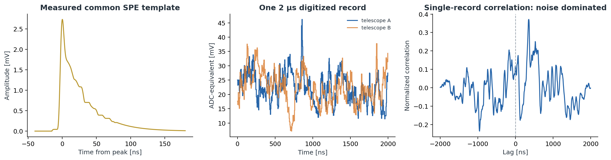

**图 4。** 左：实测 SPE 模板。中：同一次 2 µs Monte Carlo 得到的 A、B 两台望远镜电压波形。右：直接由中图这两条波形计算的归一化延迟相关。右图确实与中图一一对应，但其起伏由有限记录噪声主导；零延迟附近没有可识别的物理 HBT 峰。

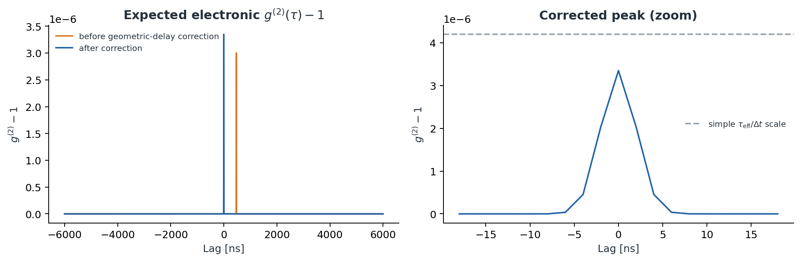

**图 5。** 由 $\tau_{\rm eff}$、该基线的 $P$、几何时延、光学时间核和采样响应计算的**期望电子相关峰形**。它不是图 4 那一次随机波形的测量相关；图中没有叠加 2 µs 记录的随机噪声，所以能看见均值只有几 $\times10^{-6}$ 的理论峰。

### 7.3 图 4 和图 5 的关系

两图使用相同的源、基线、光子率和仪器响应，但表示不同统计对象：

- 图 4 是一次有限样本 realization；中图两条电压波形直接产生右图的噪声主导相关曲线。
- 图 5 是把同一随机实验无限重复后相关曲线的期望值，也可由已知传递函数直接算出。

因此“图 5 有理论峰”和“图 4 的 2 µs 实测相关看不见峰”可以同时成立。类比来说，单次抛硬币可能严重偏离 50%，但概率模型的期望仍是 50%。只有累积足够多独立时间样本，图 4 类型的测量平均值才逐渐趋近图 5。

更准确地说，每个 2 µs 片段有超额相关对的概率虽只有约 $0.1364\%$，但 20 min 包含

$$
N_{\rm rec}=\frac{1200\ \mathrm{s}}{2\ \mu\mathrm{s}}=6.0\times10^8
$$

个这样的片段。20 min 内的超额相关对期望总数为

$$
\langle N_{\rm HBT}\rangle
=R_{\rm pair}T
=682.15\times1200
\simeq8.19\times10^5.
$$

没有超额相关对的短片段占绝大多数，但它们的去均值随机相关有正有负，平均时主要互相抵消；少数 HBT 超额项总在校正后的同一延迟处贡献正均值，于是累计平均逐渐留下图 5 的峰形。峰的**期望存在**不等于一次有限曝光中峰已被显著测出，显著度仍由第 8.2 节的 SNR 决定。

### 7.4 为什么 2 µs 看不到真实 HBT 峰

一次记录中期望物理相关对数为

$$
\mu_{\rm pair}=R_{\rm pair}T_{\rm rec}.
$$

默认过中天示例代入 $R_{\rm pair}=682.15\ \mathrm{s^{-1}}$ 和 $T_{\rm rec}=2\ \mu\mathrm{s}$，得到

$$
\mu_{\rm pair}=1.364\times10^{-3}.
$$

若相关对计数服从 Poisson 分布，完全没有相关对的概率为

$$
\Pr(N_{\rm pair}=0)=e^{-\mu_{\rm pair}}=99.864\%.
$$

因此一条真实强度的 2 µs 波形几乎必然没有额外相关对，不能据此判断天体是否可见。程序使用两个互补检查：

- 零增强：测量纯噪声底和估计器方差；
- 仅增强 HBT 相关对：不改变恒星独立光子和 NSB，用已知倍数放大相关项，验证测量峰与预测值一致。

增强 10000 倍时，实测原始零延迟相关为 $0.02394\pm0.00629$，预测为 $0.02420$，说明从相关对、光学核、SPE 到相关器的实现闭合。

---

## 8. 从短记录推广到长曝光统计量

### 8.1 为什么可以不保存整夜波形

若系统在一个统计时间段内近似平稳、响应线性、时延已校正，而且 $K_{\rm opt}$、$h_{\rm SPE}$ 和噪声已经由短波形链路标定，那么关于 $P$ 的信息可压缩为完整相关峰模板 $\boldsymbol k$、零点 $\boldsymbol c_0$ 和协方差 $\boldsymbol\Sigma$。250 MS/s 连续记录 6 小时，每台望远镜有 $5.4\times10^{12}$ 个样点；32 台超过 $10^{14}$ 个样点。逐点保存和卷积不会增加新的天体统计信息，只会极大增加计算量。

因此新设计是：短波形负责得到实际估计器的充分统计量，长曝光严格缩放同一个统计量。它不再要求假定一个 $B_{\rm eff}$ 就等于当前算法真正达到的带宽。

### 8.2 原始解析长曝光方法：保留为理想上限

令 $T_{\rm seg}$ 为一条基线在一个时间段内的有效积分时长。先用计数窗口的图像推导 SNR，再把真实响应等效为第 6 节的 $B_{\rm eff}$。

在本文的单边带宽约定下，定义等效独立时间窗口

$$
\Delta t_{\rm eff}\equiv\frac{2}{B_{\rm eff}}.
$$

$\Delta t_{\rm eff}$ 不是 4 ns ADC 采样间隔，也不是 SPE 长度；它是把匹配相关器的信息量换算成理想矩形相关器后，一个统计自由度所占的等效时间。令 $N_i$ 和 $N_j$ 是一个等效窗口内两台望远镜记录的总光电子数，其 Poisson 均值分别为

$$
\mu_i=r_{{\rm tot},i}\Delta t_{\rm eff},
\qquad
\mu_j=r_{{\rm tot},j}\Delta t_{\rm eff}.
$$

相关器实际使用去均值计数涨落

$$
\delta N_i=N_i-\mu_i,
\qquad
\delta N_j=N_j-\mu_j,
$$

而不是直接把原始 $N_iN_j$ 当成天体信号。一个窗口内，来自恒星的 HBT 超额相关使 $\delta N_i\delta N_j$ 出现非零期望值；由第 5.3 节的相关对率得到：

$$
\mu_{{\rm HBT},ij}
=r_{\star,i}r_{\star,j}\tau_{\rm eff}P_{ij}\Delta t_{\rm eff},
$$

其中 $P_{ij}=P(u_{ij},v_{ij})$ 是该基线和时刻的理论功率可见度。若先忽略很弱的 HBT 协方差，两路无相关 Poisson 涨落满足

$$
\mathrm{E}[\delta N_i\delta N_j]=0.
$$

但是它在一次有限测量中不会恰好等于 0。由于独立 Poisson 变量有

$$
\mathrm{Var}(N_i)=\mu_i,
\qquad
\mathrm{Var}(N_j)=\mu_j,
$$

乘积 $X_{ij}=\delta N_i\delta N_j$ 的方差为

$$
\begin{aligned}
\mathrm{Var}(X_{ij})
&=\mathrm{E}[\delta N_i^2]\,\mathrm{E}[\delta N_j^2]\\
&=\mu_i\mu_j\\
&=r_{{\rm tot},i}r_{{\rm tot},j}\Delta t_{\rm eff}^2.
\end{aligned}
$$

所以无相关随机符合留下的标准差为

$$
\sigma_{{\rm acc},ij}
=\sqrt{\mathrm{Var}(X_{ij})}
=\sqrt{r_{{\rm tot},i}r_{{\rm tot},j}}\,\Delta t_{\rm eff}.
$$

这个表达来自**去均值的两路 Poisson 涨落乘积的方差**。如果直接研究未去均值的原始乘积 $N_iN_j$，还会出现额外高阶项；当前 HBT 相关器先减均值，因此不使用那个表达。在 HBT 信号远小于总散粒噪声时，忽略信号本身对方差的微小修正是合理近似。

因此单个等效窗口的信噪比是

$$
\frac{\mu_{{\rm HBT},ij}}{\sigma_{{\rm acc},ij}}
=\frac{r_{\star,i}r_{\star,j}\tau_{\rm eff}}
{\sqrt{r_{{\rm tot},i}r_{{\rm tot},j}}}P_{ij}.
$$

$\Delta t_{\rm eff}$ 在单窗口信号和噪声中相消。一个 $T_{\rm seg}$ 时间段包含

$$
M_{\rm eff}=\frac{T_{\rm seg}}{\Delta t_{\rm eff}}
=2B_{\rm eff}T_{\rm seg}
$$

个等效独立时间自由度，其中 $M_{\rm eff}$ 是有效独立样本数。独立样本的 SNR 按 $\sqrt{M_{\rm eff}}$ 合并；再除以双通道单 PE 电荷涨落惩罚 $F_{\rm EN}^2$，便得到

$$
\boxed{
\mathrm{SNR}_{ij}=
\frac{r_{\star,i}r_{\star,j}\tau_{\rm eff}}
{\sqrt{r_{{\rm tot},i}r_{{\rm tot},j}}}
\,P_{ij}
\sqrt{2B_{\rm eff}T_{\rm seg}}
\frac{1}{F_{\rm EN}^2}
}.
$$

这不是突然引入的经验公式，而是“每个窗口的 HBT 超额相关对 ÷ 随机符合涨落”，再乘“独立窗口数的平方根”。推导使用弱相关、Poisson 散粒噪声主导、时间段内平稳、匹配响应已知的近似；附录 B 再用量纲和极限情况检查该公式。

公式中的每个量都已在前文定义：

- $r_{\star}$ 和 $r_{\rm tot}$ 来自第 4 节；NSB 只增加 $r_{\rm tot}$，所以会降低 SNR；
- $\tau_{\rm eff}$ 来自第 5 节，包含光学频带、偏振和谱形；
- $P_{ij}$ 来自第 2 节并在第 3 节的 UV 点上取值；
- $B_{\rm eff}$ 来自第 6.4 节，包含光学时间展宽、采样和已知电子噪声权重；
- $T_{\rm seg}$ 是本次统计积分时间；
- $F_{\rm EN}$ 来自第 6.2 节的实测单 PE 电荷涨落，双通道相关中进入 $F_{\rm EN}^2$；
- 因子 $2$ 来自单边带宽的实值自由度计数：正、负频率互为共轭，
  但一个宽度为 $B_{\rm eff}$ 的单边频带在时长 $T_{\rm seg}$ 内仍有
  $2B_{\rm eff}T_{\rm seg}$ 个独立实自由度。极限检查是
  $B_{\rm eff}=f_s/2$ 时，$M_{\rm eff}=f_sT_{\rm seg}$，正好等于 ADC
  样点数；旧写法 $B_{\rm eff}T_{\rm seg}/2$ 会少计 4 倍自由度，使
  SNR 保守地低估 2 倍。

这里没有重复计算：$\tau_{\rm eff}$ 决定超窄光学相干峰的总面积，$B_{\rm eff}$ 决定纳秒电子系统能以多少独立时间模态估计这块面积。

为方便表达误差，定义单位功率可见度的 SNR：

$$
S_{ij}^{(1)}\equiv
\frac{r_{\star,i}r_{\star,j}\tau_{\rm eff}}
{\sqrt{r_{{\rm tot},i}r_{{\rm tot},j}}}
\sqrt{2B_{\rm eff}T_{\rm seg}}
\frac{1}{F_{\rm EN}^2}.
$$

于是

$$
\mathrm{SNR}_{ij}=P_{ij}S_{ij}^{(1)},
\qquad
\sigma_{P,ij}=\frac{1}{S_{ij}^{(1)}},
$$

其中 $\sigma_{P,ij}$ 是一次 $P_{ij}$ 测量的标准差。注意 $\sigma_P$ 与真实 $P$ 无关，而实际信号显著度随 $P$ 线性下降。

默认相同望远镜、$m_{\rm AB}=2$、参考 NSB、$T_{\rm seg}=1200\ \mathrm{s}$ 时：

$$
S^{(1)}=8.38108,
\qquad
\sigma_P=0.119316.
$$

前述示例基线 $P=0.149476$ 的实际单段显著度只有

$$
\mathrm{SNR}=0.149476\times8.38108=1.253.
$$

这说明该基线的单个 20 分钟 UV 点仍然只有约 $1.25\sigma$，不能单独作为可靠检出；组合 496 条基线和多个时间段后，整体条纹结构的约束才明显增强。

$\mathrm{SNR}=1$ 只表示信号期望值等于一次测量的 $1\sigma$ 标准差，不是高显著性检出。若误差近似高斯，单个预先指定位置的双侧 $1\sigma$ 偏离在纯噪声下并不罕见；单点通常至少需要约 $3\sigma$ 才能称为有证据，严格发现往往要求更高并考虑多重检验。低于 $1\sigma$ 的点仍可作为带大误差的无偏数据参与联合拟合，但不能单独声称看见 HBT 峰。

因此，若连续模拟20 min完整波形并使用第6.4节假定的**无限精确、稳定可逆的理想匹配器**，统计分布应接近本节解析上限，而不是每个短片段先判断“有峰/无峰”再投票。但当前实际实现的是由有限记录标定并正则化的完整峰GLS，它达到的 $\sigma_P=0.19225$，不等于解析上限0.11932。这个差别正是新方法需要测量、而旧方法预先假设掉的估计器代价。

### 8.3 新方法第一步：把完整相关峰写成向量

对每一个有效短记录，程序计算第 7.2 节定义的全部滞后相关，并把它们按固定顺序组成

$$
\boldsymbol c_q=
\begin{bmatrix}
\widehat\rho_q(\tau_1)&\widehat\rho_q(\tau_2)&\cdots&
\widehat\rho_q(\tau_L)
\end{bmatrix}^{\mathsf T},
$$

其中 $q$ 是短记录编号，$L$ 是滞后采样数。当前使用
$-200\ \mathrm{ns}\le\tau\le200\ \mathrm{ns}$、4 ns 间隔，所以
$L=101$。这个窗口覆盖实测 SPE 的主体与尾部，不只读取 $\tau=0$ 的一个数。

弱 HBT 相关在线性范围内满足

$$
\mathrm E[\boldsymbol c\mid P]
=\boldsymbol c_0+P\boldsymbol k,
$$

其中 $\boldsymbol c_0$ 是无天体相关时的平均零点，$\boldsymbol k$ 是单位
$P$ 对应的完整峰模板。当前模拟没有跨望远镜共享电子噪声，所以总体
$\boldsymbol c_0=\boldsymbol0$；真实数据必须用离源、错延迟或其他零相关数据标定它。

### 8.4 新方法第二步：独立标定 $\boldsymbol k$ 和 $\boldsymbol\Sigma$

当前默认短块时长为

$$
T_{\rm block}=20\ \mu\mathrm{s}.
$$

对 $m_{\rm AB}=2$、$P=1$，物理 HBT 相关对率为
$4563.59\ \mathrm{s^{-1}}$，所以一个块只有 $0.09127$ 个期望相关对。
若直接用少量物理块估计峰形，标定噪声会淹没模板。程序只在**响应标定数据**中把相关对率乘已知倍率

$$
b_{\rm cal}=10^4,
$$

同时从独立恒星光子分量减去同样的率，保持每台望远镜的恒星总率和散粒噪声不变。由增强记录与零信号记录的平均差得到

$$
\boldsymbol k=
\frac{
\overline{\boldsymbol c}_{\rm inj}
-\overline{\boldsymbol c}_{0}
}{b_{\rm cal}P_{\rm cal}},
$$

其中 $P_{\rm cal}=1$ 是标定注入值。$b_{\rm cal}$ 在这里被严格除掉，不能进入物理观测 SNR。

零信号记录给出单块协方差

$$
\boldsymbol\Sigma_{\rm block}
=\mathrm{Cov}(\boldsymbol c\mid P=0).
$$

相关过程近似平稳，所以两个滞后点的协方差主要取决于滞后差：

$$
[\boldsymbol\Sigma_{\rm block}]_{ab}
\simeq s_{|a-b|}.
$$

程序沿样本协方差的每条对角线平均，得到 Toeplitz 协方差，再以 1% 向对角阵收缩，避免有限样本对微小特征值的反演过拟合。1024 条零信号记录一半用于拟合权重，另一半完全留出；留出部分实际 $\widehat P$ 散布用于校准协方差的整体尺度。256 条注入记录也对半划分，留出部分只检查响应。固定种子结果为：

- 留出注入响应与真值之比：$0.97695$；
- 留出零信号均值：$-0.0448$ 个该分布标准差；
- 峰最大值位于 $\tau=0$；
- 波形前后各生成 $182.744\ \mathrm{ns}$ 的 padding 光子，但相关只使用中央分析窗。

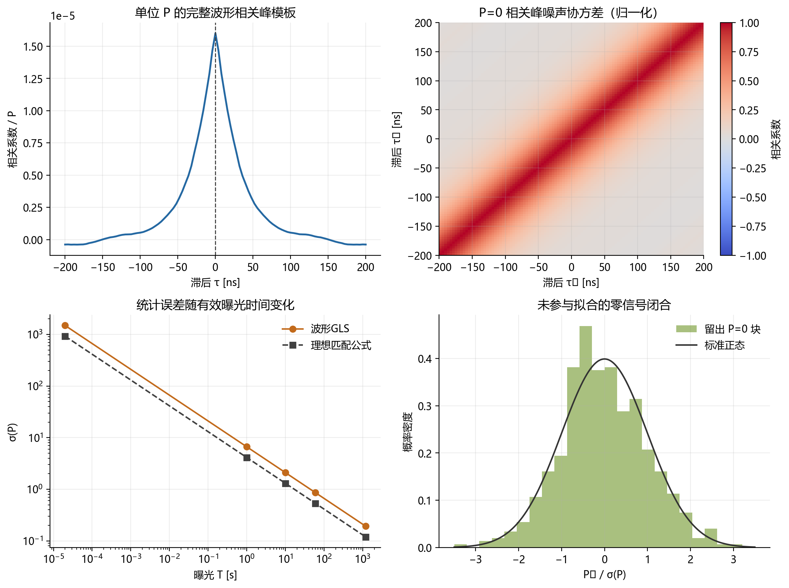

**图 8。** 左上是单位 $P$ 的完整波形相关峰模板；右上是零信号相关峰噪声的归一化协方差，清楚显示相邻滞后点并不独立；左下是误差随曝光的缩放及解析上限；右下是从未参与拟合的零信号标准化残差。四幅图均由新 notebook 当前输出直接生成。

### 8.5 新方法第三步：GLS 从峰形估计 $P$

给定某一条待测相关峰 $\boldsymbol c$，广义最小二乘（GLS）估计为

$$
\boxed{
\widehat P=
\frac{
\boldsymbol k^{\mathsf T}\boldsymbol\Sigma^{-1}
(\boldsymbol c-\boldsymbol c_0)
}{
\boldsymbol k^{\mathsf T}\boldsymbol\Sigma^{-1}\boldsymbol k
}
}.
$$

定义权重向量

$$
\boldsymbol w=
\frac{\boldsymbol\Sigma^{-1}\boldsymbol k}
{\boldsymbol k^{\mathsf T}\boldsymbol\Sigma^{-1}\boldsymbol k},
$$

则 $\widehat P=\boldsymbol w^{\mathsf T}(\boldsymbol c-\boldsymbol c_0)$。
这个表达自动给低噪声且确实含信号的滞后组合更高权重。其统计方差为

$$
\boxed{
\sigma_P^2=
\frac{1}{\boldsymbol k^{\mathsf T}
\boldsymbol\Sigma^{-1}\boldsymbol k}
}.
$$

因此 SPE 形状、光学弥散、ADC、NSB、微单元恢复和电子学噪声都不再以一个额外“$\sigma$ 修正因子”乘进第 8.2 节公式；它们先改变波形，再改变 $\boldsymbol k$ 与 $\boldsymbol\Sigma$，最后通过上式共同决定 $\widehat P$ 和 $\sigma_P$。

这里的$\sigma_P$是**条件于当前标定**的标准差，不是无限精确的已知常数。
若用$n_{\rm scale}$条独立近似正态的零信号记录估计它的尺度，则其相对标准误差近似为
$[2(n_{\rm scale}-1)]^{-1/2}$。$n_{\rm scale}$表示用于尺度估计的记录数，不包含拟合权重的训练记录。
当前1024条零信号记录分成512条训练与512条尺度标定，所以仅这一项约为3.13%。
它属于共同标定不确定度，不能作为各UV点相互独立的新噪声重复相加。
附录E用外部波形同时检查有限标定和验证统计量，没有按外部检验结果反调误差。

### 8.6 新方法第四步：短块如何严格变成长曝光

若各块相互独立且仪器在该时间段内平稳，$N$ 个等长块平均后的协方差是

$$
\boldsymbol\Sigma_N
=\frac{\boldsymbol\Sigma_{\rm block}}{N}.
$$

用有效曝光 $T=NT_{\rm block}$ 表示：

$$
\boxed{
\boldsymbol\Sigma(T)
=\boldsymbol\Sigma_{\rm block}
\frac{T_{\rm block}}{T}
},
$$

从而

$$
\sigma_P(T)=\sigma_P(T_{\rm block})
\sqrt{\frac{T_{\rm block}}{T}}.
$$

长曝光模拟抽取的是

$$
\boldsymbol c_{ij,s}\sim
\mathcal N\!\left(
\boldsymbol c_0+\overline P_{ij,s}\boldsymbol k,
\boldsymbol\Sigma(T_{\rm seg})
\right),
$$

然后把这条 101 维相关峰交给第 8.5 节同一个 GLS 权重。它没有在内存中生成连续 20 min 电压数组，但保留了该估计器关于 $P$ 的均值、全部滞后协方差和曝光标度。最后的 $\widehat P$ 当然也可写成

$$
\widehat P=\overline P+\epsilon_P,
$$

但此时 $\epsilon_P$ 的方差来自真实波形标定，而不是先验指定的解析 $B_{\rm eff}$。

参考场景的结果是

| 方法 | 20 min 单点 $\sigma_P$ | 定位 |
|---|---:|---|
| 第 8.2 节解析理想匹配 | 0.119316 | 理论上限 |
| 完整峰波形 GLS | 0.192247 | 新分支主结果 |

波形 GLS 的误差是解析理想值的 1.61 倍。差值包括实测长 SPE 造成的强滞后协方差、有限标定以及为防止反卷积噪声爆炸而施加的协方差正则化。它不是额外乘进旧公式的任意系数，而是新估计器独立测得的结果。

另用两个完全独立的标定种子重复相同1024/256记录流程，20 min
$\sigma_P$ 分别为0.18212和0.18514；参考种子为0.19225。三次结果的
均值约0.1865，最大偏离约3.1%，说明“波形方法明显弱于0.11932的解析
上限”不依赖单个随机种子。若要给最终硬件灵敏度，仍应增加真实标定时长并把
这部分标定不确定度作为误差来源保留。

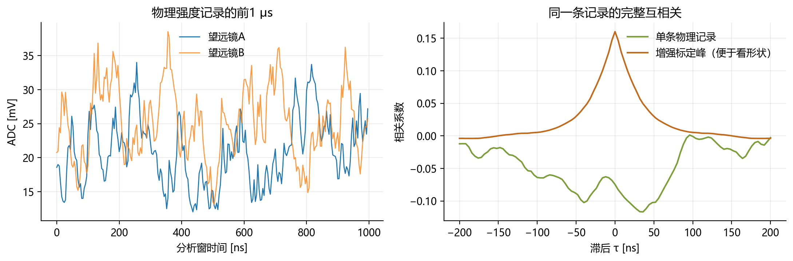

**图 8a。** 左图是两台望远镜物理强度20 $\mu$s记录的前1 $\mu$s；右图绿色曲线由同一条记录直接计算，橙色仅显示增强标定峰形。物理记录的期望相关对数远小于1，因此单条绿色曲线看不到峰是正确结果。padding 光子仅让中央分析窗的 SPE 尾部完整，padding 样点没有进入相关。

### 8.7 旧的原始零延迟闭合：只作历史诊断

同一公式用于 $T_{\rm rec}=2\ \mu\mathrm{s}$ 时，单位 $P$ 的匹配 SNR 为

$$
S^{(1)}(2\ \mu\mathrm{s})=3.4216\times10^{-4},
$$

远小于 1，与第 7.4 节“几乎总是零相关对”的结论一致。将记录时长增加时，独立模拟测得的相关估计器标准差满足

$$
\sigma\propto T^{-1/2},
$$

而长曝光公式正是同一缩放。图 6 同时检查了相关对均值、原始波形带宽惩罚和 $T^{-1/2}$ 噪声缩放。

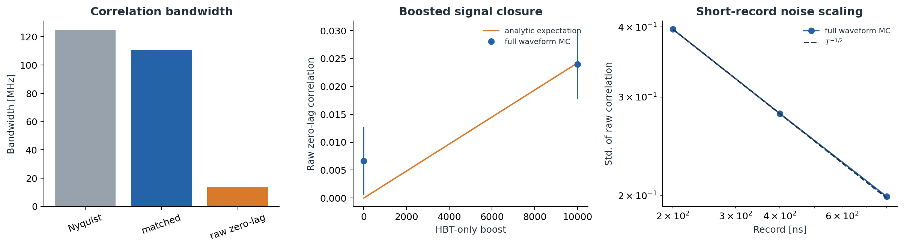

**图 6。** 短波形 Monte Carlo 和长曝光解析统计量的闭合。匹配相关器使用 $B_{\rm eff}=110.91\ \mathrm{MHz}$；直接原始零延迟相关使用 $B_{\rm raw}=14.02\ \mathrm{MHz}$。

为避免把纳秒级趋势直接外推到分钟而不检查，独立 Notebook
notebooks/short_long_exposure_closure.ipynb 又完成了 10 s 与 60 s
等效曝光闭环。它保留实际光子率、NSB、光学到达延迟、实测 SPE、电荷
涨落、微单元恢复和 4 ns 采样，只把线性弱相关的 HBT 共同分量放大
$b=\sqrt{T_{\rm target}/T_{\rm rec}}$，再将相关幅度除以 $b$。这样一条
短波形 realization 的统计误差等效于目标时长，同时避免真的生成
$10^9$ 量级 ADC 样点。

| 目标曝光 | 波形外推 $\sigma_P$ | 同一原始相关器解析 $\sigma_P$ | 相对差 |
|---:|---:|---:|---:|
| 10 s | 3.6197 | 3.6760 | $-1.5\%$ |
| 60 s | 1.4664 | 1.5007 | $-2.3\%$ |

所选真实 UV 点的理论值为 $P=0.1463$；波形 ensemble 在 10 s 和 60 s
等效曝光下分别恢复 $0.097\pm0.094$ 与 $0.177\pm0.038$，均在 Monte
Carlo 均值误差内覆盖真值。这验证的是**原始零延迟估计器**的波形—长曝光
闭环。匹配相关器在 10 s 和 60 s 的解析误差分别为 1.3070 和 0.5336；
它利用完整频率信息，不能用原始零延迟波形结果直接冒充，后续若要做同等级
闭环必须在波形端实现相同的白化和频率权重。

### 8.8 未校准时间误差怎样进入长曝光

已知且稳定的 DC 光学时间核已经包含在 $B_{\rm eff}$ 中，不应再额外乘一个“光学效率”。只有未被模型校正的相对时间误差才需要单独衰减。

令 $\Delta\tau_{ij}$ 是基线 $ij$ 在校正 $\tau_g$ 后残留的相对延迟，定义归一化残余延迟响应

$$
A_{ij}(\Delta\tau_{ij})=
\frac{
\int_0^{f_{\rm Nyq}}
|H_{\rm opt}(f)|^2
\cos(2\pi f\Delta\tau_{ij})\,df
}{
\int_0^{f_{\rm Nyq}}|H_{\rm opt}(f)|^2\,df
}.
$$

若残余延迟未校正，则期望测量值变为 $A_{ij}P_{ij}$。当前 main 未提供时钟漂移或残余时延 RMS，故 $\Delta\tau_{ij}=0$、$A_{ij}=1$。这只是默认关闭，不代表真实系统一定没有该误差。

---

## 9. 组合全部基线和时间段，生成带噪稀疏 UV 数据

### 9.1 每个测量点

对每个有效时间段和每条基线，程序依次：

1. 用第 3 节公式计算 $(u_{ij},v_{ij},w_{ij})$ 和 $\tau_g$；
2. 沿该 20 min 内的地球自转轨迹计算段平均期望 $\overline P_{ij,s}$；
3. 用相同星等、NSB 和仪器状态的短波形标定 $\boldsymbol k$、$\boldsymbol c_0$ 和 $\boldsymbol\Sigma_{\rm block}$；
4. 按第 8.6 节缩放到 $T_{\rm seg}$，抽取完整相关峰 $\boldsymbol c_{ij,s}$，再用 GLS 得到 $(\widehat P_{ij,s},\sigma_{P,ij,s})$；
5. 保存 $(u,v)$、测得的 $\widehat P$、$\sigma_P$、望远镜编号和时刻。

这里下标 $s$ 表示第 $s$ 个时间段。20 min 内基线投影并不静止，所以真正的无噪声期望不是只在段中点计算一次，而是

$$
\overline P_{ij,s}
=\frac{1}{T_{\rm seg}}
\int_{t_s-T_{\rm seg}/2}^{t_s+T_{\rm seg}/2}
P\!\left[u_{ij}(t),v_{ij}(t)\right]dt,
$$

其中 $t_s$ 是该段中点。程序用 9 个等间隔段内时刻作数值积分；表中的 $(u,v)$ 仍用段中点坐标代表这一小段 UV 轨迹。当前双星案例中，段平均值与段中点值的最大差约为 0.0068，小于波形 GLS 单点统计误差 0.1922，但保留段平均可避免在更长分段、更长基线或更复杂源上产生时间平均偏差。

统计模型可写成

$$
\widehat P_{ij,s}=A_{ij,s}G_{ij,s}\overline P_{ij,s}
+z_{ij,s}+\epsilon_{ij,s},
$$

其中：

- $\widehat P_{ij,s}$ 是基线 $ij$ 在时间段 $s$ 的测量值；
- $\overline P_{ij,s}$ 是上一式定义的 20 min 段平均无噪声期望；
- $A_{ij,s}$ 是第 8.8 节的残余时间响应；
- $G_{ij,s}$ 是望远镜增益、透明度等乘性标定因子的组合；
- $z_{ij,s}$ 是基线相关零点偏差；
- $\epsilon_{ij,s}$ 是均值为 0、标准差为 $\sigma_{P,ij,s}$ 的统计噪声。

在旧解析路径中，第 8.2 节的 SNR 用来确定这一随机测量有多宽：

$$
\sigma_{P,ij}=\frac{1}{S_{ij}^{(1)}},
\qquad
\epsilon_{ij,s}\sim\mathcal N(0,\sigma_{P,ij}^2).
$$

新波形路径不使用这条解析 $\sigma_P$。它先抽取第 8.6 节的 101 维相关峰，再计算

$$
\widehat P=\overline P+\epsilon,
$$

然后重建器读取 $(u,v,\widehat P,\sigma_P)$。这里的 $\sigma_P$ 由
$\boldsymbol k^{\mathsf T}\boldsymbol\Sigma^{-1}\boldsymbol k$ 决定；恒星、NSB、暗计数、$\tau_{\rm eff}$、光学时间核、完整 SPE、采样、恢复、电荷涨落和已启用电子噪声已经在生成标定波形时进入。不能再把第 8.2 节的 $B_{\rm eff}$ 或 $F_{\rm EN}$ 乘一次，否则会重复计算。

当前缺少实测值的 $G$ 波动、$z$、时钟漂移、额外电子噪声、串扰、后脉冲和暗计数都设为 0，但接口保留。每台望远镜自己的 Poisson 光子涨落不是这些“可选系统误差”，它始终通过 $r_{\rm tot}$ 和显式短波形包含。

程序不把负的 $\widehat P$ 强行裁剪为 0。低 SNR 无偏相关估计出现负值是正常现象；提前裁剪会引入正偏差。重建阶段再通过非负天空图约束处理物理性。

### 9.2 时间分段和点数

默认长曝光单段使用

$$
T_{\rm seg}=1200\ \mathrm{s}=20\ \mathrm{min}.
$$

6 小时共有 18 个时间段，理论最多产生

$$
N_{\rm meas}=496\times18=8928
$$

个基线—时间测量；$N_{\rm meas}$ 表示测量数。32 台望远镜同时观测，496 个基线相关器也同时积分，因此这 8928 个值只需要 6 小时墙钟观测，不是 $8928\times20$ min。每一行都代表“一条基线在一个 20 min 段内得到的一次 $\widehat P$”。高度角筛选会删除不可用时段。

若同一 UV 网格内合并 $N$ 个相互独立、等误差测量，则

$$
\sigma_{\overline P}=\frac{\sigma_P}{\sqrt N}.
$$

其总**基线积分量**是 $N\times20$ min，但不一定等于 $N\times20$ min 墙钟时间：不同望远镜对可以并行贡献；同一基线在不同时间段或不同夜的重复才会增加顺序观测时间。多夜场景中，同一个表格行已是 $N_{\rm night}$ 次相同恒星时刻测量的逆方差平均，故该行代表的基线积分时间是 $N_{\rm night}T_{\rm seg}$。

| 数据层级 | 包含的测量 | 墙钟观测时间 |
|---|---:|---:|
| 单夜的一个原始 UV 行 | 1 条基线 $\times$ 1 个 20 min 段 | 20 min |
| 同一时段全部 32 镜 | 496 条并行基线 $\times$ 20 min | 仍为 20 min |
| 单夜 6 h 全表 | $496\times18=8928$ 行 | 6 h |
| 相同 6 h 轨迹重复 $N_{\rm night}$ 夜 | 每行平均 $N_{\rm night}$ 次 | $6N_{\rm night}$ h |
| 一个 UV 格含 $N$ 行 | $N$ 份基线—时间信息 | 取决于这些行是并行基线还是顺序重复，不能仅由 $N$ 推出墙钟时间 |

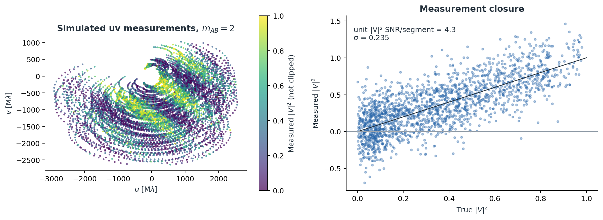

**图 7。** 原解析路径的 UV 诊断，保留用于比较。左：每条基线每个 20 min 段沿 UV 轨迹平均后的无噪声期望 $\overline P$。中：按解析误差抽样的 $\widehat P$。右：同一次 realization 中 $\widehat P$ 相对 $\overline P$ 的散布。它不是新波形 GLS 的最终结果。

新方法的完整 UV 和重建结果如下。

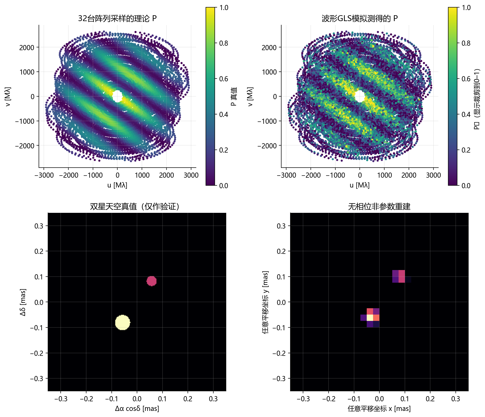

**图 9。** 上排是同一批32台阵列坐标上的理论 $\overline P$ 和波形 GLS 单次测量；正负基线使用相同数值，只为显示而复制。测量色标裁剪到0–1，但内部数据和重建没有裁剪。下排是真值与不读取真值的无相位非参数重建；后者仍具有任意平移和180°反演简并。

新方法本次 8928 个点的标准化残差

$$
z_k=\frac{\widehat P_k-\overline P_k}{\sigma_{P,k}}
$$

均值为 $-0.00094$、样本标准差为 $1.00238$，与生成这些长曝光随机量时使用的波形GLS误差一致；这不是独立波形验证，后者见附录D。原始8928行中1429行越过物理显示区间 $[0,1]$；程序没有裁剪这些值。单点 $\overline P/\sigma_P$ 的中位数为1.685。图9的旧重建两峰间距为0.2025 mas、位置角39.81°、峰值比0.541；对应真值分别为0.200 mas、35°和0.55。这些重建数值保留为历史记录，新结果见图14–22和附录D。

---

## 10. 从无相位功率可见度重建天空图

### 10.1 离散正向模型

令 $x_p$ 是第 $p$ 个天空像素的归一化非负流量，不是单位立体角的亮度密度；像素角坐标为 $(l_p,m_p)$。程序施加

$$
x_p\ge0,\qquad \sum_p x_p=1,
$$

即非负性和总流量归一化。对第 $k$ 个 UV 点 $(u_k,v_k)$，预测复可见度为

$$
V_k(\mathbf x)=
\sum_p x_p\exp[-2\pi i(u_kl_p+v_km_p)],
$$

预测功率可见度为

$$
P_k(\mathbf x)=|V_k(\mathbf x)|^2.
$$

$\mathbf x$ 表示由所有像素值组成的图像向量。
归一化本身就保证 $P(0,0)=1$；这不是一次真实零基线观测。
新版不再额外插入带有虚构$\sigma_P=0.01$的零点，也不将它计入独立测量数。

### 10.2 UV 合并和逆方差加权

直接优化前，临近UV测量按网格合并。令 $g$ 编号UV格，$k$ 编号原始测量，其权重定义为

$$
w_k=\frac{1}{\sigma_{P,k}^2}.
$$

合并值和误差为

$$
\widehat{\overline P}_g=
\frac{\sum_{k\in g} w_k\widehat P_k}{\sum_{k\in g} w_k},
\qquad
\sigma_g=\left(\sum_{k\in g} w_k\right)^{-1/2}.
$$

这些合并误差公式要求参与平均的测量条件独立；它们不会自动包含共同标定误差。
程序保存 `multiplicity` 表示每格原始测量数。并行基线的统计信息量不能当成实际墙钟曝光。

更新后的重建不再把整格观测当成平均坐标上的一次测量。令 $s$ 编号测量 $k$ 的时间子采样，
$q_{k,s}$ 是非负时间权重且 $\sum_s q_{k,s}=1$。
普通20 min段使用9个等权中点子采样；由1 min记录组合的粗段保留原来的全部子采样。
格内逆方差归一化系数为 $a_{g,k}=w_k/\sum_{k\in g}w_k$。模型必须预测

$$
\mu_g(\mathbf x)=\sum_{k\in g}a_{g,k}
\sum_s q_{k,s}P(u_{k,s},v_{k,s};\mathbf x).
$$

这里 $\mu_g$ 是整个UV格的预期测量值，不是代表坐标上的 $P$。
**测量先平均，模型也按相同位置和相同权重平均。** 不能用
$P(\langle u\rangle,\langle v\rangle)$ 或 $|\langle V\rangle|^2$ 代替上式。
几何子采样随观测一起保存，不需要天体真值；`cell_mlambda=None`可在规模受控的数据上关闭UV合并。

为避免每次迭代重新计算大量子采样，程序利用像素天图自相关 $A_{\mathbf x}(\Delta l,\Delta m)$
预计算平均余弦核。$\Delta l,\Delta m$ 是像素坐标差，单位为弧度；自相关定义为

$$
A_{\mathbf x}(\Delta l,\Delta m)=
\sum_{\substack{p,p':\ l_p-l_{p'}=\Delta l\\m_p-m_{p'}=\Delta m}}x_px_{p'}.
$$

将傅里叶功率展开为像素对的乘积，并将坐标差相同的像素对合并，就得到

$$
K_g(\Delta l,\Delta m)=\sum_{k\in g}a_{g,k}\sum_s q_{k,s}
\cos[2\pi(u_{k,s}\Delta l+v_{k,s}\Delta m)],
\qquad \mu_g=\sum_{\Delta l,\Delta m}K_g A_{\mathbf x}.
$$

这是对候选天图执行上述平均功率公式的代数等价实现，不是把观测功率逆变换成天图，
也没有猜测相位或插值缺测UV。新增测试与直接傅里叶计算及有限差分梯度逐项对照。

### 10.3 优化目标

现在默认使用绝对高斯似然。令 $\widehat{\overline P}_g$ 是第10.2节合并后的实际测量，
$\sigma_g$ 是其统计标准差，$\alpha$ 是平滑先验强度，$R$ 是下面定义的平滑惩罚：

$$
\mathcal L(\mathbf x)=
\frac{1}{2}\sum_g
\left[
\frac{\mu_g(\mathbf x)-\widehat{\overline P}_g}{\sigma_g}
\right]^2
+\alpha R(\mathbf x).
$$

这里把 $\sigma_g$ 视为已标定且不随候选天图改变，因此省略与天图无关的高斯归一化常数。
若另行拟合噪声尺度或比较不同噪声模型，不能继续省略相应的对数行列式项。

**纠正旧文档：原代码并未实现这里曾写出的TV加二范数、迭代后投影算法。**
新版直接优化有限支撑内的非负变量 $a_p\in[0,1]$，定义 $s_a=\sum_pa_p$ 和
$x_p=a_p/s_a$。$s_a$是数值变量之和，不是另外测量的总流量；全零向量不能归一化，会被拒绝。
任意非负归一化天图都能由 $a_p=x_p$ 表示，因此这些数值边界没有预设源形状。
优化器仍为多初值L-BFGS-B。旧softmax参数化
$x_p=e^{z_p}/\sum_{p'}e^{z_{p'}}$仅保留作对照，其中$z_p$是无约束数值参数；
其暗像素梯度被$x_p$压低，会拖慢更新。附录E比较两者在相同测量、初始天图与物理目标下的表现。
平滑项是相邻像素差的平方，
不是TV。令每边像素数为 $n_{\rm pix}$，在坐标除以视场宽度后的无量纲平面上，
亮度密度近似为 $(n_{\rm pix}-1)^2x_p$。当前定义

$$
R(\mathbf x)=\frac{(n_{\rm pix}-1)^4}{2}
\left[\sum_{\rm horizontal}(x_{p+1}-x_p)^2+
\sum_{\rm vertical}(x_{p+1}-x_p)^2\right].
$$

因而在同一视场内加密像素时，不会仅因每像素流量减小就让平滑惩罚大幅变弱。
这仍是一个离散近似，不保证不同分辨率给出完全相同的最优解。

原始 $1/\sigma_g^2$ 不再按数据集归一化或截断。若所有误差扩大10倍，在候选天图不变时，
数据项应减少100倍，而同一先验项不变；新增测试直接验证这一点。
可选Huber模式对 $(\mu_g-\widehat{\overline P}_g)/\sigma_g$ 使用Huber损失，
默认转折为2.5个标准差；不再对未标准化的 $P$ 残差套用0.15阈值。

若已知UV测量之间的协方差 $\mathbf C_{\rm UV}$，数据项应为
$\tfrac12\mathbf r^{\mathsf T}\mathbf C_{\rm UV}^{-1}\mathbf r$，其中
$\mathbf r$ 是由所有 $\mu_g-\widehat{\overline P}_g$ 组成的残差向量。
重建器支持直接提供该矩阵并检查其对角元等于 $\sigma_g^2$，但当前主报告仍使用条件独立模型。
不能把单条相关峰内的滞后协方差 $\boldsymbol\Sigma$ 当成跨UV点协方差。
非对角协方差情形暂不自动交叉验证，必须显式指定先验强度。

主报告的 $\alpha$ 在固定候选集 $0,10^{-5},10^{-3},10^{-1}$ 中选择：
随机种子固定，80%UV格训练，20%UV格按绝对高斯预测损失评分，再以选出的 $\alpha$ 对全部数据重拟合。
不读取真图，不沿用旧0.020的数值意义。留出分数是调参依据，不是最终独立检验；
候选集有限、局部优化未收敛及边界选择都可能影响结果。每个初值的目标值与收敛标志均保存。
当前仅做有限候选检查，不宣称找到全局最优或最佳先验。

主结果每个初值最多1600次迭代，非负流量参数化的默认相对函数停止容差为
`optimizer_ftol=1e-12`。显式选择旧softmax高斯路径时默认仍为`1e-9`；
旧经验权重及无噪声路径为`1e-12`。不能单凭容差数字相同就断言达到同一物理精度。
附录D另用同一凌日观测、相同初值、3200次上限比较当前参数化下的`1e-12`与`1e-14`，
检查更严格停止条件是否改变统计评分和图像。数值停止不意味着像素图唯一，
若达到预算仍未收敛，输出仍保留失败标志，不把它改成成功。

重建后的平移若会裁掉通量或移出支撑，则不执行，避免“居中后归一化”偷偷改变预测UV。
旧图9仍是原经验权重版本的历史结果；更新后的统计重建见图14–22及附录D。

### 10.4 为什么低 SNR 单点仍能参与重建

先区分模拟真值和重建输入。前向模拟必须用源模型给出的

$$
P_k^{\rm true}=P(u_k,v_k)
$$

规定随机实验的均值，然后生成一次带噪测量

$$
\widehat P_k=P_k^{\rm true}+\epsilon_k,
\qquad
\epsilon_k\sim\mathcal N(0,\sigma_{P,k}^2),
$$

其中 $k$ 编号不同基线和时间段。重建器接收测量、误差和几何子采样，不读取 `visibility2_true`、
双星参数或真傅里叶相位。归一化已由像素参数化保证，因此新路径不额外加入一个带人为误差的
$P(0,0)=1$ 观测点。仍使用非负、有限支撑和平滑先验；真图仅用于拟合结束后的指标与配准显示。

当前完整报告的固定随机种子给出每个20 min原始测量
$\sigma_P=0.1742$；独立验证 notebook 的三个标定种子约为0.18–0.19。
这几个百分点的差异来自有限的短波形模板和协方差Monte Carlo，而不是物理
曝光改变。它比旧解析路径更保守，但8928个不同方向和尺度的测量仍能提供
联合约束。

重建也不是从一个点作图，而是同时拟合所有测量。程序把相近UV点按逆方差
合并，总流量归一化直接由图像约束实现。重复点的误差继续按
逆方差降低；源信号还具有跨UV平面连续、成体系的条纹结构，非负性、有限
支撑、总流量归一化和平滑正则会排除大量纯噪声图像。

所以“单点不显著”和“整体模型显著”并不矛盾，类似很多低 SNR 像素共同检出一个弱而连续的整体结构。但每次 $\widehat P_k$ 都会偏离真值，因此每次重建也会变化；误差变大时，双星可能被重建成错误分离度、错误流量比、单峰或噪声伪双峰。当前完整波形报告对不同时间和星等各显示一次固定随机实现，并用单圆盘—双星的BIC比较防止仅凭图像判断；它还不是多随机种子检出率研究。只有将来同时得到较高双星真阳性率和较低单星假阳性率时，才能把某一星等和分离角称为可靠极限。

不过当前重建仍偏乐观，原因包括：参考源很亮（$m_{\rm AB}=2$）；缺失的增益漂移、时钟误差、附加电子噪声和跨望远镜共享噪声均设为0；波形标定只建立了单基线内部101个滞后的协方差，尚未建立共享望远镜导致的跨基线协方差；重建还使用非负、有限视场和弱平滑先验。因此图14–16是在当前已知输入下的闭合结果，不是对真实LACT六小时必然成像质量的保证。

### 10.5 强度干涉固有歧义

仅有 $P=|V|^2$ 时，至少存在以下信息损失：

- 整体平移不改变 $P$；
- 180° 反演可给出相同 $P$；
- 稀疏 UV 覆盖和噪声可产生多个局部极小值；
- 不对称源的相位信息不由单个二阶相关数据集直接提供。

因此评价重建时，程序允许先做平移和 180° 镜像配准，再在共同分辨率下比较；这不是人为改善观测，而是消除不可辨识自由度。

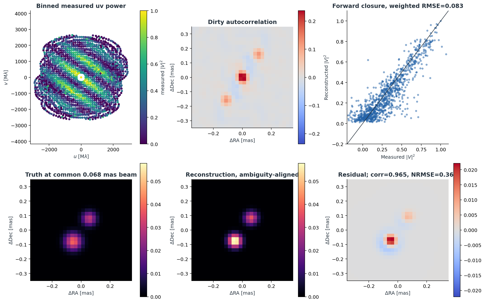

**图 7b。** 原解析路径的真值、带噪稀疏测量和无相位重建，保留作历史比较。新波形 GLS 主结果见图9。

---

## 11. 观测时间、星等极限和角分辨率

### 11.1 时间缩放

从第 8.6 节的协方差缩放直接得到

$$
\mathrm{SNR}\propto\sqrt{T_{\rm seg}},
\qquad
\sigma_P\propto T_{\rm seg}^{-1/2}.
$$

在 UV 几何已接近饱和后，继续重复观测仍会降低误差，但收益是平方根而非线性。当前完整报告的固定随机种子标定给出2等星单个20 min点
$\sigma_P=0.1742$；相同响应在10 min和60 min时分别为0.2464和0.1006。
这里改变的是单个点的积分时间。若每个点仍积分20 min，只延长整夜跟踪，则
单点误差不变，但会增加不同位置的 UV 测量。独立夜晚重复同一 UV 点时，才可
再按逆方差合并降低该位置的误差。

### 11.2 角分辨率

令 $B_{\max}$ 为最长投影基线。常用条纹尺度为

$$
\theta_{\rm fringe}\simeq\frac{\lambda_0}{B_{\max}}.
$$

对于均匀圆盘第一零点，尺度为

$$
\theta_{\rm null}\simeq1.22\frac{\lambda_0}{B_{\max}}.
$$

当前 32 台 `layout_0803_reco32` 的物理最长基线约为 $1219.21\ \mathrm{m}$。在 $400\ \mathrm{nm}$ 下，名义条纹尺度约为 $0.0677\ \mathrm{mas}$，均匀圆盘第一零点尺度约为 $0.0826\ \mathrm{mas}$。这些是几何上限，不等于在有限 SNR、有限方向覆盖和无相位重建下必然可分辨的最小双星间距。

最短基线 $B_{\min}\simeq121.01\ \mathrm{m}$ 对应约 $\lambda_0/B_{\min}=0.682\ \mathrm{mas}$ 的最大敏感结构尺度；缺少更短基线会削弱大尺度形态恢复。

### 11.3 星等极限

下面旧表由第8.2节的解析理想式反解，只能作为上限比较，不能再称为新波形GLS的最终星等极限。对于未分辨源的 $P=1$、参考 NSB、单光谱通道，解析估计为：

| 总积分时间 | $\mathrm{SNR}=5$ 的 AB 星等 | $\mathrm{SNR}=10$ 的 AB 星等 |
|---:|---:|---:|
| 1 h | 2.327 | 1.733 |
| 10 h | 3.210 | 2.693 |
| 50 h | 3.763 | 3.289 |

这些数字是“单基线、单位 $P$、假设2 nm恒星通道、main宽带NSB压力值和理想匹配处理”条件下的检测门槛，不是最终硬件星等极限，也不是复杂双星可靠成像极限。完整报告已经分别对 $m_{\rm AB}=2,3,4,5$ 重新生成
$\boldsymbol k$ 和 $\boldsymbol\Sigma$，20 min单点误差依次为0.1742、
0.6387、2.7135和13.5773。这个快速恶化来自恒星率下降，而NSB仍保持
$70.5275\ \mathrm{MHz/pixel}$；不能把2等星误差简单平移到暗源。

对默认0.20 mas双星的单次6 h realization，参数化双星相对单圆盘的
$\Delta\mathrm{BIC}=\mathrm{BIC}_{\rm single}-\mathrm{BIC}_{\rm binary}$
依次为28006.9、1839.6、100.3和-5.77。前三个案例在这个固定场景中支持
双星，5等星不支持。这里仍不能直接宣布通用极限星等：可靠极限必须对每个
星等运行多随机种子，并同时改变分离角、流量比和源直径。多光谱通道若彼此
统计独立，总SNR理想情况下按 $\sqrt{N_{\rm ch}}$ 增长；最终灵敏度仍必须
让恒星和NSB共用同一个实测总响应 $T(\lambda)$。

### 11.4 完整报告中的图像证据链

除图注明确声明共色标外，天图面板沿用各自自动色标，主要比较形态，
不能直接用面板间颜色亮暗推断通量变化；所有重建天图总流量均归一化。
图22、25和29另提供共色标对照。未满足优化停止准则的图仍保留，但不作为性能保证。

完整报告 notebook 先给出仪器参数表，再按物理因果顺序生成以下结果。

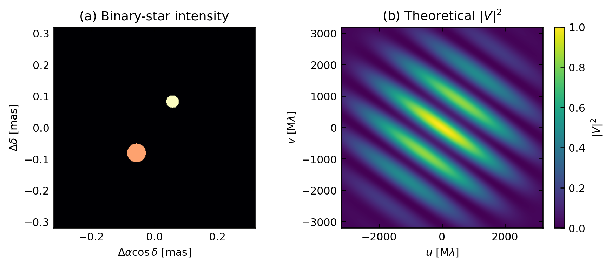

**图 10。** 左图是默认0.20 mas双星的归一化天空真值，右图是解析计算的
连续理论 $P(u,v)$。这一级没有阵列采样和测量噪声；显示天图的像素化不参与
右图计算。

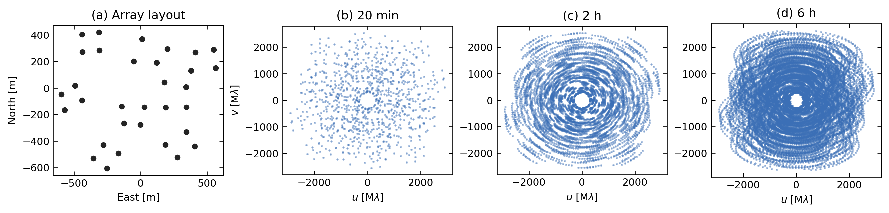

**图 11。** 32台望远镜布局以及20 min、2 h和6 h覆盖。三种时长分别包含
496、2976和8928个独立测量；图上同时显示共轭点，所以可见点数是其两倍。
最长投影基线约1219.19 m。时间延长既增加采样点，也让单条物理基线沿地球
自转轨迹移动。

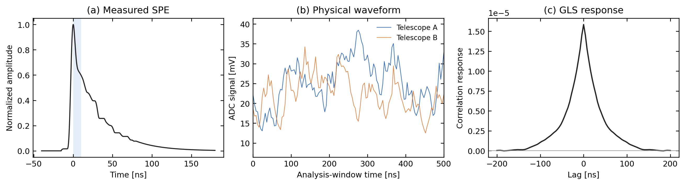

**图 12。** 左图为main读取的实测SPE，中图是两台望远镜各一个像素的物理
波形，右图为波形Monte Carlo标定的单位 $P$ 相关响应 $k(\tau)$。波形生成时
在有效窗两侧加入足以容纳SPE和光学时间核的padding，互相关只使用有效分析
窗；2 µs有效窗内期望物理HBT相关对仅0.0091，因此单条波形看不出相关峰是
正常结果。

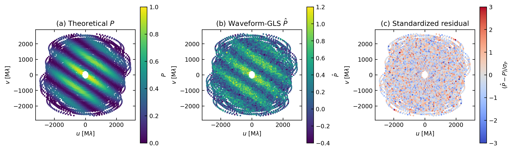

**图 13。** 同一组6 h UV坐标上的理论 $P$、波形GLS测得的 $\widehat P$ 和
标准化残差。8928个测量的标准化残差均值为-0.0087，样本标准差为1.0015，
与标定协方差一致。共有1300个原始估计落在 $[0,1]$ 之外；程序没有裁剪
这些点，因为裁剪会给重建引入偏差。图中色标范围只影响显示。

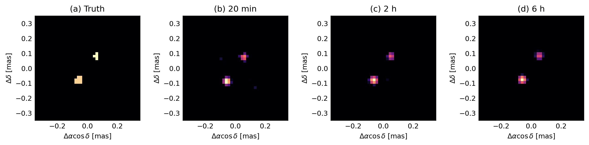

**图 14。** 20 min、2 h和6 h结果从同一个6 h realization逐步加入中心时段，
因此数据严格嵌套。输入双星分离角为0.20 mas；各时长的加权可见度RMSE、
事后天图相关系数和峰间距由notebook紧随本图的表格给出。
峰间距只是图像诊断，噪声峰也可能碰巧给出接近真值的间距。
本次三组天图相关系数依次为0.8169、0.6870、0.8695，其中2 h尚未达到停止准则。
这里显示的是一次随机实现，而不是不同时间的成功概率。

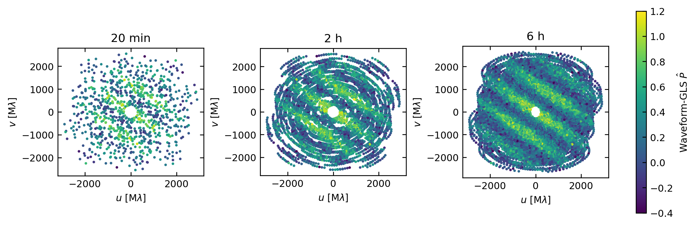

**图 17。** 与图14严格对应的实测UV数据：颜色是波形GLS从带噪模拟中得到的
$\widehat P$，不是理论真值。20 min只有496个独立测量，轨迹稀疏；2 h和6 h
分别扩展为2976和8928个测量。图上复制了共轭点$(-u,-v)$并赋予相同
$\widehat P$，所以呈中心对称；这一复制只方便显示，不增加独立数据。三个
面板使用同一色标，超出显示范围的原始值只发生颜色饱和，没有在数据表或
重建输入中被裁剪。

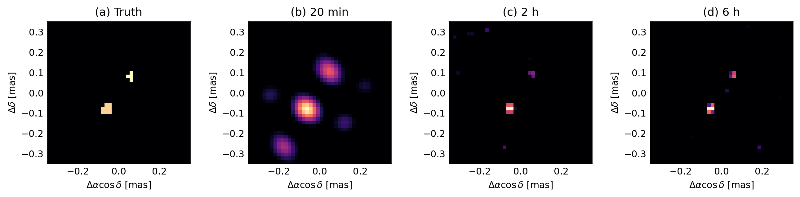

**图 18。** 为了直接检验较暗目标，把参考双星改为$m_{\rm AB}=4$，其余源形态
和仪器设置保持不变，并用该星等重新标定波形GLS。20 min、2 h和6 h仍从同一
个6 h噪声实现中取严格嵌套的中心时段。各组数值诊断见notebook输出；不能只看
是否出现两个亮峰，或两峰间距是否接近0.20 mas，就判断恢复成功。
本次20 min、2 h和6 h天图相关系数为0.5108、0.7277、0.7803。
延长观测增加统计信息，但有限噪声实现、先验选择和局部解会使图像质量不严格单调。
本图不能证明“4等星在6 h必然可成像”：正式灵敏度结论仍需多随机种子，
并同时检查单星假阳性率和双星模型证据。

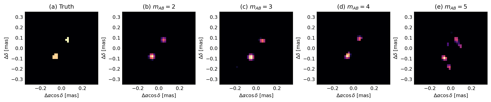

**图 15。** 2–5等星均独立完成波形标定并观测6 h。暗星重建仍可能输出
若干亮斑，但“优化器返回一张图”不等于“天体形态被检出”。
notebook另列的单星/双星BIC对照属于有模型拟合诊断，并非像素重建的一部分：
它固定了分量直径，双星拟合初始参数也取自设定场景，因此不是盲搜成功率或极限星等验证。
不能用这一个条件化指标替代多噪声实现、不同初值和假阳性检验。

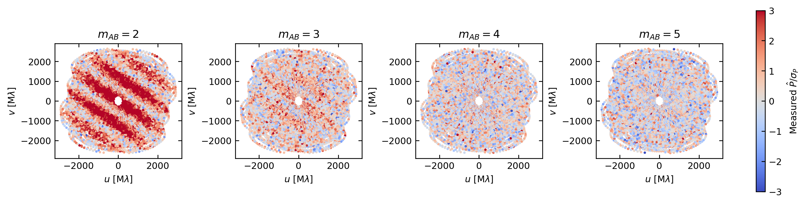

**图 19。** 与图15的6 h星等扫描相对应，颜色显示每个UV测量的标准化值
$\widehat P/\sigma_P$。这里不用同一色标直接比较$\widehat P$，因为2–5等星的
$\sigma_P$跨越近两个数量级，原始值会被最暗目标的噪声范围支配。2等星中
可以辨认连续条纹；3等星条纹已明显变弱；4–5等星多数单点接近随机噪声。
重建使用的仍是未裁剪的$(\widehat P,\sigma_P)$，不是图中饱和到$[-3,3]$的
显示值，也不是$P$的理论真值。

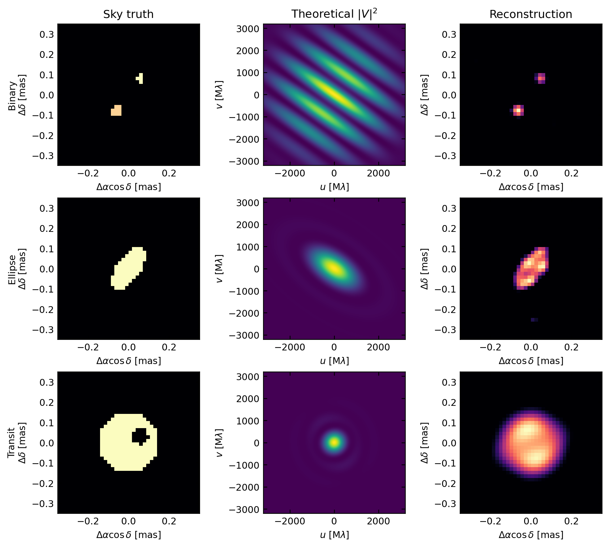

**图 16。** 每行依次为天空真值、连续理论 $P$ 和带噪无模型重建；三行分别
为双星、均匀椭圆和凌日源，均采用2等星、单夜6 h观测。椭圆的整体伸长方向可以恢复。凌日源的暗斑没有
被忠实恢复，只得到若干与数据相容的正亮结构。有限信噪比、UV缺口、缺失
傅里叶相位及当前先验都会影响局部暗结构，不能仅凭图像将原因归为其中一项。
本图天图面板分别自动设定色标，仅适合比较形态；共色标的数值对照见图25和29。
数值优化成功只表示
目标函数收敛，不能替代形态检验。若重复观测$N_{\rm night}$个相同6 h时段，
每个UV点的统计误差理想情况下缩小为$1/\sqrt{N_{\rm night}}$，但重复轨迹不增加
新的UV位置，也不能消除无相位反演本身的形态简并。

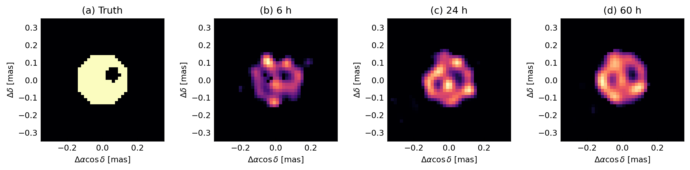

**图 20。** 同一个2等星凌日源在1、10和100个独立夜晚累计后的无相位重建，
对应总积分6、60和600 h。第一夜与图16使用完全相同的测量和重建；后续夜晚
使用波形GLS给出的单夜$\sigma_P$生成独立统计噪声，并按夜累计平均。每个UV点
的$\sigma_P$依次为0.1742、0.0551和0.0174；测量精度随积分时间单调改善。
图像现已由绝对似然和精确平均前向模型重算，不再沿用旧版本的图像相关系数。
各次选出的平滑强度、拟合指标和图像比较以notebook当前输出为准。
长曝光仍可能出现多个暗区或不均匀盘面，不能从数值收敛直接推断形态正确，
更不能把每个残差都归因于不可消除的相位简并；还需要附录D的数值收敛和先验对照。
本次非负流量参数化下，6、60、600 h三组的选中解分别在205、415、826次迭代
达到停止准则；不再是上一版三组都触及1600次上限的情况。
但图中仍没有稳定、忠实地恢复输入盘面与唯一暗区，因此不能宣称已求出物理最优重建。
本比较假设
各夜仪器稳定且天气相同，尚未加入跨夜增益和时钟漂移。

### 11.5 固定总曝光，缩短每个UV点的积分时间

这里固定2等星凌日源、32台阵列、同一6 h小时角窗口和仪器设置，比较20 min、
5 min、1 min的单点相关积分长度，记为$\Delta T$。这不是把ADC的4 ns采样间隔
改为分钟。三种分段使用相同的总光子预算，短分段让已有UV轨迹更密，而非增加新轨迹。

先用波形GLS标定的相关向量统计模型生成1 min数据，然后按同一基线把相邻
$n$个小段取平均，$n$分别为20、5、1。令$a$编号小段，则

$$
\widehat P_n=\frac{1}{n}\sum_{a=1}^n\widehat P_a,
\qquad
\sigma_{P,n}=\frac{\sqrt{\sum_{a=1}^n\sigma_{P,a}^2}}{n}.
$$

这个误差关系以小段统计噪声相互独立为前提；等长同方差的小段给出熟悉的
$\sigma_P\propto1/\sqrt{\Delta T}$。粗段的理论值同样取细段真值的时间平均，
而非直接读取中心时刻真值。三种结果由同一份细段数据合并，不是三套独立随机实验。

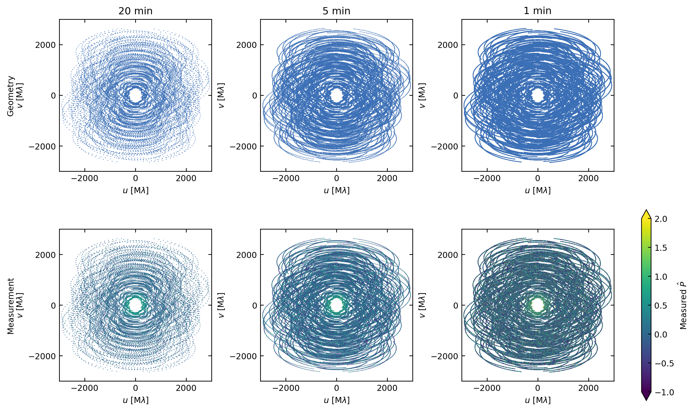

**图21。** 从左到右为20 min、5 min、1 min分段，上排是几何UV采样，下排是
同一批点的带噪$\widehat P$。横纵轴单位均为M$\lambda$。正负基线只为显示而复制，
数值相同，独立测量数不加倍。下排统一色标为$[-1,2]$，超出范围只颜色饱和，
原始数据及重建输入没有裁剪。三幅图覆盖相同小时角范围，并非更长观测。

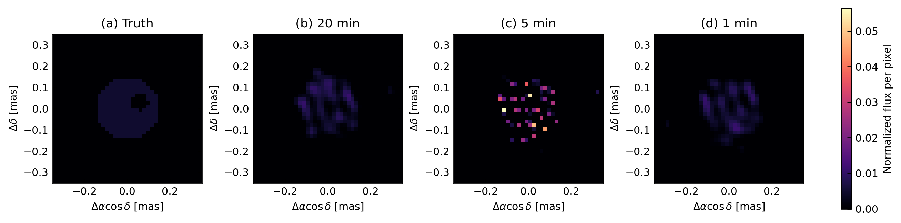

**图22。** 从左到右为静态凌日天图真值，以及由图21下排三组测量得到的重建。
天图坐标单位为mas，所有面板共享归一化像素流量色标；只允许事后平移和180度
反演配准。优化只读取测量坐标、$\widehat P$和$\sigma_P$，不读取真图；
三种分段使用相同初值种子、平滑候选集和120 M$\lambda$的UV合并网格，
各自按留出数据选择平滑强度；预测量保留粗段实际包含的细段几何子采样。

| 单点积分 | 原始测量数 | 实际合并点数 | 单点$\sigma_P$ | 新重建天图相关系数 |
|---|---:|---:|---:|---:|
| 20 min | 8928 | 1021 | 0.1742 | 0.7632 |
| 5 min | 35712 | 1061 | 0.3485 | 0.3620 |
| 1 min | 178560 | 1071 | 0.7792 | 0.7854 |

这次更新后的固定实现中，5 min结果出现明显像素斑点，图像相关系数反而较低。
这不能解释成5 min积分的物理性能必然更差：三个数据集的分组、留出数据选择和局部优化解均会变化。
在这套有限调参与优化预算下，缩短分段并没有保证更准确的天图，单一凌日暗区仍未可靠恢复。
三种分段的选中解均未在1600次预算内满足当前更严格的停止准则，
因此表中只能作为有限预算的敏感性对照，不能用于判断分钟分段的最优选择。
原始测量数增加20倍并不表示重建独立约束增加20倍：当前120 M$\lambda$网格
把很多细采样重新合并，同时单点噪声增大。段平均真值与中心值的最大差异分别
约为$4.96\times10^{-4}$、$3.38\times10^{-5}$、$1.37\times10^{-6}$，
在本例中也远小于原始单点噪声。不能据此宣称1 min最优或细采样无效；
附录D另外在受控的20 min数据集上比较不合并、60和120 M$\lambda$合并，
不把这个局部检查扩大解释成整夜所有分段的完备收敛证明。

本节20 min面板来自新的细段噪声实现，所以不应与图16逐像素比较；本节内部
三种分段才是同一数据的公平比较。此外，本节与图20都固定遮挡圆盘的位置，
是静态成像实验，不是随轨道演化的真实凌日。不能将真实不同相位的凌日直接
按这些公式叠加成一张静态天图。

### 11.6 单点参数影响表

完整报告还对单个20 min UV点进行了固定随机种子的参数对照：

| 改变量 | 设置 | $\sigma_P$ | 相对SNR |
|---|---:|---:|---:|
| 参考 | 2等星、实测SPE、4 ns采样 | 0.1742 | 1.000 |
| 单点积分 | 10 min | 0.2464 | 0.707 |
| 单点积分 | 60 min | 0.1006 | 1.732 |
| 星等 | $m_{\rm AB}=3$ | 0.6387 | 0.273 |
| 星等 | $m_{\rm AB}=4$ | 2.7135 | 0.064 |
| 星等 | $m_{\rm AB}=5$ | 13.5773 | 0.013 |
| NSB | 关闭 | 0.1240 | 1.406 |
| 光学时间弥散 | 关闭 | 0.1727 | 1.009 |
| SPE | 10 ns支撑的快速脉冲 | 0.1289 | 1.352 |
| 采样 | 1 ns | 0.1524 | 1.144 |

除曝光时间按严格的 $T^{-1/2}$ 缩放外，其余仪器行均重新生成短波形、峰模板
和协方差。这些数值回答“在当前模拟估计器中改一个参数会怎样”，不是对未来
硬件的保证；单个Monte Carlo标定的有限样本波动仍为数个百分点。

---

## 12. 当前参数来源、已包含项和待标定接口

| 物理项 | 当前状态 | 当前处理 |
|---|---|---|
| 32 台望远镜坐标 | 已有 | 直接读取 `layout_0803` run-card 导出 |
| 遮挡后面积 $A_{\rm col}$ | 已有 | $24.57686\ \mathrm{m^2}$ |
| 单像素净面积效率乘积 | 光追标定 | $4.64128\ \mathrm{m^2}$，含中心像素光追和上游传输因子 |
| 镜面、宽带相机窗口、PDE、集光器、PSF | 已有 | 进入 main 的 400 nm 单像素光追响应 |
| SII 光谱通道 $\lambda_0,\Delta\lambda$ | 场景假设 | 当前取 400 nm、2 nm；不是已有 LACT 窄带片标定 |
| 谱形因子 $s_{\rm spec}$ | 场景假设 | 当前取 0.842；需由最终 SII 总光谱响应重新积分 |
| 光学到达时间核 $K_{\rm opt}$ | 光追标定 | 100 万平行光子，$\sigma_{\rm opt}=0.548827\ \mathrm{ns}$ |
| 实测 SPE $h_{\rm SPE}$ | 已有 | 537 个干净脉冲模板；通过波形标定同时进入 $\boldsymbol k$ 和 $\boldsymbol\Sigma$ |
| SPE 电荷涨落 $F_{\rm EN}$ | 已有 | $F_{\rm EN}=1.016142$；逐 PE 抽样，新长曝光不再另除一次 $F_{\rm EN}^2$ |
| 暗夜 NSB | main 宽带模型估计 | $70.5275\ \mathrm{MHz/pixel}$；当前作为保守压力值，尚未与假设的 2 nm SII 通道统一 |
| 微单元数 | 已有 | 270336 个/像素 |
| 微单元恢复时间 $\tau_{\rm rec}$ | 暂定 | 10 ns，可替换 |
| ADC 采样 | 已有 | 4 ns，即 250 MS/s、Nyquist 125 MHz |
| 有效相关带宽 $B_{\rm eff}$ | 由响应推导 | 当前 $110.910\ \mathrm{MHz}$，仅作解析理想匹配上限 |
| 完整峰 GLS 标定 | 波形 Monte Carlo | 每个星等使用101个滞后、1024条零信号和256条增强注入记录；完整报告2等星20 min $\sigma_P=0.1742$ |
| ADC 位数和满量程 | 缺失 | 接口保留，0 表示关闭量化 |
| 附加电子噪声谱 | 缺失 | 接口保留，当前为 0；加入后需重算 $\eta_{\rm shot}(f)$ 和 $B_{\rm eff}$ |
| 串扰、后脉冲、暗计数 | 缺失 | 接口保留，当前均为 0 |
| 时钟漂移和残余时延 | 缺失 | 接口保留，当前为 0 |
| 望远镜增益、透明度、NSB 稳定性 | 缺失 | 接口保留，当前随机 RMS 均为 0 |
| 随天顶角、方位角变化的光学核 | 缺失 | 当前只用轴上核；未来可按方向替换 $K_{\rm opt}$ |
| 窄带滤光片角响应 | 缺失 | 路径接口保留，当前只使用轴上频带 |

因此，当前时间响应、SPE、短—长曝光 GLS 统计量已经在
$m_{\rm AB}=2,3,4,5$ 场景分别闭合，但光谱部分仍是“2 nm恒星通道 +
main宽带NSB压力值”的保守混合场景，不是最终自洽通带。缺失系统误差设0
可避免虚构参数；代码在波形GLS模式下若发现这些RMS被设为非零，会明确报错，
而不是悄悄忽略。形成硬件灵敏度结论前，必须用同一个总响应 $T(\lambda)$
同时计算 $r_\star$、$r_{\rm NSB}$、$s_{\rm spec}$ 和 $\tau_{\rm eff}$，
并对目标星等重新标定波形统计量。

---

## 13. 如何运行自己的参数

### 13.1 一次完整前向模拟

`python/sii_unified.py` 将仪器、源、阵列和观测计划分开。典型调用关系是：

```python
instrument = Instrument.from_repository(repo_root)
source = BinarySource(...)
observation = Observation(...)

# 只需对相同星等、NSB 和仪器状态标定一次；可供不同源形态/UV点复用。
calibration, diagnostics = simulate_waveform_gls_calibration(
    instrument,
    source_ab_magnitude=source.ab_magnitude,
)

result = run_sii_pipeline(
    layout=positions,
    source=source,
    instrument=instrument,
    observation=observation,
    seed=20260903,
    estimator="waveform_gls",
    waveform_calibration=calibration,
)
```

`Instrument.from_repository(...)` 会重新读取 main 当前使用的镜面/宽带窗口/PDE 配置、单像素光追响应、SPE、SiPM 和采样参数。`simulate_waveform_gls_calibration(...)` 随后用这些参数建立完整峰模板和协方差。只要星等、NSB、通带、光学核、SPE、采样或噪声设置改变，就应重新标定；仅改变双星间距、位置角或望远镜坐标时可以复用同一个标定。解析比较仍可调用 `with_matched_effective_bandwidth(...)`，但它不再是波形GLS流程的必需步骤。

需要额外注意：main 参数变化可以自动传播，但当前假设的 2 nm SII 光谱通道并不来自 main。若更换 SII 滤光片，必须同时更新恒星光谱积分、NSB 光谱积分和 $\tau_{\rm eff}$，不能只改 `optical_width_nm` 一个数字。

### 13.2 重建独立运行

前向模拟输出带有 $(u,v,\widehat P,\sigma_P)$ 的表格。`python/sii_reconstruction.py` 只依赖这张表和成像网格，因此可以：

- 对同一批模拟数据比较不同重建超参数；
- 对不同源、观测时间、NSB 或电子学场景重复运行统一前向流程；
- 将来把模拟表替换成格式相同的真实相关测量，而不重写重建器。

`sii_complete_waveform_report.ipynb` 是当前主入口，完整生成图10–25、图27和参数
影响表；`waveform_gls_validation.ipynb` 专门检查短块—长曝光统计闭合并输出
图8、8a和9。原 `lact_sii_paper_simulation.ipynb` 只保留作解析上限和历史
扫描对照，不能把其中解析灵敏度称为新方法结果。

---

## 14. 一句话总结

当前新流程先用源模型计算连续理论 $P(u,v)$，再用32台望远镜和地球自转决定采样位置；单镜光子率与光学相干面积产生共享HBT相关对，光追时间核、实测SPE、电荷涨落、10 ns恢复和4 ns采样共同生成两镜波形；零信号与已知注入波形标定完整峰 $\boldsymbol k$ 和协方差 $\boldsymbol\Sigma$，GLS直接给出 $\widehat P$ 与 $\sigma_P$；协方差按 $1/T$ 缩放形成20 min UV统计量，最后交给独立的无相位重建器。解析 $B_{\rm eff}$ 公式现在只作理想上限，不再冒充实际波形估计器。

---

## 附录 A：为什么相干面积与 $1/\Delta\nu$ 成正比

### A.1 从归一化频谱到一阶相干函数

令 $\psi(\nu)$ 表示探测到的归一化光子频谱形状，$\nu$ 是光频率，并规定

$$
\int_{-\infty}^{\infty}\psi(\nu)\,d\nu=1.
$$

$\psi$ 的单位是 $\mathrm{Hz^{-1}}$。Wiener–Khintchine 关系给出归一化一阶时间相干函数

$$
g^{(1)}(\tau)=
\int_{-\infty}^{\infty}
\psi(\nu)e^{2\pi i\nu\tau}\,d\nu.
$$

在本文使用的傅里叶变换约定下，Parseval 定理给出

$$
\int_{-\infty}^{\infty}|g^{(1)}(\tau)|^2\,d\tau
=
\int_{-\infty}^{\infty}|\psi(\nu)|^2\,d\nu.
$$

左边单位是 s；右边的 $|\psi|^2d\nu$ 单位是 $\mathrm{Hz^{-1}}=\mathrm{s}$，量纲一致。

### A.2 矩形频带的直接计算

对中心频率 $\nu_0$、宽度 $\Delta\nu$ 的理想矩形频带，归一化频谱为

$$
\psi(\nu)=
\begin{cases}
1/\Delta\nu,
& |\nu-\nu_0|\le\Delta\nu/2,\\
0,&\text{其他频率}.
\end{cases}
$$

直接代入 Parseval 关系：

$$
\int |g^{(1)}(\tau)|^2d\tau
=\int |\psi(\nu)|^2d\nu
=\left(\frac{1}{\Delta\nu}\right)^2\Delta\nu
=\frac{1}{\Delta\nu}.
$$

也可以先做傅里叶变换：

$$
g^{(1)}(\tau)=
e^{2\pi i\nu_0\tau}\,
\operatorname{sinc}(\Delta\nu\tau),
$$

其中 $\operatorname{sinc}(x)=\sin(\pi x)/(\pi x)$。相位因子取绝对值后为 1，而 $\operatorname{sinc}^2$ 峰的宽度与 $1/\Delta\nu$ 成正比，所以积分仍为 $1/\Delta\nu$。

### A.3 非矩形频谱和当前 $s_{\rm spec}$

一般频谱不必是矩形。本文定义无量纲谱形因子

$$
s_{\rm spec}\equiv
\Delta\nu\int_{-\infty}^{\infty}|\psi(\nu)|^2d\nu.
$$

于是

$$
\int|g^{(1)}(\tau)|^2d\tau
=\frac{s_{\rm spec}}{\Delta\nu},
$$

再考虑两种未分辨偏振模式的稀释 $p_{\rm pol}$，便得到正文第 5.2 节使用的

$$
\boxed{
\tau_{\rm eff}
=\frac{p_{\rm pol}s_{\rm spec}}{\Delta\nu}
}.
$$

窄带近似 $\Delta\nu\simeq c\Delta\lambda/\lambda_0^2$ 给出

$$
\tau_{\rm eff}\simeq
p_{\rm pol}s_{\rm spec}
\frac{\lambda_0^2}{c\,\Delta\lambda}.
$$

因此人们有时口头说“相干时间与 $1/\Delta\lambda$ 成正比”，但严格的傅里叶共轭变量是频率，基本关系是 $1/\Delta\nu$；只有在 $\Delta\lambda\ll\lambda_0$ 时才可使用上面的波长近似。

---

## 附录 B：长曝光 SNR 公式的自洽检查

### B.1 量纲检查

正文第 8.2 节 SNR 公式的率和相干面积组合为

$$
\frac{r_{\star,i}r_{\star,j}\tau_{\rm eff}}
{\sqrt{r_{{\rm tot},i}r_{{\rm tot},j}}}.
$$

分子的量纲是 $\mathrm{s^{-2}}\times\mathrm{s}=\mathrm{s^{-1}}$，分母也是 $\mathrm{s^{-1}}$，所以该项无量纲；$B_{\rm eff}T_{\rm seg}$ 也是 $\mathrm{s^{-1}}\times\mathrm{s}$，因此最终 SNR 无量纲。

### B.2 理想情况下为什么单通道 SNR 对光学带宽近似不敏感

对两台相同望远镜、忽略 NSB 和暗计数时，$r_{\rm tot}=r_\star$，SNR 中与光学频带有关的部分化为

$$
\frac{r_\star^2\tau_{\rm eff}}{r_\star}
=r_\star\tau_{\rm eff}.
$$

由第 4.2 节和附录 A，平坦连续谱下

$$
r_\star=A_{\rm col}\eta_{\rm det}n_\nu\Delta\nu,
\qquad
\tau_{\rm eff}=\frac{p_{\rm pol}s_{\rm spec}}{\Delta\nu}.
$$

两式相乘后 $\Delta\nu$ 抵消：

$$
r_\star\tau_{\rm eff}
=A_{\rm col}\eta_{\rm det}n_\nu
\,p_{\rm pol}s_{\rm spec}.
$$

这正是“窄带降低光子率，却提高单对光子的相干对比度”的定量表达。若恒星和连续谱 NSB 都经过同一理想滤光片并保持线性，它们随带宽的共同缩放也会产生类似抵消。真正改变最优带宽的是谱线和非平坦光谱、波长依赖的 PDE/透过率、暗计数与附加电子噪声、探测器饱和/恢复、色散、滤光片入射角漂移，以及是否能同时读取多个独立光谱通道。

### B.3 时间展宽怎样传到曝光时间

光学时间核不改变 $\tau_{\rm eff}$ 所表示的 HBT 总面积，而是通过 $H_{\rm opt}(f)$ 改变 $B_{\rm eff}$。由于

$$
\mathrm{SNR}\propto\sqrt{B_{\rm eff}T_{\rm seg}},
$$

在其他条件不变时

$$
\frac{\mathrm{SNR}_2}{\mathrm{SNR}_1}
=\sqrt{\frac{B_{{\rm eff},2}}{B_{{\rm eff},1}}},
\qquad
\frac{T_2}{T_1}
=\frac{B_{{\rm eff},1}}{B_{{\rm eff},2}}
$$

分别给出 SNR 比和达到相同 SNR 所需的曝光时间比。当前 DC 时间核把 125 MHz 降到 110.91 MHz，因此匹配 SNR 降低约 5.8%，等效曝光增加约 12.7%。这就是第 6 节光学时间展宽进入第 8.2 节观测结果的明确路径。

---

## 附录 C：去掉中心和最外侧 UV 后，无噪声重建能达到什么程度

**版本说明：本附录保留旧经验权重重建器作为历史基准，代码显式使用 `likelihood="legacy"`。
这里的0.020平滑强度属于旧定义，不再是正文新统计方法的默认参数。
新旧观测重建和新方法的理想凌日收敛检验见附录D。**

### C.1 这个实验回答什么问题

正文中的 UV 数据同时受到基线覆盖、测量噪声和重建算法的限制。本附录暂时去掉测量噪声，
并在允许的径向范围内补齐所有方位，单独考察有限空间频率范围的影响。仍然使用正文的
双星、均匀椭圆和静态凌日三个源；**它不是某个星等、某段曝光的真实观测预测**，也不需要
生成光子或波形。这里直接给重建器准确的理论 $P=|V|^2$，这是本附录明确采用的理想化条件。

因此，更准确的名称是“理想覆盖、无测量噪声、当前算法的重建结果”，而不是已经证明的
“数学上最好的重建”。有限像素、有限采样、先验约束和非凸优化仍然存在。

### C.2 中间挖多大，外面切到哪里

仍以 $u,v$ 表示以波长为单位的投影基线，并定义空间频率半径

$$
\rho=\sqrt{u^2+v^2}.
$$

$\rho_{\rm in}$ 和 $\rho_{\rm out}$ 分别表示保留区域的内、外半径。
它们取正文相同目标、6 h 观测窗口内，以1 min时间间隔计算32台望远镜几何轨迹时的
最小、最大投影基线除以中心波长 $\lambda_0$，不依据信号显著性筛选。
当前 $\lambda_0=400\ \mathrm{nm}$，得到：

| 参数 | 空间频率 | 等效投影基线 |
|---|---:|---:|
| 内半径 $\rho_{\rm in}$ | 231.312 M$\lambda$ | 92.525 m |
| 外半径 $\rho_{\rm out}$ | 3048.020 M$\lambda$ | 1219.208 m |
| 均匀 UV 网格间距 | 76.201 M$\lambda$ | 30.480 m |

其中 $1\ \mathrm{M}\lambda=10^6$ 个波长。实际轨迹不是一个填满的圆环；
这里主动补齐方位，是为了移除轨迹稀疏和方位不均匀的影响。计算在覆盖
$[-\rho_{\rm out},\rho_{\rm out}]$ 的 $81\times81$ 网格上选取样本。
掩膜 $M$ 是“是否提供测量”的指示函数：

$$
M(u,v)=
\begin{cases}
1,&\rho_{\rm in}\leq\rho\leq\rho_{\rm out},\\
0,&\text{其他位置}.
\end{cases}
$$

**$M=0$ 表示没有数据，不是测得 $P=0$。** 重建器的目标函数只包含 $M=1$ 的点。
另提供归一化条件 $P(0,0)=1$；这是已知总流量的归一化，不代表测到了整个中心缺口。
由于 $P(-u,-v)=P(u,v)$，优化只使用一个独立半平面的样本，不将正负基线当成两次观测。

为区分“缺中心”和“缺高频”，还做一组**只切外圆、中心不挖空**的对照。
两组外半径、UV步长和重建设置完全相同。

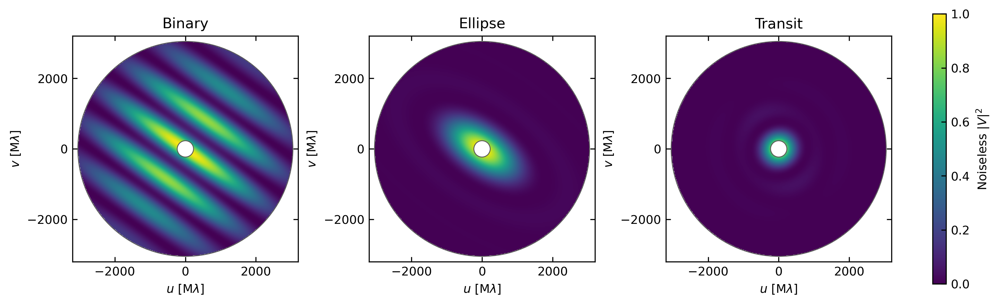

**图23。** 双星、椭圆、静态凌日源在圆环内的无噪声理论 $P$，颜色统一为0–1。
中心和外侧的白色区域是缺测区域。为便于看清理论结构，图像采用321×321显示网格；
实际优化使用上文81×81网格内的独立半平面点，并另保留归一化零点。

### C.3 用什么重建，是否用到了真实天图

使用保留的legacy非负像素重建器：天空网格为40×40，视场为0.70 mas，
相邻像素中心间距为0.01795 mas，允许发光的支撑半径为0.32 mas。
每组使用6个初值、每个初值最多1600次迭代。历史基准保留旧平滑强度0.020，
另外将平滑强度设为0，作为数值稳定性的对照；非负、总流量归一化和有限支撑约束保留。
此处不经过正文的120 M$\lambda$ UV合并。

对候选像素图 $I$，按照正文的傅里叶定义计算预测量 $P_I(u,v)=|V_I(u,v)|^2$。
本附录在所有提供的数据点上使用相同的数值权重，最小化预测量与准确理论量的失配，
加上相邻像素差异的平滑惩罚。沿用旧版Huber损失，其转折残差为0.15；
残差较小时就是平方损失。这里仍采用旧版的平滑项定义，不能把0.020与正文新版的强度直接比较，
不是光学PSF，也不是对最终图片进行美化。
这不是把物理不确定度 $\sigma_P$ 设成1：**本实验没有赋予测量误差**，统一权重只是
定义无噪声拟合的数值准则。没有测量噪声，并不意味着应当取消所有先验：有限频率范围
仍然不能稳定约束任意细的像素结构。无平滑对照用于检查这种依赖，不通过真图相似度挑选平滑参数。

初值使用现有高斯和随机双高斯初始化，不读取真实源参数；在6次拟合中仅按目标函数选择解。
真实天图只用于拟合结束后的平移/中心反演配准、显示和相似度评估，不参与优化或初值选择。
这种事后配准用于处理 $|V|^2$ 成像的平移与中心反演不确定性，不表示能测量绝对位置。
此外，解析源的连续边界与40×40像素模型并不完全一致，不能把所有残余失配都归因于缺失相位。

### C.4 为什么另外画一列“已知相位”

为直观看到切掉空间频率后的线性效果，另计算一个**额外知道真实相位**的参考。
这里 $V$ 是真实复可见度，$\mathcal F^{-1}$ 表示与正文傅里叶定义配对的逆变换：

$$
I_{\rm filt}=\mathcal F^{-1}[M V].
$$

离散实现另外保留 $V(0,0)=1$，在256×256的较大视场上逆变换，再裁出与重建图一致的
中央40×40区域；没有将裁剪区域重新归一化。硬切频率会产生振铃和负旁瓣，因此这一列
保留负值，使用单独的发散色标。它不是一个处处非负的物理天图。

这一列使用了 SII 没有直接测到的真实相位，**不是SII重建结果，也不是带先验非线性重建的
严格性能上界**。它只展示线性带限响应。尤其不能把
$\mathcal F^{-1}[M|V|^2]$ 当成天图：后者对应带限的强度自相关，而非源本身。

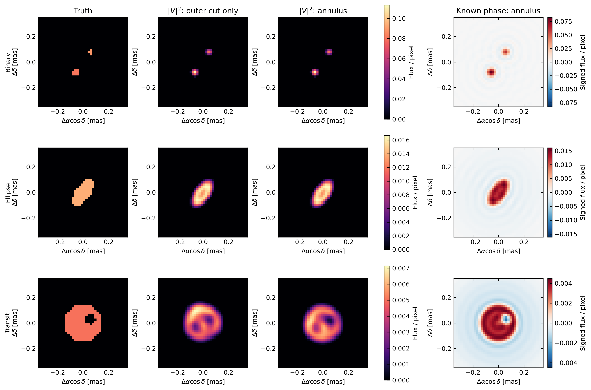

**图24。** 每行依次为双星、椭圆和静态凌日源；四列分别为真实天图、仅切外圆的
无相位重建、中心也挖空的圆环无相位重建，以及使用真实相位的圆环线性参考。
两个无相位重建列均沿用旧方法的平滑强度0.020。
每行前三列共用非负流量色标；最后一列用独立的有符号色标，不能按颜色亮暗直接与前三列比较。
此图用于比较源形状与缺失空间频率，不对应20 min、6 h或任何有限曝光时间。

### C.5 怎样解读结果

结果的定量汇总由 notebook 输出，并保存为
`docs/sii_workflow_figures/23_ideal_annulus_summary.csv`。
功率可见度RMSE是所有输入点上 $P_I-P$ 的均方根，用于衡量UV拟合；
天图相关系数是事后配准后与真图的像素相关，用于评估图像形态，不是检测显著性。
两者回答不同问题：拟合UV数据好，并不自动证明像面细节唯一或正确。

使用旧方法的平滑强度0.020，历史基准得到：

| 源 | 覆盖 | $P$ 的RMSE | 天图相关系数 |
|---|---|---:|---:|
| 双星 | 仅切外圆 | 0.007608 | 0.9031 |
| 双星 | 中心挖空的圆环 | 0.007600 | 0.9031 |
| 椭圆 | 仅切外圆 | 0.002962 | 0.9490 |
| 椭圆 | 中心挖空的圆环 | 0.002956 | 0.9488 |
| 静态凌日 | 仅切外圆 | 0.001414 | 0.9298 |
| 静态凌日 | 中心挖空的圆环 | 0.001388 | 0.9458 |

两组分别包含2510和2496个独立半平面约束，均计入归一化零点。
在本例中，双星的位置分离、椭圆的伸长方向，以及凌日的偏心暗区都能辨认；
但盘面均匀性、锐利边缘和小尺度细节并未完全恢复。中心缺口对双星、椭圆的图像相似度
影响很小。凌日圆环组相似度反而略高，**不能据此说丢弃短基线会提升信息量**：
输入约束变化会改变有限迭代下选中的局部解，统一损失归一化与平滑项的相对作用也会变化。

无平滑对照的圆环重建中，双星、椭圆、凌日的天图相关系数分别为0.8239、0.5788、0.5924，
尽管其UV失配更小，椭圆和凌日图却出现明显像素斑点。这个对照说明：有限UV范围内拟合得
更精确，不等于缺测频率对应的图像细节更可信。本附录主图保留历史版本预先采用的平滑强度，
不是事后按真实天图挑选最漂亮的一组参数。所有12组解的优化器均报告数值收敛，
但这不等于已找到非凸问题的全局最优。

本例中心缺口对应的条纹尺度约为 $1/\rho_{\rm in}=0.892\ \mathrm{mas}$，
大于0.70 mas重建视场；因此它对这些紧致模型的影响不能直接推广到更宽、更弥散的源。
外半径对应 $1/\rho_{\rm out}=0.0677\ \mathrm{mas}$，这是最大基线的条纹角尺度，
不是保证任意形状都能分辨的硬阈值。像素比它更细，也不表示获得了同等细节的实测分辨能力。

若圆环重建看起来很好，只能说明当前源、支撑约束和数值设置下找到了很接近真图的解。
若仍有偏差，则需要区分缺测信息、解析源到像素的离散化和优化未充分收敛，不能由一张图
断言这是不可突破的物理极限。本附录的凌日图仍是一个固定时刻的静态模型，不把不同凌日阶段
拼成同一静态天图。

---

## 附录 D：统计重建更新后，哪些结论经过了独立检查

### D.1 更新范围与公平比较

这次没有改变仪器光学核、实测SPE、光子率或主波形GLS标定。
改变的是从 $\widehat P,\sigma_P$ 到图像的推断，主要包括：取消经验权重截断；
使用绝对误差定义损失；保留时间子采样和UV格平均；取消人为零基线测量；
按留出数据选择平滑强度；阻止重建后居中裁剪通量。第10节给出对应公式。

旧实现以 `likelihood="legacy"` 保留，只作为对照。比较时，两种方法接收同一批带噪测量，
并使用相同初值种子。完成拟合后，统一使用新前向模型和同一组绝对 $\sigma_g$ 重新评分。
因此表中的 $\chi^2/N_{\rm UV}$ 可以直接比较，其中 $N_{\rm UV}$ 是实际合并测量个数，
但它**不是除以有效自由度后的约化卡方**；非线性正则化拟合的有效自由度没有在这里估计。

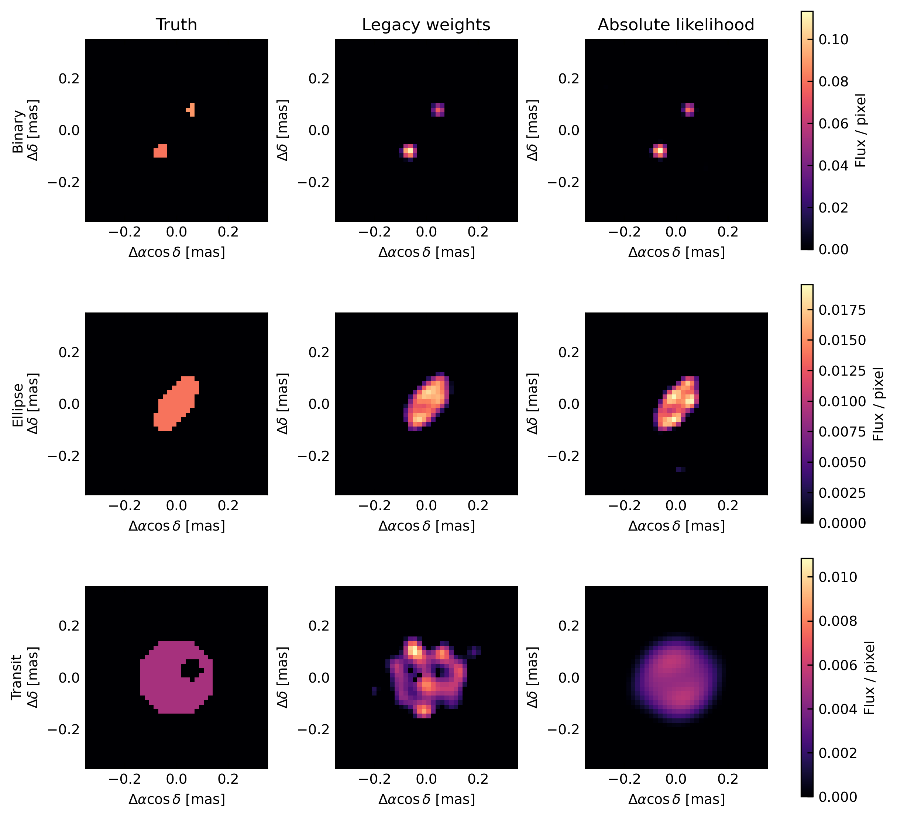

**图25。** 三行依次为2等星双星、椭圆、静态凌日，均为同一6 h阵列观测。
列分别为像素化真值、旧经验权重重建、新绝对统计似然重建。每行共享流量色标，
不对结果图额外平滑；只允许事后平移/中心反演配准。该图不以视觉更漂亮作为通过标准，
相应UV评分、图像指标、收敛标志和平滑选择表由同一notebook输出。

| 源 | 旧$\chi^2/N_{\rm UV}$ | 新$\chi^2/N_{\rm UV}$ | 旧天图相关 | 新天图相关 | 新版达到停止准则 |
|---|---:|---:|---:|---:|---|
| 双星 | 0.9890 | 0.9553 | 0.8344 | 0.8699 | 是 |
| 椭圆 | 0.9693 | 0.9616 | 0.9416 | 0.9401 | 是 |
| 静态凌日 | 0.9922 | 1.0374 | 0.8418 | 0.8866 | 是 |

两种方法这三组均达到各自的数值停止准则。新法双星、椭圆的UV评分略好，
但天图相关不保证同步提高；
凌日整体更平滑，却没有可靠恢复行星缺口。平滑惩罚与数据项共同决定解，
所以新法也不保证未加惩罚的卡方一定更小。这里修正的是统计目标和前向平均，
不是依据真图选择最好看的方法。

主报告还完整保留未通过停止准则的情况：2 h双星时间序列及20/5/1 min凌日分段对照
在1600次预算下尚未停止。不能把上面三个6 h基准的收敛推广到全部扫描。
每组状态与一阶驻点检查量见`25_main_reconstruction_status.csv`。

### D.2 三个独立噪声实现能说明什么

对三类源分别生成3份新的6 h噪声实现，再从每份取中心20 min。
旧、新方法每次都接收相同数据。新方法的平滑强度固定为独立参考数据选择的值，
不会每次看真图重新调参，也不会在看结果后换随机种子。
统计噪声由已有波形GLS的 $\sigma_P$ 抽样，因此这是**条件于标定模型的长曝光重复实验**，
不是又生成了数小时连续ADC波形。真值只用于生成模拟均值和拟合后的误差评估。

三类源均报告事后配准的天图相关系数及重复散布，不把它当成参数置信区间。
检查中发现，旧两峰诊断的默认最小间距0.35 mas不适合本例0.20 mas双星；
它未参与拟合，本附录不使用该诊断宣称双星间距精度，并移除不适用的派生列。
对凌日另定义“对侧区域亮度亏损”：事后配准后，在真实行星位置的中心反演位置取同样大小的圆区，
比较它与恒星盘内、避开两候选暗区的参考亮度。若区域均值为 $I_{\rm opp}$、参考均值为
$I_{\rm ref}$，则亏损 $d_{\rm opp}=1-I_{\rm opp}/I_{\rm ref}$，是无量纲诊断量。
报告 $d_{\rm opp}>0.25$ 的出现比例，仅用于检查假暗区；25%不是统计显著性阈值。
这个指标依赖已知真图坐标，仅用于模拟验证，不能拿来处理未知真实源时直接宣称发现行星。

3个随机种子只能提供有限稳定性证据，不能给出精确失败率，更没有证明可靠极限星等。
共同模板误差和仪器漂移在这些重复中没有变化，所以重复散布也不是总系统误差。

| 源 | 曝光 | 旧天图相关（均值±样本标准差） | 新天图相关（均值±样本标准差） |
|---|---|---:|---:|
| 双星 | 20 min | 0.832±0.034 | 0.815±0.032 |
| 双星 | 6 h | 0.848±0.048 | 0.881±0.004 |
| 椭圆 | 20 min | 0.834±0.052 | 0.892±0.014 |
| 椭圆 | 6 h | 0.932±0.002 | 0.919±0.006 |
| 静态凌日 | 20 min | 0.543±0.052 | 0.845±0.003 |
| 静态凌日 | 6 h | 0.792±0.069 | 0.881±0.019 |

本次新法18/18组、旧法18/18组均达到各自停止准则；此前新法凌日重复未收敛的问题
在这组固定对照中得到改善。每类只有3个独立噪声种子，仍不能据此宣称所有源上都有统计显著优势。
新法三次重复均没有超过25%阈值的对侧暗区，但6 h实际位置的平均亮度亏损也仅约19%，
20 min仅约5%。因此“假暗区减少”也可能是平滑同时抹去了真实暗区，不能当成成功恢复行星。

### D.3 不合并UV、加密像素和增加迭代预算

首先在中心20 min、496条原始基线上比较不合并、60和120 M$\lambda$合并。
它们保留相同时间子采样、同一测量和先验强度，区别只是是否压缩UV数据。
合并并非信息无损：即使模型正确平均，格内关于功率变化的独立对比信息仍被丢弃。
本实验用于量化这种压缩的影响，不能由496点的局部检查宣称所有整夜采样都完全收敛。

| UV合并尺度 | 输入重建的约束数 | 天图相关系数 | 达到停止准则 |
|---|---:|---:|---|
| 不合并 | 496 | 0.8490 | 是 |
| 60 M$\lambda$ | 456 | 0.8471 | 是 |
| 120 M$\lambda$ | 365 | 0.8330 | 是 |

本次合并越粗，天图相关略低，但不能将三组差异全部解释为信息损失：
数据压缩也会改变有限先验和局部解。不能仅从约束点数量推断最终成像精度。

然后对无噪声凌日圆环分别使用40×40和64×64网格，比较650/1600迭代上限及3/6个初值。
两组固定先验强度为 $\alpha=0$ 和 $10^{-5}$；这是敏感性检查，不用真图选择参数。
无噪声数据显式使用 `likelihood="noiseless"` 的功率残差平方和，不伪造一个很小的物理 $\sigma_P$。

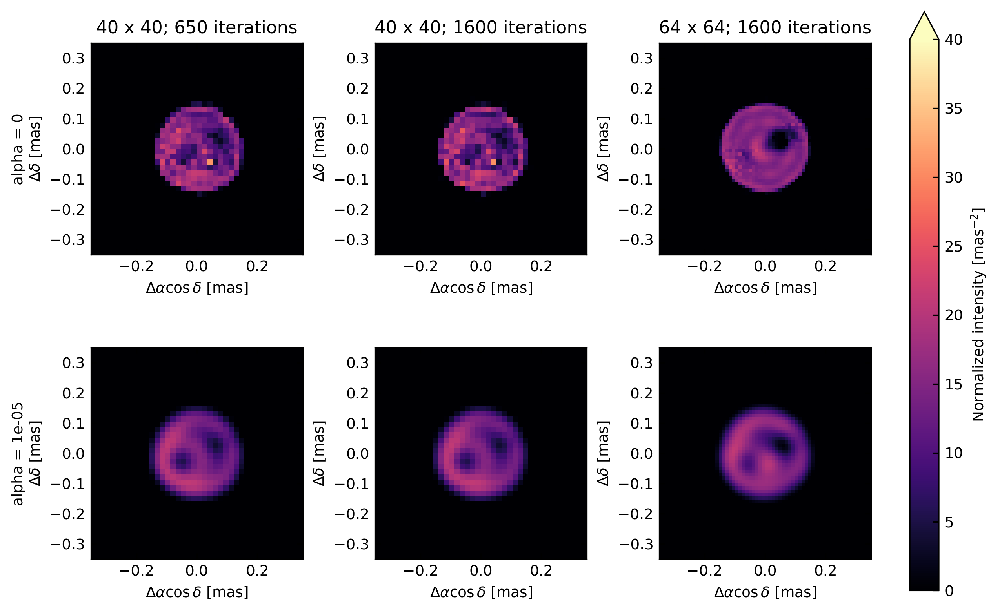

**图27。** 同一个无噪声圆环凌日模型，上下两行分别为无平滑及固定 $\alpha=10^{-5}$。
三列依次为40×40/650次、40×40/1600次、64×64/1600次，前一列3个初值，后两列6个初值。
颜色显示归一化亮度密度，单位mas$^{-2}$，而不是每像素流量，因此不同像素大小可在同一色标比较。
色标上端饱和只影响显示。增加迭代上限不表示每次都运行到该次数；实际收敛状态见表。
图像仍可能出现假暗区、尖峰或不均匀盘面，不能将这些数值解自动解释为物理最优。

本次无平滑对照从40×40/650次到64×64/1600次，功率RMSE由
$2.20\times10^{-5}$降至$6.26\times10^{-6}$，天图相关系数由0.917提高到0.964。
固定$\alpha=10^{-5}$时，40×40/1600次与64×64/1600次的天图相关系数分别为
0.932和0.947，图中仍有两个暗区。三个固定平滑对照均达到停止准则；
三个无平滑对照均未达到。64×64无平滑结果更接近单暗区，但仍有盘面起伏，
不能把未收敛的较好图像直接称为理论最优，也不能证明双暗区必然由缺失短基线造成。

### D.4 独立波形验证与程序测试

新增512条零信号短波形和128条增强注入短波形，随机种子与原标定不同。
这些新记录只送入原来的GLS估计器评估，不用于重新调权重或缩放原来的误差。
零信号均值除以 $\sigma_P$ 应接近0，样本标准差除以预测 $\sigma_P$ 应接近1；
增强注入回收均值除以注入量用于检验响应。有限样本会产生波动，不能强行调到1后再宣称独立验证通过。

本次独立检验的零信号均值为$0.01363\sigma_P$，样本标准差为$1.08045\sigma_P$，
增强注入响应比为1.02659。这个小样本的实际散布比固定标定预测高约8%，
但仅由点估计不能判断是否存在系统偏差：原标定和验证样本都具有有限统计量。
附录E将测试扩展到8192条，并计入两边的方差不确定度；结果与相同散布相容。
这里保留原误差与历史检验结果，没有用验证集反过来调误差后再宣称检验通过。

单元测试覆盖：平均功率核与逐子采样直接傅里叶计算一致；解析梯度与有限差分一致；
$\sigma_P$ 放大10倍时损失和梯度缩小100倍；已知非对角协方差的白化结果一致；
UV合并保留时间权重且不注入人为零点；最终返回图像确实预测出报告的功率和卡方。
独立波形检验只能约束本次已建模链路，不能校准尚不存在的真实硬件系统误差。

停止容差对照额外固定同一6 h凌日观测与平滑强度，以3个相同初值、3200次迭代上限，
比较默认和更严格相对函数容差。它用于判断统计目标是否已经足够稳定；
即使卡方几乎相同，图像仍可能不同，这反映弱约束方向，不能据此挑选更接近真图的一次作为唯一结果。

| 相对函数容差 | 总目标$\mathcal L$ | $\chi^2$ | 实际迭代数 | 达到停止准则 |
|---|---:|---:|---:|---|
| $10^{-12}$ | 554.040541936 | 1059.201505 | 220 | 是 |
| $10^{-14}$ | 554.040541915 | 1059.201135 | 342 | 是 |

两者天图相关系数分别为0.886636和0.886645，总目标只相差约$2.1\times10^{-8}$。
这支持当前默认容差下该受控6 h解已相当稳定；它不证明全局最优或行星暗区可辨识。
本对照和主图的初值种子不同，所以实际迭代数不应逐项相等。
其他分钟分段等未停止案例仍保留失败标志，不能用本表替它们作收敛证明。

### D.5 如何重新运行

主入口仍为 `notebooks/sii_complete_waveform_report.ipynb`，从头运行会重新产生本文主结果、
图25/27/29及对应诊断表，包括附录E的独立波形检验。批量执行命令为：

```powershell
$env:PYTHONIOENCODING='utf-8'
$env:OPENBLAS_NUM_THREADS='1'
python tools/execute_notebook.py notebooks/sii_complete_waveform_report.ipynb --timeout 3600
python -m pytest tests/test_sii_unified.py -q
```

理论模板、噪声、时间/星等对照与重建保持同一入口；图内标签使用英文，正文说明与代码注释使用中文。
`prepare_reconstruction_uv`只读取测量、误差、坐标和时间子采样。
已知跨UV协方差可经 `UvData.covariance` 直接传入，但缺失的共享系统误差不能用零矩阵冒充已测量。

---

## 附录 E：独立波形散布与像素参数化的进一步检查

### E.1 8%的散布差异是否意味着程序需要固定修正

不应直接乘一个1.08。第8.6节的$\sigma_P$也由有限标定数据估计，检验时必须把这部分统计量计入。
令$n_{\rm test}$是独立测试记录数，$n_{\rm scale}$是尺度标定记录数，
$s_{\rm test}$和$s_{\rm scale}$分别为固定GLS权重下两组估计量的样本标准差。
本程序缩放协方差后，报告的单块$\sigma_P=s_{\rm scale}$；固定权重是这项比较的必要条件。
定义$r=s_{\rm test}/s_{\rm scale}$，它是样本标准差之比，不是某条基线的SNR。

若两组独立且近似正态，在两总体方差相同的假设下，

$$
r^2\sim F_{n_{\rm test}-1,\,n_{\rm scale}-1}.
$$

$F_{\nu_1,\nu_2}$表示两个自由度分别为$\nu_1,\nu_2$的F分布。
令$Q_p$为该分布累计概率$p$对应的分位点，则两总体标准差比的95%置信区间为

$$
\left[\frac{r}{\sqrt{Q_{0.975}}},\frac{r}{\sqrt{Q_{0.025}}}\right].
$$

这一表达计入了两组样本的波动；不能把分母当作无限精确的常数。
F检验及正态前提见[NIST方法说明](https://itl.nist.gov/div898/handbook/eda/section3/eda359.htm)。
notebook同时对两组分别重抽样2000次，给出bootstrap百分位区间，并报告偏度与超额峰度检查分布形状。
这些区间描述标定一致性，不是单个UV测量或重建像素的置信区间。

原来512条测试波形得到$r=1.08045$。连同512条尺度标定记录计算，95%区间约为
0.991–1.178，双侧检验$p\simeq0.081$，尚不足以认定存在固定偏差。
随后新增8个预先固定种子的独立批次，共8192条零信号波形，结果为：

| 标定设置 | 独立测试数 | $r$ | F方法95%区间 | 双侧$p$ |
|---|---:|---:|---|---:|
| 原1024条零信号，512条用于尺度 | 8192 | 1.0416 | 0.9760–1.1077 | 0.218 |
| 新8192条零信号，4096条用于尺度 | 8192 | 0.9911 | 0.9650–1.0176 | 0.506 |

两组bootstrap 95%区间分别为0.9809–1.1119和0.9660–1.0165，同样包含1。
2048条独立增强注入记录给出的回收均值/注入量分别为1.0077和1.0037，
独立测试均值的标准误分别为0.0032和0.0031；这些标准误不包含模板标定误差，
不能拿它们当成完整响应系统误差或精确无偏证明。

第二组使用独立生成的更大标定集，不用外部测试结果调整尺度。
原标定仍用于主图，因此这次可靠性检查没有改变主图的噪声以改善重建。
更大标定集的20 min条件标准差为0.18003，原标定为0.17424；它们也使用各自拟合的模板和权重，
不能把两者之比当成只改变样本数时必然获得的仪器灵敏度变化。

这组证据支持“原8%差异可与有限标定波动相容”，不等于证明精确无偏。
原与新标定在独立测试集的偏度约0.005和0.007，超额峰度约$-0.054$和$-0.051$，
暂未显示强非正态性；共享漂移、真实硬件系统误差和模板不确定度仍需另行标定。
8份小标定之间的错位测试也显示散布比上下波动，不能把单个种子的比值作为固定修正系数。

### E.2 为什么直接优化非负像素更容易收敛

物理目标仍是第10节的$\mathcal L(\mathbf x)$。令$g_p=\partial\mathcal L/\partial x_p$
为目标对第$p$个归一化像素流量的导数。旧softmax与新非负归一化的链式导数分别为

$$
\frac{\partial\mathcal L}{\partial z_p}
=x_p\left(g_p-\sum_qx_qg_q\right),
\qquad
\frac{\partial\mathcal L}{\partial a_p}
=\frac{g_p-\sum_qx_qg_q}{s_a}.
$$

其中$z_p$、$a_p$和$s_a$在第10.3节定义，$q$在本式仅为对像素求和的下标。
旧式在暗像素处多乘一个很小的$x_p$，可能使其更新停滞；新式去掉这种额外压低，
仍然使用相同初始天图、非负性、归一化、支撑范围、似然和平滑先验，没有预设行星位置。
`parameterization="flux"`为当前默认，`"softmax"`和旧权重`"legacy"`保留作对照。

为避免只看优化器返回的成功标志，再定义

$$
D=\sum_px_pg_p-\min_pg_p\ge0.
$$

$D$是像素单纯形上的一阶驻点检查量，与物理目标使用相同的无量纲单位。
若将很小的流量比例移向梯度最小的像素，一阶目标下降量等于该比例乘$D$。
因此$D$接近0是局部驻点的必要条件，但在这个非凸问题中不是全局误差上界，也不能证明图像唯一。
不同数据和目标尺度下，不能只比较$D$的裸数值大小。
L-BFGS-B的函数变化和投影梯度停止条件见[SciPy说明](https://docs.scipy.org/doc/scipy/reference/optimize.minimize-lbfgsb.html)。

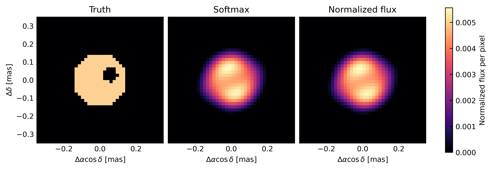

**图29。** 2等静态凌日源、同一6 h观测。三列依次为像素真图、旧softmax参数化、新非负流量参数化。
使用相同测量、初始天图与平滑强度，仅比较数值参数化和声明的停止容差。
面板共享每像素归一化流量色标，不进行显示后平滑，仅作事后平移/中心反演配准。
图像看起来相似并不否定优化改善：主要判据是目标值、实际迭代数及一阶驻点检查。
具体结果由notebook附录E和`29_optimizer_parameterization.csv`同时给出。

| 参数化 | 相对函数容差 | 总目标$\mathcal L$ | 实际迭代数 | 达到停止准则 | 一阶检查$D$ |
|---|---:|---:|---:|---|---:|
| softmax | $10^{-9}$ | 554.062422 | 1600 | 否 | 54.85945 |
| 非负流量归一化 | $10^{-9}$ | 554.040607 | 135 | 是 | 0.091414 |
| 非负流量归一化（默认） | $10^{-12}$ | 554.040542 | 205 | 是 | 0.001376 |

相同容差的前两行先隔离参数化影响，第三行再检查更严格停止要求。
默认解目标更低、一阶检查量更小，但事后天图相关从旧解的0.8894变为0.8866，
没有因更接近真图而被选中。这正是数值优化改善与形态真实性需要分开报告的原因。

本次解决的是标定一致性的判读与数值条件问题。数值停止仍不等于行星缺口可靠恢复，
更不等于已经建立极限星等、成功率或像素置信区间。

---

## 参考物理关系

- [Pupil plane intensity interferometry with imaging air Cherenkov telescopes](https://academic.oup.com/mnras/article/538/2/867/8015798)：给出时间相干面积、电子带宽和 SNR 的统一表达。
- [Intensity interferometry with more than two detectors?](https://academic.oup.com/mnras/article/437/1/798/1007746)：解释窄带下光子率与相干时间的抵消，以及独立光谱通道的收益。
- [Intensity interferometer results on Sirius with 0.25 m telescopes](https://academic.oup.com/mnras/article/537/3/2527/8003771)：讨论实际系统中探测时间分辨远大于光学相干时间时的相关对比度展宽。
