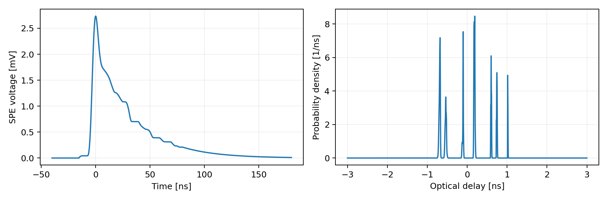
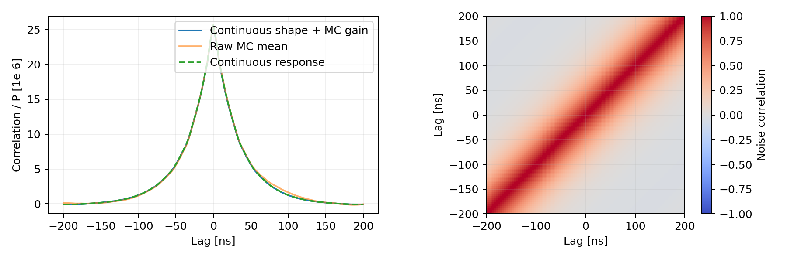
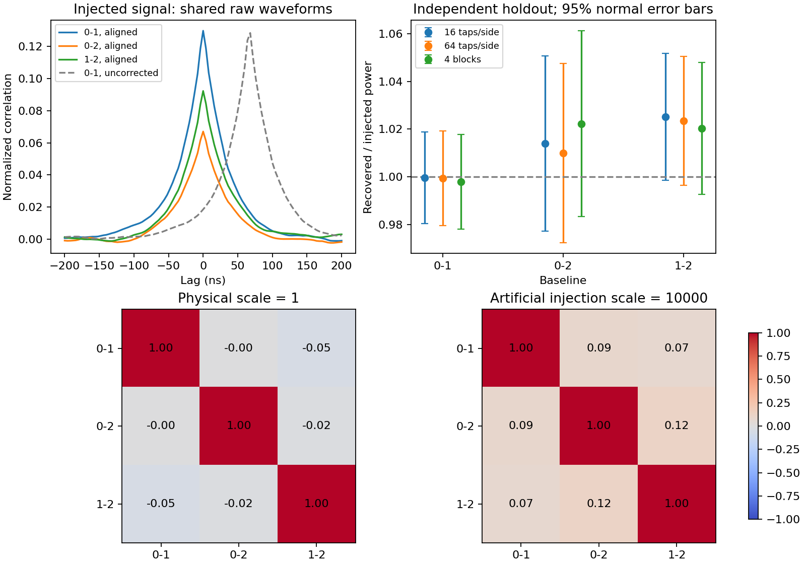
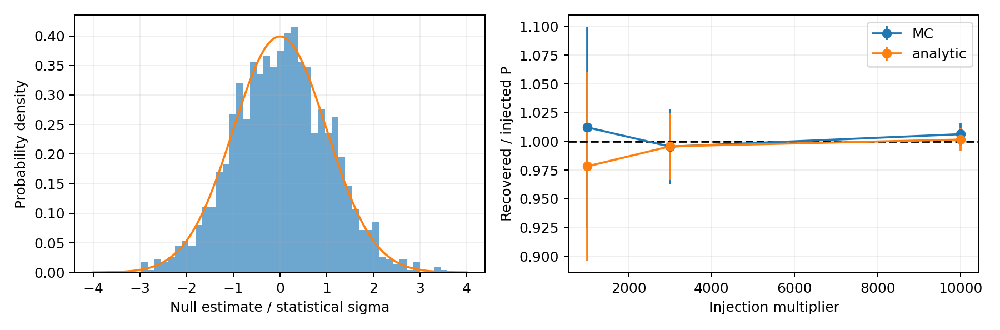
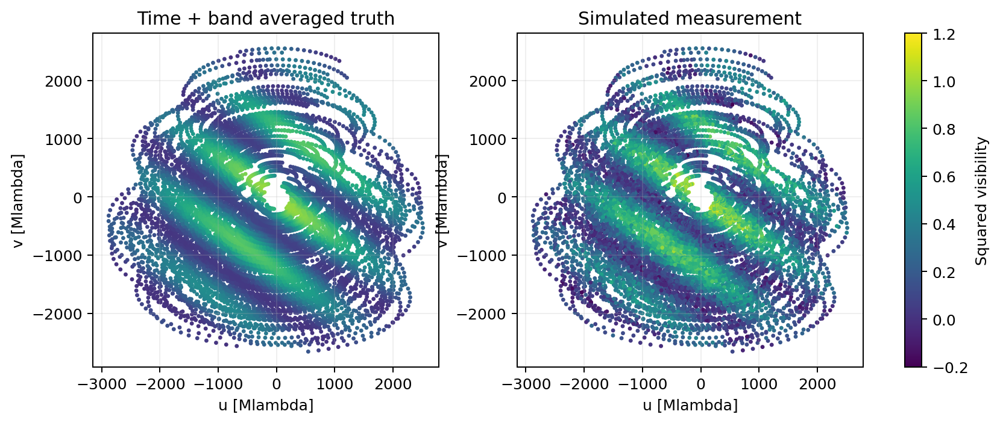
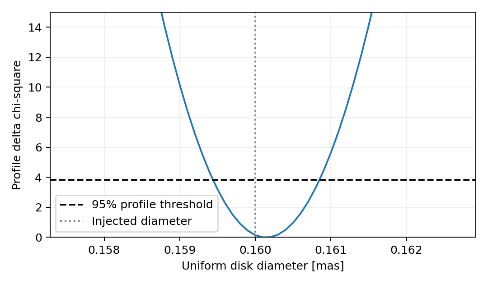
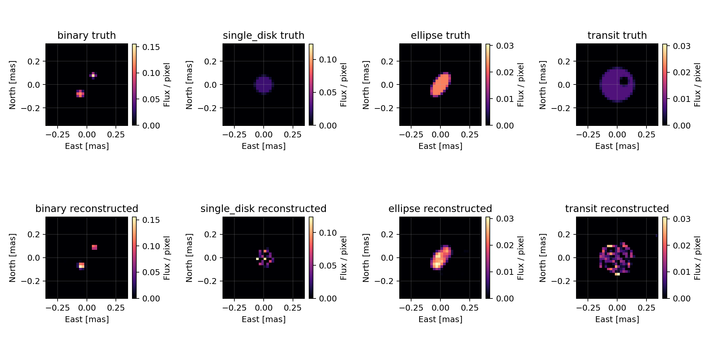
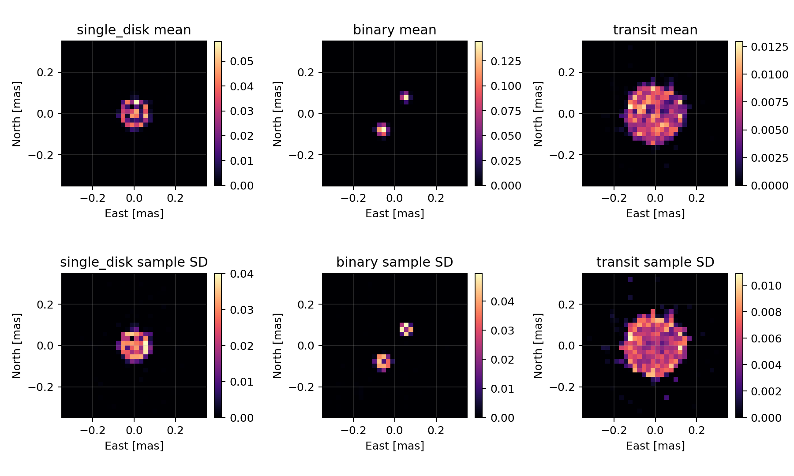

# LACT恒星强度干涉：从天体亮度到测量与重建

本版本是一套用仓库仪器输入约束的随机模拟和统计推断程序。短记录实际生成光电子并形成波形；整夜观测使用由短波形标定的统计量。它可以支持明确假设下的方法和性能研究。它还不是实测恒星观测，也不能仅凭重建图声称检测到双星或行星。

计算证据在[完整Notebook](../notebooks/sii_complete_waveform_report.ipynb)，函数和复现方法在[代码实现说明](SII_IMPLEMENTATION_ZH.md)。当前数值由[结果汇总](../validation/sii_science/summary.json)及其同目录CSV保存。

## 1. 先区分输入事实与观测场景

参数核对以GitHub main提交`2926031b14c8aa2164a4d9233f5c2d0a75324127`为准。[来源清单](../configs/sii/main_parameter_manifest.json)保存核对过的文件和哈希。**来自main不等于每一项都是实测**：配置中的采样率、天空谱模型以及由光追得到的时间核有不同证据性质。

| 输入 | 本次采用值或来源 | 证据类别及作用 |
|---|---|---|
| 单光电子响应SPE | [时间—电压数组](../configs/electronics/parameters/spe_template_measured.csv)，积分84.03496 mV ns | 实测波形经过模板提取；决定脉冲叠加及噪声时间相关 |
| 单光电子电荷涨落 | [电荷样本](../configs/electronics/parameters/spe_charge_samples_measured.csv)，归一化后二阶矩1.032545 | 实测样本；决定散粒噪声强度 |
| 反射率、滤光片、PDE | main对应响应曲线 | 实测/配置响应输入；具体来源以原始数据为准，不额外宣称整条响应经过现场测量 |
| 光学时间分布 | [单像素光追核](../configs/optics/lact2_measured_single_pixel_400nm.csv)，RMS为0.548827 ns | 使用实测光学配置生成的光追结果；不是探测器本征时间抖动实测 |
| 单像素有效探测面积 | 光追缓存及其[溯源记录](../configs/optics/lact2_measured_single_pixel_400nm.provenance.json) | 已包含镜面、遮挡、PSF、相机、集光器、滤光片和PDE的模型结果，避免再乘同一损失 |
| 采样间隔 | 4 ns，即250 MS/s | main电子学配置；125 MHz是数字Nyquist频率，不是另一次前端带宽测量 |
| SII光学通带 | 中心400 nm、宽2 nm矩形通带，乘已有响应曲线 | 场景假设；支持替换为实测SII透过率曲线 |
| 上游源透过率 | `source_transmission_scale=0.7836336` | 固定场景假设；不是当前夜晚大气实测，也没有调用逐时MODTRAN传播 |
| 夜天光背景NSB | main天空谱、像素立体角与同一SII通带积分 | 天空模型预测；本次为0.573214 MHz，不能当作实测当晚背景 |
| 未测电子学及漂移 | 电噪声、暗计数、串扰、后脉冲、恢复、本征抖动、剩余时延和增益漂移等为0 | 缺失且关闭。0不产生衰减或附加涨落，接口保留 |
| ADC量化 | 位数与满量程为0 | 关闭量化；保留采样后的模拟电压 |
| 天体及观测 | 总观测AB星等2，32台望远镜，过中天前后共6小时 | 理想静态场景，不是特定日期的天体观测记录 |

SPE长尾已经在模板中。它可能包含探测器和前端的共同响应，不能直接解释成微单元恢复时间，再重复施加恢复损失。当前微单元恢复时间是0；将来有独立恢复测量后再启用。

**图1。** 左图横轴是相对SPE参考时刻的时间，单位ns；纵轴是模板电压，单位mV。右图是光追延迟混合分布的概率密度，单位ns的倒数，横轴已减去平均光行时。这两图是响应输入，不是随机观测。光追核只展示中心±3 ns，生成光电子时使用完整混合分布；显示窗口不截断计算。图1不包含尚未测得的本征时间抖动。

## 2. 天体亮度如何决定相关信号

以源中心附近的切平面描述天空。东、北角坐标分别记为$l,m$，单位rad。归一化亮度$I(l,m)$的单位为rad的负二次方，且积分为1。总光通量另由AB星等决定，不能和归一化形态混为一项。

投影基线除以波长后得到空间频率$u,v$，按波长数计。远场、窄视场、空间非相干热辐射的复可见度为

$$
V(u,v)=\int I(l,m)\exp[-2\pi i(ul+vm)]\,dl\,dm,
\qquad P(u,v)=|V(u,v)|^2.
$$

$V$和平方可见度$P$都无量纲。程序拟合$P$，不把未知傅里叶相位当作观测。零基线满足$V(0,0)=1$，由图像总流量归一化保证，无需伪造一个零基线测量。

均匀圆盘的角直径为$d$，单位rad；空间频率长度为$q=\sqrt{u^2+v^2}$。对轴对称亮度做角向积分，再做径向积分，得到

$$
V_{\rm disk}(q)=\frac{2J_1(\pi d q)}{\pi d q}.
$$

$J_1$是一阶贝塞尔函数。$d q$无量纲，$d\to0$或$q\to0$时$V\to1$。代码显式处理这个极限。角度输入mas先换为rad，$1\,\mathrm{mas}=4.8481368\times10^{-9}\,\mathrm{rad}$。

双星把两颗圆盘的复可见度乘各自位移相位，再按流量比相加，最后才取模平方。椭圆通过坐标旋转和长短轴伸缩计算。遮挡模型把完全位于恒星盘内的不透明圆盘亮度从恒星亮度中减去，再按**遮挡后的总光通量**归一化。这里没有轨道、时间变化的凌星光变或临边昏暗，AB星等表示该静态场景的总观测亮度。

## 3. 地球自转决定实际采样位置

望远镜位置采用东、北、天顶ENU坐标，单位m。镜对$i,j$的基线是$\boldsymbol B_{ij}=\boldsymbol r_j-\boldsymbol r_i$。观测站纬度为$\phi$，源赤纬为$\delta$；时角定义为$H=\mathrm{LST}-\mathrm{RA}$，西向为正。源方向单位向量为

$$
\boldsymbol s=
\begin{pmatrix}
-\cos\delta\sin H\\
\sin\delta\cos\phi-\cos\delta\cos H\sin\phi\\
\sin\delta\sin\phi+\cos\delta\cos H\cos\phi
\end{pmatrix}.
$$

东向天球切轴是$\boldsymbol e_u=-(\partial\boldsymbol s/\partial H)/\cos\delta$，北向切轴是$\boldsymbol e_v=\partial\boldsymbol s/\partial\delta$。因而$u=\boldsymbol B\cdot\boldsymbol e_u/\lambda$，$v=\boldsymbol B\cdot\boldsymbol e_v/\lambda$。沿视线投影$w_m=\boldsymbol B\cdot\boldsymbol s$保留m单位，几何时延为$w_m/c$。这里$c$是真空光速，单位m/s。沿天球固定方向构造切轴，可以避免把视差角的额外旋转错误引入源的位置角。

以过中天为时间零点，曝光时长用SI秒；时角按平均恒星日86164.0905 s推进，不把一个恒星日当成86400 s。此处是固定赤道坐标的平均自转模型，不是包含极移、章动、折射和目标历表的日期级指向程序。程序拒绝不是整数段的曝光以及观测窗口内低于地平线的源。

一段1200 s内的基线会转动，400 nm附近不同波长也对应不同空间频率。因此测量期望是

$$
\overline P_a=\sum_{t,r} w_{tr}
P\!\left(\frac{B_{u,a}(t)}{\lambda_r},\frac{B_{v,a}(t)}{\lambda_r}\right),
\qquad \sum_{t,r}w_{tr}=1.
$$

$a$标记一条测量；$r$标记波长节点。时间采用9个中点，波长采用5点Gauss–Legendre求积。权重由下一节的相关面积光谱决定。这是对**模平方**平均，不是先平均复振幅，也不是把平均UV坐标代入一次。重建器接收相同的子采样及权重；合并UV格后仍保留全部实际子采样。

32台望远镜有496对，6小时包含18段，产生8928条测量。[时间求积对照](../validation/sii_science/time_quadrature.csv)将每段时间节点增至27，以相同理论源检查积分误差。

## 4. 同一通带必须同时决定光子率和相干面积

AB星等为$m_{\rm AB}$，频率通量密度为$F_\nu$，单位W m$^{-2}$ Hz$^{-1}$。普朗克常数记为$h$，单位J s。平坦AB频谱满足

$$
F_\nu=3631\times10^{-26}10^{-0.4m_{\rm AB}},
\qquad R_\star=\int r_\nu\,d\nu,
\qquad r_\nu=\frac{A\eta(\nu)F_\nu}{h\nu}.
$$

$A$是收集面积，单位m²；$\eta$是探测传递比例；$r_\nu$是探测光电子谱率，单位s$^{-1}$ Hz$^{-1}$。如果有效探测面积已经含PDE等损失，就不再重复乘入。每个光子的能量$h\nu$为J，所以积分后的$R_\star$为s$^{-1}$。本次$m_{\rm AB}=2$给出$R_\star=199.889298$ MHz。

夜天光用地面天空的光子谱面亮度积分，另乘面积、像素立体角和同一通带响应。它增加单镜噪声，不被当作目标天体的HBT信号。上游源透过率不再乘到已经定义于地面的天空谱上。

将单位偏振的归一化时间相干函数记为$\gamma_t(\tau)$。对两个互不相干且等强的偏振，偏振因子$p=1/2$；单偏振可设$p=1$。有效相干面积定义为

$$
\tau_{\rm eff}=p\int|\gamma_t(\tau)|^2d\tau
=p\frac{\int r_\nu^2d\nu}{(\int r_\nu d\nu)^2}.
$$

它的单位是s，已包含偏振因子，后续对率和GLS响应中不能再乘一次1/2。理想矩形频率通带下$\tau_{\rm eff}=p/\Delta\nu$；窄带近似$\Delta\nu\simeq c\Delta\lambda/\lambda_0^2$。当前曲线积分给出0.133429 ps。与4 ns采样间隔相差约三万倍，所以ADC不会直接解析光学相干波动。

对平坦AB频谱，换成波长积分后，相关面积权重正比于响应曲线的平方。第3节的波长权重据此构造，而不是用光子率的线性响应权重。恒星、NSB及相干面积共享同一2 nm通带，避免一项使用窄带、一项仍使用宽带。

## 5. 热光场、超额光子对和它们的适用范围

热光场满足二阶强度相关与一阶相干的关系。程序用两条独立路径检查这一物理基础。

第一条是独立热光验证。取均值为0、单位方差的圆对称复高斯场$E_1$与独立场$E_0$，构造$E_2=\sqrt P E_1+\sqrt{1-P}E_0$。把$M$个独立模的$|E|^2$平均成归一化光强$J_1,J_2$，则

$$
\operatorname{Cov}(J_1,J_2)=P/M.
$$

给定光强后再做泊松探测。若每条记录的平均星光计数为$\mu_\star$、背景为$\mu_b$，都有“个”的计数单位，那么

$$
\operatorname{Var}(N_1)=\mu_\star+\mu_b+\mu_\star^2/M,
\qquad
\operatorname{Cov}(N_1,N_2)=\mu_\star^2 P/M.
$$

因此可以同时验证均值、热光超泊松方差和镜间协方差。[30万次计算](../validation/sii_science/thermal_modes.csv)采用$M=16$、$\mu_\star=6$、$\mu_b=2$、$P=0.6$。16是可检验的离散示例模数，不是LACT每4 ns的实际光学模数。

第二条用于纳秒波形。对相干时间远短于仪器响应的弱热光，二阶超额相关面积可以用稀疏共享光电子对表示：

$$
R_{\rm pair}=R_{\star,1}R_{\star,2}\tau_{\rm eff}P.
$$

右侧单位是s$^{-1}$。每台镜的独立星光流率设为$R_{\star,i}-R_{\rm pair}$，再加入共享对，以保持边缘总星光率不变。背景另外独立生成。$P=0$时对率归零；若放大注入后的对率超过任意一镜总星光率，代码报错。

本次单位$P$对应每20 μs约0.107个物理超额对。单个短记录一般看不到清晰相关峰。标定使用已知放大倍数增加对率，最终除回倍率；长曝光场景不使用放大的物理信号。独立注入检验分别采用1000、3000和10000倍。

共享对算法只保持需要的弱信号二阶相关，不具有完整热光的全部高阶统计。当前简并度$R_\star\tau_{\rm eff}=2.6671\times10^{-5}$说明散粒噪声占优，不能据此推广到高简并度或多镜高阶相关。[Rou等的原始模拟研究](https://academic.oup.com/mnras/article/430/4/3187/1113694)同样强调脉冲响应、背景和有限口径对SII预测的作用；本实现的独立热光检验和解析对照用于检查自身近似，并非声称复现该论文的全部模型。

### 5.1 多镜共享数据还需要哪些约束

三镜的01、02、12基线必须使用同一次生成的三个事件流。若每个镜对都重新生成镜0，虽然各基线的平均峰可以正确，基线之间的联合涨落却不再对应同一次观测。`sii_observation.py`先生成每镜唯一事件流和电压，再由所有基线共用。

联合输入为无量纲复相干矩阵$\Gamma$，元素$\Gamma_{ij}=\langle E_iE_j^*\rangle$，场归一到单位方差。它必须是Hermitian半正定矩阵且对角为1；仅保证每个$|\Gamma_{ij}|^2$介于0和1仍不够。多镜弱对过程把镜$i$的独立星光率改为

$$
R_{\star,i}^{\rm single}=R_{\star,i}-\sum_{j\ne i}R_{\star,i}R_{\star,j}\tau_{\rm eff}|\Gamma_{ij}|^2.
$$

加上其参与的全部共享对后，平均星光率仍为$R_{\star,i}$。放大注入时求和项整体乘注入倍率；若独立率变负，程序拒绝运行。因此双镜能用的放大倍率，不一定适用于32镜。

这仍是弱对近似，其各镜星光边缘是泊松流，缺少完整热光自聚束及三镜闭合项。独立的`joint_thermal_mode_counts`通过复高斯联合场生成光强，检验这些高阶项。沿用$M$个独立模平均的归一化光强$J_i$，三镜中心矩为

$$
\left\langle(J_0-1)(J_1-1)(J_2-1)\right\rangle
=\frac{2\operatorname{Re}(\Gamma_{01}\Gamma_{12}\Gamma_{20})}{M^2}.
$$

单模三阶相关的闭合相位项见[Malvimat、Wucknitz与Saha](https://academic.oup.com/mnras/article/437/1/798/1007746)；独立模相加的三阶累积量可加，除以平均中的$M^3$后得到上式的$M^{-2}$。这是离散热光基准，不把它的两模场景当作LACT实际4 ns采样。[30万条联合热光记录](../validation/sii_observation/thermal_moments.csv)得到三阶中心矩$0.09550\pm0.00210$，理论为0.09671；误差为均值标准误。此结果检验联合场实现，不能证明弱对生成器具有相同高阶统计。

## 6. 仪器如何把相关光电子变成一个宽峰

第$i$台镜中第$k$个光电子的时间为$t_{ik}$，归一化电荷为$Q_{ik}$；SPE电压模板记为$h_{\rm SPE}(t)$，单位mV。采样中心时刻$t_n=(n+1/2)\Delta t$，噪声电压为$e_i[n]$。量化前波形为

$$
x_i[n]=\sum_k Q_{ik}h_{\rm SPE}(t_n-t_{ik})+e_i[n].
$$

光学延迟从各镜的时间核独立抽样。本征抖动若有实测值，在光电子时刻上另加；当前为0。连续模板通过线性插值在实际采样位置求值，光电子到达时刻不先取整到4 ns格点。电荷样本满足$\mathrm E Q=1$，而$\mathrm E Q^2>1$增加噪声。电子学白噪声为0时不加随机数组，ADC位数为0时不量化。

波形各自减去块内均值后做互相关，并按有重叠的样本数和实测方差归一化。得到的相关向量记为$\boldsymbol C$，各分量对应不同滞后，均无量纲。这里的有限块归一化会产生小修正，所以“无偏滞后计数”不等于整个归一化比值严格无偏。

相邻滞后的噪声不独立，因为它们重复使用同一批脉冲。独立解析对照先计算连续SPE自相关$A_h(\tau)=\int h_{\rm SPE}(t)h_{\rm SPE}(t+\tau)dt$，再与两镜光学延迟差分布卷积得到信号峰。光学传递在频域贡献模平方，不能把单镜展宽当作确定平移。

在长块、线性探测、零相关信号的近似下，归一化单镜自相关为$\rho[j]$，块内样本数为$N$，Bartlett形式给出

$$
\operatorname{Cov}(C_k,C_l)\simeq\frac1N\sum_j\rho[j]\rho[j+k-l].
$$

右侧无量纲且随块长按$1/N$下降。代码另保留减均值和样本方差的一阶有限块修正。该解析路径不调用共享光电子对生成器，也不读取Monte Carlo拟合的峰形。

**图2。** 左图横轴为滞后ns，纵轴为每单位$P$的归一化相关响应，以$10^{-6}$为显示单位；实线来自波形Monte Carlo标定，虚线来自独立解析计算，都是期望峰。右图是不同滞后之间的噪声相关系数，颜色范围固定为−1至1。左图由图1的响应经过两种计算得到；右图由零信号波形样本估计并作平稳协方差正则化，不能把它当成天体图像。

### 6.1 到达时差必须先进入波形，再由处理程序补偿

设镜$i$的ENU位置为$\boldsymbol r_i$（m），参考镜位置为$\boldsymbol r_0$，第3节的单位矢量$\hat{\boldsymbol s}$指向天体。光朝$-\hat{\boldsymbol s}$传播，所以到达时差$d_i$（s）为

$$
d_i=-\frac{(\boldsymbol r_i-\boldsymbol r_0)\cdot\hat{\boldsymbol s}}{c},
\qquad y_i(t)=x_i(t+d_i).
$$

第一式中朝天体方向更近的镜先到，$d_i<0$；第二式在原始波形对应的到达时刻取值，使共同事件回到同一参考时间。零基线给零时差；m除以m/s得到s。代码接口以ns传递。旧UVW表中的`geometric_delay_ns`保存正的基线投影除以光速，表示几何补偿量；不能直接把它当作这里的到达时差。

实际ADC间隔为4 ns，时差通常不是其整数倍。`align_waveforms`采用有限Lanczos-sinc插值；整数偏移直接索引。输出只保留所有通道及插值支持区间都有真实输入的公共区间，不把记录末端卷绕到开头。插值是带限近似，不能恢复ADC中已混叠的模拟频率，因此补偿后的响应必须重标定。

三镜验证使用布局中的TEL.1、TEL.2和TEL.6、时角0.5 rad、赤纬0.3 rad。后两个角度和输入复相干矩阵是检验场景，不是特定真实恒星的观测记录。到达时差为0、−66.713、489.583 ns。24 μs记录经默认16点半宽补偿后保留23.320 μs；四块合并再丢弃2个尾样本，实际使用23.312 μs。此场景24 μs内最大几何时差变化约$2.17\times10^{-6}$ ns，可冻结几何；较长观测必须更新时角，不能沿用整晚固定时差。

**图S1。** 左上为384条独立留出记录的平均归一相关，横轴为滞后ns，曲线无平滑；实线是补偿后三条基线，灰虚线是未补偿01基线。显示窗口为±200 ns，另外两条未补偿基线的峰在窗口外，未画出。此面板使用10000倍人工注入以检验处理链，不能把峰高当作实际星光信号。右上是恢复功率除以注入真值，三组方法各自用另外256条记录标定，误差棒是留出均值和标定均值误差合成后的正态近似95%区间。下排是三条基线估计量的样本相关矩阵，颜色固定在−1到1；左为物理倍率1，右为人工倍率10000，分别来自384条新记录。它们不是第9节长曝光重建的输入。

默认补偿的留出功率为0.48981、0.25349、0.36904，真值分别为0.49、0.25、0.36，含标定误差的均值标准误约0.0048。整段与四块合并的差异均小于1.45个合成标准误。64点半宽相对16点半宽的训练响应改变约0.17%、0.09%、2.15%；这同时包含裁剪区间变化，不能宣布插值已达到亚百分比收敛。两种处理均经过各自标定，不能直接共用一个增益。

物理倍率下，三对基线估计量的样本相关系数约−0.0039、−0.0536、−0.0205；384条记录对近零相关的95%分辨范围约为±0.10。[结果表](../validation/sii_observation/baseline_covariance.csv)保留协方差及Fisher近似区间。因此尚不能证明基线统计严格独立或给出百分比以下的相关上限。单条约23 μs记录的功率噪声标准差约580至598，远大于物理信号；倍率1的数据验证了实际弱信号下的数据通路，并未在这些短记录中检出恒星相关峰。人工注入改变了联合噪声，不能把右下矩阵外推为真实LACT整夜误差。

## 7. 完整峰GLS怎样得到一个平方可见度测量

单位$P$的相关峰模板记为$\boldsymbol k$；零信号均值记为$\boldsymbol C_0$；单块相关噪声协方差为$\boldsymbol\Sigma_b$。模型为$\mathrm E\boldsymbol C=\boldsymbol C_0+P\boldsymbol k$。理想独立通道的零信号期望采用0，而不是把有限训练样本的随机均值当作真实仪器零点。

广义最小二乘GLS使用完整峰及其协方差：

$$
\widehat P=\frac{\boldsymbol k^T\boldsymbol\Sigma_b^{-1}(\boldsymbol C-\boldsymbol C_0)}
{\boldsymbol k^T\boldsymbol\Sigma_b^{-1}\boldsymbol k},
\qquad
\sigma_{P,b}^2=(\boldsymbol k^T\boldsymbol\Sigma_b^{-1}\boldsymbol k)^{-1}.
$$

所有量无量纲。模板必须随仪器和源/背景率标定；换SPE、采样或通带后复用旧标定会被拒绝。增加噪声协方差会使误差增大；增加单位信号响应会使误差减小。

2048条零信号记录和512条放大信号记录分别划分为训练、选择和检验用途。协方差先沿滞后差平均，再轻微向对角阵收缩；收缩强度由留出数据选取。另用未参与该选择的零信号记录定噪声尺度，最终信号留出组只检验响应。对称化和正定特征值下限是明确数值处理，不是原始测量内容。

对平稳且块间独立的曝光，$T_b$和$T$分别为标定块长和目标曝光，单位s：

$$
\boldsymbol\Sigma(T)=\boldsymbol\Sigma_b\frac{T_b}{T},
\qquad \sigma_P(T)=\sigma_{P,b}\sqrt{T_b/T}.
$$

这一步是从短记录外推长曝光的假设，不能靠直接画$T^{-1/2}$曲线验证。Notebook另外生成10和40 μs的真实短波形，检查同一估计器的尺度变化。当前1200 s条件误差约0.07927，独立解析最优估计器约0.07545；二者是不同固定权重，不要求数值完全相同。

**图3。** 左图是三个独立批次共1536条零信号波形经固定GLS投影后的标准化直方图；曲线是标准正态密度，没有按这批数据重新缩放。右图横轴是注入倍数，纵轴是回收值除以注入值，误差棒为均值的约95%区间。它检验放大注入的响应斜率，不展示真实星光在单条20 μs记录中的可见峰。有限样本的标准差区间和不同块长结果见对应CSV，未删除偏离1的批次。

## 8. 长曝光数据为什么还需要共同标定误差

固定模板与噪声尺度时，多维高斯相关向量的线性GLS投影严格等价于一个标量高斯变量。因此整夜不必生成全部ADC数组。但有限标定的增益误差不能被错误地当成每条基线独立噪声。

共同标定增益为$g$，先验标准差为$s_g$；独立统计噪声为$\epsilon_a$，标准差为$\sigma_a$。模拟数据为

$$
y_a=g\overline P_a+\epsilon_a,\qquad
g\sim\mathcal N(1,s_g^2),\qquad
\epsilon_a\sim\mathcal N(0,\sigma_a^2).
$$

同一批数据只抽一个$g$，对应协方差$\operatorname{Cov}(y_a,y_b)=\delta_{ab}\sigma_a^2+s_g^2\overline P_a\overline P_b$。共同项不会因合并基线而按数量平方根消失。本次条件响应标定相对误差约0.006407；噪声尺度本身的估计相对误差约0.03128，后者单独报告并做参数区间敏感性分析，未伪装成每点独立附加噪声。

**图4。** 两轴是投影空间频率，单位百万波长。左图颜色是时间和通带平均后的双星期望$\overline P$，右图是一次随机长曝光实现$y$。两图使用相同颜色范围−0.2至1.2；超范围颜色仅显示饱和，拟合数据不截断，允许负测量值和大于1的值。该图由图2的标定统计量传播而来，不是8928段20分钟ADC波形的逐样本堆叠。

## 9. 参数拟合与图像重建回答不同问题

对候选图像$I$计算与真实采样相同的预测$m_a(I)$。统计拟合加共同增益先验的目标是

$$
\chi^2(I,g)=\sum_a\frac{[g m_a(I)-y_a]^2}{\sigma_a^2}
+\frac{(g-1)^2}{s_g^2}.
$$

固定$I$时对$g$求导为0，可解析得到

$$
g_*(I)=\frac{\sum_a y_a m_a/\sigma_a^2+s_g^{-2}}
{\sum_a m_a^2/\sigma_a^2+s_g^{-2}}.
$$

$s_g=0$单独解释为$g=1$，代码不计算发散的逆方差。用$g_*$代回即得到剖面似然。对图像求导采用包络定理，不把共享误差漏掉，也不让它被每格独立拟合。

### 9.1 已知模型族时，可以检验参数区间

Notebook对预先指定的均匀圆盘拟合角直径，使用固定参数网格和$\Delta\chi^2=3.84146$构造渐近95%剖面区间。程序显式报告区间是否碰到网格边界或不连通；这些情况不能只输出一个看似正常的误差棒。

1000次独立模拟都重新抽取共同增益及统计噪声，计算区间覆盖真直径0.16 mas的比例，并给出二项分布区间。另用噪声尺度标定误差上下变化检验覆盖率敏感性。它验证的是**给定圆盘模型、标定先验和噪声分布**的推断；不能证明未知恒星就是均匀圆盘，也不包含模型选择的试验次数效应。

**图5。** 横轴是角直径mas，纵轴是相对最优值的剖面卡方，标定增益在每个直径处重新剖面拟合。水平虚线为内部单参数的渐近95%阈值，竖线是真值，只用于拟合后检验。显示窗口聚焦最优值附近，完整网格保存在`diameter_profile.csv`；曲线没有按真值移动，覆盖率见`diameter_coverage.csv`。

### 9.2 未指定形态时，非参数图像有额外的不适定性

图像采用非负像素，总流量为1，并限制在给定支撑区域。初始化包含集中、弥散和随机平滑图，不把“双星”预先写进所有起点。优化器以多起点L-BFGS-B求解，在误差似然上加入可选平滑项。平滑强度通过80/20测量留出选择，不读取真图。增益只由训练集确定，再连同其不确定度传递到验证预测。

实际子采样很多，重建采用图像自相关与预平均余弦核计算功率。这与对每个子采样分别计算$|V|^2$后加权在代数上等价，不需要插值缺失UV，也不需要猜一个观测相位。UV合并降低数据量，同时会丢弃格内测量差分信息；精确平均算子消除了平均坐标偏差，却不使粗合并变成无损操作。因此仍须检查合并尺度。

优化器的成功状态还不够。程序计算非负归一化单纯形上的驻点间隙：若像素梯度为$\nabla f$，则$G=I\cdot\nabla f-\min_j\nabla_jf$。$G$越小，向最有利像素转移少量流量的一阶下降能力越小。当前同时报告原值及$G/\max(1,|f|)$，以$10^{-4}$作数值诊断阈值。非凸问题中这不是全局最优证书。

**图6。** 上排是给定的静态真图，下排是单次测量重建；坐标是东、北方向mas，颜色是归一化像素流量，每列真图和重建共用色标，不同列独立定标。真图仅为拟合后的评价做8×8子像素面积平均。重建展示允许整数平移及180°中心反演配准，不作周期卷绕、不做额外平滑、不按真图调参数；配准裁边造成的保留通量另存表中，不悄悄归一化补回。它不能证明遮挡结构可检出。

幅度数据固有地不确定绝对平移和180°中心反演；有限采样下还可能有其他近似等价形态。单峰图只报告实际局部极大值，不强行找第二个亮像素来宣布双星。残差的卡方除以测量数只作尺度诊断，不能直接称为精确约化卡方：有效图像自由度受到正则化、边界、非线性和参数选择影响。

本次32×32网格、120百万波长合并尺度得到1023个约束。四个主拟合及其交叉验证训练都正常结束，并通过上述驻点诊断，但图像恢复质量明显不同：

| 场景 | 卡方/测量数 | 与真图的相关系数 | 归一化图像误差 |
|---|---:|---:|---:|
| 双星 | 0.9562 | 0.7817 | 0.6875 |
| 单圆盘 | 0.9823 | 0.6098 | 1.3204 |
| 椭圆 | 1.0337 | 0.9734 | 0.2263 |
| 静态遮挡盘 | 0.8974 | 0.6501 | 1.0162 |

归一化图像误差定义为配准后图像差的均方根除以真图的均方根，越小越好，来自`image_alignment.csv`。单圆盘和遮挡盘出现明显碎片结构，不能称为形态恢复成功。双星在24、32、40网格上的图像误差约为0.4985、0.6875、0.3250，并非单调数值收敛；这些差异保留在`convergence.csv`。增加迭代次数解决了优化停止问题，却没有消除有限数据下的图像不适定性。相比之下，第9.1节在已知圆盘模型族中的直径推断回答的是更受约束的问题。

**图7。** 每列用同一场景12次独立测量实现，显示配准后的重建均值和样本标准差；坐标为mas，颜色为像素流量及其标准差，各面板有独立色标。正则化固定为该场景原始留出选择值，不在每次重复中重选。配准使用真图，只服务于模拟评价。下排是有限重复离散度，不是逐像素置信区间；它也不包含正则化选择本身的重复不确定性。未收敛的重复仍保留于CSV并单独计数。

12次重复的归一化图像误差均值±样本标准差为：双星$0.5543\pm0.0506$，单圆盘$1.1951\pm0.0707$，遮挡盘$0.9652\pm0.0940$。双星与遮挡盘各12次都通过驻点阈值，单圆盘只有7次通过；单圆盘的12次实验中另有1次优化器未报告收敛。这同时暴露数值困难和形态不稳定；平均图看起来较平滑不能抵消这些问题，也不代表一次观测能达到平均图的效果。

## 10. 哪些科学结论可以使用，哪些仍需额外证据

当前已实现并留下可执行检查的内容包括：统一通带积分、偏振与相干面积、连续SPE采样、光学时间差分布、独立热光场检验、独立解析峰与协方差、分组标定、独立信号注入与块长检验、共同标定误差、时间和波长平均的生成—重建一致性、参数区间覆盖率、图像初始化和驻点检查，以及网格、UV合并和噪声实现的稳定性。

但“论文级”需要与论文的具体主张对应。以下限制影响可主张的范围：

| 范围 | 当前证据与限制 | 要提出更强结论需要什么 |
|---|---|---|
| 缺失电子学 | 接口存在且严格关闭 | 有测量后接入响应分布、重新标定；串扰/后脉冲不能只填一个概率而假定时间结构已知 |
| 仪器真实性 | 使用实测SPE和main光学输入；部分响应是历史光追缓存 | 用当前完整光追重新生成并核对缓存、提供原始响应测量及其协方差 |
| 天气与时间变化 | 固定源透过率、平稳背景、静态目标 | 当晚背景、透明度、增益和延迟数据；按时间段联合建模 |
| 波形统计 | 弱HBT二阶近似；已有三镜共享波形与独立多镜热光矩检验 | 完整热光时间过程尚未接入波形；三镜有限重复不足以限定32镜微弱基线协方差 |
| 时延处理 | 短记录几何注入、分数补偿、共同裁剪、分块合并已验证 | 需要实际时变状态、处理后的完整协方差标定及更长记录外推检验；主Notebook尚未切换此入口 |
| 有限望远镜口径 | 光追包含收集与时间响应；源可见度仍采用镜心基线 | 若口径内空间相干变化不可忽略，需对瞳面点对积分；不能把光追时间核当作已经完成该积分 |
| 空间亮度 | 均匀圆盘、椭圆、双星、静态盘内遮挡 | 温度/颜色梯度、临边昏暗、偏振或轨道须有相应源模型和验证 |
| 标定统计 | 已传播共同响应增益；噪声尺度误差单列并作敏感性检验 | 严格联合推断需纳入响应形状、协方差学习和实测参数的不确定性 |
| 图像科学发现 | 已输出稳定性与失败情况；没有用真值选重建参数 | 对“行星检出”等主张必须比较无行星/有行星模型，校准伪阳性、试验次数效应及系统误差 |

因此，本版本的合适定位是**有实测输入、独立对照和统计验证的理想化SII方法模拟**。它比原理演示多了真正的随机数据与可核对推断，但能否成为论文结果，仍由具体结论及其验证范围决定。
