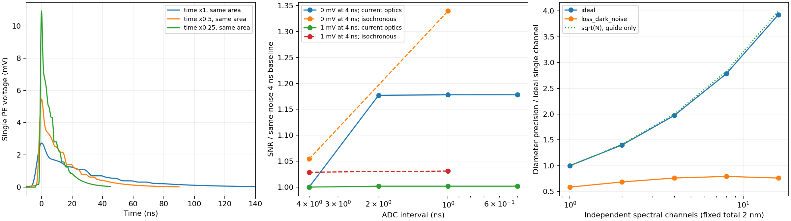

# LACT 恒星强度干涉：从热光到电压相关，再到天体参数

本文面向尚未学习恒星强度干涉的读者，解释当前程序实际计算的物理过程。先给定天体的亮度分布和总光通量，计算两处接收到的热光应该有怎样的相关性；然后让光经过 LACT 的光学响应、SiPM 和采样链，形成电压记录；最后从电压相关函数提取平方可见度，组合地球自转形成的采样，估计角直径或重建图像。

这条链中有两个计算尺度。微秒级记录逐个生成探测事件并叠加实测单光电子响应；小时级观测生成经过波形标定的统计量。后者没有存储整夜的 250 MS/s 电压流。本文会在进入这一近似时说明它保留了什么、为什么可以用，以及验证到哪里。所有数值都是模拟结果，仪器输入中包含实测数据，但没有把模拟标成实测恒星观测。

[完整 notebook](../notebooks/sii_complete_waveform_report.ipynb)按看图和做实验的顺序组织，适合先建立直觉；本文独立展开推导，不要求读者同时翻阅 notebook。函数、配置及复现命令见[代码实现说明](SII_IMPLEMENTATION_ZH.md)。文中的数学推导采用当前代码的归一化和正负号；附录给出关键中间步骤，避免仅以参考文献代替说明。

阅读导航：正文第 1–6 节解释源、通带、阵列与电压生成；第 7–9 节解释相关、GLS 与整夜观测；第 10–13 节解释模型、反演、性能和规格书；[第14节](#instrument-design)解释仪器参数怎样影响信号、SNR与天体约束，并给实际设计对照。基础概念可从[附录0](#appendix-zero)查阅；关键推导集中于[附录 A–K](#appendix-a)，[附录 L](#appendix-l)列出公式与函数、结果数组的对应。

## 1. 全文使用什么场景与符号

### 1.1 一条贯穿理论、波形和阵列的基准观测

基准源是总 AB 星等为 2、角直径为 0.16 mas 的均匀圆盘。它没有随时间变化的亮度或表面结构。除专门写明的对照实验外，光学通带、仪器和观测几何保持下表设置。

| 量 | 基准值 | 程序字段或输入 | 性质 |
|---|---:|---|---|
| 总观测星等 | 2 AB mag | `BinarySource.ab_magnitude` | 场景假设，通带内平坦频率谱 |
| 圆盘角直径 | 0.16 mas | `primary_diameter_mas`，`source_case='single_disk'` | 场景假设；类名不表示本例必须是双星 |
| 赤纬、站址纬度 | 22°、29.36° | `Observation.source_dec_deg/site_lat_deg` | 本次固定几何 |
| 曝光 | 过中天前后合计 6 h，1 夜 | `hours_per_night/nights` | SI 秒计时 |
| 分段 | 1200 s，合计 18 段 | `segment_s` | 每段对时间和通带平均 |
| 时间、波长积分节点 | 每段 9 个、每通带 5 个 | `visibility_subsamples_per_segment`；`visibility_wavelength_nm/visibility_spectral_weights` | 数值求积，不是额外独立探测器 |
| 阵列 | 36 台、630 对 | [原始 input](../configs/arrays/lact36_20260906.input) | 用户提供的位置 |
| 中心波长、带宽 | 400 nm、2 nm | `wavelength_nm/optical_width_nm` | 矩形 SII 通带再乘仓库响应曲线 |
| 偏振因子 | 0.5 | `polarization_factor` | 未分偏振、两种等强独立偏振 |
| 上游源透过率 | 0.7836336 | `source_transmission_scale` | 固定场景系数，非当晚实测大气 |
| 采样间隔 | 4 ns，250 MS/s | `sample_width_ns` | main 配置 |
| 单镜探测星光率 | 199.889298 MHz | `detected_star_rate_hz(2, instrument)` | 用同一通带计算 |
| 单镜夜天光率 | 0.573214 MHz | `detected_nsb_rate_hz` | 天空谱模型积分 |
| 有效相干面积 | 0.133429 ps | `coherence_area_s` | 已含偏振因子 |
| 单镜示例 | Tel.1、Tel.2，时角 0.5 rad，24 μs | [基准参数记录](../validation/sii_science/walkthrough_parameters.json) | 观测窗口内的一个短时刻，物理对率倍率为 1 |

这里的“5 个波长节点”只是同一光学通带的积分点，不带来五份独立观测或额外的信噪比平方根增益。其他源形态在第 10 节逐项列出改变的参数；性能扫描在第 12 节列出星等、直径和曝光的变化。验证用放大注入不改变这条基准观测。

若提供自定义SII透射曲线，积分改为在各输入曲线相邻物理节点之间做5点Gauss–Legendre求积。星光率、NSB率、相干面积与可见度权重共用该网格；这时波长节点总数随曲线变化，不再固定为5。这样窄峰即使落在原全通带节点之间，也不会出现光子率为正而可见度权重全零的矛盾。

### 1.2 符号约定

| 符号 | 含义和单位 |
|---|---|
| $l,m$；$I(l,m)$ | 天空切平面东、北角坐标，rad；归一化亮度，rad$^{-2}$ |
| $d$；$q$ | 角直径，rad；空间频率长度，按波长数计 |
| $V$；$P=\lvert V\rvert^2$ | 复可见度；平方可见度，均无量纲 |
| $\boldsymbol r_i,\boldsymbol B_{ij}$ | 第 $i$ 镜位置、$\boldsymbol r_j-\boldsymbol r_i$，m |
| $H,\delta,\phi$ | 西向为正的时角、赤纬、地理纬度，公式中用 rad |
| $u,v,w_m$ | 东、北投影基线除以波长；视线投影基线保留 m |
| $E_i,J_i$ | 单偏振复光场、光强 $J_i=\lvert E_i\rvert^2$；只在归一相关中使用 |
| $g^{(1)},g^{(2)}$ | 一阶场相关、二阶光强相关，均无量纲 |
| $R_\star,R_b,R_{\rm tot}$ | 已探测星光、背景、总事件率，s$^{-1}$ |
| $Q_\nu,\tau_{\rm eff}$ | 已探测光子谱率，s$^{-1}$ Hz$^{-1}$；相关面积，s |
| $h_{\rm P}$；$h_{\rm SPE}(t)$ | 普朗克常数，J s；单光电子电压模板，mV，二者不可混淆 |
| $a_k,F_q$ | 单事件相对电荷；$F_q=\mathrm E(a_k^2)$，无量纲，$\mathrm E a_k=1$ |
| $K_i(t),X_i(t)$ | 单镜随机光学延迟密度，s$^{-1}$；电压，mV |
| $D_i,D_{ij}$ | 相对参考镜到达时差、$D_j-D_i$，公式用 s，接口用 ns |
| $\widehat C_k,\boldsymbol k,\boldsymbol\Sigma$ | 电压归一互相关、单位 $P$ 峰模板、相关向量协方差 |
| $\widehat P,\sigma_P$ | 从一条相关曲线估计的平方可见度及其标准差 |
| $T,T_b,\Delta t$ | 观测曝光、短标定块时长、采样间隔，s |
| $g,s_g$ | 全体测量共用的响应增益及其先验标准差，无量纲 |

$1\,\mathrm{mas}=4.8481368\times10^{-9}\,\mathrm{rad}$。时间积分公式默认秒；代码中连续波形常用 ns，因此率乘时间时显式带 $10^{-9}$。理论 $P$ 在 0 至 1 内，有限噪声下的线性估计 $\widehat P$ 可以越界。

### 1.3 从没有接触过SII开始怎样阅读

正文依次回答：星光本来怎样相关，光经过通带后有多少事件，阵列怎样采样它，事件怎样变成电压，相关峰怎样变成可见度，最后能约束什么天体参数。每次只把上一步的输出带到下一步。附录提供需要时可以展开的基础讲解；公式名称不代表读者已经学过它。

| 遇到的概念 | 为什么这里需要它 | 基础入口 |
|---|---|---|
| 复数、相位、平均与协方差 | 区分平均天图、随机场和电压涨落 | [附录0](#appendix-zero) |
| 平稳、不同频率相关、delta | 从场定义得到图1的时间相关积分 | [附录A.0](#stationary-spectrum) |
| 空间相干、热光四阶矩 | 从亮度到V，再从g1到g2 | [附录A、B](#appendix-a) |
| Parseval、谱权重与峰面积 | 将光学时间峰换成可生成的超额对率 | [附录C](#appendix-c) |
| 泊松、条件概率、热光模 | 理解光子计数及弱对模型的边界 | [附录0、D](#appendix-d) |
| 坐标投影、卷积、相关 | 从两镜到达时刻形成电压峰 | [附录E、F](#appendix-e) |
| 协方差、GLS、有效曝光 | 从噪声中的多个峰点估计一个P | [附录G、H](#appendix-g) |
| 似然、先验、重建、覆盖率 | 从测量推断参数并判断误差可信度 | [附录I、J](#appendix-i) |
| 高阶预算、设计收益 | 明确已采用近似与可以改善的因素 | [附录K、M](#appendix-k) |

下文“推出”表示在列出的假设下可由数学得到；“模型取”表示代码主动选择的近似；“实测输入”与“场景假设”保留各自来源。这三类不能因为都写成公式就混在一起。模拟输出的可复算性也不替代真实仪器的外部验证。

## 2. 天体在理想仪器前是什么样

### 2.1 总光通量与形态是两件事

把天空亮度归一化为

$$
\int_{\mathbb R^2} I(l,m)\,dl\,dm=1.
$$

这个积分只规定形态的相对权重。总的探测光子率另由星等、面积和效率决定。增亮同一个圆盘会提高测量精度，不会自动把它变成更小的圆盘。

远场、窄视场、不同源面元彼此空间非相干的条件下，两个镜面位置接收到的复场相干等于亮度的归一化傅里叶变换：

$$
V(u,v)=\int I(l,m)e^{-2\pi i(ul+vm)}\,dl\,dm,
\qquad P(u,v)=V(u,v)V^*(u,v).
$$

指数中 $ul+vm$ 无量纲；星号表示复共轭。这个关系把天体形态连接到基线：小角尺度需要较长基线才能使不同面元的相位显著抵消。零基线相位完全相同，所以 $V(0,0)=P(0,0)=1$。非负归一亮度又保证 $|V|\leq1$。均匀盘可见度及强度相关的天文用法可对照 [Mozdzen 等（2025）第 2 节](https://academic.oup.com/mnras/article/537/3/2527/8003771)；本文的盘模型积分在[附录 A](#appendix-a) 直接展开。

对于直径 $d$ 的均匀圆盘，盘内 $I=4/(\pi d^2)$，盘外为 0。令 $q=\sqrt{u^2+v^2}$，得到

$$
V_{\rm disk}(q)=\frac{2J_1(\pi d q)}{\pi d q},
\qquad P_{\rm disk}(q)=\left[\frac{2J_1(\pi d q)}{\pi d q}\right]^2.
$$

$J_1$ 是一阶第一类贝塞尔函数。其小自变量极限为 $J_1(x)\simeq x/2$，故零基线不会出现物理奇点；代码对数值上的 $0/0$ 单独赋值为 1。$V$ 可以在较长基线变成负值，但 $P$ 始终非负。直接把 $\sqrt P$ 当成已知 $V$ 会丢掉这些符号，非轴对称源还会丢掉一般的复相位。

### 2.2 图1中的电场在哪里：平均亮度先决定场的相关

图1第三幅没有先生成一条随机电场，再计算它的强度相关。它先计算电场的统计相关，再利用热光统计关系得到理论强度相关。为了理解这一步，需要先分清第一幅的亮度与瞬时电场。

第一幅的 $I(l,m)$ 是天空各位置的**平均亮度分布**，已归一化为积分1。它不描述某一时刻的随机光强，也没有包含各发光面元的随机相位。因此不能把这张图直接开平方，就认为得到了恒星完整的电场。

在第二幅中，$I$ 的傅里叶变换给出 $V$。这个 $V$ 本身就描述两处接收电场的相关性：同一频率下，不同恒星面元相互独立发光，而同一个面元到两台望远镜的光有确定的相对传播相位。把各面元的场乘积取平均，跨面元项消失，只剩“平均亮度乘传播相位差”；归一后就是2.1节的傅里叶积分。这个从随机发光到 $V$ 的步骤在[附录A](#appendix-a)展开。

因此，第二幅已经包含了关于电场的统计信息。它没有决定某一次随机电场长什么样，却决定了两镜电场平均有多相关。实际代码调用均匀盘的解析傅里叶公式 `uniform_disk_visibility`，并没有对第一幅显示的361×361像素图做数值FFT；两幅来自同一0.16 mas圆盘模型。

### 2.3 从空间相关V得到随时间延迟变化的场相关

第二幅是在400 nm单色条件下画 $V$ 随基线怎样变化。第三幅的横轴却是时间延迟，所以还需要通带内的光谱信息：不同频率在延迟 $\tau$ 后积累不同的相位，这决定相关峰随 $\tau$ 怎样衰减。

先定义两镜归一化场相关：

$$
g^{(1)}_{ij}(\tau)=
\frac{\langle E_i(t+\tau)E_j^*(t)\rangle}
{\sqrt{\langle J_i\rangle\langle J_j\rangle}},
\qquad J_i(t)=|E_i(t)|^2.
$$

这里 $i,j$ 是镜号，$t$ 是时间，$\tau$ 是左镜相对右镜的时间偏移，几何传播时差已经消除。$E_i$ 是一个偏振的复解析场；为与程序的光子谱一致，可取经过探测响应加权的光子通量归一，使 $J_i$ 的单位为s$^{-1}$、$E_i$ 为s$^{-1/2}$，不把它当作原始V/m单位的电场记录。星号表示复共轭，角括号表示平稳总体平均，$g^{(1)}$ 无量纲。等强两偏振的相关形状相同，偏振合并对强度相关的影响下一节单独计入。

设 $Q_\nu(\nu)$ 是通带后有效光子谱，单位s$^{-1}$ Hz$^{-1}$；$V_{ij}(\nu)$ 是该频率下的空间可见度。“平稳”在这里表示把两次取样时间同时平移，平均乘积不变，因此相关只依赖时间差；它不要求每条波形保持不变。相同时间平移给不同频率的交叉项带来不断变化的相位，要使二阶平均不受平移影响，这些不同频率的交叉项必须为零。同频项保留下来，便得到下面的单频率积分。[附录A.0](#stationary-spectrum)从电场展开逐步推导，并解释连续频率中Dirac delta的来源与有限记录的区别。两镜响应相同、源平稳时，实际计算的关系为

$$
\boxed{
g^{(1)}_{ij}(\tau)=
\frac{\displaystyle\int_{\nu_{\min}}^{\nu_{\max}}
Q_\nu(\nu)V_{ij}(\nu)e^{-2\pi i\nu\tau}\,d\nu}
{\displaystyle\int_{\nu_{\min}}^{\nu_{\max}}Q_\nu(\nu)\,d\nu}}
$$

分子将各频率的场相关乘其时间相位后相加，分母用平均探测率归一；两者单位均为s$^{-1}$。$\nu_{\min},\nu_{\max}$ 是通带最低、最高频率，Hz，$\tau$ 在指数中用秒。**被积分的是场的相关谱，不是给各频率赋相同随机相位后合成一条电场。** 随机光场已经通过总体平均进入 $Q_\nu V$。光谱与时间场相关的傅里叶关系可对照 [Ferreira等（2020），式(1)–(2)](https://arxiv.org/pdf/2002.05425)；这里加入跨镜空间可见度及本程序光子归一的推导见附录A。

如果通带内 $V$ 变化很小，可把它移到积分外，得到 $g^{(1)}_{ij}(\tau)\simeq V_{ij}\gamma_t(\tau)$。$\gamma_t$ 是单镜归一光子谱的傅里叶变换，$\gamma_t(0)=1$。这个近似帮助理解“空间相干控制峰高、谱宽控制时间宽度”；图1实际保留 $V(\nu)$ 在通带内的变化。

### 2.4 从场相关得到强度相关：这里才使用热光假设

要画的强度相关定义为

$$
g^{(2)}_{ij}(\tau)=
\frac{\langle J_i(t+\tau)J_j(t)\rangle}
{\langle J_i\rangle\langle J_j\rangle}.
$$

因为 $J=|E|^2$，分子是电场四阶矩。一般情况下，知道平均亮度和二阶场相关，还不足以确定这个四阶矩。程序在这里采用恒星热光模型：单偏振场是零均值、圆对称复高斯随机场。高斯四阶矩可以分解为平均强度乘积与场相关模平方两项，得到Siegert关系：

$$
\boxed{g^{(2)}_{ij}(\tau)=1+p\,|g^{(1)}_{ij}(\tau)|^2.}
$$

$p=1$ 对应单偏振；当前探测两个等强、互不相关的偏振而没有分开读出，所以 $p=1/2$。强度相关的定义及单偏振Siegert关系见 [Ferreira等（2020），式(3)–(4)及第II节](https://arxiv.org/pdf/2002.05425)；本代码采用的四阶矩展开与双偏振因子在[附录B](#appendix-b)推导。这里从高斯统计推出公式，不把它当成对任意激光或非高斯光场都成立的恒等式。

计算理论平均相关时，不必先抽样一条 $E_i(t)$：我们已经知道它需要的统计矩。如果要检验有限电场记录的随机起伏，则可另生成满足这些协方差的复高斯场，计算 $J_i=|E_i|^2$ 后取样本相关；那是另一个随机实验。图1没有执行它，也不是后来光子事件或ADC记录反算出的结果。

### 2.5 图1第三幅实际执行的积分、代码和曲线

前面的三步合起来，就是图1的计算链：

$$
I(l,m)
\xrightarrow{\text{面元独立、远场传播}}V_{ij}(\nu)
\xrightarrow{\text{光谱加权、时间相位}}g^{(1)}_{ij}(\tau)
\xrightarrow{\text{高斯热光四阶矩}}g^{(2)}_{ij}(\tau).
$$

第一步提供空间相关，第二步提供时间相关，第三步把场统计变成强度统计。只有一张平均亮度图而没有光谱与热光假设，不能单独确定第三幅曲线。

`theoretical_scene` 用399–401 nm之间4097个波长节点读取镜面反射率、滤光片透射率和PDE，乘积记为 $\mathcal R(\lambda)$，无量纲。本例频率通量密度平坦；由光子能量及频率到波长的换元可得 $Q_\nu d\nu\propto[\mathcal R(\lambda)/\lambda]d\lambda$，详见[附录C](#appendix-c)。令 $D(\lambda)=\mathcal R(\lambda)/\lambda$，代码实际用梯形积分计算

$$
\widetilde g^{(1)}_{ij}(\tau)=
\frac{\displaystyle\int_{399\,\mathrm{nm}}^{401\,\mathrm{nm}}
D(\lambda)V_{ij}(\lambda)
 e^{-2\pi i[c/\lambda-\nu_{\rm ref}]\tau}\,d\lambda}
{\displaystyle\int_{399\,\mathrm{nm}}^{401\,\mathrm{nm}}D(\lambda)\,d\lambda},
\qquad
g^{(2)}_{ij}=1+\tfrac12|\widetilde g^{(1)}_{ij}|^2.
$$

$c$ 是光速，计算频率 $c/\lambda$ 时把nm转为m；波长积分的分子分母可一致使用nm，因为共同换算因子抵消。$\nu_{\rm ref}$ 取波长节点对应频率的算术平均，只去除共同载频。$\widetilde g^{(1)}=e^{2\pi i\nu_{\rm ref}\tau}g^{(1)}$，所以取模平方后结果不变；这不是把光子的中心频率实际移动了。

关键变量对应如下，具体见 [sii_walkthrough.py](../python/sii_walkthrough.py) 的 `theoretical_scene`：

| 代码变量 | 它实际代表什么 |
|---|---|
| `sky` | 归一化圆盘像素亮度，用于第一幅显示 |
| `visibility` | 400 nm下均匀盘解析可见度，第二幅同时画它的平方 |
| `density` | 上式 $D(\lambda)$，由实际响应曲线与平坦频率谱得到 |
| `mono_visibility` | 固定所选基线，在各波长的 $V_{ij}(\lambda)$ |
| `phase` | 每个波长、每个时延的复时间相位 |
| `field`、`field_pair` | 零基线、所选两镜的 $\widetilde g^{(1)}$；变量名不是随机电场的含义 |
| `g2_zero`、`g2_pair` | 用偏振因子0.5和Siegert关系得到的第三幅两条理论曲线 |

时延取−1至1 ps，共801个点，积分时转成秒。零基线令 $V=1$，所以零时延处曲线严格到1.5；所选 Tel.1–Tel.2 投影基线为139.2941 m，实际积分给 $g^{(2)}(0)=1.4164554$。随着 $\tau$ 远离零点，不同频率的相位抵消使场相关衰减，强度相关回到1。曲线宽度来自通带，而不是4 ns采样、18.4 ns SPE或SiPM恢复时间。

还应注意：此处零时延峰用的是**光谱加权复可见度的模平方**，并不严格等于后续事件生成使用的“平方可见度的光谱平均”。当前窄带两者接近；后者来源于对整个超额相关峰做时间积分的Parseval关系，在附录C推导，不能为了写成一样的公式而交换平均和平方。

**图1。** 左图为0.16 mas均匀盘的平均归一亮度，横东纵北，单位mas。中图由同一圆盘的解析傅里叶变换画出400 nm下 $V$ 与 $P$，竖线标记 Tel.1–Tel.2 在时角 $H=0.5$ rad的位置。右图先将该基线各波长的场相关按上述公式积分，再利用热光Siegert关系画出 $g^{(2)}$；零基线与两镜零时延峰分别为1.5与1.4164554。右图是通带后的理想总体平均，尚未加入光学到达时间弥散、电子学或有限记录噪声，没有显式随机电场样本。三幅展示的是上述理论计算链，不是三次独立观测。

## 3. 同一束光经过通带后，有多少光子、多少相关面积

### 3.1 从 AB 星等到已探测率

前一节只确定归一相关的形状，现在还要知道实际能探测多少光子。先把星等换成每单位频率的能量流量，再乘收集面积和探测概率，最后除以单光子能量。相同形态可以很亮或很暗，归一可见度相同，但后面的统计误差不同。$F_\nu d\nu$ 表示小频率区间贡献的能量通量，因此下式中的 $1/(h_{\rm P}\nu)$ 是从焦耳换成光子个数，不是额外的光学效率。

AB 星等定义为频率通量密度的对数。平坦 $F_\nu$ 的本例采用

$$
F_\nu=3631\times10^{-26}\,10^{-0.4m_{\rm AB}}
\quad\mathrm{W\,m^{-2}\,Hz^{-1}},
\qquad Q_\nu=\frac{A\eta(\nu)F_\nu}{h_{\rm P}\nu},
\qquad R_\star=\int Q_\nu\,d\nu.
$$

$A$ 是收集面积，m²；$\eta$ 是包含探测效率的无量纲响应；$h_{\rm P}\nu$ 是单光子能量，J。因此 $Q_\nu$ 为每秒、每 Hz 的探测事件数，积分后的 $R_\star$ 为 s$^{-1}$。AB 零点和 Jy 的单位约定见 [NASA/IPAC 天文术语表](https://ned.ipac.caltech.edu/level5/Glossary/Glossary_A.html)。

代码保留 $A\times\texttt{throughput}\times Q_{\nu,\rm incident}(\lambda_0)\times\Delta\nu$ 的接口，但 `throughput` 已乘实际通带积分相对中心值的校正。这不是在任意宽通带上直接以中心点代替积分。本例面积字段为 24.57686 m²；400 nm 光追缓存给出的中心有效探测面积为 5.92276165 m²，已含镜面、遮挡、PSF、相机接收、集光器、滤光片与 PDE 的模型损失。再乘一遍这些中心效率会重复减光。

计算使用 main 已有的反射率、滤光片、PDE 曲线，以相同的 2 nm SII 窗口截取。`source_transmission_scale=0.7836336` 只施加到源光。本例所得 $R_\star=1.99889298\times10^8\ \mathrm{s^{-1}}$，每 4 ns 平均约 0.800 个星光事件。一个长尾 SPE 在多个采样点都有贡献，因此实际波形常见的是脉冲叠加，而非彼此完全分开的单光电子。

### 3.2 背景增加什么

目标星光的相关只占总电压涨落的一小部分。没有跨镜相关的背景仍会让每镜多产生随机脉冲，增加方差；“平均后背景相关为零”不表示它不增加相关估计的不确定度。暗计数甚至不需要入射光子。这里先确定它们的平均率，第6–8节再把这些率传到实际噪声。

夜天光输入是每秒、每 nm、每 sr、每平方米的光子面亮度 $L_\lambda$。有效面积与像素立体角将它转成同一像素的率：

$$
R_{\rm NSB}=\int L_\lambda(\lambda)\,A\eta_{\rm sky}(\lambda)\,
\Omega_{\rm pix}\,d\lambda.
$$

$\Omega_{\rm pix}$ 的单位为 sr，代码用像素尺寸与焦距之比的平方作小角近似。这里的天空谱已定义在地面，不再乘源的上游透过率。仓库的 [NSB 谱](../configs/nsb/nsb_spectrum.csv)由 Paranal、airmass 1.2 等设置下的 SkyCalc 场景产生，**不是 LACT 当晚实测天空谱**。本例积分得到 0.573214 MHz。

暗计数如果启用则另加一次：$R_b=R_{\rm NSB}+R_{\rm dark}$，$R_{\rm tot}=R_\star+R_b$。当前跨镜 HBT 信号只来自目标星光；NSB 和暗计数按不同镜独立处理。大尺度天空结构的相关、共同电噪声及闪烁不在这一默认背景模型中。

### 3.3 相关峰的面积由光谱决定

定义归一化时间场相干

$$
\gamma_t(\tau)=\frac{\int Q_\nu e^{-2\pi i\nu\tau}\,d\nu}{R_\star}.
$$

它在零时延等于 1。不同频率随时延积累不同相位，越宽的频谱越快相消。把这个复积分取模平方，会出现两个频率的积分；再对全部时延积分，不同频率的交叉项抵消，只留下同频率的 $Q_
u^2$。这个守恒关系称为Parseval恒等式，逐行展开见[附录C.1](#parseval-basics)。它把相关峰面积写成

$$
\tau_{\rm eff}\equiv p\int_{-\infty}^{\infty}|\gamma_t(\tau)|^2d\tau
=p\frac{\int Q_\nu^2d\nu}{R_\star^2}.
$$

分子单位为 s$^{-2}$ Hz$^{-1}$，除以率平方后得到 s。这里的“面积”是无量纲相关函数对时延的积分，不是望远镜面积，也不是把峰的 FWHM 直接称为相干时间。它已包含偏振因子，后面生成对率时不能再乘 $1/2$。有限时间分辨使峰变低变宽但保留相关面积的关系，可对照 [Mozdzen 等第 2.2 节](https://academic.oup.com/mnras/article/537/3/2527/8003771)；本代码采用实测脉冲和光追核卷积，未采用该文的高斯仪器响应作为 LACT 输入。

若 $Q_\nu$ 在宽度 $\Delta\nu$ 内为常数，便有 $\tau_{\rm eff}=p/\Delta\nu$。利用窄带 $\Delta\nu\simeq c\Delta\lambda/\lambda_0^2$，当前值约为 0.133429 ps。ADC 的 4 ns 间隔比它大约三万倍，直接在 ADC 图上寻找图 1 的尖锐光学峰不会成功。

令三条效率曲线与 SII 窗口的乘积为 $\mathcal R(\lambda)$。对于平坦 AB 频谱，换元后光子率积分权重是 $\mathcal R/\lambda$，相关面积分子的权重却是 $\mathcal R^2$。所以程序的 5 点波长求积按 $\mathcal R^2$ 加权来平均 $P$；不能误用线性的光子数权重。[附录 C](#appendix-c) 给出换元和代码 `spectral_shape_factor` 的表达式。

## 4. 阵列怎样把天空变成一组 UV 采样

### 4.1 原始 input 到地面坐标

每条 TELESCOPE 卡片的三个坐标按原程序解释为北、西、向上，单位 cm。读入转换严格为

$$
(E,N,U)=(-W_{\rm cm},N_{\rm cm},U_{\rm cm})/100.
$$

结果单位为 m，不做额外居中、旋转或交换镜号。Tel.1 是 $(-434.92063,417.46032,0)$ m，Tel.36 是 $(266.66667,136.50794,0)$ m。input 的 400 cm 是采样球半径 4 m，不是直径；它也没有自动给 SII 加上有限瞳面平均。原值及转换值见[坐标 CSV](../configs/arrays/lact36_20260906_coordinates.csv)。

**图 2。** 左图横东纵北，单位 m，数字沿用用户的 Tel.1–Tel.36，标记表示镜心。右图统计 630 条唯一地面基线，范围 91.7482–1197.0085 m。地面长度不等于任一时刻的投影长度，下一步需要源方向。

### 4.2 切轴、时角和几何时延

天空在转动，但望远镜仍固定在地面。每个时刻要做两种不同的投影：垂直视线的基线分量决定空间相干，沿视线的分量决定光程差。点积 $\boldsymbol B\cdot\boldsymbol e$ 就是基线沿单位方向 $\boldsymbol e$ 的有符号长度；除以光速得到时间，除以波长得到空间频率。下面的三角函数仅把赤道坐标表达成当地东、北、上三轴，[附录E](#appendix-e)从正交坐标旋转展开。

$H=\mathrm{LST}-\mathrm{RA}$，向西增大。纬度 $\phi$、赤纬 $\delta$ 下，指向源的 ENU 单位向量为

$$
\boldsymbol s(H,\delta,\phi)=
\begin{pmatrix}
-\cos\delta\sin H\\
\sin\delta\cos\phi-\cos\delta\cos H\sin\phi\\
\sin\delta\sin\phi+\cos\delta\cos H\cos\phi
\end{pmatrix}.
$$

天空向东的切轴取 $\boldsymbol e_u=-(\partial\boldsymbol s/\partial H)/\cos\delta$，向北取 $\boldsymbol e_v=\partial\boldsymbol s/\partial\delta$。二者与视线互相正交并归一。用这组天球切轴投影，源的位置角始终有相同的东、北含义：

$$
u=\boldsymbol B_{ij}\cdot\boldsymbol e_u/\lambda,
\qquad v=\boldsymbol B_{ij}\cdot\boldsymbol e_v/\lambda,
\qquad w_m=\boldsymbol B_{ij}\cdot\boldsymbol s.
$$

光沿 $-\boldsymbol s$ 传播，因此到达更靠近源的镜时更早。相对参考镜 $0$，

$$
D_i=-\frac{(\boldsymbol r_i-\boldsymbol r_0)\cdot\boldsymbol s}{c},
\qquad D_{ij}=D_j-D_i=-w_m/c.
$$

本例 Tel.2 比 Tel.1 晚到 231.03275 ns。程序先把这个时差加到真实事件时刻，再由分析阶段补偿；不会先生成已对齐的数据，然后声称已验证追踪。

时角按 $H(t)=H(0)+2\pi t/86164.0905\,\mathrm{s}$ 推进。这是平均恒星日模型，而非 86400 s 的太阳日。它足以定义当前静态源的自转采样，但不包含日期级章动、极移、大气折射或目标历表。代码检查观测窗口的地平线条件及分段是否整除曝光。

### 4.3 一个分段测量不是单个瞬时点

最终一行数据来自一段时间内的累积。若基线在这段时间内移动，仪器先在各时刻产生相应强度相关，再把这些贡献平均；所以前向模型也必须做同样顺序的平均。对非线性函数，通常 $f(\langle x\rangle)\ne\langle f(x)\rangle$，这就是不能只用一个代表UV点的原因。

一段 1200 s 内基线在转动，带内波长也不同。测量 $a$ 的期望是

$$
\overline P_a=\sum_{t,r}w_{tr}
\left|V\!\left(B_{u,a}(t)/\lambda_r,B_{v,a}(t)/\lambda_r\right)\right|^2,
\qquad \sum_{t,r}w_{tr}=1.
$$

$t,r$ 分别标记时间和波长求积节点，$B_u,B_v$ 单位 m。时间采用 9 个等权中点，波长采用 5 点 Gauss–Legendre 与上一节的平方响应权重。必须先求每个节点的模平方再平均；平均复振幅会把本来不相干叠加的不同频率抵消。只在平均 UV 坐标计算一次也会遗漏曝光展宽。

36 台镜的每段 630 条基线乘 18 段，一夜得到 11340 条测量。绘图用段中心坐标定位点，数据生成与拟合保留全部节点。UV 合并后也保留原来的节点和统计权重，不把一格中心当成这一格所有实际采样。

## 5. 从相干函数生成探测事件

### 5.1 为什么不直接用皮秒电场跑六小时

现在已经有光子率和理想相关峰，要把它们换成可生成的事件。对于两个小时间箱，独立巧合的期望与 $R_iR_j\,dt_i\,dt_j$ 成正比；关联光在此之上增加 $g^{(2)}-1$ 的部分。将第二个光子相对第一个的时间差积分，得到每单位观测时间的超额事件对数。当真实光学峰远窄于后面的响应时，只保留它的面积，就可以用同一公共时刻产生的两事件来近似。这是积分后的二阶统计模型，不是一个真实发光机制的逐过程复刻。

对本例单镜 $R_\star\tau_{\rm eff}=2.6671\times10^{-5}$，占据度很低，光子计数主要由散粒噪声支配。相关信号则是独立泊松巧合之外的一点超额。仪器时间响应远宽于光学相关峰，可用保留峰面积的窄脉冲近似：

$$
R_{{\rm pair},ij}=R_{\star,i}R_{\star,j}\tau_{\rm eff}\overline P_{ij}.
$$

单位检查为 s$^{-1}\times$s$^{-1}\times$s，即每秒超额对数。这个量是用于复现二阶统计的生成率，不表示天体每次只发射一对光子，也不表示一个光子被同时探测两次。对基准两镜，24 μs 内平均只有约 0.1065 个超额对，而各镜有约 4800 个星光事件；一次短记录自然不应出现清晰相关峰。

实现先生成独立的公共泊松时刻，每个时刻向参与的两镜各加入一个事件；两边独立抽取光学延迟、电荷等响应。为保证单镜总星光率不被人为增加，第 $i$ 镜其余独立星光率设为

$$
R_{\star,i}^{\rm single}=R_{\star,i}-\sum_{j\ne i}R_{{\rm pair},ij}.
$$

公共对加回后，各镜边缘平均仍是 $R_{\star,i}$。独立 NSB、暗计数再加入。每镜只生成一次事件流，所有涉及它的基线都使用同一条波形；不能为了计算 01、02 两条基线而重新生成两个互不相同的镜 0。

### 5.2 相干矩阵保留了什么约束

多镜输入在每个波长节点构造 $\Gamma^{(r)}_{ij}=V(u_{ij,r},v_{ij,r})$。它满足对角为 1、交换镜号取复共轭、矩阵半正定。对角为1来自单镜场相关归一；复共轭来自交换场乘积次序；半正定意味着任意镜场线性组合的平均模平方都不能为负。这个最后的要求比逐对检查更强，[附录D](#appendix-d)用矩阵平方根构造和两镜例子说明。这三个条件来自同一非负天空亮度的傅里叶积分。逐元素 $|\Gamma_{ij}|\leq1$ 只是必要条件，并不足以使任意拼出的多镜矩阵成为一个物理场。

程序检查逐波长矩阵，再计算 $\overline P_{ij}=\sum_r w_r|\Gamma^{(r)}_{ij}|^2$。例如两个谱节点的跨镜 $\Gamma$ 为 $+1$、$-1$，等权的 $\overline P$ 仍为 1，先平均 $\Gamma$ 却得到 0。反过来对 $\overline P$ 开平方也不能恢复一套合法的相位。

短记录扩展到事件与 SPE 支持范围之外生成保护区，再只保留有完整脉冲贡献的采样。几何平移和插值的公共边界另行裁剪。这样避免把记录之外应有的事件误当作不存在而产生边缘偏差。

### 5.3 弱对模型的边界与独立热光检查

这里的“模”可先理解成一个独立的复高斯场样本。很多互不相关的时间、频率或偏振模被同一个探测箱平均时，强度起伏会变小。验证代码故意用少量模把热光项放大，便于统计检查；正文公式的 $M$ 指实际平均的独立模总数，代码中等于 `modes*polarizations`。这与图1的波长积分节点数、真实ADC采样数都不同。

弱对生成器保留了指定的两镜超额相关，但单镜边缘仍是泊松过程，未生成完整热光的自聚束及全部三、四阶累积量。为了独立核对理论，另一条验证路径从相关复高斯场生成光强，再作条件泊松探测。

设 $M$ 个独立模的平均归一光强为 $J_i$，每块平均星光计数为 $\mu_\star$，背景为 $\mu_b$。则

$$
\operatorname{Cov}(J_i,J_j)=P_{ij}/M,
\quad \operatorname{Var}(N_i)=\mu_\star+\mu_b+\mu_\star^2/M,
\quad \operatorname{Cov}(N_i,N_j)=\mu_\star^2P_{ij}/M.
$$

$N_i$ 是计数，第一项是泊松噪声，最后一项是热光超泊松涨落。三镜还包含

$$
\left\langle(J_0-1)(J_1-1)(J_2-1)\right\rangle
=2\operatorname{Re}(\Gamma_{01}\Gamma_{12}\Gamma_{20})/M^2.
$$

闭合乘积中的相位在两镜 $P$ 之外提供信息；当前图像重建没有把这个量当作已测数据。多探测器高阶相关的物理见 [Malvimat、Wucknitz 与 Saha](https://arxiv.org/abs/1304.3391)，本文与离散模数的换算见[附录 D](#appendix-d)。验证用较高占据度和小 $M$ 让这些项可统计检验；它不是把 LACT 的 4 ns 采样解释成只有两模或十六模。

标定可以把对率乘已知倍率 $\alpha$，再把响应除回 $\alpha$。若任一镜扣除后的独立率为负，程序拒绝运行。主波形示例始终 $\alpha=1$；两镜标定及多镜验证使用的放大注入会单独注明，不能用它们的可见峰代表物理短曝光的探测效果。

## 6. 光学、SiPM 与采样怎样形成电压

本节先说明响应如何生成电压；读完相关与推断链后，[第14节](#instrument-design)进一步比较改变这些响应的收益，包括SPE与恢复时间的区别、光学等时性、采样与分色。

### 6.1 输入响应的物理性质

[main 参数清单](../configs/sii/main_parameter_manifest.json)记录了提交 `2926031b14c8aa2164a4d9233f5c2d0a75324127` 核对过的 10 个文件。来自 main 不等于全部是现场实测：SPE 和电荷分布是实测提取输入，光学时间核是使用实测配置的光追产物，天空谱和上游透过率是场景设置。

**图 3。** 左图为实测提取的 SPE 模板，时间 ns、电压 mV；积分为 84.03496 mV ns。右图为单像素光追延迟概率密度，单位 ns$^{-1}$，整体减去平均行时，RMS 为 0.548827 ns。显示窗口没有截断事件生成使用的完整 54 分量混合分布。这是随机到达时间的展宽，不能只把波形整体平移一个 RMS 来代替。

光追缓存及[溯源 JSON](../configs/optics/lact2_measured_single_pixel_400nm.provenance.json)由历史百万光子模拟产生；原始逐光子文件不在本分支。可用已提交缓存复现 SII 计算，但不能仅凭本分支从头重做那次历史 C++ 光追。当前 2 nm 内共用 400 nm 时间核，尚未建模波长相关的脉冲变化。

### 6.2 事件变成连续平移的 SPE

SPE是“一次探测事件到来后，电压随时间怎样变化”的响应函数。若事件在 $t_k$ 到来，原模板就平移成 $h(t-t_k)$；多个事件的电压在线性响应假设下直接相加，不需要把它们先分辨成不重叠的脉冲。电荷因子使每次脉冲大小略有不同。这里叠加的是探测后的电压响应，不是恒星不同发光面元的光学电场。

第 $k$ 个事件先加光学随机延迟和几何到达时差，得到 $t_{ik}$。其电荷因子 $a_{ik}$ 从实测电荷样本抽取，归一到 $\mathrm E a=1$。采样前及采样后的电压关系是

$$
X_i(t)=\sum_k a_{ik}h_{\rm SPE}(t-t_{ik}),
\qquad x_i[n]=X_i\big((n+1/2)\Delta t\big)+e_i[n].
$$

$n$ 是非负采样索引，$e_i[n]$ 是附加电子噪声，单位 mV。代码在线性插值的连续模板上求值，不先将 $t_{ik}$ 取整到 4 ns 格点。随机电荷的二阶矩 $F_q=1.03254526$ 增加散粒噪声；字段 `excess_noise_factor` 存的是 $\sqrt{F_q}$，因此出现该字段平方时才是这里的 $F_q$。

这里“复合泊松脉冲流”表示泊松时刻、随机电荷标记与固定SPE形状的组合。把时间分成小箱，每箱发生事件的概率约为 $R_{\rm tot}dt$；均值相加时每个箱贡献 $R_{\rm tot}dt\,h$，方差相加时贡献 $R_{\rm tot}dt\,\mathrm E(a^2)h^2$。取细箱极限，就得到以下均值与方差。为什么不同事件的平均项会消掉、共同事件又留下跨镜峰，见[附录F.1](#shot-noise-derivation)。对线性平稳复合泊松脉冲流，均值和方差为

$$
\mu_X=R_{\rm tot}\int h_{\rm SPE}(t)dt,
\qquad \sigma_X^2=R_{\rm tot}F_q\int h_{\rm SPE}^2(t)dt+\sigma_e^2.
$$

时间用 s 时单位分别是 mV 和 mV²。电荷噪声进入方差而不改变归一后的平均脉冲面积。独立随机平移一个平稳泊松流不改变其自相关的脉冲形状；光学核影响跨镜共同事件的相对时差，后文将它放在交叉峰中。

**图 4。** 上图是 Tel.1 前 1 μs 的实际探测事件时刻；中图是形成电压所用的 SPE；下图是同一次 24 μs、倍率 1 记录中两镜的前 1 μs 电压片段。横轴 ns、纵轴 mV。两镜保留原始接收时刻，因此几何时差尚未去除。后面的相关图使用这同一对完整记录，未重新抽一组更好看的随机数。完整事件和 6000 点/镜 ADC 数组保存在 [NPZ](../validation/sii_science/walkthrough_record.npz)。

### 6.3 缺失电子学参数为零时究竟发生什么

当前附加白噪声 RMS、暗计数、本征时间抖动、微单元恢复时间、串扰和后脉冲概率均为 0。恢复为 0 时电荷恢复比例严格为 1；噪声为 0 时不生成附加噪声。已有的 SPE 长尾、实测电荷涨落和光学展宽仍然保留。

若将来启用指数恢复，模型对同一微单元相邻雪崩间隔 $\Delta t_c$ 取恢复比例 $f=1-\exp(-\Delta t_c/\tau_r)$，首次事件为 1。这里 $\tau_r$ 是独立恢复测量参数；不能从 SPE 电压长尾直接推断。器件共有 $8\times33792=270336$ 微单元，当前启用恢复时用均匀随机单元分配，是需要用真实照明和接线进一步约束的模型。

本征抖动非零时独立加高斯时间偏移；白噪声非零时加独立高斯电压。ADC 只有 `adc_bits=0` 且 `adc_full_scale_mv=0` 时关闭量化。若启用 $b$ 位、总满量程 $L$ mV，则步长 $\Delta V=L/2^b$，四舍五入并限制在 $[-L/2,L/2-\Delta V]$。$L$ 是整个对称电压范围，不是正半轴最大值。

串扰和后脉冲非零目前显式报未实现，因为单个总概率不足以决定延迟和电荷分布。GLS 主路径同样拒绝未标定的非零每镜/每夜增益漂移、透明度漂移、NSB 漂移和剩余时延扰动。零值是关闭接口的约定；它不能被解释为已经测得这些效应不存在。第 13 节解释规格书能补到哪里。

## 7. 对齐两条波形后，实际计算什么相关函数

### 7.1 先消除几何时差，再处理采样残差

可以先想象左镜某个脉冲在100 ns，右镜对应脉冲在110 ns：要比较同一公共事件，就要将右镜更晚的样本与左镜更早的样本配对。移动数组只是改变比较的索引，不改变真实传播时间。记录只有4 ns格点，10 ns的时差不可能用整数格精确消除；剩余部分必须由对应的连续响应模板处理。下面给出程序实际采用的索引方向。这个10 ns例子只解释符号，不替换基准231.03 ns的真实时差。

程序的互相关采用 `correlate(left, right)` 约定，即左序列的索引增加滞后、右序列保持参考索引。若右镜事件晚到 $D_{ij}>0$，原始相关峰出现在 $\tau=-D_{ij}$。这个负号由数据定义决定，不能只根据“晚到”凭直觉把模板往正方向移。

最终性能路径对每镜取整数偏移 $n_i=\operatorname{round}(D_i/\Delta t)$，读取 $x_i[n+n_i]$，裁剪到所有镜都有数据的公共区间。它不做循环移位。剩余时差为

$$
\epsilon_i=D_i-n_i\Delta t,
\qquad \epsilon_{ij}=\epsilon_j-\epsilon_i.
$$

这里 $\epsilon_i$ 是单镜残差，位于半个采样间隔附近；两镜之差可以达到一个完整采样间隔。模板因此覆盖 $[-4,4]$ ns，而非只覆盖 $[-2,2]$ ns。

基准两镜右侧平移 58 点，即 232 ns；残差为 $-0.967249$ ns，公共样本由 6000 点降为 5942 点，有效曝光 23.768 μs。GLS 使用这个实际曝光和残差，不把裁掉的数据算进积分。

旧的短记录追踪验证还保留分数时延 Lanczos 插值路径：以归一化 sinc 窗核对原始 ADC 作有限支持插值，显式裁边、不作周期延拓。这条路径可以比较插值误差，但插值改变采样噪声，必须使用处理后的对应标定。最终 36 镜角直径性能采用上述整数移位和残差模板，避免把不同处理链的误差混用。[附录 E](#appendix-e) 给出段内追踪与两种对齐的具体表达式。

### 7.2 本程序的 $C$ 不是光学 $g^{(2)}$

互相关的操作是：选定一个时差，把两条波形的涨落逐点相乘，再对重叠区间取平均。若公共事件使两边在这个时差下更常同时偏高，乘积平均就出现超额；独立随机涨落的乘积期望为零，但一次有限记录仍有随机起伏。归一化决定纵轴是什么，所以必须保留下式的具体分母，不能只把所有相关曲线统称为g2。

对共同长度为 $N$ 的两镜波形，先分别减去本块均值，再取

$$
\widehat C_k=
\frac{\displaystyle\sum_{n\in\mathcal O_k}(x_i[n+k]-\bar x_i)(x_j[n]-\bar x_j)}
{(N-|k|)\,s_i s_j}.
$$

$k$ 是整数滞后，实际横轴为 $k\Delta t$；$\mathcal O_k$ 是两条序列有效重叠的索引集合。$s_i,s_j$ 是各完整块用总体形式计算的样本标准差，mV。分子是电压乘积，分母也为 mV²，故 $\widehat C_k$ 无量纲。除以 $N-|k|$ 修正重叠数量，并不保证含随机均值和随机标准差的整个比值严格无偏。

若用电压均值归一化，超额相关应写成 $\operatorname{Cov}(X_i,X_j)/(\mu_i\mu_j)$；本程序却除以 $\sigma_i\sigma_j$。因此电压 $C$ 的零信号基线为 0，其峰高不能直接读成 $g^{(2)}-1$，更不能直接读成 $P$。需要经过下一节的单位响应模板换算。

### 7.3 这一次短记录真的看到了什么

**图 5。** 左图用图 4 的完整 24 μs 电压计算原始 $\widehat C$，横轴滞后 ns；虚线只标理论几何峰位置 $-231.03$ ns，并未声称附近的随机起伏就是信号。中图是整数对齐后同一记录的 $\widehat C$ 与理论期望，仍然没有放大注入。右图只表示保持这条基线和采样相位不变时，1200 s 与 21600 s 的期望值及预测 $1\sigma$；它不是地球自转六小时所得的单条原始 ADC，也不是两次随机测量。

**图 6。** 将图 5 中的理论电压相关单独画出，纵轴单位是 $10^{-6}$。理论峰最大值约 $2.12184\times10^{-5}$，远小于这次短记录的随机起伏。单独改变显示尺度没有改变生成事件的对率。

从这条实际记录得到 $\widehat P=-295.744$，短记录标准差约 550.861；真实 $P=0.832912$。这三个量同时成立：真实源的平方可见度在 0–1 内，弱信号线性估计的统计分布却很宽。这次负估计既不是“负的真实相干”，也不是重建出的负亮度。把它截成 0 会在弱源总体上制造向上的偏差，所以测量表保留原值。

精确数据见[相关 CSV](../validation/sii_science/walkthrough_pair_correlation.csv)与[估计结果 JSON](../validation/sii_science/walkthrough_pair_result.json)。固定该基线和相位，用当前解析标定外推到 1200 s，$\sigma_P=0.0775260$；后文整阵列计算还要处理自转、时间平均与独立标定不确定度，不能直接把这个固定相位数字复制给每条基线。

## 8. 从完整相关峰提取平方可见度

### 8.1 理论峰怎样从 SPE 与光学核得到

上一节有了一个实际相关估计，现在需要知道“如果真实 $P=1$，这个估计平均会长什么样”。先只放一对共同事件：两边各产生一个SPE，改变比较时差时，两个SPE重叠乘积的面积就在变化，这给出SPE自相关。再考虑两边光程随机差，把这条曲线按每种差值平移并按概率平均，就是卷积。最后乘每秒超额对数、除以两镜电压标准差，得到GLS需要的单位响应模板。

先定义单光电子模板的自相关

$$
A_h(\tau)=\int h_{\rm SPE}(t)h_{\rm SPE}(t+\tau)\,dt.
$$

其单位为 mV² s。两个共同事件各自通过光学路径，差分延迟 $z=t_j^{\rm opt}-t_i^{\rm opt}$ 的概率密度记为 $K_\Delta(z)$，单位 s$^{-1}$。本程序同一响应的两镜具有对称的差分核；对一般两镜，可按相同滞后定义写交叉模板并保留方向。当前信号核为 $A=A_h*K_\Delta$，单位仍是 mV² s。

因为每秒有 $R_{{\rm pair},ij}$ 对共同事件，交叉电压协方差为

$$
\operatorname{Cov}[X_i(t+\tau),X_j(t)]
\simeq R_{\star,i}R_{\star,j}\tau_{\rm eff}\overline P_{ij}
\,A(\tau+D_{ij}).
$$

近似条件是光学相干时间远短于仪器响应、弱信号、线性响应，且一个短块内几何和光子率近似恒定。量纲为 s$^{-1}\times$mV² s，即 mV²。随机电荷因子在两镜独立，所以共同事件电荷乘积期望为 1；单镜方差里的 $F_q$ 则仍然存在。除以第 6 节的两镜标准差后得到单位 $P$ 的电压相关模板。

频域可更直接地算同一件事：SPE 的功率谱乘单镜光学传递的模平方，再逆变换。这里光学的模平方对应两镜独立延迟之差，[附录 F](#appendix-f) 给出卷积关系及有限块修正。代码以 0.05 ns 的细网格积分实测模板，并用 0.025 ns 网格作收敛对照。

### 8.2 为什么不能只取零时延那一个点

相关峰有多个滞后点，但它们往往重复使用同一批ADC样本。举例说，两个数如果都是“同一个真实量加同一份噪声”，把它们平均并不能降低噪声；只有额外的独立部分才增加信息。因此先计算整条峰的噪声协方差，再根据“哪里有信号、哪些起伏重复”求权重。GLS就是对这一问题的线性最小方差解，不是为了使峰看起来更尖的一种滤波技巧。

相邻滞后使用重叠的 SPE 片段，因此噪声相互相关。设归一单镜自相关分别为 $\rho_{\rm left}[r]$、$\rho_{\rm right}[r]$，在零跨镜信号、长块条件下，相关向量的 Bartlett 协方差近似为

$$
\Sigma_{kl}\simeq\frac1N\sum_r\rho_{\rm left}[r+k-l]\rho_{\rm right}[r].
$$

这里 $r$ 枚举整数采样滞后，$k,l$ 标记相关向量的两个分量。实际两镜响应相同，代码使用同一 $\rho$。[附录 G](#appendix-g) 从四因子乘积的双重求和直接推导这个式子，并明确零跨镜相干假设。

$\boldsymbol\Sigma$ 的对角表示每个滞后的方差，非对角表示它们的共同噪声。把所有点当独立会反复计算同一部分信息。使用完整峰的广义最小二乘（GLS）模型是

$$
\widehat{\boldsymbol C}=\boldsymbol C_0+\boldsymbol kP+\boldsymbol n,
\qquad \mathrm E\boldsymbol n=0,
\quad \operatorname{Cov}(\boldsymbol n)=\boldsymbol\Sigma.
$$

$\boldsymbol C_0$ 为零信号模板，本次平稳无共同噪声模型取零；$\boldsymbol k$ 为单位 $P$ 响应。最小化对应的二次型得到

$$
\boldsymbol w=\frac{\boldsymbol\Sigma^{-1}\boldsymbol k}
{\boldsymbol k^T\boldsymbol\Sigma^{-1}\boldsymbol k},
\qquad \widehat P=\boldsymbol w^T(\widehat{\boldsymbol C}-\boldsymbol C_0),
\qquad \sigma_P^2=(\boldsymbol k^T\boldsymbol\Sigma^{-1}\boldsymbol k)^{-1}.
$$

$T$ 上标表示转置。归一化保证 $\boldsymbol w^T\boldsymbol k=1$，所以输入真实模板幅度 $P$ 后期望输出也是 $P$。权重可以正负交替以压制相关噪声，不能将负权重本身解释为负概率。[附录 H](#appendix-h) 给出最小方差推导。

**图 7。** 左图给出连续SPE响应、乘Monte Carlo增益后的主模板，以及实际Monte Carlo相关曲线的样本平均，纵轴以 $10^{-6}$ 表示；右图是不同滞后之间的噪声相关系数，颜色 −1 至 1。主模板形状来自连续响应，两者不能凭峰形接近算作独立验证。原始波形均值和新种子的留出检验才独立检查该物理响应；右图也不是天体 UV 图。

### 8.3 标定数据与观测数据如何分开

单位响应和噪声不能由待测星的未知 $P$ 反过来任意调到吻合。程序分别生成已知零信号和已知非零信号记录：前者告诉我们噪声怎样共同波动，后者告诉我们注入多少 $P$ 会输出多大响应。用一部分记录选择处理参数后，再用未参与选择的记录检验，才能避免把训练噪声当成物理规律。Toeplitz平均表示同一滞后差对应的协方差元素取平均；收缩表示将不稳定估计向更简单的对角矩阵靠拢，并不自动提供新的实测精度。

基础图像流程使用 2048 条零信号、512 条已知信号的两镜波形，信号对率倍率为 10000。零信号一半训练协方差、四分之一选择收缩强度、四分之一测噪声尺度；信号前一半保留原始响应诊断、四分之一校正增益、最后四分之一检验。主模板的连续形状由SPE与时间核计算，以支持任意分数采样时延，波形独立确定响应增益和噪声。协方差按平稳性作 Toeplitz 平均，候选对角收缩比例为 $10^{-4},10^{-3},10^{-2},0.05$，特征值相对下限 $10^{-10}$ 用于稳定求解。

用于校正的有限记录带来响应增益误差和噪声尺度误差，它们单独保存，不能当作已知无误差的常数。独立零信号、1000/3000/10000 倍注入、不同块长，以及不调用对事件生成器的解析模板检查分别回答零偏差、倍率线性、曝光缩放和物理响应问题。

最终 36 镜性能流程采用同一相位响应算法，并另外用三时刻的共享 36 通道 ADC 标定。共生成 1152 条 24 μs 数组记录，原始曝光 0.027648 s，裁剪后总有效曝光 0.026164224 s。标定/检验信号倍率为 300，零信号独立生成。响应增益为 1.004796，其相对标准误 1.0804%；噪声尺度为 1.006279，其相对标准误 0.2621%。基础图像和最终性能现在都处理采样相位，但标定记录、共同噪声预算和噪声学习误差的处理仍各有明确范围，不能互换其数值。

## 9. 怎样从短记录得到整夜的 UV 相关测量

### 9.1 长曝光统计替代的依据

一个短块给一次很吵的 $P$ 估计；很多近似独立块平均后，噪声会变小。若每块方差为 $s_b^2$，平均 $M_b$ 块的方差是 $M_b s_b^2/M_b^2=s_b^2/M_b$，标准差因此除以 $\sqrt{M_b}$。这解释曝光平方根律，也说明它依赖独立或足够弱的块间相关。共同偏差若在每块完全相同，则平均后仍是同一个偏差。

在平稳、弱信号且相隔足够远的短块可近似独立时，平均 $M_b$ 个等时长块使协方差缩小 $M_b$ 倍。于是

$$
\boldsymbol\Sigma(T)=\boldsymbol\Sigma(T_b)\frac{T_b}{T},
\qquad \sigma_P(T)=\sigma_P(T_b)\sqrt{T_b/T}.
$$

这不是声称每个 4 ns 采样独立；短块内的相关已经由 $\boldsymbol\Sigma$ 计算。$T\gg T_b$ 时才用高斯近似生成投影后的测量。整夜模型记录 $\overline P_a$ 和标准差，并生成

$$
y_a=g\overline P_a+\sigma_a z_a,
\qquad z_a\sim\mathcal N(0,1),
\qquad g\sim\mathcal N(1,s_g^2).
$$

$y_a$ 是观测表的 `visibility2_measured`。每条测量有独立统计随机数 $z_a$；同一批数据只抽一个共同标定增益 $g$，因此这一项不能随基线数量简单平均掉。本次图像流程的漂移字段都为 0；光学通带、SPE、采样率和源/背景率改变后需要重新标定，程序检查对应签名。

### 9.2 采样相位与段内变化怎样进入最终误差

地球自转使几何时差连续变化，而数字整数移位只能跳过整格，于是剩余时差在一个采样周期内反复扫过。由于峰落在采样格上的位置影响可用信息，不同短块可能有不同误差。我们要估计的是等时间平均的可见度，所以必须先保持等时间定义，再对这些不同方差求正确的传播。若改成优先使用某些相位的逆方差平均，也必须同步改变物理前向模型的时间权重。

通用长曝光与最终性能共用相位模板表，在 −4 至 4 ns 放置 65 个节点，对每个节点计算峰、权重和块误差。通用入口把连续峰乘以独立两镜标定增益，并使用该标定的完整噪声协方差；没有连续相位模型的旧离散峰标定会明确拒绝。原始 ADC 每镜整数移位的残差进入相应模板。段内追踪使用 1200 个时间中点积分采样相位；最终性能中2400 点重算的最大标准差相对变化为 $1.8619\times10^{-5}$。

由于目标 $\overline P$ 按等时间平均，若段内包含 $M_b$ 个等时块，应有

$$
\widehat P_{\rm seg}=\frac1{M_b}\sum_b\widehat P_b,
\qquad \operatorname{Var}(\widehat P_{\rm seg})=
\frac1{M_b^2}\sum_b\sigma_b^2
=\langle\sigma_b^2\rangle T_b/T.
$$

所以代码平均块方差，不取平均信息量的倒数。逆方差平均虽然常见，却会把期望改成依赖相位的时间加权 $P$；若仍用等时间模型拟合就会不一致。

### 9.3 连续理论面、真实采样、噪声测量的区别

**图 8。** 三幅图保持基准 0.16 mas、AB 2 等和同一仪器。左图是在 400 nm 上计算的连续理论 $P(u,v)$，不含噪声；中图只显示实际 11340 条采样对应的时间/通带平均期望；右图显示同一采样上的高斯统计模拟测量。坐标单位为百万波长，颜色显示范围固定 0–1。测量原值中的负数和大于 1 的值仍保留在 [CSV](../validation/sii_science/walkthrough_disk_measurements.csv)，颜色饱和不是数据裁剪。没有以镜像点增加独立测量数。

这一图使用基础波形 GLS 标定，并沿每条基线积分采样相位误差，帮助理解“同一个源如何变成 UV 数据”；36镜共同噪声预算和最终覆盖率采用第 12 节单独执行的性能入口。连续平面可画出很多像素，但独立约束仍只有实际采样；图像显示密度不能替代数据量。

## 10. 改变天体模型与参数会怎样

现在仪器和误差链已经固定，换天体模型只先改变平均亮度，再由同一个傅里叶规则改变 $V$。傅里叶变换对亮度是线性的，所以两个亮度分布相加，对应其复可见度按流量相加；整体平移对应一个复相位因子。但取模平方是非线性的，必须在相加之后执行。这里的“可见度复振幅相加”不是假设两颗恒星的瞬时发光电场相位锁定。

不同模型使用同一 36 镜、同一 AB 2 等、400±1 nm 通带和 6 小时观测。表中仅列相对基准需要改变的天体形态。

| 模型 | 形态设置 | 仍然固定的量 |
|---|---|---|
| 均匀盘 | 直径 0.16 mas | 基准不变 |
| 双星 | 两盘直径 0.060/0.040 mas，间距 0.20 mas，次/主流量比 0.55，位置角 35° | 合计 AB 2 等 |
| 均匀椭圆 | 长/短直径 0.24/0.12 mas，长轴位置角 35° | 总 AB 2 等 |
| 静态遮挡 | 恒星直径 0.30 mas，遮挡盘直径 0.08 mas，中心偏移东 0.06、北 0.03 mas | 遮挡后总 AB 2 等 |

位置角从北向东。双星间距 $s$ 与位置角 $\psi$ 给两中心 $\boldsymbol\theta_{1,2}=\mp(s/2)(\sin\psi,\cos\psi)$。两颗圆盘的复场相加后再取模平方：

$$
V_{\rm binary}=\frac{V_1e^{-2\pi i\boldsymbol q\cdot\boldsymbol\theta_1}
+rV_2e^{-2\pi i\boldsymbol q\cdot\boldsymbol\theta_2}}{1+r},
\qquad \boldsymbol q=(u,v).
$$

$r$ 是次星/主星流量比，$V_1,V_2$ 各用对应直径的圆盘表达式。位移相位使 $P$ 中出现方向性条纹；直接平均两个盘的 $P$ 会丢掉交叉项。

椭圆先将空间频率旋转到长短轴方向：$u'=u\sin\psi+v\cos\psi$，$v'=u\cos\psi-v\sin\psi$，再取

$$
x=\pi\sqrt{(d_{\rm maj}u')^2+(d_{\rm min}v')^2},
\qquad V_{\rm ellipse}=2J_1(x)/x.
$$

$d_{\rm maj},d_{\rm min}$ 为长短角直径，rad。长轴在天空上越宽，该方向的可见度随基线越快下降；$d_{\rm maj}=d_{\rm min}$ 时回到圆盘。

静态遮挡模型只支持不透明小圆盘完全位于均匀恒星盘内。设恒星/遮挡盘直径为 $d_s,d_p$，遮挡面积分数 $f=(d_p/d_s)^2$，偏移 $\boldsymbol\theta_p$，则

$$
V_{\rm occulted}=
\frac{V_s-fV_pe^{-2\pi i\boldsymbol q\cdot\boldsymbol\theta_p}}{1-f}.
$$

分子减去被挡亮度，分母以剩余总光通量归一化，零基线仍为 1。输入星等对应遮挡后的总亮度。该模型没有轨道、入凌/出凌、时间光变或临边昏暗；一次形态重建不能据此宣称发现行星。

**图 9。** 四个模型在完全相同 UV 位置的时间/通带平均理论 $P$。横纵坐标为百万波长，所有面板颜色尺度相同。方向条纹与椭圆伸缩属于源模型差异，采样空洞保持一致。

**图 10。** 左图仅把圆盘直径改为 0.08、0.16、0.32 mas，展示 400 nm 理论曲线；较大圆盘在更短基线已被分辨。右图对四个模型的实际采样期望作直方图，横轴 $\overline P$，纵轴测量条数。它说明现有阵列在哪些可见度范围积累信息，不是检测显著性直方图。

## 11. 从平方可见度推断角直径与图像

### 11.1 先问一个可检验的参数问题

推断方向与模拟方向相反：模拟先选直径得到数据；推断固定已有数据，依次尝试不同直径，问哪个候选更容易产生这些观测。高斯误差假设下，偏差一个标准差与偏差十个标准差的可信程度不同，因此先把残差除以误差再平方求和。这个目标由概率密度的负对数得到，不是随意选的距离；[附录I](#appendix-i)从高斯概率密度推到下式，再解释共同增益、剖面与区间。

对圆盘模型，给每个候选直径 $d$ 都用原测量的时间/通带节点计算模型 $m_a(d)$。带共同标定增益的统计目标为

$$
\chi^2(d,g)=\sum_a\frac{[y_a-gm_a(d)]^2}{\sigma_a^2}
+\frac{(g-1)^2}{s_g^2}.
$$

第一项比较观测与物理模型，第二项来自独立标定的增益先验。$\sigma_a$ 是各条测量的统计误差，不能先把逆方差截断或归一化后仍将目标称为绝对卡方。固定 $d$ 时，$g$ 可解析剖面消去：

$$
g_*(d)=\frac{\sum_a y_am_a(d)/\sigma_a^2+s_g^{-2}}
{\sum_a m_a^2(d)/\sigma_a^2+s_g^{-2}}.
$$

$s_g=0$ 的关闭约定直接设 $g=1$，不实际计算除零。对一般正定测量协方差，可将求和换成相应逆协方差二次型；最终性能表采用独立统计项加共同增益先验。

参数估计取剖面卡方最小处，常规单参数 95% 区间取 $\Delta\chi^2\leq3.84146$。这是正则问题的似然近似；参数接近边界、多峰和有限数据需要重复模拟检查，不能只画一条漂亮曲线就声称区间准确。[附录 I](#appendix-i) 给出求导和覆盖率含义。

### 11.2 图像重建为什么更困难

直径问题只有一个主要形态参数；图像问题却让许多像素都可以变化。程序不会把一幅候选图“直接变成观测图”：它先按与模拟相同的曝光/通带平均计算候选的所有 $P$，比较这些预测和测量，再用梯度调整像素。非负、归一化、有限支持和平滑是在信息不足时限定允许图像的假设。它们必须明示，不能说成数据自己测出了这些限制。

SII 两镜测量只给 $|V|^2$。平移图像只改变 $V$ 的线性相位，中心反演则使 $V$ 取复共轭，两者都不改变 $P$。缺失相位与不完整 UV 覆盖使任意像素图的约束远弱于单个圆盘直径；算法收敛不意味着数据唯一确定形态。

当前重建把图像像素视为非负、总和为 1 的流量权重，使用 0.70 mas 视场、0.32 mas 支持半径、32×32 网格。支持限制是已给定先验，不是观测额外测到的暗区。3 个起点、每次最多 8000 次 L-BFGS-B 迭代寻找低目标值。80/20 测量留出选择平滑强度，当前 notebook 候选为 0、$10^{-4}$、$10^{-2}$，不使用真值选择先验。

前向计算仍为每个实际节点上的 $|V|^2$ 再加权。为了高效且精确地实施它，代码先计算候选图像的离散自相关 $A_I(\boldsymbol d)$，再应用平均余弦核：

$$
A_I(\boldsymbol d)=\sum_{\boldsymbol x}I_{\boldsymbol x}I_{\boldsymbol x+\boldsymbol d},
\quad K_a(\boldsymbol d)=\sum_s w_{as}\cos(2\pi\boldsymbol q_{as}\cdot\boldsymbol d),
\quad m_a=\sum_{\boldsymbol d}K_a(\boldsymbol d)A_I(\boldsymbol d).
$$

这里 $I_{\boldsymbol x}$ 是无量纲像素流量，区别于连续亮度密度；$\boldsymbol d$ 是角位移，rad；$s$ 枚举属于测量 $a$ 的实际节点。这个代数恒等式见[附录 J](#appendix-j)。它不是把观测 $P$ 做逆傅里叶就得到天体图：逆变换给的是图像自相关，仍须求一个符合数据的非负图像。

平滑项惩罚相邻像素差，网格缩放因子使改变分辨率时先验的含义更一致。目标和梯度均由实际前向算子计算。UV 格采用 120 百万波长合并后有 1448 条约束；更细的 60 百万波长对照有 4185 条。合并依据统计权重，保留子采样，而非截断负值或补出未观测的低频。

这些积分节点和共享增益先验属于观测模型的一部分，不能保存CSV后改成单点可见度拟合。Notebook用 `write_uv_data`保存完整NPZ，再由 `read_uv_data`读回后实际拟合，保留采样坐标、权重、统计协方差和共享先验。浏览CSV只用于看数据；含积分或共享误差字段的CSV不能进入会丢失这些信息的旧读取入口。

**图 11。** 每列是一个模型，上排为像素真值，下排为正则化重建；横纵角度单位 mas，颜色为每像素流量。同一列共用颜色尺度，不同模型因峰值不同各有色标。真值只用于拟合后的评价，以每像素 8×8 面积采样形成，避免把像素中心判定误差当成算法误差。允许的后验配准只有平移与 180° 反演；使用非循环平移，并报告保留流量，不静默裁切后重新归一化来改善分数。

### 11.3 怎样区分优化失败与信息不足

可以把目标值理解成地形高度，优化器沿局部坡度寻找低处；多个起点帮助发现不同盆地，但不能保证找遍所有低谷。梯度表示每个像素稍微改变时目标如何变化；由于像素必须非负且总和为1，能走的方向受限制。驻点检查是在问“沿允许方向还能否降低目标”，而物理解的唯一性是在问“是否另有不同图像也符合数据”，两者是不同问题。

程序同时记录预测残差、不同起点目标、优化器返回状态和单纯形驻点差。若像素梯度为 $\nabla f$，归一图像上的驻点差为 $G=\boldsymbol I^T\nabla f-\min_j(\nabla f)_j$。它小表示不能沿任意单个可行顶点方向明显降低目标；当前阈值为 $G/\max(1,|f|)<10^{-4}$，并不是全局最优证明。

基础四模型与 36 次独立噪声图像重建的数值收敛检查可通过，但双星与遮挡形态仍有明显误差。此时不能再只通过增加迭代宣称能解决；要检查对应的 UV 信息、噪声、像素自由度和先验。圆盘角直径可以达到好的覆盖率，也不自动推出同一数据足以检测盘内小遮挡。最终论文层面的形态主张还需针对具体模型做模型比较与检出/误报检验；当前确定交付的性能问题是第 12 节的圆盘角直径。

## 12. 最终 36 镜性能如何定义、验证与解读

### 12.1 固定问题后做重复观测

单次重建接近真值可能只是运气，也不能检验误差条的长期可靠性。性能评估因此固定真值，重复生成新噪声，再每次独立推断。偏差看是否长期偏向同一侧，RMSE同时包含偏差和随机散布，覆盖率看标称区间是否按预期频率包含真值。模拟中知道真值是为了最后评价，不允许先拿真值帮助拟合选答案。

最终入口扫描 AB 星等 2、4、6，圆盘直径 0.08、0.16、0.32 mas，曝光 1、3、6 h，共 27 个场景；其余设置沿用基准。每个场景 500 次独立统计观测，同时比较剖面共同增益与错误固定增益两种推断，得到 [54 行结果](../validation/sii_performance/performance.csv)。这 500 次属于长曝光统计量模拟，不是 500 个夜晚的完整 ADC。

模型压缩也有明确的信息含义：将误差归一后的观测向量分解为候选模型所张成的方向与其正交补。若所有候选在正交补上均无分量，该部分数据只给所有候选增加同一个拟合常数，不影响谁更合适；于是可以仅保存有用投影。QR分解是构造这组正交方向的数值方法。当前只用有限锚点近似模型空间，所以仍需检查遗漏分量与插值误差，不能把压缩当成精确恒等式而不验证。

候选直径范围 0–0.64 mas、步长 0.0005 mas，似然插值细化到 0.00005 mas。计算用预先选定的 81 个候选模型锚点建立 QR 子空间，保留这些模型所需的数据投影；锚点不依赖哪一个候选被指定为真值。模型压缩与 33 个中点的直接前向检验分别检查丢弃分量和插值误差，详情见[近似预算](../validation/sii_performance/approximation_budget.csv)。

有限波形标定的响应误差作为每次观测共同增益抽样。噪声尺度的不确定度用均值为 1 的共同对数正态变量扰动，再对推断标准差加入 $1+1.96s_{\rm noise}$ 的保守因子；它是条件性能预算中的处理，不是未知仪器状态的完整联合后验。

### 12.2 共镜相关、热光项和有限口径的近似预算

误差预算是在问：为了使小时级计算可行，我们忽略的物理项最多会改变结果多少。某个保守上界是“在特定近似内不会超过”的估计，不是实际额外噪声的测量。不同基线共享望远镜、有限镜面内部各点基线略有不同，分别是统计依赖与空间平均两个问题；[附录K](#appendix-k)逐项解释其数学来源。

不同基线共享镜数据，不能从“每条基线噪声均值为零”推出全部独立。当前弱光线性 Bartlett 谱近似下，以未分辨源给最保守的归一跨谱上界

$$
\varepsilon=\frac{R_\star^2\tau_{\rm eff}}{R_{\rm tot}F_q},
\qquad \delta_\Sigma=(1+N_{\rm tel}\varepsilon)^2-1.
$$

$N_{\rm tel}=36$；两式都无量纲。以这个界将最终统计标准差乘 $\sqrt{1+\delta_\Sigma}$。AB 2 等时方差算子相对界约 0.0018553，对标准差约增加 0.0927%。这个结论限制在线性弱光的二阶谱/Bartlett 近似内；独立的四阶热光计数对照另列在[协方差预算](../validation/sii_performance/covariance_budget.csv)，其矩形 4 ns 计数箱不是完整 SPE 滤波后四阶累积量的严格界。[附录 K](#appendix-k) 展开这两个检查的区别。

有限口径会使一对镜内部的不同入射位置对应稍有不同的基线。程序另用半径 4 m 的均匀圆瞳计算 $P$ 的双瞳平均，作为镜心近似的对照；实际瞳面照明权重尚未提供。对于 0.08/0.16/0.32 mas，最大 $P$ 改变量约 $3.62\times10^{-5}$、$1.34\times10^{-4}$、$3.77\times10^{-4}$；相应局部直径偏差绝对值约 $1.22\times10^{-6}$、$1.02\times10^{-5}$、$4.79\times10^{-5}$ mas。此对照不冒充真实 LACT 瞳面的测量校正。

圆瞳求积从 12×24 增至 18×36 节点，最大 $P$ 变化约 $2.70\times10^{-9}$。完全移除光学时间核的标准差变化约 6.01%，说明该响应不能省略；“有核/无核”的差异也不能当成核本身的实测不确定度。

### 12.3 结果说明了什么

偏差定义为重复估计均值减真值，RMSE 为 $\sqrt{\langle(\widehat d-d)^2\rangle}$，覆盖率为 500 个区间中包含真值的比例。固定直径 0.16 mas、6 h 时：

| AB 星等 | 偏差（mas） | RMSE（mas） | 剖面增益 95% 区间覆盖率 |
|---:|---:|---:|---:|
| 2 | −0.0000213 | 0.0003608 | 0.960 |
| 4 | −0.0000395 | 0.0018199 | 0.966 |
| 6 | +0.0014909 | 0.0130389 | 0.946 |

**图 12。** 最终 27 场景的角直径误差和区间覆盖，使用独立执行的 36 通道标定及相位误差积分。图中的时间是每次条件模拟的观测曝光；覆盖率的波动还受每格只有 500 次试验影响，CSV 同时给出二项区间。

全部剖面增益场景的覆盖率为 0.932–0.972；固定增益的最差场景降到 0.304，表明共同标定误差不能被大量基线自动消除。AB 6 等、0.32 mas 的弱约束场景中，6 h 有 22/500 个区间触及搜索边界，1 h 有 317/500 个。边界意味着当前区间对搜索范围敏感，不能把有限数值上限当作可靠物理上限。

当前 27 场景没有不连通区间。区间函数会标记不连通与边界，返回的是首末端点包络；如果未来出现不连通接受集合，不能把包络内的空隙也解释为被似然接受，更不能不加处理沿用包络覆盖率作为集合覆盖率。

这些结果支持在已给定响应和关闭未知效应下的 LACT36 灵敏度与均匀盘直径方法研究。它们没有替代实际温度/过压、ADC、相关电噪声、真实天空或标准星的外部验证。可复现的数值实验和真实仪器预测各需要自己的证据。

## 13. SiPM 规格书补全了什么，还缺什么

经过前面的链条，可以给每项规格找到具体作用位置：PDE改变光子率，暗计数增加独立脉冲，时间抖动改变共同事件的相对时差，电荷涨落改变噪声谱。把厂家某个温度/过压条件下的数填入另一个工作点，会改变物理模型；“有参数”不等于“已经知道现场参数”。下面按这个原则保留能够确认的数值与缺口。

用户提供的 K30-B60168 / S17351 规格书为 2025-01-29 的 preliminary 版本；提取值、条件与原 PDF 哈希保存在 [结构化数据](../configs/sii/s17351_datasheet.json)。原 PDF 是本地输入，没有随分支公开。规格书给器件条件值，不能自动代表 LACT 实际工作点。

| 可以记录的项目 | 规格书条件值 | 本程序怎样使用 |
|---|---|---|
| 几何 | 8 通道，33792 微单元/通道，25 μm 单元，47% 填充，6.6×3.2 mm²/通道 | 核对现有微单元数量 |
| 暗计数 | 25°C、过压 8.5 V，单通道典型 1.2 MHz、最大 3 MHz | 单列温度/接线假设场景，不改默认 0 |
| PDE | 405 nm 典型 34%，450 nm 典型 37% | 对照现有完整 PDE 曲线，不以两个点覆盖曲线 |
| 串扰、后脉冲 | 串扰 25°C 典型 3%、最大 5%；后脉冲 −10°C 典型 5% | 记录不同温度条件，缺延迟/电荷分布，尚不启用 |
| 雪崩增益、电容 | 典型增益 $1.1\times10^6$；单通道电容 750 pF，100 kHz 条件 | 不能直接换算为整条前端的 mV，也不能单独推出恢复时间 |
| 工作电压与温漂 | 击穿典型 52 V，范围 49–55 V；工作电压为本器件击穿电压加 8.5 V；54 mV/°C | 需要实际温度、各器件击穿值及供电记录 |
| 均匀性、稳定性 | 最大偏离均匀性典型 1.7%、最大 2.7%；24 h 增益稳定性最大 0.5% | 这些上限/最大偏离不是可直接抽样的高斯 RMS |

单独假设 8 个通道全相加、25°C 时，典型暗计数为 9.6 MHz；同一仪器重新算误差后，AB 2/4/6 等的标准差分别增大到无暗计数时的 1.0479/1.2976/2.7161 倍。最大额定暗计数 24 MHz 下为 1.1197/1.7441/5.2902 倍。结果见[规格书场景表](../validation/sii_performance/datasheet_scenarios.csv)。它说明暗计数对弱源可能很重要，不表示真实接线一定汇总 8 通道。

还需要六组实测信息来闭合当前关闭的电子学接口：

1. ADC 位数、满量程、基线偏置与实际截幅规则，用于量化/饱和。
2. 前端噪声的时间谱、跨通道相关，以及 SPE 对应的实际增益和带宽设置，用于重算噪声协方差。
3. SiPM 本征时间抖动、通道同步误差与时钟漂移，用于独立于光学核的到达时间模型。
4. 微单元恢复和高率饱和曲线，用于验证指数恢复及照明分配近似。
5. 串扰/后脉冲的延迟、幅度、条件概率与电荷样本选取方法，避免与已有实测电荷涨落重复计数。
6. 实际温度、过压、通道汇总接线和对应的暗计数/增益，决定规格书条件是否能用于观测。

补到任一组就可以替换其明确接口并重做标定，不需要重写天体或几何模型。默认仍保持未测项 0/关闭。物理解释必须同时说明这些零的含义和已经存在的真实响应，才不会把“参数还没测”误写成“仪器没有这种效应”。

## 14. 怎样由仪器参数判断值得提升什么

前面已经从同一颗星走到了角直径和图像。现在反过来问：若希望约束更精确，应该在哪里增加信息？这一节沿“更多有用光子→更准确保留到达时间→更有效读出→更多独立观测→推断”解释。所有对照继续使用第 1 节的 36 镜、400 nm/2 nm、6 h、0.16 mas 圆盘；弱源对照明确改为 AB 6。未测参数仍保持默认零，下面的非零数值是单独的设计情景，不写回实测配置。

### 14.1 首先区分信号高度、测量SNR与重建精度

本章反向使用前面的计算链：先明确改动影响光子数、到达时间、电压响应还是标定，再重算相关模板与噪声，最后把得到的测量误差传给天体参数。SNR是目标信号除以其统计标准差；Fisher精度则还考虑天体参数改变时预测能变化多快。这解释为什么同一个SNR提升，不一定在不同直径或不同形态上得到同样参数收益。

这里的天体信号是 $P=|V|^2$。硬件不会让同一基线、波长和天体的真实 $P$ 变大；硬件改变的是相关模板 $\boldsymbol k$ 和噪声协方差 $\boldsymbol\Sigma$，进而改变我们测量 $P$ 的精度：

$$
\mathrm E(\widehat{\boldsymbol C}-\boldsymbol C_0)=P\boldsymbol k,
\qquad \sigma_P^2=(\boldsymbol k^T\boldsymbol\Sigma^{-1}\boldsymbol k)^{-1},
\qquad \mathrm{SNR}_P=P/\sigma_P.
$$

$\widehat{\boldsymbol C}$ 是实测电压相关系数向量，$\boldsymbol C_0$ 是零信号基线，二者无量纲；$\boldsymbol k$ 是单位 $P$ 的响应；$\sigma_P$ 是相同曝光下的平方可见度标准差。宽而低的峰仍可能含有信息，窄而高的峰也可能同时带来更大的噪声。判断收益必须同时重算模板和协方差，不能只看峰高或单镜波形有多漂亮。

为解释参数趋势，可在两台相同望远镜、线性弱光、无混叠的平稳极限写出频域近似：

$$
\sigma_P^{-2}\simeq 2T\int_0^{f_N}
\left[
\frac{R_\star^2\tau_{\rm eff}|H(f)|^2|G(f)|^2}
{R_{\rm tot}F_q|H(f)|^2+S_e(f)}
\right]^2df.
$$

$T$ 是曝光秒数，$f_N=1/(2\Delta t)$ 是 Nyquist 频率，Hz；$H(f)=\int h_{\rm SPE}(t)e^{-2\pi ift}dt$，单位 mV·s，表示电压响应；$G$ 是归一到达时间分布的傅里叶变换，无量纲，包含光学时间弥散及独立时间抖动。$R_\star$ 是星光探测率，$R_{\rm tot}=R_\star+R_{\rm NSB}+R_{\rm dark}$，均为 s$^{-1}$；$F_q=\mathrm E(a^2)$ 是第 6 节的电荷二阶矩；$\tau_{\rm eff}$ 是包含偏振的相干面积，s。$S_e$ 是以双边谱密度约定表示的附加电压噪声，单位 mV²/Hz；方括号分子分母均为 mV²·s，因此积分与 $T$ 相乘无量纲。正频率前的 2 来自实信号的两侧频率，推导见[附录 M](#appendix-m)。

这个式子解释机制，数值对照仍调用 `analytic_waveform_calibration → phase_template_bank → tracked_segment_precision` 的有限采样GLS，包含真实亚采样相位、有限记录归一和段内时延。它不是把上式再乘进GLS。当前解析路线只适用于线性SPE、白色附加噪声等已实现条件；未测有色或跨镜相关噪声需要新的实测协方差。

### 14.2 多收集一些真正的星光，收益通常最直接

镜面反射、遮挡、光锥耦合、滤光片透射和SiPM的PDE共同决定星光到探测雪崩的概率。若在固定通带内把探测效率提高为原来的 $\eta$ 倍，同时等比例增加星光与夜天光，且暗计数/电子噪声可忽略，那么共同HBT事件率随 $\eta^2$ 增加，而单镜散粒噪声功率随 $\eta$ 增加。由上式得

$$
\mathrm{SNR}'/\mathrm{SNR}=\eta,
\qquad T'/T=\eta^{-2}
$$

第二式表示达到同一SNR所需的曝光比，并不包含系统误差。这里 $\eta$ 是相对效率倍率，例如1.2，不是超过100%的绝对PDE。当前中心波长等效探测面积约5.923 m²，已折入现有损失，不能在此基础上再重复乘一次PDE。只增加电压放大倍数时信号与已有电压噪声一起放大，并没有新增光子；它主要用于克服放大之后的读出噪声或量化，而不是获得上述光子数收益。

这里随通量增加的电压相关系数峰不等于理想光学聚束对比度：第7节的电压相关用单镜电压标准差归一，分母含泊松散粒项；理想光学 $g^{(2)}-1$ 则用平均强度乘积归一。提高效率不能改变后者的本征空间可见度。

若存在不随星光增长的暗计数或电子噪声，提高效率的相对收益可能比 $\eta$ 更大，因为星光在固定噪声上变得更显著。反之，靠提高过压提高PDE时，如果同时增大暗计数、串扰和后脉冲，就必须把这些变化一起带入，不能只改一个PDE数字。本次 `eff1.2/1.5/2` 是只改变光子探测效率的隔离实验。

改善PSF可能既把更多星光收入测量像素，又允许缩小接收立体角、降低NSB。这与把镜面面积扩大两倍不同：面积一般同时增加源和背景，缩小像素的收益要由真实星光包围能量与背景接收立体角共同计算。当前 AB 2 星光约199.889 MHz、NSB约0.573 MHz，所以单独去掉全部NSB的理想散粒噪声收益只有约0.29%；AB 6 时星光约5.021 MHz，相同NSB已不可忽略。为了降低NSB而损失很多亮星光通量，可能得不偿失。

### 14.3 单PE波形长，应该改什么

实测输入的采样步长是0.2 ns，表格覆盖−40至180 ns；这段表格长度不是脉冲宽度。峰值约2.733 mV，按半峰网格测得FWHM约18.4 ns，面积约84.035 mV·ns。另定义面积等效宽度

$$
w_h=\frac{\left[\int h_{\rm SPE}(t)dt\right]^2}{\int h_{\rm SPE}^2(t)dt}\simeq67.1\ \mathrm{ns}.
$$

$w_h$ 的单位是时间，长尾使其大于FWHM。它描述脉冲积分与平方积分的比例，不等于独立到达时间抖动，也不等于恢复时间。输入模型中的约32.98 ns尾常数描述SiPM与前端组合响应，不能直接填入 `microcell_recovery_time_ns`。

第14.1节里，若附加噪声为零、没有混叠、线性响应可逆，$|H|^2$ 同时出现在分子和分母，会消掉。因此，已知长尾经过最优GLS后，损失不会简单等于尾宽比。相反，附加电子噪声位于分母，脉冲的高频分量如果已淹没在它下面，就无法靠反卷积找回。SPE很长还可能增加基线堆积、动态范围压力；这些实际影响需看前端耦合、增益、ADC截幅和真实噪声，而不是单凭尾常数。

如果确实要更短的读出响应，应改前端成形、输入阻抗/电容、连接与增益带宽，再测新的SPE和噪声谱。数字高通或反卷积可以改善不合适的估计器，但不会凭空增加原始记录的信息；直接截掉现有SPE尾部则是在模拟中删掉真实电荷，不能当成硬件优化。

本次定义明确的硬件假设 $h_s(t)=h_{\rm SPE}(t/s)/s$，其中 $s=0.5$ 或0.25，时间压缩、面积保持，峰值相应增大。它不声称任何特定前端能达到此波形。两种假设FWHM约9.2与4.6 ns，必须重新计算采样和噪声：仍用4 ns采样时，压短后的峰可能落在采样点之间，混叠也更强。结果中压短并非总是改善，正是整条读出链需要共同设计的原因。若实际硬件压短同时降低脉冲面积，这份“面积保持”的收益不能照搬。

### 14.4 微单元恢复时间影响的是再次响应，不是所有光子的时间模糊

一次雪崩后，微单元需要重新充电。下一颗光子很快击中同一微单元时，其响应可能未完全恢复；别的已充满微单元仍可正常响应。外部读出的单PE波形则还经过全器件电容、前端和成形，两者有关联但不是同一个可互换参数。厂家介绍的恢复测量用延迟事件幅度随时间的恢复来估计，不能把另一器件的恢复数值移植给S17351。[Hamamatsu恢复测量说明](https://hub.hamamatsu.com/us/en/technical-notes/mppc-sipms/a-technical-guide-to-silicon-photomutlipliers-MPPC-Section-4.html)

程序当前的简化微单元模型为

$$
a_{\rm rec}(\Delta)=1-e^{-\Delta/\tau_r},\qquad
x=\frac{R_{\rm tot}\tau_r}{N_{\rm eff}},\qquad
\mathrm E(a_{\rm rec})=\frac{1}{1+x}.
$$

$\Delta$ 是同一单元两次触发间隔，$\tau_r$ 为恢复时间，二者单位须相同；$a_{\rm rec}$ 是本次相对电荷，无量纲。$N_{\rm eff}$ 是均匀照明假设下实际参与的单元数，$x$ 是平均每单元一个恢复时间内的触发数。最后一式来自泊松触发间隔积分，见附录M。`apply_exponential_microcell_recovery` 对每次事件实际乘恢复电荷，$\tau_r=0$ 则关闭此作用。

当前8通道合计270336单元，AB 2基准每单元平均约741次/s，平均间隔约1.35 ms。假设恢复时间100 ns时，$x\simeq7.42\times10^{-5}$，平均电荷损失仅约0.0074%；30 ns时约0.0022%。所以在均匀照明、2 nm窄带、当前亮度下，恢复速度很可能不是首先要改善的因素。即使假设100倍总率、100 ns恢复，平均电荷损失也约0.74%。

但实际照明不均匀时结论会变：若光主要落在1000个单元，原始总率、100 ns恢复已损失约1.97%；100倍总率则约66.7%。这些1000单元和100倍率都是压力情景，不是LACT实测。本次脚本给出占据率、平均电荷及二阶矩，并用泊松间隔随机抽样验证；没有把平均电荷损失直接当成SNR损失。真实恢复还可能改变PDE、触发概率和时间相关噪声，目前代码只建模电荷恢复，不能把这个简化模型当成完整饱和模型。

### 14.5 光学时间弥散、抛物面和时间抖动

光学时间弥散发生在探测之前：同一波前的光子因落在不同镜面位置而经历不同光程。每个光子的未知额外时延被独立抽样，相关峰被两台镜的时延差分布展宽。单镜平稳泊松散粒噪声却不会因为独立平移事件时间而减少，所以这个损失不能像已知线性电压成形那样约去。对于单镜高斯时间散布RMS为 $\sigma_t$ 的说明性模型，$G(f)=\exp(-2\pi^2 f^2\sigma_t^2)$；信息积分中的 $|G|^4=\exp(-8\pi^2 f^2\sigma_t^2)$ 抑制高频。独立高斯抖动的方差可相加，但当前LACT光追核是54个分镜分量的混合，不是一个高斯。

当前光追核的总RMS约0.549 ns。零附加电子噪声、4 ns采样下，本次保持收光效率不变并取消光学时间核，SNR增加约5.4%。这个数字是当前SPE、采样、相位跟踪下的条件收益，不表示“换抛物面只值5.4%”：若前端与采样真正能利用更高频，光学弥散的限制会更明显；若电子噪声先淹没高频，则单改光学等时性收益较小。

理想抛物面有轴上等光程优势；IACT研究也区分了抛物面与Davies–Cotton几何的时间响应。但有限镜片、对准误差、离轴角、焦面/光锥和PSF仍会影响具体仪器。[光学几何与SII时间响应研究](https://academic.oup.com/mnras/article/512/2/1722/6534919) 本程序还没有在这一设计对照中重新追迹LACT抛物面，因而只报告“取消时间弥散且保留原收光”的隔离实验。

要得到可用的抛物面方案预测，应以相同入射光子分布分别追迹两种几何，重新输出每镜/每像素的收光效率、PSF、到达时间分布和视场依赖，再替换对应输入重算GLS。仅把现有RMS改小会漏掉可能的收光损失或NSB变化。另一种思路是在分镜/子孔径光混合前分别探测、校正延迟，但一旦光已汇入一个不可区分的探测通道，软件无法知道每颗光子原来来自哪块镜片。

SiPM本征抖动和剩余同步误差也会损失高频相干。独立随机事件抖动可用 `intrinsic_time_jitter_ns` 重算；缓慢时钟漂移需要追踪而不能等同每光子独立抖动。以独立1 ns RMS为假设，基准 $\sigma_P$ 中位数由约0.0777增至0.0895，SNR约降13.2%。这说明先测清实际抖动，才知道改镜面等时性是否会被探测器限制。

### 14.6 每个采样点改成皮秒，并不等于皮秒分辨率

采样间隔决定数字记录允许的频率上限；真正有用的频率还取决于SPE、附加噪声、光学时延、探测器抖动和同步。若现有模拟电压中高频信息已经消失或低于噪声，更密的采样只是记录更多强相关样本。把4 ns记录插值成1 ps，更没有产生新的独立观测。

本次比较4、2、1、0.5 ns，分别对应250 MS/s至2 GS/s。白噪声对照以4 ns时1 mV RMS为基准，保持双边噪声谱密度不变，因此样本RMS按 $\sigma_e(\Delta t)=1\,\mathrm{mV}\sqrt{4\,\mathrm{ns}/\Delta t}$ 改变。若加快采样但强行保持同一个样本RMS，就同时改变了模拟噪声谱，无法只归因于采样改善。真实前端噪声通常不是无限平坦，此处只是清楚可复算的设计假设。

还需区分物理瓶颈和数值瓶颈：当前连续GLS参考对协方差特征值设置最大特征值的 $10^{-10}$ 下限。零电子噪声且高速采样时，许多微弱模式落到这个下限，结果会受正则化影响。本次单列 `covariance_floor.csv` 检查 $10^{-10},10^{-12},10^{-14}$；不能把高速零噪声曲线变平解释成真实硬件已经饱和。实际检查中，4 ns无附加噪声基准没有模式被截断；1 ns无附加噪声时，401个模式中255个触及默认下限，下限降至 $10^{-14}$ 后SNR另变高约8.4%。这不是已经确认的新物理收益，而是必须披露的数值敏感性。1 mV基准噪声的1 ns情景没有模式触及下限，三个下限给出相同精度。

此外，输入SPE只有200 ps网格，本征抖动没有独立测量；光追54分量的单分量RMS甚至细到约0.5–18 ps，这些分镜摘要不足以代表皮秒尺度的镜面误差与探测响应。因此没有给1 ps ADC编造一个“真实LACT增益”。当前可以支持纳秒采样的条件比较；要定量进入皮秒尺度，需相应带宽下的新SPE、噪声谱、时间抖动、抗混叠/采样孔径与更完整光追。采样率提高带来的数据吞吐和每台多通道同步也要纳入实现。

### 14.7 分成多个波长通道，为什么能增加信息

在源谱平滑、光学通带远宽于电子带宽的散粒噪声极限，单通道 $R_\star\propto\Delta\nu$，相干面积 $\tau_{\rm eff}\propto1/\Delta\nu$，所以单通道SNR近似不随光学带宽变化。这不表示可以把光任意分给同色探测器而无损：必须将不同光谱模分到独立通道，让每个通道单独计算相同颜色的跨镜相关。[谱复用的理论及五通道实验](https://arxiv.org/html/2411.08417v1)

若将固定2 nm总通带无损分为 $N$ 个等宽、独立、等灵敏度的光谱通道，每个通道光子率约降为 $1/N$，相干面积约增为 $N$，两者抵消。对于近似相同的目标 $P$，独立测量的信息相加：

$$
\sigma_{P,\rm joint}^{-2}=\sum_{c=1}^{N}\sigma_{P,c}^{-2},
\qquad \mathrm{SNR}_{\rm joint}\simeq\sqrt N\,\mathrm{SNR}_1.
$$

$c$ 是物理光谱通道索引，$N$ 无量纲；要求通道无明显串漏、噪声独立，且没有占主导的共同系统误差。如果分色器额外透过率为 $L$，且仍处于星光散粒噪声极限，相对原单通道收益约为 $L\sqrt N$。若每个探测器仍有不随通道变窄而降低的暗计数和电子噪声，过度细分会失去收益，可能存在最佳通道数。

本次脚本真实构造399–401 nm内1、2、4、8、16个通带，分别调用仪器谱积分、波形GLS和直径模型，再合并信息矩阵。比较无损理想情况与“额外透过率0.8、每光谱通道独立1 mV白噪声、每通道9.6 MHz暗计数”的假设。9.6 MHz沿用8路SiPM相加的25℃典型值情景，不是分色后必然需要同样大的探测器。后者让通道数增加的同时增加噪声预算，不能与只增加软件积分节点混淆。

现有 `visibility_wavelength_nm` 的5个数值积分节点不产生5路ADC、不会得到 $\sqrt5$ 收益。本次分色对照也没有生成多色整夜原始波形，它复用已验证的单通道线性统计模型并联合预测。窄带内不同通道的 $\boldsymbol B_\perp/\lambda$ 略有不同，代码各自计算；没有先把不同颜色的可见度当成完全一样再盲目平均。若将覆盖范围扩到很多个2 nm通道，还要新测波长依赖的效率、PSF、时间核和天体表面模型，不能沿用400 nm单点响应。宽波段有望增加径向UV覆盖，同时也是不同颜色天体结构的测量。

类似地，在非偏振星光假设下，偏振分束器若把两个正交偏振都独立读出，每路通量减半而偏振相干因子由0.5变为1；理想每路SNR与原混合通道相同，两路合并可得约 $\sqrt2$。只放一个偏振片并丢弃另一半光，不能得到这个两路收益。实际损失和独立读出噪声仍需计入；本次没有另生成偏振通道结果表。

### 14.8 如何把这些收益换算成天体约束

对本节0.16 mas圆盘，在固定36镜/6 h几何上逐点计算时间和光谱平均模型 $m_a(d)$。$a$ 为基线—时间段索引，$d$ 为直径，单位mas；使用 $10^{-5}$ mas的中心差分得到 $m'_a=\partial m_a/\partial d$。令共同增益为 $g$，预测为 $g m_a$，则在 $g=1$ 处

$$
F_{dd}=\sum_a\frac{(m'_a)^2}{\sigma_a^2},\quad
F_{dg}=\sum_a\frac{m'_am_a}{\sigma_a^2},\quad
F_{gg}=\sum_a\frac{m_a^2}{\sigma_a^2}+s_g^{-2},\qquad
\sigma_d\simeq\left(F_{dd}-F_{dg}^2/F_{gg}\right)^{-1/2}.
$$

$\sigma_a$ 是GLS给每行的统计误差，$F$ 是直径与增益的局部信息矩阵；$s_g=0.0108040$ 是本次统一采用的共同增益先验标准差，沿用已有验证的数值作为设计假设，不是每种新硬件都重新标定所得。$F_{dd},F_{dg},F_{gg}$ 单位依次为mas$^{-2}$、mas$^{-1}$、1，所得 $\sigma_d$ 为mas。多色情况先合并各通道数据项，只加入一次共同先验。另保存增益完全已知的误差供比较。

这个Fisher误差是在正确模型、局部可辨识、误差近似高斯下的设计指标，不是重新做过覆盖率的置信区间，AB 6弱源尤其不能自动套用。它能揭示标定与直径的退化为什么使精度收益不完全等于SNR收益；正式科学结果仍用第12节的非线性拟合和重复覆盖检验。

对一般图像，令像素流量向量为 $\boldsymbol I$，前向模型的导数矩阵为 $J_{ap}=\partial m_a/\partial I_p$，统计信息为 $J^T\boldsymbol\Sigma^{-1}J$。在归一化与非负约束允许的局部方向上，提高SNR主要缩小原本有信息的模式误差；未采样空间频率、平方模丢失的相位、多解和低信息模式不能仅靠更高SNR消除。图像RMSE、边缘分辨率与弱伴星检出率不是一个可通用换算的数。因此这里报告圆盘精度，不声称已经验证任意天体的图像重建精度；改进方案进入正式图像分析时，应固定源族、UV、重建选择规则，重复模拟并检查偏差、稳定性和检出率。

### 14.9 当前实际算出的对照，以及怎样选择改进方向

以下数值来自[可复现脚本](../tools/evaluate_sii_design.py)，原始结果为[设计表](../validation/sii_design/design.csv)、[分色表](../validation/sii_design/channels.csv)、[恢复表](../validation/sii_design/recovery.csv)。每次只改变所列量，其余回到同一基准；统计列取11340行误差的中位数，不能理解成已把11340行当成同一个 $P$ 合并。设计收益不更改原Notebook的观测结果。

| 改动（AB 2） | 4 ns基准电子噪声RMS | 单行中位 $\sigma_P$ | SNR倍率 | 局部 $\sigma_d$（μas） |
|---|---:|---:|---:|---:|
| 当前输入 | 0 mV | 0.07770 | 1.0000 | 0.3621 |
| 探测效率×1.2 | 0 mV | 0.06475 | 1.2000 | 0.3034 |
| 探测效率×2 | 0 mV | 0.03885 | 2.0000 | 0.1836 |
| SPE时间×0.5、面积保持 | 0 mV | 0.08521 | 0.9119 | 0.3956 |
| SPE时间×0.25、面积保持 | 0 mV | 0.09140 | 0.8502 | 0.4230 |
| 消除光学时间弥散 | 0 mV | 0.07371 | 1.0542 | 0.3441 |
| 2 ns采样† | 0 mV | 0.06601 | 1.1772 | 0.3091 |
| 1 ns采样† | 0 mV | 0.06597 | 1.1779 | 0.3089 |
| 增加1 ns独立抖动 | 0 mV | 0.08953 | 0.8679 | 0.4148 |
| 当前输入 | 1 mV | 0.10118 | 1.0000 | 0.4658 |
| 探测效率×1.2 | 1 mV | 0.08199 | 1.2341 | 0.3812 |
| 探测效率×2 | 1 mV | 0.04599 | 2.2002 | 0.2169 |
| SPE时间×0.5、面积保持 | 1 mV | 0.09101 | 1.1117 | 0.4213 |
| SPE时间×0.25、面积保持 | 1 mV | 0.09305 | 1.0873 | 0.4303 |
| 消除光学时间弥散 | 1 mV | 0.09835 | 1.0287 | 0.4535 |
| 2 ns采样† | 1 mV | 0.10100 | 1.0018 | 0.4650 |
| 1 ns采样† | 1 mV | 0.10100 | 1.0018 | 0.4650 |
| 增加1 ns独立抖动 | 1 mV | 0.10951 | 0.9239 | 0.5018 |

表中附加噪声为假设值；无暗计数及其他未知效应。SNR倍率对各自相同噪声的4 ns基准归一，角直径列始终保留上述共同增益先验。零电子噪声高速采样行还受协方差数值下限影响，须结合[正则化对照](../validation/sii_design/covariance_floor.csv)阅读。

| 光谱通道数 | 无损理想：精度倍率 | 损失+噪声：精度倍率 | 损失+噪声：$\sigma_d$（μas） |
|---:|---:|---:|---:|
| 1 | 1.0000 | 0.5837 | 0.6203 |
| 2 | 1.4012 | 0.6834 | 0.5298 |
| 4 | 1.9719 | 0.7599 | 0.4764 |
| 8 | 2.7818 | 0.7908 | 0.4578 |
| 16 | 3.9291 | 0.7596 | 0.4767 |

分色表的精度倍率均相对原来的无附加噪声单通道，因而带损失/噪声的方案可能小于1。它表达的是各自器件预算下的结果，不是对光谱复用普遍无效的结论。

图左为实测SPE及面积保持的时间压缩假设，横轴ns、纵轴mV；中图为AB 2采样对照，实线保留当前光学核，虚线消除光学时间弥散，颜色区分附加噪声，纵轴相对各自4 ns基准；右图为固定总通带分色的角直径精度，虚线仅示意 $\sqrt N$。三图都是设计模型输出，不是新硬件实测或新一批恒星ADC。

从当前输入可以得到的实际判断是：先把收光/PDE与背景控制、前端SPE和噪声谱放在一起评估，再决定采样速度。对亮星，提高有效探测效率的收益直接；单纯压尾或加快采样的收益取决于是否同时改善可用信号频段。对弱星，暗计数、前端噪声和背景可以先成为瓶颈。光谱分通道值得作为系统方案比较，但要把分色损失、每通道探测器面积与噪声、共同标定和数据量一起算。当前窄带均匀照明下，恢复时间更像需要确认的饱和边界；抛物面和皮秒采样则需要新的响应输入才可以给出可信的完整升级收益。

还有一些参数会限制收益能否积累：更多有效曝光在统计极限给 $\sqrt T$，坏天气与数据剔除减少有效时长；延长单段会增加UV平均，必须保持模型一致，不能用更粗分段制造额外信息。ADC位数/满量程决定量化噪声和截幅，过小量程可能让看似更大的SPE峰造成偏差；其量化白噪声近似只在步长足够小且不剪裁时成立。电荷涨落、串扰、后脉冲会改变自噪声谱，不能当成更多独立星光。跨镜相关电子噪声与基线零点会伪造相关峰，稳定性不足可能产生不随曝光消失的偏差；提高采样或光通量不能代替零信号/标准星标定。共同增益先验也不会因为同一组数据被细分更多次而自动缩小。这些效应的接口与已实现边界仍以第6、9、13节及代码说明为准。

## 附录0：阅读这条模拟链所需的数学与概率基础

本附录只准备本文实际会用到的工具。可以先顺着正文看物理过程，在遇到陌生符号时回到相应小节；不需要先把附录全部读完。下面的简化例子用于解释数学，不替代第1节的LACT基准输入。

### 0.1 复数、相位与傅里叶变换：为何亮度会对应“频率”

复数 $z=a+ib$ 有实部 $a$、虚部 $b$，$i^2=-1$；其共轭为 $z^*=a-ib$，模平方为 $|z|^2=zz^*=a^2+b^2$。欧拉公式 $e^{i\phi}=\cos\phi+i\sin\phi$ 将相位 $\phi$ 表示为平面上单位箭头的方向。两根等长箭头同向相加更长，反向相加为零；正文的“相位抵消”说的就是这种复数相加，不是光子数变成负数。

复解析场用一个复数振幅同时保存振荡的大小与相位。实际实电场可由复表达的实部表示；平均强度与其模平方成正比，常数因子吸收进所选归一。本文光学场采用光子通量归一，电压波形则保留mV，二者不能直接混用。空间相干的负 $V$ 表示复相位相差 $\pi$，而物理平方可见度仍非负。

傅里叶变换是在问：一个函数里，各种周期性变化各占多少。按本文约定，一个时间函数 $h(t)$ 的变换为 $H(f)=\int h(t)e^{-2\pi ift}dt$，逆变换为 $h(t)=\int H(f)e^{2\pi ift}df$。$t$ 用s，$f$ 用Hz，指数无量纲；如果 $h$ 单位mV，$H$ 单位mV·s。复光场也常写成 $E(t)=\int a(\nu)e^{-2\pi i\nu t}d\nu$，此时 $a$ 采用相反号的变换定义；附录A始终沿该约定配对，不把两套正负号混用。

空间中的操作相同：$I(l,m)$ 随角位置变化，$V(u,v)$ 表示不同角尺度的相位加权和。$l,m$ 是角度，$u,v$ 是与其相乘形成无量纲相位的空间频率。长基线对应高空间频率，能使很小的角位移积累明显相位。积分不是“凭空生成了某种物理波”，而是描述一个分布在这些基函数上的权重。

### 0.2 随机实现、平均、相关和独立分别是什么意思

一次随机实现是程序某个种子产生的一组事件或电压；期望 $\mathrm E X$ 或 $\langle X\rangle$ 则是相同物理条件下无限多次重复的平均。数据上只能计算有限次样本平均 $\bar X=(1/n)\sum_{a=1}^{n}X_a$，它本身也会波动。$n$ 是重复次数，$a$ 为重复索引。给定一次数据的平均不能自动当成总体期望。

方差与协方差分别定义为

$$
\operatorname{Var}(X)=\mathrm E[(X-\mu_X)^2],\qquad
\operatorname{Cov}(X,Y)=\mathrm E[(X-\mu_X)(Y-\mu_Y)]
=\mathrm E(XY)-\mu_X\mu_Y,
$$

其中 $\mu_X=\mathrm E X$、$\mu_Y=\mathrm E Y$。方差量化单个量偏离平均的幅度，标准差是其平方根；协方差量化两者是否倾向一起高于平均、一起低于平均。把协方差除以两者标准差，得到无量纲相关系数。原始乘积平均包含平均值乘积；去掉它才隔离涨落。因此 $g^{(2)}$ 的独立基线为1，而第7节去均值电压相关的独立基线为0。

“独立”比“协方差为零”强：独立表示联合概率可分成两部分的乘积，因而任意适当函数的乘积期望均可分解。零协方差只限制一个二阶平均。例如对关于零对称的随机 $X$，$Y=X^2$ 与 $X$ 的协方差可为零，但知道 $X$ 就确定了 $Y$，显然不独立。只有满足相应联合高斯条件时，不相关才能进一步推出独立。附录A从平稳性推出的是频率分量的二阶正交，不偷偷把它升级为任意阶独立。

### 0.3 泊松计数与“散粒噪声”为什么随平均率出现

先假设事件以恒定率 $R$ 到达，互不影响，极短时间箱长 $dt$ 内一个事件的概率约为 $Rdt$，两个以上事件的概率是更高阶小量。把总时长 $T$ 分成 $n$ 个小箱，计数近似二项分布；固定 $\mu=RT$ 并令 $n\to\infty$，得到

$$
\Pr(N=k)=\lim_{n\to\infty}{n\choose k}(\mu/n)^k(1-\mu/n)^{n-k}
=e^{-\mu}\mu^k/k!,\qquad k=0,1,2,\ldots.
$$

$N$ 是计数，$\mu$ 是无量纲平均计数，$k!$ 是阶乘。利用求和式中的 $k/k!=1/(k-1)!$，可算出 $\mathrm EN=\mu$；类似地 $\mathrm E[N(N-1)]=\mu^2$，所以 $\operatorname{Var}N=\mu$。这就是即使仪器没有附加电子噪声，离散探测事件本身仍有约 $\sqrt\mu$ 起伏的原因。以上假设是泊松过程的定义性条件，教材说明见 [Pishro-Nik：Poisson过程基本概念](https://www.probabilitycourse.com/chapter11/11_1_2_basic_concepts_of_the_poisson_process.php)。

等待下一事件超过 $t$ 秒等价于这段时间零事件，故 $\Pr(\Delta>t)=e^{-Rt}$，等待时间密度为 $R e^{-Rt}$。给定总计数后，恒定率事件在窗口内的位置均匀分布；主事件代码使用“先抽泊松总数，再抽均匀时刻”的等价生成方法。这里的均匀不是把间隔都设成相同。

热光计数不完全是恒率泊松：其瞬时强度本身会波动。可先抽光强 $J$，再在给定 $J$ 下抽泊松计数。于是既有给定光强时的离散计数噪声，也有光强变化带来的额外起伏，附录D把这两项拆开。主弱对模型只近似复现所需的二阶跨镜信号，不把所有热光计数都宣称为严格独立泊松。

### 0.4 从一个数扩展到向量：协方差矩阵与权重

一组滞后上的相关值构成向量 $\boldsymbol C=(C_1,\ldots,C_n)^T$，$T$ 表示转置。它的协方差矩阵定义为 $\Sigma_{kl}=\mathrm E[(C_k-\mu_k)(C_l-\mu_l)]$。对任何实权重向量 $\boldsymbol w$，加权和的方差为

$$
\operatorname{Var}\!\left(\sum_k w_kC_k\right)
=\sum_{k,l}w_kw_l\Sigma_{kl}
=\boldsymbol w^T\boldsymbol\Sigma\boldsymbol w\geq0.
$$

第一个等号只是展开平方并交换有限求和与期望；最后的不等号来自方差不能负。能使所有权重都满足该条件的矩阵叫半正定；如果每个非零权重都得到正方差，则叫正定。非对角元素使重复测到的同一种涨落不会被误计成独立信息。

特征向量可理解为几组彼此不相关的线性组合方向，特征值是这些方向的方差。逆协方差权重倾向更相信噪声小的方向；如果某个特征值因数值或有限标定误差非常接近零，求逆会极度放大它，必须检查正则化敏感性。这解释第8和14节的数值下限，不代表真正噪声为零的无限精确信息。

### 0.5 积分节点、样本与模拟次数不能混为一谈

积分 $\int f(x)dx$ 可用小区间面积和近似；一般写成 $\sum_r w_rf(x_r)$，其中 $x_r$ 是求积位置、$w_r$ 含区间宽度。中点法取每个等宽区间中心；Gauss–Legendre选特定位置和权重，让一定次数的多项式积分精确。这些节点只是计算平均的工具，不是独立探测器或额外观测。

代码把时间/光谱积分节点加密，是在检查对同一物理模型算得是否足够准；增加随机重复次数，则是在更好估计模拟结果的统计分布；增加真实曝光，才增加观测信息。三者都可能让某种图形更稳定，但含义不同。

## 附录 A：亮度傅里叶变换与均匀盘公式

### A.0 从平稳性到频率相关，再推导g1的积分式

**先解释“平稳”是什么。** 想象把一次观测的时间原点从0改到 $a$ 秒。如果源和仪器统计状态不随这个选择改变，那么均值不变，两点相关只取决于两次取样相隔多久，不取决于钟表显示几点。对本节零均值场，只需联合二阶平稳，即

$$
\langle E_i(t_1+a)E_j^*(t_2+a)\rangle
=\langle E_i(t_1)E_j^*(t_2)\rangle
=\mathcal G_{ij}(t_1-t_2).
$$

$a,t_1,t_2$ 为秒，$\mathcal G_{ij}$ 是未归一场相关。平稳并不表示每条波形为常数，也不表示不同时间都独立；例如振幅随机、相关时间有限的噪声可以不断波动但保持同样统计。严格平稳要求所有阶联合分布平移不变，本节只用上述较弱的二阶条件。定义可对照 [Pishro-Nik：平稳过程](https://www.probabilitycourse.com/chapter10/10_1_4_stationary_processes.php)。整夜自转会改变两镜关系，因此实际代码先追踪几何，在足够短、率与响应近似不变的记录内使用此假设；透明度大幅变化时不能不分段直接套用。

**为什么不同频率的二阶项消失？** 先用离散频率理解，写 $E_i(t)=\sum_r A_{ir}e^{-2\pi i\nu_rt}$。$A_{ir}$ 是第 $r$ 个频率分量的随机复幅度，$\nu_r$ 是Hz。时间整体平移 $a$ 后，幅度变为 $A_{ir}e^{-2\pi i\nu_ra}$。若 $M_{rs}=\langle A_{ir}A_{js}^*\rangle$，平移后它变成

$$
M_{rs}e^{-2\pi i(\nu_r-\nu_s)a}.
$$

二阶平稳要求这个量对任意 $a$ 都与原来的 $M_{rs}$ 相同。若 $\nu_r\ne\nu_s$，总能找到一个 $a$ 使相位因子不是1；要使等式始终成立，只能有 $M_{rs}=0$。若频率相同，相位因子始终为1，二阶相关可以不为零。这就是“频率分量二阶正交”的含义，不是额外规定每颗光子的频率与别的光子毫无关系，也还没有使用高斯四阶矩。

**连续频率中为什么出现Dirac delta？** 普通函数在单个点不贡献积分，不能仅用“相同频率取某个有限值，别处取零”表示连续谱。需要一个专门描述积分抽取的对象：

$$
\int f(\nu')\delta(\nu-\nu')d\nu'=f(\nu).
$$

这定义了Dirac $\delta$ 的作用：它只保留被积函数在相同频率处的贡献。$\delta$ 不是普通有限高度曲线，在频率变量下单位是Hz$^{-1}$，积分为1；它与离散情况下的Kronecker $\delta_{rs}$ 不同。平稳连续场的随机频谱不是一条有限能量波形的普通傅里叶数组，应理解为随机谱积分或有限记录极限。常用记法是

$$
\langle \widetilde E_i(\nu)\widetilde E_j^*(\nu')\rangle
=W_{ij}(\nu)\delta(\nu-\nu').
$$

$W_{ij}$ 是互功率谱密度，在本文光子归一下单位s$^{-1}$ Hz$^{-1}$。这条式子是上面的频率正交性加上每单位频率的功率权重；不是先假定未知 $E$ 的具体随机取值。

还可以直接看出它与时间相关的关系。采用 $\widetilde E_i(\nu)=\int E_i(t)e^{2\pi i\nu t}dt$ 的形式记法，将频域乘积展开，并用 $u=t_1-t_2$ 换元：

$$
\begin{aligned}
\langle\widetilde E_i(\nu)\widetilde E_j^*(\nu')\rangle
&=\iint\mathcal G_{ij}(t_1-t_2)e^{2\pi i(\nu t_1-\nu't_2)}dt_1dt_2\\
&=\left[\int\mathcal G_{ij}(u)e^{2\pi i\nu u}du\right]
\left[\int e^{2\pi i(\nu-\nu')t_2}dt_2\right]\\
&=W_{ij}(\nu)\delta(\nu-\nu').
\end{aligned}
$$

第二行中第一个括号定义 $W_{ij}$，第二个括号按分布意义是delta；因此 $W$ 与 $\mathcal G$ 是傅里叶变换对。这个无穷时长推导只用于说明平稳谱；有限长 $T$ 的时间积分实际给出 $T\operatorname{sinc}[(\nu-\nu')T]$，$\operatorname{sinc}(x)=\sin(\pi x)/(\pi x)$。主瓣宽约 $1/T$，说明有限记录的频率分量可能存在窗函数泄漏，不能把理论delta解释成有限FFT各格自动严格独立。

**现在从定义得到程序公式。** 将 $E_i(t)=\int\widetilde E_i(\nu)e^{-2\pi i\nu t}d\nu$ 代入场相关，得到

$$
\begin{aligned}
\mathcal G_{ij}(\tau)
&=\iint\langle\widetilde E_i(\nu)\widetilde E_j^*(\nu')\rangle
 e^{-2\pi i\nu(t+\tau)}e^{2\pi i\nu't}d\nu d\nu'\\
&=\int W_{ij}(\nu)e^{-2\pi i\nu\tau}d\nu.
\end{aligned}
$$

delta消去一个积分并令 $\nu'=\nu$，所以绝对时间 $t$ 消失，只剩延迟 $\tau$。这就是Wiener–Khinchin关系的互相关形式；单场的光谱—相干关系见 [Ferreira等，式(1)–(2)](https://arxiv.org/pdf/2002.05425)，以上是本程序两镜与光子归一的展开。

最后，用A.1的空间独立面元假设计算每个频率的互谱。两镜响应相同且去除中心几何时差时，$W_{ij}(\nu)=Q_\nu(\nu)V_{ij}(\nu)$，单镜平均为 $R_\star=\int Q_\nu d\nu$。代回并归一：

$$
\boxed{g^{(1)}_{ij}(\tau)
=\frac{\mathcal G_{ij}(\tau)}{\sqrt{\langle J_i\rangle\langle J_j\rangle}}
=\frac{\int Q_\nu(\nu)V_{ij}(\nu)e^{-2\pi i\nu\tau}d\nu}
{\int Q_\nu(\nu)d\nu}.}
$$

只用平稳性可以得到互谱积分，不能单靠平稳性推出 $W=Q_\nu V$ 的具体天空模型，更不能推出Siegert关系；这些分别需要空间发光/传播假设和高斯场统计。三个前提分开写，才知道以后换源、换通带或换仪器时哪一步需要重算。

### A.1 从一个可构造的随机场，推出代码所需的场相关

下面给出一种用于推导的随机场构造，说明电场信息如何被统计平均保留下来；图1代码没有实际生成这个随机场。将天空分成面元 $\alpha$，将通带分成频率箱 $r$。第 $r$ 箱中心为 $\nu_r$ Hz、宽度为 $\Delta\nu_r$ Hz、有效光子谱为 $Q_r$ s$^{-1}$ Hz$^{-1}$。若 $Q_r$ 记总光子谱，等强双偏振中的每偏振取其一半；这个共同倍率在归一相关中抵消。归一亮度分给面元的权重为 $w_{\alpha r}\geq0$，满足 $\sum_\alpha w_{\alpha r}=1$；其角坐标为 $(l_\alpha,m_\alpha)$，rad。本例形态不随波长变化，但传播相位仍随波长变化。

为每个面元、频率箱取独立标准圆对称复高斯变量 $z_{\alpha r}$，规定

$$
\langle z_{\alpha r}\rangle=0,\qquad
\langle z_{\alpha r}z^*_{\beta s}\rangle=\delta_{\alpha\beta}\delta_{rs},\qquad
\langle z_{\alpha r}z_{\beta s}\rangle=0.
$$

$\beta,s$ 是另一组面元与频率箱索引，$\delta$ 是Kronecker符号，相同索引为1、不同为0。这些关系表达不同面元和频率模独立、单模平均功率归一，以及无优选复相位。用同一组 $z$ 构造两台镜接收的场，才保留同一源面元的跨镜相干：

$$
E_i(t)=\sum_{\alpha,r}
\sqrt{Q_r\Delta\nu_r\,w_{\alpha r}}\,
 z_{\alpha r}e^{i\phi_{i\alpha r}}e^{-2\pi i\nu_rt}.
$$

$\phi_{i\alpha r}$ 是面元到镜 $i$ 的传播相位，rad；这里沿用光子通量归一，$E_i$ 单位s$^{-1/2}$。在消去源中心的几何时差后，按正文可见度的符号约定，两镜相位差为

$$
\phi_{i\alpha r}-\phi_{j\alpha r}
=-2\pi(u_r l_\alpha+v_r m_\alpha),
$$

$u_r,v_r$ 是该频率的投影基线除以波长，即以波长计的空间频率。交换镜号会反转基线，使场相关复共轭；强度相关的模平方不变。

把 $E_i(t+\tau)$ 与 $E_j^*(t)$ 展开相乘后，先有面元与频率的双重交叉求和。上述 $\delta$ 将不同面元、不同频率的交叉项全部消去，只剩

$$
\begin{aligned}
\langle E_i(t+\tau)E_j^*(t)\rangle
&=\sum_r Q_r\Delta\nu_r e^{-2\pi i\nu_r\tau}
\sum_\alpha w_{\alpha r}e^{-2\pi i(u_r l_\alpha+v_r m_\alpha)}\\
&=\sum_r Q_r\Delta\nu_r V_{ij}(\nu_r)e^{-2\pi i\nu_r\tau}.
\end{aligned}
$$

第二行的 $V$ 就是亮度的离散归一傅里叶变换。面元变细时内和趋于2.1节的亮度积分；频率箱变细时外和趋于2.3节的频率积分。单镜同一时刻取 $i=j,\tau=0$ 得到 $\langle J_i\rangle=\sum_rQ_r\Delta\nu_r$；除以两镜平均强度的几何平均，就得到正文 $g^{(1)}$ 的分母。这既说明归一为什么如此，也说明没有显式 $E(t)$ 样本时，代码仍然知道需要的二阶场统计。

这段构造是对当前代码归一和傅里叶约定的直接推导。空间非相干、远场条件把内和识别为van Cittert–Zernike关系；相关谱与时间场相关的傅里叶对应可对照 [Ferreira等（2020）式(2)](https://arxiv.org/pdf/2002.05425)。有限数量频率箱只提供总体平均推导，不声称任意短时间样本平均已经等于它。

### A.2 对均匀圆盘完成空间积分

对圆盘，亮度只依赖离中心的半径，所以将平面积分换成“半径乘角度”的积分，面积元为 $r\,dr\,d\theta$。角向积分没有简单的初等函数形式，我们用贝塞尔函数来命名它，并不是额外添加天体物理假设。可定义 $J_0(x)=(2\pi)^{-1}\int_0^{2\pi}e^{-ix\cos\theta}d\theta$；角向虚部抵消，所以它为实数。对半径 $a=d/2$ 的圆盘，将极坐标的极轴沿基线方向，角积分用贝塞尔积分表示：

$$
\begin{aligned}
V(q)&=\frac1{\pi a^2}\int_0^a r\,dr
\int_0^{2\pi}e^{-2\pi iqr\cos\theta}\,d\theta\\
&=\frac2{a^2}\int_0^a rJ_0(2\pi qr)\,dr
=\frac{2J_1(2\pi qa)}{2\pi qa}.
\end{aligned}
$$

$\theta$ 是盘面极角，$r$ 是角半径，rad。第一步用角向积分 $2\pi J_0$，第二步用 $d[xJ_1(x)]/dx=xJ_0(x)$。积分表示可核对 [NIST DLMF §10.9](https://dlmf.nist.gov/10.9)，这里的圆盘归一化和 $2\pi$ 约定由上式自行推导。

如果不熟悉特殊函数，也可以用级数核对以上积分：$J_0(x)=\sum_{n=0}^{\infty}(-1)^n(x/2)^{2n}/(n!)^2$，$J_1(x)=\sum_{n=0}^{\infty}(-1)^n(x/2)^{2n+1}/[n!(n+1)!]$。逐项对 $xJ_1(x)$ 求导便得到 $xJ_0(x)$，所以径向积分可以写成 $J_1$。保留 $J_1$ 的首项 $x/2$ 得到零基线极限1，再保留下一项就得到下面的小源展开。程序调用已有数值特殊函数求值，不依靠在大基线上截断这个小量级数。

小源展开为 $V=1-(\pi dq)^2/8+O((dq)^4)$，故 $P=1-(\pi dq)^2/4+O((dq)^4)$。当全部投影基线都满足 $dq\ll1$ 时，$P$ 对 $d$ 的导数很小，即使每点噪声不大，也难以精确估计很小的直径。这是数据灵敏度的限制，不是优化器多跑几次就能增加的信息。

## 附录 B：Siegert 关系与偏振因子

### B.1 高斯、圆对称，以及为什么四阶矩能用二阶矩表达

将大量独立发光贡献相加时，在没有少数异常贡献主导且方差有限等条件下，实部和虚部可近似服从高斯统计；这是热光使用高斯场模型的动机，不是对所有天体光都无条件成立的证明。标准圆对称复高斯数可写成 $z=(x+iy)/\sqrt2$，其中 $x,y$ 独立且服从均值0、方差1的实高斯分布。因而 $\mathrm Ez=0$、$\mathrm E|z|^2=1$；“圆对称”表示把所有复数旋转任意相位后概率分布不变。

为什么 $\mathrm Ez^2=0$？旋转 $z\mapsto ze^{i\phi}$ 后这个平均变为 $e^{2i\phi}\mathrm Ez^2$，而圆对称要求它对任意 $\phi$ 不变，所以只能为零。这里的零是统计平均，不是说每个瞬时场都为零。

四阶矩的一个具体算例足以看到聚束项从哪里来。实高斯密度为 $p(x)=e^{-x^2/2}/\sqrt{2\pi}$，分部积分得 $\mathrm Ex^4=3\mathrm Ex^2=3$；于是

$$
\mathrm E|z|^4=\tfrac14\mathrm E(x^4+2x^2y^2+y^4)
=\tfrac14(3+2+3)=2.
$$

单模平均强度是1，但强度平方平均为2，正是单偏振零延迟 $g^{(2)}=2$ 的来源。

对任意两镜复相干 $\gamma$，$|\gamma|\leq1$，用两个独立标准复高斯数 $z,w$ 构造 $E_i=z$、$E_j=\gamma^*z+\sqrt{1-|\gamma|^2}\,w$。直接计算得两镜各自平均强度为1，$\langle E_iE_j^*\rangle=\gamma$。再展开强度乘积，含单个 $w$ 的交叉项平均为零，留下

$$
\mathrm E(|E_i|^2|E_j|^2)
=|\gamma|^2\mathrm E|z|^4+(1-|\gamma|^2)\mathrm E|z|^2\mathrm E|w|^2
=1+|\gamma|^2.
$$

这是一种从简单独立高斯数得到Siegert关系的直接推导。不同平均强度只会在分子分母乘共同尺度，归一后不变；任意时延处将 $\gamma$ 换成对应的 $g^{(1)}(\tau)$ 即可。一般高斯矩配对是同一结果的紧凑写法，下一段明确写出它保留了哪两项。

### B.2 两镜四阶矩与双偏振

附录A构造的场是高斯变量的线性组合，所以仍为联合复高斯场。现在取 $E_i=E_i(t+\tau)$、$E_j=E_j(t)$，这里只为简化写法暂时省略时间自变量。令 $\mathcal G_{ij}=\langle E_iE_j^*\rangle$，$\mu_i=\langle J_i\rangle$，分别为未归一场相关和平均强度，单位均为s$^{-1}$。

对零均值圆对称复高斯场，$\langle E_iE_j\rangle=0$。将 $\langle E_iE_i^*E_jE_j^*\rangle$ 按高斯矩分解：

$$
\langle J_iJ_j\rangle
=\langle E_iE_i^*\rangle\langle E_jE_j^*\rangle
+\langle E_iE_j^*\rangle\langle E_i^*E_j\rangle.
$$

一般高斯四阶矩有三种两两配对：$(E_i,E_i^*)(E_j,E_j^*)$、$(E_i,E_j)(E_i^*,E_j^*)$、$(E_i,E_j^*)(E_i^*,E_j)$。中间一种因为圆对称的无共轭相关为零而消失，另两种分别为 $\mu_i\mu_j$ 与 $|\mathcal G_{ij}|^2$。所以不是凭经验把可见度平方加到1上，而是先完成这个四阶矩平均。

第一项是平均光强的独立巧合，第二项是超额相关。除以 $\langle J_i\rangle\langle J_j\rangle$ 就得到单偏振 $g^{(2)}=1+|g^{(1)}|^2$。这一步针对热光，不可直接推广为任意激光场或任意非高斯光场的恒等式。

若两偏振平均光强为 $J_A,J_B$ 且互不相关，各偏振贡献的超额协方差分别正比于 $J_A^2,J_B^2$。总强度归一后

$$
p=\frac{J_A^2+J_B^2}{(J_A+J_B)^2}.
$$

等强时 $p=1/2$，只剩一种偏振时 $p=1$。本程序默认使用等强情形，没有同时给两个偏振复制信号后再重复乘 $1/2$。光学峰高度取决于 $pP$；经过响应后的电压 $C$ 则还要除以电压方差，所以两种峰高不能互换。

## 附录 C：相干面积的换元与通带权重

### C.1 先展开积分，看看为什么出现平方光谱

令 $R=\int Q_\nu d\nu$，并先看零基线，$\gamma_t(\tau)=R^{-1}\int Q_\nu(\nu)e^{-2\pi i\nu\tau}d\nu$。取模平方不是把积分号内直接平方，而是先与其共轭相乘：

$$
|\gamma_t(\tau)|^2=\frac1{R^2}\iint
Q_\nu(\nu)Q_\nu(\nu')e^{-2\pi i(\nu-\nu')\tau}d\nu d\nu'.
$$

然后才对全部时延积分。用附录A.0解释过的delta积分，在可积、有限通带条件下得到

$$
\begin{aligned}
\int |\gamma_t(\tau)|^2d\tau
&=\frac1{R^2}\iint Q_\nu(\nu)Q_\nu(\nu')\delta(\nu-\nu')d\nu d\nu'\\
&=\frac1{R^2}\int Q_\nu^2(\nu)d\nu.
\end{aligned}
$$

这个结果称为Parseval恒等式：同一个信号的平方积分在傅里叶两侧相等。这里关注的是相关函数的面积，不是把其高度当成时间。有限基线时，在每个谱因子中加上 $V$ 与 $V^*$，同样得到 $\int Q_\nu^2|V|^2/R^2$，因此事件生成所需平均功率使用平方谱权重。

作为可手算的例子，若 $Q_\nu=Q_0$ 仅在中心 $\nu_0$、全宽 $\Delta\nu$ 的矩形通带内非零，直接对复指数积分可得

$$
\gamma_t(\tau)=e^{-2\pi i\nu_0\tau}\operatorname{sinc}(\Delta\nu\tau),
\qquad \tau_{\rm eff}=p/\Delta\nu.
$$

$Q_0$ 是常量谱密度，$\operatorname{sinc}(x)=\sin(\pi x)/(\pi x)$；$\tau=0$ 的值取连续极限1。带宽越大，相位在同一延迟上变化越快，因此峰越窄；峰顶仍为1。当前实际通带并非严格矩形，代码积分真实响应，不把这个例子画成实测滤光片。

### C.2 从频率换到波长：雅可比不是可选因子

同一小光谱区间，使用频率或波长只是改变坐标，其光子数必须相同。因为 $\nu=c/\lambda$，微分为 $d\nu=-c\,d\lambda/\lambda^2$：波长增大时频率减小。将积分上下限交换后使用绝对值 $c/\lambda^2$，这就是换元的雅可比。对于平坦能量频率谱，光子谱另有 $1/\nu$；两个因子组合后产生线性率权重 $\mathcal R/\lambda$，而平方谱积分产生 $\mathcal R^2/c$。以下保留常数，逐项显示两种积分的差别。

设 $Q_\nu=\kappa\mathcal R(\lambda)/\nu$，常数 $\kappa$ 收集平坦 $F_\nu$、面积、普朗克常数及不随波长变化的效率。使用 $\nu=c/\lambda$ 和 $|d\nu|=c\,d\lambda/\lambda^2$：

$$
\int Q_\nu d\nu=\kappa\int\frac{\mathcal R(\lambda)}\lambda d\lambda,
\qquad
\int Q_\nu^2d\nu=\frac{\kappa^2}{c}\int\mathcal R^2(\lambda)d\lambda.
$$

因此

$$
\tau_{\rm eff}=\frac p c
\frac{\int\mathcal R^2(\lambda)d\lambda}
{[\int\mathcal R(\lambda)d\lambda/\lambda]^2}.
$$

波长在此式必须统一用 m。若先用 nm 计算形状因子，代码把无量纲因子定义为

$$
S=\frac{\Delta\lambda\int\mathcal R^2d\lambda}
{\lambda_0^2[\int\mathcal R\,d\lambda/\lambda]^2},
\qquad \tau_{\rm eff}=pS\frac{\lambda_0^2}{c\Delta\lambda},
$$

最后一项再将波长转换为 m。这就是 `spectral_shape_factor`。常数 $\kappa$ 在归一相干面积中抵消，但仍决定星光率，不能因此从率计算中删除它。

保留基线随波长的变化时，光学超额相关为带 $V(\nu)$ 的场积分模平方。对时延积分使用 Parseval，得到

$$
\int [g^{(2)}_{ij}(\tau)-1]d\tau
=\frac p{R_\star^2}\int Q_\nu^2|V_{ij}(\nu)|^2d\nu
=\tau_{\rm eff}\sum_r w_rP_{ij}(\lambda_r).
$$

这解释了为什么生成事件用平方响应加权的 $P$，而图 1 的理想 $g^{(2)}(\tau)$ 使用线性光子谱乘复 $V$ 的场积分后取模平方。它们是同一物理关系的“时间函数”与“时间积分”，不能为了形式一致把其中一条改错。

## 附录 D：离散热光模的均值、方差与闭合项

### D.1 怎样保证多镜电场来自同一个合法随机过程

设单模场向量为 $\boldsymbol E=(E_1,\ldots,E_n)^T$，归一协方差定义为 $\Gamma_{ij}=\mathrm E(E_iE_j^*)$。对任意复系数向量 $\boldsymbol a$，

$$
\boldsymbol a^\dagger\Gamma\boldsymbol a
=\mathrm E|\boldsymbol a^\dagger\boldsymbol E|^2\geq0.
$$

$\dagger$ 表示共轭转置；这是平均非负强度，所以相干矩阵必须半正定。若给定Hermitian矩阵有负特征值，就意味着某个场线性组合有“负的平均强度”，不能作为物理输入。只限制每对相关模长不大于1，没有检查所有这些组合。

合法矩阵可分解为 $\Gamma=U\Lambda U^\dagger$，$U$ 的列是相互正交归一的特征向量，$\Lambda$ 是非负特征值对角矩阵。令 $L=U\sqrt\Lambda$，对独立标准复高斯向量 $\boldsymbol z$ 取 $\boldsymbol E=L\boldsymbol z$，则

$$
\mathrm E(\boldsymbol E\boldsymbol E^\dagger)
=L\,\mathrm E(\boldsymbol z\boldsymbol z^\dagger)L^\dagger
=LL^\dagger=\Gamma.
$$

程序 `joint_thermal_mode_counts` 就这样构造多镜场；两镜 `thermal_mode_counts` 使用附录B的简化构造。在这个验证路径里确实有随机复场，区别于图1只算理论平均。

### D.2 从模平均到条件泊松计数

附录B已算出单模强度均值1、二阶矩2，因而方差 $2-1^2=1$。两个镜的单模强度协方差为 $|\Gamma_{ij}|^2=P_{ij}$。若平均 $M$ 个独立模，求和时只有同模协方差不为零，再除以平均的 $M^2$，所以 $\operatorname{Var}J_i=1/M$、$\operatorname{Cov}(J_i,J_j)=P_{ij}/M$。代码中的独立模总数为 `modes*polarizations`；已经计入的偏振不再额外乘一次。

给定平均归一光强 $J_i$ 后，计数均值是 $\lambda_i=\mu_\star J_i+\mu_b$。把计数写成 $N_i=\lambda_i+\eta_i$，其中条件期望 $\mathrm E(\eta_i|J_i)=0$、条件方差 $\mathrm E(\eta_i^2|J_i)=\lambda_i$。展开 $N_i-\mathrm EN_i$ 的平方时，交叉项平均为零：

$$
\operatorname{Var}N_i=\mathrm E\lambda_i+\operatorname{Var}\lambda_i
=\mu_\star+\mu_b+\mu_\star^2/M.
$$

第一项表示在同一固定光强下也有计数噪声，第二部分表示不同记录光强本身的变化。这就是全方差公式在这里的含义。两镜给定光场后的计数噪声条件独立，所以跨镜协方差只剩 $\operatorname{Cov}(\lambda_i,\lambda_j)$。以下把这一结果与高阶检查的代码参数对应。

给定 $J_i$，探测计数 $N_i|J_i\sim\operatorname{Poisson}(\mu_\star J_i+\mu_b)$。全方差分解给出

$$
\operatorname{Var}(N_i)=
\mathrm E[\operatorname{Var}(N_i|J_i)]
+\operatorname{Var}[\mathrm E(N_i|J_i)]
=\mu_\star+\mu_b+\mu_\star^2/M.
$$

不同镜在给定光场后条件独立，故跨镜计数协方差只来自条件均值的协方差，即 $\mu_\star^2P/M$。三阶高斯配对除去均值与二阶项后，只留下沿三镜环路的两个共轭项，合为 $2\operatorname{Re}(\Gamma_{01}\Gamma_{12}\Gamma_{20})$；独立模的三阶累积量相加为 $M$ 倍，再除以平均的 $M^3$，得到第 5 节的 $M^{-2}$。

单模三镜强度乘积含三个场与三个共轭场。高斯非零配对把三个场与三个共轭各配一次，共 $3!=6$ 种：全自配给1；选一对跨镜互换、另一镜自配，给 $P_{01},P_{12},P_{20}$；剩余两种是相反方向环路，给 $\Gamma_{01}\Gamma_{12}\Gamma_{20}$ 及其复共轭。因此

$$
\mathrm E(J_0J_1J_2)=1+P_{01}+P_{12}+P_{20}
+2\operatorname{Re}(\Gamma_{01}\Gamma_{12}\Gamma_{20}).
$$

展开 $(J_0-1)(J_1-1)(J_2-1)$ 后，常数项和三个二阶项被减掉，只留下闭合项。独立模平均时，来自不同模的中心交叉项为零，于是仅有 $M$ 个同模贡献除以 $M^3$。这说明三阶闭合项为什么按 $M^{-2}$ 缩小，而二阶按 $M^{-1}$ 缩小。它是当前验证用物理量，不是图像重建已输入的额外数据。

[基础热光表](../validation/sii_science/thermal_modes.csv)采用 30 万条记录、$M=16$、$\mu_\star=6$、$\mu_b=2$、$P=0.6$。另一个[三镜热光表](../validation/sii_observation/thermal_moments.csv)检查闭合项：30 万条记录、2 个模、单偏振，三镜星光平均计数分别为 4、5、6，每镜背景平均计数为 0.3；在下述实矩阵的 01 元素上乘 $e^{0.4i}$，10 元素取共轭。这些明确改变的计数和偏振使高阶项易于检验，不对应主观测的 AB 2 等纳秒记录。

两种热光基准与纳秒弱对模型由不同生成路径计算，可发现归一化或多镜场构造错误；不能用其通过来宣称弱对模型已经含有全部相同高阶项。

## 附录 E：几何追踪、时间导数和采样边界

### E.1 方向向量与投影从哪里来

先取当地子午面指向赤道的单位轴 $\boldsymbol e_a=(0,-\sin\phi,\cos\phi)$，东轴 $\boldsymbol e_E=(1,0,0)$，北天极轴 $\boldsymbol e_p=(0,\cos\phi,\sin\phi)$，坐标按东、北、上排序，$\phi$ 为纬度。三轴两两正交。赤纬 $\delta$ 给向北天极的分量 $\sin\delta$，时角 $H$ 给赤道平面内的位置，所以

$$
\boldsymbol s=\cos\delta\cos H\,\boldsymbol e_a
-\cos\delta\sin H\,\boldsymbol e_E
+\sin\delta\,\boldsymbol e_p.
$$

展开三个分量就是正文4.2的方向向量。$H=0$ 时源在子午面，东分量为0；纬度与赤纬相等且源过中天时指向天顶。这些极限可帮助检查三角函数与符号。

对 $H$ 或 $\delta$ 微调，相当于沿天空的东向或北向移动；对方向向量求偏导、再按长度归一，就得到切轴。单位向量沿自身的长度不变，所以它的导数与自身垂直，这解释切轴为何自然与视线正交。基线在这两轴上的分量给UV，沿视线的分量给光程差。光从源沿 $-\boldsymbol s$ 传播，较靠近源的一镜先到，因此到达时间差是负的沿视线投影除以 $c$。

### E.2 连续到达时间如何映射到离散ADC

ADC每 $\Delta t$ 秒记录一次，允许直接索引的平移只能是整数乘 $\Delta t$。剩余相位不是一个新随机噪声，而是确定几何时差减去整数移位后的确定数值，程序用相应模板处理。真正随机的时钟误差或单光子抖动属于另外的仪器参数。

理想带限信号的sinc插值依据在于采样后频谱会按采样率周期复制，原频谱若严格限制在Nyquist以内，各副本不重叠，可通过理想低通重建。但实际SPE未必严格带限，且代码用有限窗核，所以保留插值误差对照，最终主路径使用整数移位与连续模板。把已有采样插得更密并不增加独立带宽。

### E.3 追踪导数与既有验证场景

从第 4 节的方向向量求导，$\dot D_i=-(\boldsymbol r_i-\boldsymbol r_0)\cdot\dot{\boldsymbol s}/c$。$\dot{\boldsymbol s}$ 由 $\partial\boldsymbol s/\partial H$ 乘恒星自转角速度得到；二阶导同理，可估计一个短块内线性近似的剩余曲率。

事件生成以短块参考时刻的 $D_i$ 和 $\dot D_i$ 作仿射变换。如果事件时间用 ns、导数用 ns/s，实际关系为

$$
t_{i,\rm ns}=(1+10^{-9}\dot D_i)t_{\rm ref,ns}+D_{i,\rm ns}.
$$

相应时间轴伸缩会把率变成 $R/(1+10^{-9}\dot D_i)$，代码保留这个雅可比。对 24 μs 短记录变化很小，但在 1200 s 上可能累积数百 ns，不能用初始时延替代整个观测夜的追踪。

分数插值路径在归一的有限窗核 $L(x)\propto\operatorname{sinc}(x)\operatorname{sinc}(x/a)$、$|x|<a$ 上取值，$a$ 是半宽采样数，$\operatorname{sinc}(x)=\sin(\pi x)/(\pi x)$。整数点精确索引；分数点要求所有抽头有原始支持。核半宽、实际曝光和首尾丢弃点都记录在结果中。

三镜插值验证比较 16、32、64、128、256、512 点半宽，以 512 为对照，并用相同原始记录的公共区间区分插值偏差与新的随机噪声。默认处理半宽仍是 16；单独的 64 点处理也用于观察核宽变化。

这组处理链验证沿用已有的独立几何场景，不能与正文基准混为同一条观测：赤纬为 0.3 rad（约 17.19°），纬度为 29.3586°，实际波形选 Tel.1、Tel.2、Tel.6。固定时刻实验取 $H=0.5$ rad；七时刻实验以中天为零，取 −10800 至 +10800 s 的七个等间隔时刻。仪器、AB 2 等、2 nm 通带与 24 μs 记录不变，训练和注入留出倍率为 10000，物理倍率样本为 1，零信号样本使用单位相干矩阵。固定相干场景采用

$$
\Gamma=\begin{pmatrix}1&0.7&0.5\\0.7&1&0.6\\0.5&0.6&1\end{pmatrix},
\qquad (P_{01},P_{02},P_{12})=(0.49,0.25,0.36).
$$

矩阵镜标 0、1、2 对应所选三镜的数组顺序。圆盘源七时刻实验把此固定矩阵替换为 0.16 mas 源在实际基线上的逐波长相干；独立训练源则为同星等、单位 $P$ 的未分辨参考。后者先计算 36 镜全部预测，再在这三镜上实际生成波形。它们是跨夜稀疏时刻验证，实际模拟曝光据记录数相加，不能写成持续六小时 ADC。入口和独立输出分别在 [sii_observation](../validation/sii_observation/summary.json)、[sii_tracking](../validation/sii_tracking/summary.json)、[sii_source_tracking](../validation/sii_source_tracking/summary.json)。

最终性能的段内积分把两镜时差按采样周期折回一个主周期。峰形与权重在整体整数滞后平移下具有同样信息，200 ns 滞后窗远大于 4 ns 残差，因此这一做法与原始 ADC 保留完整两镜残差的处理一致到已验证的截窗误差。原始相位留出结果保存在 [raw_phase_holdout.csv](../validation/sii_performance/raw_phase_holdout.csv)。

## 附录 F：电压峰、傅里叶卷积与有限块归一

### F.1 从小时间箱推导脉冲流的均值与协方差

将事件发生时刻分成极小箱 $u_r$，宽 $du$ 秒，令 $B_r$ 表示该箱是否发生一次事件。忽略高阶小量时 $\mathrm EB_r=Rdu$、$\operatorname{Var}B_r\simeq Rdu$。每次电荷为独立标记 $a_r$，满足 $\mathrm Ea_r=1$、$\mathrm Ea_r^2=F_q$，则固定观测时刻 $t$ 的电压近似为

$$
X(t)=\sum_r B_ra_rh(t-u_r).
$$

这是第6节事件叠加式换一种求和顺序。取期望后 $\mu_X\simeq\sum_rRdu\,h(t-u_r)$，细箱极限变成 $R\int h(v)dv$，$v=t-u$。若看两个时刻的涨落，独立小箱 $r\ne s$ 的协方差为0；同箱项有

$$
\operatorname{Var}(B_ra_r)
=\mathrm E(B_ra_r^2)-[\mathrm E(B_ra_r)]^2
=Rdu\,F_q-(Rdu)^2.
$$

最后一项在细箱积分中消失，因此

$$
\operatorname{Cov}[X(t+\tau),X(t)]
=RF_q\int h(v+\tau)h(v)dv=RF_qA_h(\tau).
$$

取 $\tau=0$ 就得到正文方差，再加独立电子噪声方差。两个不同镜独立的事件箱没有跨镜协方差；共享事件箱的率改成 $R_{\rm pair}$，而两镜独立电荷乘积期望为 $\mathrm Ea_i\mathrm Ea_j=1$，于是超额交叉项为 $R_{\rm pair}A_h$，没有额外的 $F_q$ 因子。这解释信号与自噪声为什么对电荷涨落反应不同。

### F.2 卷积到底平均了什么

若共同事件在右镜额外延迟 $z$，该事件对的相关峰变成 $A_h(\tau+z)$。不知道具体 $z$、只知道其密度 $K_\Delta(z)$ 时，要对可能值平均：$\int A_h(\tau+z)K_\Delta(z)dz$。相同两镜的独立延迟差分布对称，将 $z$ 换成 $-z$ 就是通常定义的卷积 $(A_h*K_\Delta)(\tau)$。一般不同两镜必须保留方向，不能无条件去掉符号。

若 $K_\Delta$ 积分为1，将平均后的峰再对全部 $\tau$ 积分，换元 $v=\tau+z$ 后，内部面积与 $z$ 无关，所以总面积仍为 $\int A_h(v)dv$。时间弥散因此可以降低峰高、增加宽度，而不减少数学上的峰面积；有限观测窗或截幅会破坏这个完整积分前提。

傅里叶卷积定理也可直接换元证明。令 $A(\tau)=\int A_h(\tau-z)K_\Delta(z)dz$，在 $\int A(\tau)e^{-2\pi if\tau}d\tau$ 中取 $v=\tau-z$，指数分成 $e^{-2\pi ifv}e^{-2\pi ifz}$，两重积分分离为两个傅里叶变换的乘积。两镜独立延迟差的变换是 $\mathrm E e^{-2\pi if(t_j-t_i)}=G_j(f)G_i^*(f)$；相同两镜才化为 $|G|^2$。下面的频域实现正是这些时域平均的高效计算。

### F.3 频域实现与有限块减均值

对同一单镜光学密度 $K(t)$，令其傅里叶变换为 $G(f)=\int K(t)e^{-2\pi ift}dt$。差分延迟密度的变换为 $G(f)G^*(f)=|G(f)|^2$，所以

$$
\mathcal F\{A\}(f)=|\widetilde h_{\rm SPE}(f)|^2|G(f)|^2.
$$

每个高斯光追分量的权重、均值和标准差记为 $b_r,\mu_r,\sigma_r$，则 $G(f)=\sum_r b_re^{-2\pi if\mu_r}e^{-2\pi^2f^2\sigma_r^2}$。若另有独立高斯本征抖动 $\sigma_t$，单镜 $G$ 再乘 $e^{-2\pi^2f^2\sigma_t^2}$；当前 $\sigma_t=0$，这个因子恰为 1。时间/频率单位必须配对为 s/Hz 或 ns/ns$^{-1}$。

减掉样本均值也会轻微改变有限记录统计。若 $x_n$ 的真实均值为0、方差为1，则 $\mathrm E[N^{-1}\sum_n(x_n-\bar x)^2]=1-\mathrm E\bar x^2$，因为展开后交叉项与均值平方合为 $-\bar x^2$。再由 $\bar x=N^{-1}\sum_nx_n$ 展开平方，得到均值方差是所有采样对相关的平均；具有相同滞后 $r$ 的有效样本对有 $N-|r|$ 个。这就给出下面的有限块归一，而不是经验调节一个常数。

对长度 $N$ 的归一平稳序列，块内样本均值方差为 $N^{-2}\sum_r(N-|r|)_+\rho[r]$，其中 $(x)_+=\max(x,0)$。因此减均值后样本方差的期望相对无限长方差下降到

$$
F_N=1-\frac1{N^2}\sum_r(N-|r|)_+\rho[r].
$$

若无限长单位峰在采样滞后上为 $k_\infty[r]$，代码采用长块一阶近似

$$
k_N[k]\simeq\frac{k_\infty[k]-N^{-1}\sum_r k_\infty[r]}{F_N}.
$$

分子减项来自去均值，分母来自样本方差下降。$N\to\infty$ 时回到连续峰。协方差对应除以 $F_N^2$。这是近似有限块修正，并非有限样本随机标准差比值的完全解析分布；独立波形检查用于检验剩余差异。

## 附录 G：Bartlett 协方差从哪里来

### G.1 一个相关估计为什么有整张误差矩阵

$c_k$ 是某个滞后上的乘积平均，$c_l$ 是另一个滞后上的乘积平均。要知道它们会不会一起偏高，就计算 $\mathrm E(c_kc_l)-\mathrm Ec_k\mathrm Ec_l$。乘开两个平均，就必须枚举一个平均中的每个样本与另一个平均中的每个样本，而不是只看相同采样时刻。下面的 $n,m$ 是这两个样本索引；两镜在零信号标定中独立，因此四因子平均才可以拆成左镜内部二阶项乘右镜内部二阶项。拆分的是两个镜，不是假定同一镜所有时间点都独立。

暂忽略边界和随机归一偏差，令两个独立、零均值、单位方差序列为 $x,y$，相关估计为 $C_k=N^{-1}\sum_n x_{n+k}y_n$。展开协方差：

$$
\operatorname{Cov}(C_k,C_l)
=\frac1{N^2}\sum_{n,m}
\mathrm E(x_{n+k}x_{m+l})\,\mathrm E(y_ny_m).
$$

独立性使四阶乘积分解为两镜各自二阶矩。这一步不需要每个镜的电压严格高斯，但需要零跨镜独立这一校准条件。令 $r=n-m$，同一 $r$ 有大约 $N$ 对样本，则

$$
\operatorname{Cov}(C_k,C_l)
\simeq\frac1N\sum_r\rho_x[r+k-l]\rho_y[r].
$$

对于相同镜响应且实自相关为偶函数，这与代码卷积及滞后差索引等价。$k=l$ 时是自相关乘积的和，而不是简单的 $1/N$，除非两条采样序列各自都为白噪声。

实际代码把有限滞后自相关卷积，得到 Toeplitz 协方差，加入[附录 F](#appendix-f) 的 $F_N^{-2}$；过小数值特征值抬到最大值的 $10^{-10}$。

这里Toeplitz的意思是 $\Sigma_{kl}$ 主要依赖 $k-l$：同样相隔两个滞后格点的噪声相关应相同。它来自平稳假设，不是任意协方差都满足。有限长度时具有相同 $r=n-m$ 的样本对准确数量为 $N-|r|$；当自相关支持远小于记录长，才近似为 $N$。这说明为何短到接近SPE长度的记录不能无条件使用长块公式。

可以检查白噪声极限：若两镜都只有 $\rho[r]=\delta_{r0}$，则只有 $k=l$ 时求和非零，$\Sigma_{kk}=1/N$，不同滞后近似不相关。长SPE使 $\rho$ 在多个 $r$ 上非零，方差和非对角项都随之改变。虽然每个ADC数值都存在，它们并不各提供一份独立信息。非零热光互谱、共镜基线和共同电噪声会增加展开项，不能在此零信号公式里默认消失；弱热光预算见[附录 K](#appendix-k)，共同电噪声仍需真实输入。

## 附录 H：GLS 权重与旧解析带宽入口

### H.1 从一维加权平均理解GLS

先假设各滞后噪声独立，且第 $r$ 个滞后的单位信号响应是 $k_r$、方差是 $s_r^2$。若仅用该点，可取 $(C_r-C_{0,r})/k_r$ 估计 $P$，方差为 $s_r^2/k_r^2$，因此灵敏度取决于信号响应与噪声的比值，而不只是峰高。将这些独立估计按逆方差平均，得到权重正比 $k_r/s_r^2$。完整协方差时，把逐点除方差推广为解线性方程 $\Sigma\boldsymbol v=\boldsymbol k$，就得到GLS所用的 $\boldsymbol v=\Sigma^{-1}\boldsymbol k$。

实际实现使用矩阵分解求解，不必显式形成逆矩阵。等价理解是先找到一组噪声不相关、单位方差的线性组合，再在这些组合上做普通最小二乘，最后转回原坐标；这称为白化。它重新表达已有信息，没有增加观测。最小二乘与高斯似然的统计关系可对照 [PDG《Statistics》§40.2.3](https://pdg.lbl.gov/2024/reviews/rpp2024-rev-statistics.pdf)，下面用当前 $P$、模板与协方差直接推导。

### H.2 对权重求极值，并核对无偏与方差

记 $\boldsymbol d=\widehat{\boldsymbol C}-\boldsymbol C_0$，模型为 $\mathrm E\boldsymbol d=\boldsymbol kP$。任何固定线性估计 $\widehat P=\boldsymbol w^T\boldsymbol d$ 的期望为 $(\boldsymbol w^T\boldsymbol k)P$，因此无偏要求 $\boldsymbol w^T\boldsymbol k=1$。方差按附录0展开为 $\boldsymbol w^T\Sigma\boldsymbol w$。

为了在保持无偏的条件下最小化方差，引入拉格朗日乘子 $\lambda$：$\mathcal L=\boldsymbol w^T\Sigma\boldsymbol w-2\lambda(\boldsymbol w^T\boldsymbol k-1)$。乘子只是把约束加入求导的辅助数，不是新的仪器参数。逐分量求导为 $\partial\mathcal L/\partial w_r=2\sum_s\Sigma_{rs}w_s-2\lambda k_r$。令所有导数为零，就得到 $\Sigma\boldsymbol w=\lambda\boldsymbol k$。代回归一条件后完成下面的推导。

由 $\boldsymbol w=\lambda\Sigma^{-1}\boldsymbol k$ 和 $\boldsymbol w^T\boldsymbol k=1$ 得到

$$
\lambda=\frac1{\boldsymbol k^T\Sigma^{-1}\boldsymbol k},\qquad
\boldsymbol w=\frac{\Sigma^{-1}\boldsymbol k}{\boldsymbol k^T\Sigma^{-1}\boldsymbol k}.
$$

将权重乘实际去零点的相关向量，就得到正文的可见度估计；整个推导只要求线性模型与可用协方差，没有把单次样本限制在0至1。

相同曝光缩放同时乘到全部协方差元素，改变的是误差大小，固定模板下归一权重不变。

也可直接最小化 $\chi^2(P)=(\boldsymbol d-\boldsymbol kP)^T\Sigma^{-1}(\boldsymbol d-\boldsymbol kP)$。对 $P$ 求导得到 $-2\boldsymbol k^T\Sigma^{-1}\boldsymbol d+2P\boldsymbol k^T\Sigma^{-1}\boldsymbol k=0$，解恰好是相同的 $\widehat P$。误差为 $\boldsymbol w^T\Sigma\boldsymbol w=1/(\boldsymbol k^T\Sigma^{-1}\boldsymbol k)$。因此“完整峰拟合”与“最小方差线性投影”在这些条件下是同一估计器的两种表达。光学核、采样相位、谱率或附加噪声改变则会改变模板或协方差，不能仅把旧误差乘一个任意常数。

库保留旧解析信噪比接口用于量级对照，其相同两镜形式为

$$
\operatorname{SNR}_{P=1}\simeq
\frac{R_\star^2}{R_{\rm tot}}\frac{\tau_{\rm eff}}{F_q}
\sqrt{2B_{\rm eff}T}\sqrt{N_{\rm ch}}.
$$

$B_{\rm eff}$ 为定义于该旧模型的单边有效噪声带宽，Hz；$N_{\rm ch}$ 表示实际独立谱通道数，当前为 1，而非 5 个积分节点。式子无量纲，体现背景稀释、散粒噪声以及 $\sqrt T$ 增长。

`matched_effective_bandwidth_hz` 以响应谱、光学 $|G|^4$ 和信号/总噪声谱比平方积分，旧入口还含采样箱的 sinc 近似。每端本征高斯抖动的传递函数 $\exp(-2\pi^2 f^2\sigma_t^2)$ 也乘入 $G$，其中 $f$ 与 $\sigma_t$ 使用一致的频率、时间单位。电子白噪声和量化噪声已经进入谱比，标记使用匹配带宽后，解析观测不再另乘电子学效率或光学损失。主波形路径直接在采样中心取连续 SPE，并用完整相关协方差；不能先套这个有效带宽再做波形 GLS，把同一损失计入两次。`electronics_bandwidth_hz=125 MHz` 在当前波形仪器签名里只与 Nyquist 一致，不是另一个可独立调节的前端测量值。真实前端形状已经包含在实测 SPE 中。

## 附录 I：共同增益剖面、误差与覆盖率

### I.1 从测量概率到拟合目标

假设某条测量的模型期望为 $gm_a(d)$、已知统计标准差为 $\sigma_a$。高斯概率密度为

$$
p(y_a\mid d,g)=\frac1{\sqrt{2\pi}\sigma_a}
\exp\!\left[-\frac{(y_a-gm_a(d))^2}{2\sigma_a^2}\right].
$$

$d$ 是直径，$g$ 是共同响应增益；$y_a$ 是已经得到的数据。独立测量的联合密度相乘，取负对数后乘积变成求和。若 $\sigma_a$ 不依赖当前拟合参数，可去掉不影响最小点的常数，得到一半的残差平方和。再加入中心1、标准差 $s_g$ 的高斯标定约束，乘2就得到正文 $\chi^2(d,g)$。这里的“先验”表示采用独立标定提供的增益约束，不代表随后给出的剖面区间自动就是完整贝叶斯可信区间。相关统计噪声时，指数中的平方和改为逆协方差二次型。

“剖面”是固定一个待考察直径，允许增益在标定约束内选最合适的值，然后只比较直径。它不是将增益简单删掉，也不同于对增益的概率密度积分。下面的求导给出这个最合适的增益。

对 $\chi^2(d,g)$ 求 $g$ 导数并置零，得到

$$
-g\sum_a\frac{m_a^2}{\sigma_a^2}
+\sum_a\frac{y_am_a}{\sigma_a^2}
-\frac{g-1}{s_g^2}=0.
$$

整理即为第 11 节 $g_*$。

可逐项检查：数据项对 $g$ 的导数为 $-2\sum_a m_a(y_a-gm_a)/\sigma_a^2$，标定项为 $2(g-1)/s_g^2$；令二者相加为零，把所有含 $g$ 的项移到同一侧，即得到分子中的观测—模型乘积与分母中的模型平方。共同标定不是给每条测量独立加一份误差，因为每条数据的 $g$ 是同一个变量。先验趋于极窄时 $g_*\to1$；先验较宽时数据可整体调整幅度，但直径的曲线形状与增益可能退化。用更多基线可以改善形状约束，不能保证消除所有共同幅度不确定度。

在真值附近线性化 $m_a(d+\Delta d)\simeq m_a(d)+m'_a(d)\Delta d$。

这里“线性化”就是保留小变化的一阶项；$m'_a$ 是直径改变一点时第 $a$ 个预测变化多少，单位mas$^{-1}$。如果所有导数接近零，不同直径几乎产生同样数据，即使优化器很精确也很难区分。若增益已知，将残差变化 $m'_a\Delta d$ 代入平方和，得到 $\Delta\chi^2\simeq(\Delta d)^2\sum_a(m'_a/\sigma_a)^2$。与标准高斯的 $\Delta\chi^2=(\Delta d/\sigma_d)^2$ 比较，就得到局部Fisher误差。保留增益时需要对两参数信息矩阵求逆，正文14.8已给出对应式子。若固定增益且模型正则，直径 Fisher 信息为 $\sum_a[m'_a(d)/\sigma_a]^2$。这个局部式解释了短基线未分辨、小导数或低信噪比为什么使直径误差增大；正式区间仍扫描实际非线性剖面，不用局部曲率替代所有弱源区间。

覆盖率检验在固定真值下重复生成数据，每次独立拟合并生成区间，然后统计区间是否包含真值。

一维标准高斯偏差 $Z$ 在约 $[-1.96,1.96]$ 内的概率为95%，所以其平方阈值约为 $1.96^2=3.84$。正则的大样本似然理论将单参数剖面似然比连接到这一卡方分布，产生程序使用的3.84146，而不是任意指定误差条宽度。参数边界、多峰或弱数据可能使这种近似不成立；可对照 [PDG《Statistics》§40.4.2，置信区间与似然比](https://pdg.lbl.gov/2024/reviews/rpp2024-rev-statistics.pdf)。

程序的500次覆盖检查还按已声明分布重新抽共同增益与噪声尺度，所以检验的是这套包含标定不确定度的生成模型，不是对任意固定未知仪器状态都保证95%。若成功覆盖次数为 $K$，在独立重复下可视为二项计数；$K/500$ 自己也有抽样误差，例如概率约0.95时标准误约 $\sqrt{0.95\times0.05/500}=0.00975$。这解释为什么不能要求每个场景恰好0.950，也不能把一次包含真值当作区间正确的证明。它检验的是这个生成模型与推断流程的长期行为。500 次的覆盖率自身有二项不确定度，所以结果同时给二项置信区间。若边界或多峰使常规 $\Delta\chi^2$ 阈值失效，应改变区间构造或扩大问题定义；不能把近似曲率的小误差自动解释为可靠覆盖率。

## 附录 J：平均功率算子、平滑先验与梯度

### J.1 从亮度对的位移理解图像自相关

先看两个非负像素，流量为 $I_1,I_2$，角位置相差 $d$。展开傅里叶模平方得到 $P(q)=I_1^2+I_2^2+2I_1I_2\cos(2\pi qd)$。它含有“两个像素隔多远、流量乘积多大”的信息，却不含共同平移后的绝对位置。多像素推广时，对所有像素对重复这一展开，把相同位移的乘积相加，就是图像自相关。以下公式保留实际曝光与波长的平均，没有补造缺失相位。

离散像素流量 $I_p$ 位于角坐标 $\boldsymbol\theta_p$，$V(\boldsymbol q)=\sum_pI_pe^{-2\pi i\boldsymbol q\cdot\boldsymbol\theta_p}$。展开模平方：
$$
|V|^2=\sum_{p,r}I_pI_r e^{-2\pi i\boldsymbol q\cdot(\boldsymbol\theta_p-\boldsymbol\theta_r)}.
$$

把相同位移的像素对归并成 $A_I(\boldsymbol d)$，虚部因相反位移成对抵消，只剩余弦。然后对实际采样权重平均，就得到第 11 节 $K_a A_I$。这一步只是重排有限和，没有额外空间频率插值误差。

对实亮度，相反位移的像素对贡献互为复共轭，合起来成为余弦，因此只需实核 $K_a$。平移图像只给傅里叶振幅乘一个单位模相位；中心反演使振幅复共轭，所以二者模平方不变。反过来知道自相关，并不一定唯一知道所有像素：这正是相位恢复的困难，不能靠对 $P$ 做一次逆FFT就跳过。

若损失对每条预测的导数为 $b_a$，先作 $K^T\boldsymbol b$ 得到自相关位移上的导数。自相关对图像求导有两项，利用中心对称性合为 $2\,(K^T\boldsymbol b)*I$ 的相应有效卷积；代码 `_power_gradient` 实施这个伴随运算，避免用有限差分逐像素估计梯度。

设网格边长为 $n_g$，平滑超参数为 $\alpha$，当前非旧版目标加入

$$
\mathcal S(I)=\frac{\alpha(n_g-1)^4}{2}
\left[\sum_{p,q}(I_{p,q+1}-I_{p,q})^2
+\sum_{p,q}(I_{p+1,q}-I_{p,q})^2\right].
$$

求和仅覆盖存在的邻点；乘子补偿像素流量随网格细化的尺度变化。在固定视场下它让相同 $\alpha$ 的比较更有意义，但先验依然会影响弱约束形态。候选 $\alpha$ 用测量留出选择，真值只在最终图像评价时出现。

### J.2 梯度、平滑与局部停止条件

梯度第 $p$ 个分量表示只把像素 $I_p$ 增加一点时目标的一阶变化率。对 $A_I(d)=\sum_xI_xI_{x+d}$ 求导时，$I_p$ 可以出现在乘积左边或右边，故 $\partial A_I(d)/\partial I_p=I_{p+d}+I_{p-d}$。先将每条测量残差对预测的导数通过 $K^T$ 传到位移，再乘这个图像自相关导数，就得到代码 `_power_gradient` 的两项卷积；对称核下两项相等。这就是链式求导，并非用真图告诉优化器该往哪里走。

平滑项把每对相邻像素的差平方后求和。对某个像素求导，每条相邻边贡献“当前像素减邻居”的量，因而抑制无数据支持的剧烈像素跳变。它也可能抹掉真实小结构，所以用训练测量拟合、用独立留出测量评价预测表现，再选择强度。验证集使用训练得到的增益不确定度，不能自己重新调整增益来改善分数。选中强度后才用全部测量重建。

L-BFGS-B是利用目标值与梯度、保留有限步历史来近似局部曲率的有界优化方法；代码将非负变量归一成总流量1的图像。对任意归一非负像素向量 $\boldsymbol I$，把少量流量朝第 $j$ 个单像素顶点移动，方向为 $\boldsymbol e_j-\boldsymbol I$，沿此方向的目标导数为 $\nabla f_j-\boldsymbol I^T\nabla f$。最能下降的顶点取最小梯度分量，所以 $G=\boldsymbol I^T\nabla f-\min_j\nabla f_j$ 表示这些允许方向的最大一阶下降幅度。$G$ 小只说明局部难以再降，不证明别处没有更好的形态。

### J.3 数据协方差与共享误差的保存

`UvData` 支持给定正定的完整统计协方差；Gaussian 主路径使用其 Cholesky 求解。库的 Huber 选项用于鲁棒残差对照，不能在使用共同增益剖面时不加说明替代当前 Gaussian 似然。无噪声和旧版平均 UV 入口同样只是对照，不属于最终性能表的生成定义。

旧解析观测若启用基线零点，模型为 $\boldsymbol y=\boldsymbol m+B\boldsymbol b+\boldsymbol\epsilon$：$\boldsymbol b$的各基线分量为独立单位正态，$B$把同一个基线的零点RMS传给它的所有时间段，独立统计噪声协方差记为 $D$。UV合并是固定线性算子 $A$，故合并后协方差严格为 $ADA^T+(AB)(AB)^T$。由 $\mathrm{Cov}(AX)=A\mathrm{Cov}(X)A^T$ 及两类噪声独立直接得到这一式；共享零点不会随着合并点数按平方根缩小。实现使用独立统计方差确定 $A$，保留完整结果协方差。当前自动留出选择平滑不支持这一跨集相关情形，需要显式给固定平滑；其余未标定漂移的非零长曝光入口直接报错，默认继续关闭。

## 附录 K：弱光协方差界、计数四阶对照与圆瞳平均

这里的误差界要控制任意数据组合，而不只控制每一项方差，所以使用矩阵算子范数：它表示一个单位长度向量经过矩阵后，最大可能变大多少。记 $\boldsymbol 1$ 为单位矩阵，$\boldsymbol E$ 在本附录是小的谱矩阵扰动，不是电场。对 $N$ 阶Hermitian矩阵，每项模长若不超过 $\varepsilon$，其各行绝对值和不超过 $N\varepsilon$，从而谱范数也有这个上界。Bartlett所用的两个谱矩阵乘积再由范数乘法不等式控制，相对扰动界为 $2N\varepsilon+(N\varepsilon)^2$。这说明下面的平方项来自何种保守估计。

在线性弱光的归一谱矩阵 $\boldsymbol 1+\boldsymbol E$ 中，每个热光谱扰动元素由 $\varepsilon$ 上界，故谱范数 $\|\boldsymbol E\|\leq N_{\rm tel}\varepsilon$。Bartlett 相关协方差由两个谱矩阵的乘积构成，相对算子扰动可由 $(1+N_{\rm tel}\varepsilon)^2-1$ 控制。这是第 12 节标准差保守膨胀的来源，使用最保守 $|\Gamma|=1$，不声称独立逐基线已经严格成立。

另一条检验采用未分辨源、等权独立热光模的矩形计数箱。箱长为 $\Delta t_c$，令 $M=\Delta t_c/\tau_{\rm eff}$，星光平均计数 $\mu=R_\star\Delta t_c$，总平均计数 $\mu_t=R_{\rm tot}\Delta t_c$，并定义

$$
a=\mu^2/M,\qquad b=\mu^3/M^2,\qquad c_4=\mu^4/M^3,
\qquad v=\mu_t+a.
$$

$a,b,c_4$ 对应共享热光强度的二至四阶尺度，$v$ 是单镜计数方差。展开泊松条件矩及 Gamma 光强矩，两个中心计数乘积的协方差分三类：

$$
\begin{aligned}
\operatorname{Cov}_{\rm same}&=v^2+a^2+a+4b+6c_4,\\
\operatorname{Cov}_{\rm shared}&=va+a^2+2b+6c_4,\\
\operatorname{Cov}_{\rm disjoint}&=2a^2+6c_4.
\end{aligned}
$$

三行分别是同一基线、共用一镜、完全不共镜。例如同一基线的四阶中心矩先包含 $v^2+2a^2+a+4b+6c_4$，再减去两个乘积均值的乘积 $a^2$，得到第一行；共镜情况保留单镜重复计数的泊松项，而不共镜只有光强共同涨落。

每条基线有 $2(N_{\rm tel}-2)$ 条共镜邻居和 $(N_{\rm tel}-2)(N_{\rm tel}-3)/2$ 条不共镜邻居；用非负协方差行和相对独立散粒项 $\mu_t^2$ 给该计数箱模型的算子界。它精确对应这个等模计数模型，但 SPE 滤波的时间四阶核不是矩形箱，因此不能拿该界替代前端完整四阶误差证明。

下面给出这些四阶项的一条可逐阶求导的来源，避免只报结论。此处是未分辨、共同热光强度的计数箱对照，平均归一强度 $J$ 是 $M$ 个独立指数强度的平均，故满足 $\mathrm E e^{tJ}=(1-t/M)^{-M}$。$t$ 是生成函数的辅助变量；关系来自单模指数密度的积分，再将 $M$ 个独立模的矩生成函数相乘。

令每镜背景均值为 $\mu_b=\mu_t-\mu$，对所有镜引入辅助变量 $t_i$，条件泊松计数的对数矩生成函数为

$$
\mathcal K(\boldsymbol t)=\log\mathrm E\exp\!\left(\sum_i t_iN_i\right)
=\mu_b\sum_i(e^{t_i}-1)
-M\log\!\left[1-\frac\mu M\sum_i(e^{t_i}-1)\right].
$$

对 $t_i$ 求导并在所有 $t_i=0$ 处取值，得到计数的各阶累积量。累积量可以理解为从高阶矩中减掉低阶可分解部分后的“连接贡献”：一阶是均值，二阶是协方差。把 $-\log(1-x)=x+x^2/2+x^3/3+x^4/4+\cdots$ 展开到四阶即可核对：不同镜的二阶为 $a$，同镜方差为 $v$；四阶分别有 $\kappa_{iijj}=a+4b+6c_4$、$\kappa_{iijk}=2b+6c_4$、$\kappa_{ijkl}=6c_4$，其中标为不同字母的镜互不相同。

令中心计数为 $X_i=N_i-\mu_t$。高阶矩与累积量的关系给

$$
\operatorname{Cov}(X_iX_j,X_kX_l)
=\kappa_{ijkl}+\kappa_{ik}\kappa_{jl}+\kappa_{il}\kappa_{jk}.
$$

原四阶矩还含 $\kappa_{ij}\kappa_{kl}$，它恰好被两个乘积均值相乘减掉。同一基线时留下 $v^2+a^2$，共镜时留下 $va+a^2$，无共镜时留下 $2a^2$；再加上对应四阶连接项，就逐一得到本附录三行协方差。这个推导仅针对该共同Gamma强度、矩形计数箱模型，不能直接搬到实际SPE滤波后的连续波形。

有限圆瞳对照则对两镜相对入射位置 $\boldsymbol\xi_i,\boldsymbol\xi_j$ 积分：

$$
P_{\rm pupil}(\boldsymbol B)=
\int p_i(\boldsymbol\xi_i)p_j(\boldsymbol\xi_j)
P\!\left(\frac{\boldsymbol B_\perp+\boldsymbol\xi_j-\boldsymbol\xi_i}{\lambda}\right)
\,d^2\xi_i\,d^2\xi_j.
$$

$p_i,p_j$ 是积分为 1 的瞳面面积密度，单位 m$^{-2}$，本例取垂直视线平面中的均匀半径 4 m 圆盘。代码对径向面积变量与方位角求积，再把两点之差用于原本相同的时间/通带平均。它改变的是空间相干采样；光学时间核改变的是到达时延，两者不能互相替代。

## 附录 L：公式怎样对应实际代码与输出

| 物理步骤 | 当前执行函数 | 可核对的输出或输入 |
|---|---|---|
| AB 率、通带、相干面积 | `Instrument.from_repository`、`detected_star_rate_hz` | [parameters.csv](../validation/sii_science/parameters.csv)、main 清单 |
| 理论圆盘与其他形态 | `source_visibility` 及 disk/binary/ellipse/transit 函数 | [基准理论参数](../validation/sii_science/walkthrough_parameters.json)、图 1、9、10 |
| 理想时间光学相关 | `sii_walkthrough.theoretical_scene` | [walkthrough_ideal_hbt.csv](../validation/sii_science/walkthrough_ideal_hbt.csv) |
| 原始阵列与 UV | `read_corsika_layout`、`generate_uvw`、`segment_uv_samples` | 原始 input、ENU CSV、图 2、8 |
| 逐波长多镜相干与事件 | `source_coherence_spectrum`、`simulate_array_photon_times` | [基准记录 NPZ](../validation/sii_science/walkthrough_record.npz)、多镜验证目录 |
| 实测 SPE 与电荷叠加 | `render_pe_waveform` | 同一 NPZ 的 ADC，图 4 |
| 时差、互相关、估计 | `integer_align`、`waveform_cross_correlation`、`estimate_visibility2_gls` | [相关曲线](../validation/sii_science/walkthrough_pair_correlation.csv)、[估计 JSON](../validation/sii_science/walkthrough_pair_result.json) |
| 独立解析模板与协方差 | `analytic_waveform_calibration` | [response.csv](../validation/sii_science/response.csv)、[covariance.csv](../validation/sii_science/covariance.csv) |
| 基础波形标定、长曝光 | `simulate_waveform_gls_calibration`、`simulate_uv_observation` | [waveform_calibration.npz](../validation/sii_science/waveform_calibration.npz)、图 8 |
| 相位随时间的最终误差 | `phase_template_bank`、`tracked_segment_precision` | [phase_templates.csv](../validation/sii_performance/phase_templates.csv) |
| 图像前向与拟合 | `power_sampling_kernel`、`power_from_image`、`reconstruct_uv_data` | [reconstruction.csv](../validation/sii_science/reconstruction.csv)、图像 NPY |
| 角直径覆盖与近似 | `compressed_profiles`、`refined_profile_intervals`、`validate_sii_performance.py` | [最终摘要](../validation/sii_performance/summary.json)、性能与近似预算表 |

主计算文件分别为 [`sii_unified.py`](../python/sii_unified.py)、[`sii_observation.py`](../python/sii_observation.py)、[`sii_validation.py`](../python/sii_validation.py)、[`sii_performance.py`](../python/sii_performance.py)、[`sii_reconstruction.py`](../python/sii_reconstruction.py)；新教学图的薄封装是 [`sii_walkthrough.py`](../python/sii_walkthrough.py)。这张表用于把本文具体物理关系追溯到表达式和数组。代码签名、输入哈希、随机种子与执行环境保存在各自摘要中，复现检查同时核对实际结果表，避免文档数值更新后仍链接到旧计算。

## 附录 M：仪器设计收益的推导与数值边界

### M.1 从电压功率谱到参数信息

沿用附录F的SPE变换 $H$ 及到达时间变换 $G$。忽略弱HBT对单镜自谱的高阶修正，两台相同望远镜的双边自谱为

$$
S_{11}(f)=S_{22}(f)=R_{\rm tot}F_q|H(f)|^2+S_e(f),
\qquad
\frac{\partial S_{12}(f)}{\partial P}=R_\star^2\tau_{\rm eff}|H(f)|^2|G(f)|^2.
$$

$S_{ij}$ 是望远镜 $i,j$ 的电压互谱或自谱，单位mV²/Hz；其余符号见14.1。长记录近似下，不同傅里叶频点间隔 $1/T$，实部互谱的零信号噪声由 $S_{11}S_{22}$ 决定；把各频点对 $P$ 的平方导数除以噪声并求和，连续极限即 $T\int_{-f_N}^{f_N}|\partial_P S_{12}|^2/(S_{11}S_{22})\,df$，偶对称时成为14.1的 $2T\int_0^{f_N}$。它与附录G的Bartlett协方差、附录H的GLS是时域和频域的对应，而非额外独立的信息来源。有限采样有混叠时，需要先对离散谱中的各混叠频率求和，不能直接拿连续积分替代离散GLS。

理想 $S_e=0$ 且 $H\ne0$ 的频段中，$H$ 约掉，剩余信息密度正比 $[R_\star^2\tau_{\rm eff}/(R_{\rm tot}F_q)]^2|G|^4$。这解释已知线性滤波与未知事件到达时间弥散的区别；若响应存在零点、有限精度、混叠或附加噪声，就不能用这个极限宣称任意长尾均可无损反卷积。

相同采样间隔 $\Delta t$、相互独立的离散白噪声方差 $\sigma_e^2$ 对应 Nyquist 范围内常量双边谱 $S_e=\sigma_e^2\Delta t$，因为 $\int_{-1/(2\Delta t)}^{1/(2\Delta t)} S_e\,df=\sigma_e^2$。因此本次固定谱密度的采样比较取 $\sigma_e\propto\Delta t^{-1/2}$。量化误差若可视为独立均匀分布、步长为 $q_{\rm ADC}$ mV，则方差为 $q_{\rm ADC}^2/12$；该近似不包括剪裁、非线性和与信号相关的量化误差。当前设计对照仍关闭ADC量化。

### M.2 恢复电荷矩为什么不等于SNR倍率

均匀照明下单微单元触发率 $r=R_{\rm tot}/N_{\rm eff}$，间隔密度为 $r e^{-r\Delta}$。令 $x=r\tau_r$，则

$$
\mathrm E(e^{-k\Delta/\tau_r})=\int_0^\infty r e^{-(r+k/\tau_r)\Delta}d\Delta=\frac{x}{x+k},
\qquad k>0.
$$

$k$ 是无量纲指数系数。展开 $a_{\rm rec}=1-e^{-\Delta/\tau_r}$ 的幂，得到

$$
\mathrm E(a_{\rm rec})=\frac1{1+x},\qquad
\mathrm E(a_{\rm rec}^2)=\frac{2}{(1+x)(2+x)},\qquad
\frac{\mathrm E(a_{\rm rec}^2)}{\mathrm E(a_{\rm rec})^2}=\frac{2(1+x)}{2+x}.
$$

最后一个量表明恢复同时改变均值与归一电荷涨落。$x\to0$ 时均值、二阶矩均趋近1，恢复影响消失；$x$ 增大时平均电荷减小。更一般地，正整数 $k$ 阶矩为 $k!/\prod_{j=1}^{k}(x+j)$，可由变量 $u=e^{-\Delta/\tau_r}$ 的Beta积分得到，$j$ 为乘积索引。脚本使用一至四阶矩核对50万次指数间隔抽样的均值与平方均值误差。

恢复电荷还与之前的事件间隔相关，因此不是独立随机电荷标记：仅将原 $F_q$ 替换为上述矩比并保持原泊松谱，不足以描述完整输出相关噪声。实际未恢复过压还可能改变PDE。本节占据率估算只判断是否可能进入非线性区；要求其SII误差时，应使用实测高率响应及相应波形标定，不能越过解析模型对恢复项的非零拒绝。

### M.3 分色信息和共同增益

把原通带等分为 $N$ 份，谱平滑、探测效率相同且仍满足 $\tau_{\rm eff}\ll\Delta t$ 时，每通道 $R_{\star,c}=R_\star/N$、$\tau_c=N\tau_{\rm eff}$。若星光和天空同比分割且无额外噪声，$R_{\star,c}^2\tau_c/R_{{\rm tot},c}=R_\star^2\tau_{\rm eff}/R_{\rm tot}$，故每路SNR保持；独立信息相加才得到 $\sqrt N$。若额外有同色中性分束，光子率也降但相干时间不升，不满足这一步抵消。若暗计数在每通道固定，$R_{{\rm tot},c}$ 不再按 $1/N$ 降低；读出噪声也有同样的问题。

直径和增益的联合信息矩阵为各通道矩阵之和，再对增益加入一次先验。对二乘二矩阵求逆，直径对角元就是 $[F_{dd}-F_{dg}^2/F_{gg}]^{-1}$。共同增益越不确定，直径与幅度的相关越不能忽略；如果每通道还有独立增益，需扩展为多增益矩阵，当前表没有假装知道这些未提供的先验。

### M.4 本次哪些数值经过检验

脚本记录全部输入/计算文件的LF归一哈希，生成每个分色通带和压缩SPE，并逐通道重算率与相干面积。它检查分色总光子率守恒、无电子噪声下效率翻倍的SNR线性缩放、直径差分步长减半，以及恢复矩的随机抽样一致性。代表情景把相位节点17增至33、段内相位积分1200增至2400、连续插值步长0.025 ns减至0.0125 ns，三个代表情景的最大逐行误差变化分别约0.136%、0.0014%、0.555%，见[收敛表](../validation/sii_design/convergence.csv)。减小插值步长只检验对现有200 ps输入的积分，不能证明有同等时间分辨率的实测信息。

协方差另由SPE自相关和Bartlett公式重建，在不同特征值下限重算投影。其默认 $10^{-10}$ 结果必须与主函数一致，再输出降低下限的变化。这个检验专门暴露理想零噪声与高速采样的病态模式；降低下限本身不构成更高物理精度的证据。高频SPE、真实噪声和抖动未补齐前，这类行只是当前数值模型的情景，不用它给硬件升级作保证。当前脚本没有声称完成新硬件的事件级标定、一般图像重建重复检验或现场标准星验证。
