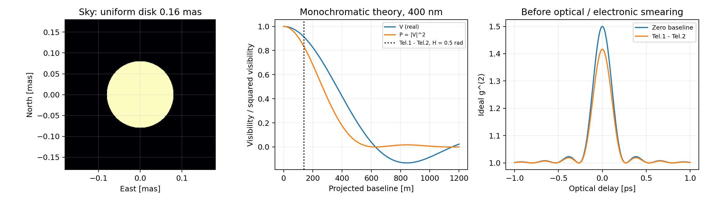
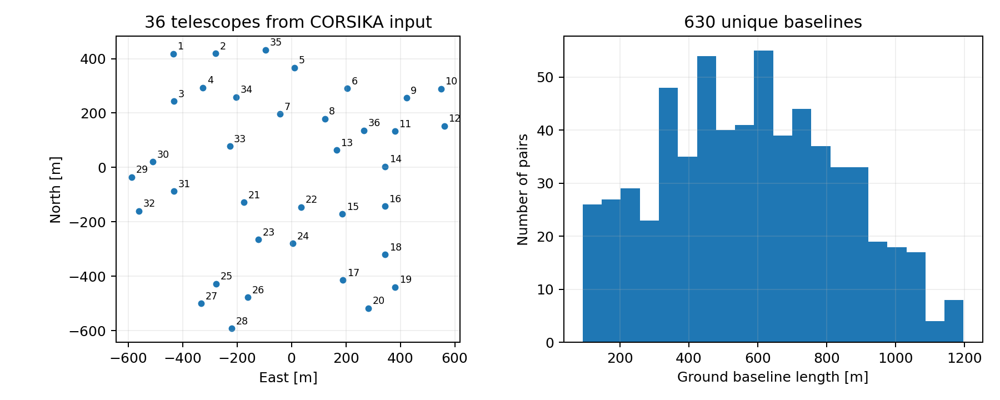
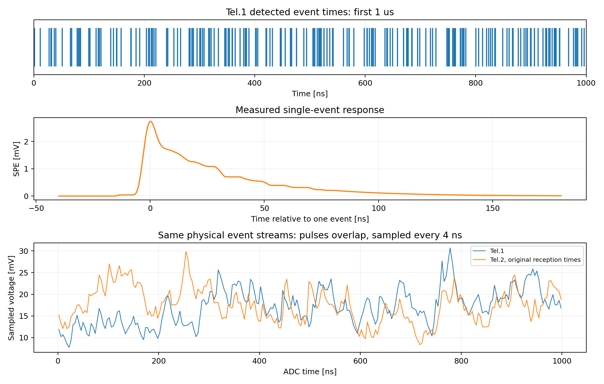
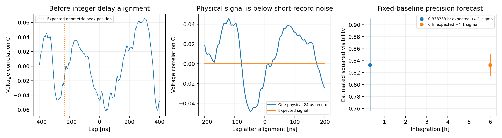
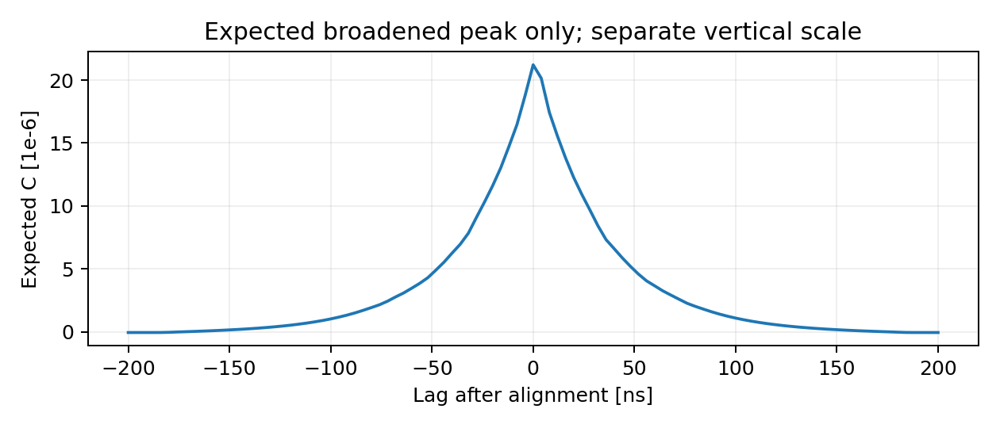
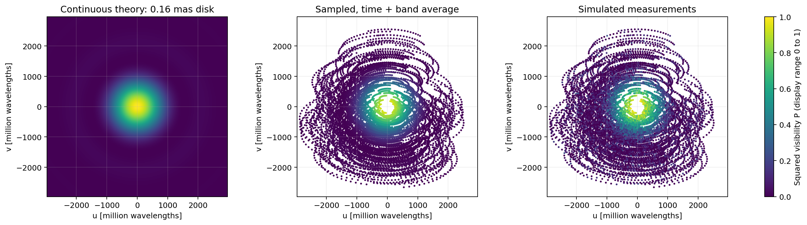
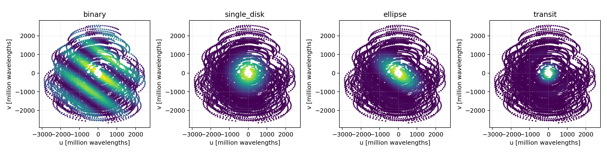
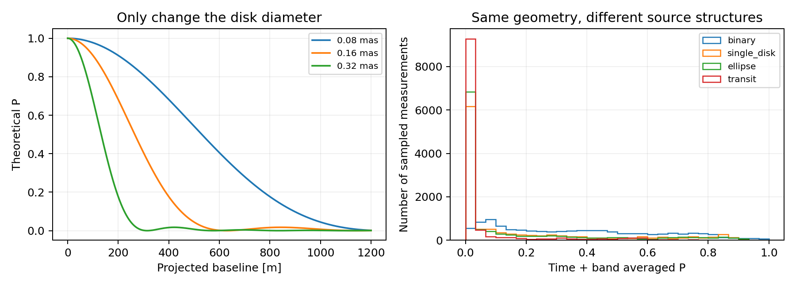
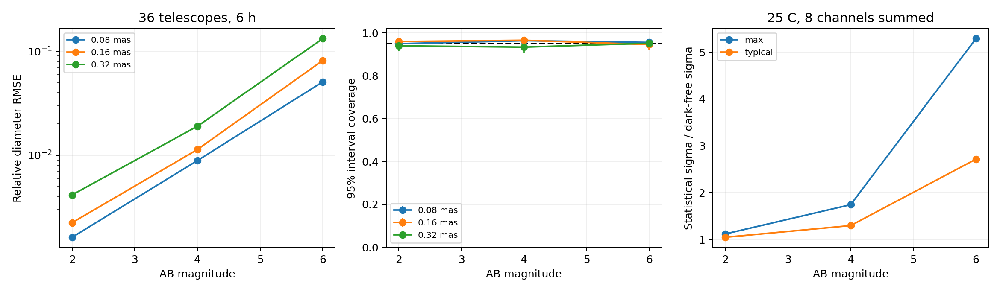

# LACT 恒星强度干涉：从热光到电压相关，再到天体参数

本文解释当前程序实际计算的物理过程。先给定天体的亮度分布和总光通量，计算两处接收到的热光应该有怎样的相关性；然后让光经过 LACT 的光学响应、SiPM 和采样链，形成电压记录；最后从电压相关函数提取平方可见度，组合地球自转形成的采样，估计角直径或重建图像。

这条链中有两个计算尺度。微秒级记录逐个生成探测事件并叠加实测单光电子响应；小时级观测生成经过波形标定的统计量。后者没有存储整夜的 250 MS/s 电压流。本文会在进入这一近似时说明它保留了什么、为什么可以用，以及验证到哪里。所有数值都是模拟结果，仪器输入中包含实测数据，但没有把模拟标成实测恒星观测。

[完整 notebook](../notebooks/sii_complete_waveform_report.ipynb)按看图和做实验的顺序组织，适合先建立直觉；本文独立展开推导，不要求读者同时翻阅 notebook。函数、配置及复现命令见[代码实现说明](SII_IMPLEMENTATION_ZH.md)。文中的数学推导采用当前代码的归一化和正负号；附录给出关键中间步骤，避免仅以参考文献代替说明。

阅读导航：正文第 1–6 节解释源、通带、阵列与电压生成；第 7–9 节解释相关、GLS 与整夜观测；第 10–13 节解释模型、反演、性能和规格书。关键推导集中于[附录 A–K](#appendix-a)，[附录 L](#appendix-l)列出公式与函数、结果数组的对应。

## 1. 全文使用什么场景与符号

### 1.1 一条贯穿理论、波形和阵列的基准观测

基准源是总 AB 星等为 2、角直径为 0.16 mas 的均匀圆盘。它没有随时间变化的亮度或表面结构。除专门写明的对照实验外，光学通带、仪器和观测几何保持下表设置。

| 量 | 基准值 | 程序字段或输入 | 性质 |
|---|---:|---|---|
| 总观测星等 | 2 AB mag | `BinarySource.ab_magnitude` | 场景假设，通带内平坦频率谱 |
| 圆盘角直径 | 0.16 mas | `primary_diameter_mas`，`source_case='single_disk'` | 场景假设；类名不表示本例必须是双星 |
| 赤纬、站址纬度 | 22°、29.36° | `Observation.source_dec_deg/site_lat_deg` | 本次固定几何 |
| 曝光 | 过中天前后合计 6 h，1 夜 | `hours_per_night/nights` | SI 秒计时 |
| 分段 | 1200 s，合计 18 段 | `segment_s` | 每段对时间和通带平均 |
| 时间、波长积分节点 | 每段 9 个、每通带 5 个 | `visibility_subsamples_per_segment`；`visibility_wavelength_nm/visibility_spectral_weights` | 数值求积，不是额外独立探测器 |
| 阵列 | 36 台、630 对 | [原始 input](../configs/arrays/lact36_20260906.input) | 用户提供的位置 |
| 中心波长、带宽 | 400 nm、2 nm | `wavelength_nm/optical_width_nm` | 矩形 SII 通带再乘仓库响应曲线 |
| 偏振因子 | 0.5 | `polarization_factor` | 未分偏振、两种等强独立偏振 |
| 上游源透过率 | 0.7836336 | `source_transmission_scale` | 固定场景系数，非当晚实测大气 |
| 采样间隔 | 4 ns，250 MS/s | `sample_width_ns` | main 配置 |
| 单镜探测星光率 | 199.889298 MHz | `detected_star_rate_hz(2, instrument)` | 用同一通带计算 |
| 单镜夜天光率 | 0.573214 MHz | `detected_nsb_rate_hz` | 天空谱模型积分 |
| 有效相干面积 | 0.133429 ps | `coherence_area_s` | 已含偏振因子 |
| 单镜示例 | Tel.1、Tel.2，时角 0.5 rad，24 μs | [基准参数记录](../validation/sii_science/walkthrough_parameters.json) | 观测窗口内的一个短时刻，物理对率倍率为 1 |

这里的“5 个波长节点”只是同一光学通带的积分点，不带来五份独立观测或额外的信噪比平方根增益。其他源形态在第 10 节逐项列出改变的参数；性能扫描在第 12 节列出星等、直径和曝光的变化。验证用放大注入不改变这条基准观测。

若提供自定义SII透射曲线，积分改为在各输入曲线相邻物理节点之间做5点Gauss–Legendre求积。星光率、NSB率、相干面积与可见度权重共用该网格；这时波长节点总数随曲线变化，不再固定为5。这样窄峰即使落在原全通带节点之间，也不会出现光子率为正而可见度权重全零的矛盾。

### 1.2 符号约定

| 符号 | 含义和单位 |
|---|---|
| $l,m$；$I(l,m)$ | 天空切平面东、北角坐标，rad；归一化亮度，rad$^{-2}$ |
| $d$；$q$ | 角直径，rad；空间频率长度，按波长数计 |
| $V$；$P=\lvert V\rvert^2$ | 复可见度；平方可见度，均无量纲 |
| $\boldsymbol r_i,\boldsymbol B_{ij}$ | 第 $i$ 镜位置、$\boldsymbol r_j-\boldsymbol r_i$，m |
| $H,\delta,\phi$ | 西向为正的时角、赤纬、地理纬度，公式中用 rad |
| $u,v,w_m$ | 东、北投影基线除以波长；视线投影基线保留 m |
| $E_i,J_i$ | 单偏振复光场、光强 $J_i=\lvert E_i\rvert^2$；只在归一相关中使用 |
| $g^{(1)},g^{(2)}$ | 一阶场相关、二阶光强相关，均无量纲 |
| $R_\star,R_b,R_{\rm tot}$ | 已探测星光、背景、总事件率，s$^{-1}$ |
| $Q_\nu,\tau_{\rm eff}$ | 已探测光子谱率，s$^{-1}$ Hz$^{-1}$；相关面积，s |
| $h_{\rm P}$；$h_{\rm SPE}(t)$ | 普朗克常数，J s；单光电子电压模板，mV，二者不可混淆 |
| $a_k,F_q$ | 单事件相对电荷；$F_q=\mathrm E(a_k^2)$，无量纲，$\mathrm E a_k=1$ |
| $K_i(t),X_i(t)$ | 单镜随机光学延迟密度，s$^{-1}$；电压，mV |
| $D_i,D_{ij}$ | 相对参考镜到达时差、$D_j-D_i$，公式用 s，接口用 ns |
| $\widehat C_k,\boldsymbol k,\boldsymbol\Sigma$ | 电压归一互相关、单位 $P$ 峰模板、相关向量协方差 |
| $\widehat P,\sigma_P$ | 从一条相关曲线估计的平方可见度及其标准差 |
| $T,T_b,\Delta t$ | 观测曝光、短标定块时长、采样间隔，s |
| $g,s_g$ | 全体测量共用的响应增益及其先验标准差，无量纲 |

$1\,\mathrm{mas}=4.8481368\times10^{-9}\,\mathrm{rad}$。时间积分公式默认秒；代码中连续波形常用 ns，因此率乘时间时显式带 $10^{-9}$。理论 $P$ 在 0 至 1 内，有限噪声下的线性估计 $\widehat P$ 可以越界。

## 2. 天体在理想仪器前是什么样

### 2.1 总光通量与形态是两件事

把天空亮度归一化为

$$
\int_{\mathbb R^2} I(l,m)\,dl\,dm=1.
$$

这个积分只规定形态的相对权重。总的探测光子率另由星等、面积和效率决定。增亮同一个圆盘会提高测量精度，不会自动把它变成更小的圆盘。

远场、窄视场、不同源面元彼此空间非相干的条件下，两个镜面位置接收到的复场相干等于亮度的归一化傅里叶变换：

$$
V(u,v)=\int I(l,m)e^{-2\pi i(ul+vm)}\,dl\,dm,
\qquad P(u,v)=V(u,v)V^*(u,v).
$$

指数中 $ul+vm$ 无量纲；星号表示复共轭。这个关系把天体形态连接到基线：小角尺度需要较长基线才能使不同面元的相位显著抵消。零基线相位完全相同，所以 $V(0,0)=P(0,0)=1$。非负归一亮度又保证 $|V|\leq1$。均匀盘可见度及强度相关的天文用法可对照 [Mozdzen 等（2025）第 2 节](https://academic.oup.com/mnras/article/537/3/2527/8003771)；本文的盘模型积分在[附录 A](#appendix-a) 直接展开。

对于直径 $d$ 的均匀圆盘，盘内 $I=4/(\pi d^2)$，盘外为 0。令 $q=\sqrt{u^2+v^2}$，得到

$$
V_{\rm disk}(q)=\frac{2J_1(\pi d q)}{\pi d q},
\qquad P_{\rm disk}(q)=\left[\frac{2J_1(\pi d q)}{\pi d q}\right]^2.
$$

$J_1$ 是一阶第一类贝塞尔函数。其小自变量极限为 $J_1(x)\simeq x/2$，故零基线不会出现物理奇点；代码对数值上的 $0/0$ 单独赋值为 1。$V$ 可以在较长基线变成负值，但 $P$ 始终非负。直接把 $\sqrt P$ 当成已知 $V$ 会丢掉这些符号，非轴对称源还会丢掉一般的复相位。

### 2.2 为什么测强度也能知道场相干

对一个偏振的平稳热光场，定义

$$
g^{(1)}_{ij}(\tau)=
\frac{\langle E_i(t+\tau)E_j^*(t)\rangle}
{\sqrt{\langle J_i\rangle\langle J_j\rangle}},
\qquad
g^{(2)}_{ij}(\tau)=
\frac{\langle J_i(t+\tau)J_j(t)\rangle}
{\langle J_i\rangle\langle J_j\rangle}.
$$

角括号表示平稳总体平均，$\tau$ 是左镜取样时刻相对右镜的偏移，与后文电压互相关采用相同方向。对零均值圆对称复高斯场，四阶矩能分解为两种非零配对，因而

$$
g^{(2)}_{ij}(\tau)=1+p\,|g^{(1)}_{ij}(\tau)|^2.
$$

此式中的 $p=1$ 对应单偏振；把两种等强、互不相关偏振的光强相加后，分母增加四倍，相关分子只增加两倍，故本例 $p=1/2$。[附录 B](#appendix-b) 给出这一步。历史强度干涉实验的出发点是强度涨落的相关，见 [Hanbury Brown 与 Twiss（1956）的公开摘要](https://www.nature.com/articles/177027a0)；这里采用的高斯矩推导写在本文中，不以未开放的原文正文代替推导。

在足够窄的通带中，可以近似分离空间和时间：$g^{(1)}_{ij}(\tau)\simeq V_{ij}\gamma_t(\tau)$。因此零延迟处理想超额相关为 $pP_{ij}$。本文展示的理论光学曲线还在通带内积分 $V(\lambda)$，没有强迫它在所有波长严格相同。基准两镜的投影基线是 139.2941 m，积分平方可见度为 0.832912；理想光学相关峰大约在 $1+0.5P\simeq1.41646$ 附近。

**图 1。** 左图是 0.16 mas 均匀盘的归一化像素亮度，横东纵北，单位 mas；它是理论输入。中图是在 400 nm 下随投影基线长度变化的 $V$ 与 $P$，竖线标出 Tel.1–Tel.2 在 $H=0.5$ rad 的位置。右图是仪器展宽前的理想 $g^{(2)}$，横轴 ps，包括零基线与所选两镜；它由相同响应曲线在 399–401 nm 积分得到。右图的皮秒尺度和后文的纳秒 ADC 尺度不能直接混用。

## 3. 同一束光经过通带后，有多少光子、多少相关面积

### 3.1 从 AB 星等到已探测率

AB 星等定义为频率通量密度的对数。平坦 $F_\nu$ 的本例采用

$$
F_\nu=3631\times10^{-26}\,10^{-0.4m_{\rm AB}}
\quad\mathrm{W\,m^{-2}\,Hz^{-1}},
\qquad Q_\nu=\frac{A\eta(\nu)F_\nu}{h_{\rm P}\nu},
\qquad R_\star=\int Q_\nu\,d\nu.
$$

$A$ 是收集面积，m²；$\eta$ 是包含探测效率的无量纲响应；$h_{\rm P}\nu$ 是单光子能量，J。因此 $Q_\nu$ 为每秒、每 Hz 的探测事件数，积分后的 $R_\star$ 为 s$^{-1}$。AB 零点和 Jy 的单位约定见 [NASA/IPAC 天文术语表](https://ned.ipac.caltech.edu/level5/Glossary/Glossary_A.html)。

代码保留 $A\times\texttt{throughput}\times Q_{\nu,\rm incident}(\lambda_0)\times\Delta\nu$ 的接口，但 `throughput` 已乘实际通带积分相对中心值的校正。这不是在任意宽通带上直接以中心点代替积分。本例面积字段为 24.57686 m²；400 nm 光追缓存给出的中心有效探测面积为 5.92276165 m²，已含镜面、遮挡、PSF、相机接收、集光器、滤光片与 PDE 的模型损失。再乘一遍这些中心效率会重复减光。

计算使用 main 已有的反射率、滤光片、PDE 曲线，以相同的 2 nm SII 窗口截取。`source_transmission_scale=0.7836336` 只施加到源光。本例所得 $R_\star=1.99889298\times10^8\ \mathrm{s^{-1}}$，每 4 ns 平均约 0.800 个星光事件。一个长尾 SPE 在多个采样点都有贡献，因此实际波形常见的是脉冲叠加，而非彼此完全分开的单光电子。

### 3.2 背景增加什么

夜天光输入是每秒、每 nm、每 sr、每平方米的光子面亮度 $L_\lambda$。有效面积与像素立体角将它转成同一像素的率：

$$
R_{\rm NSB}=\int L_\lambda(\lambda)\,A\eta_{\rm sky}(\lambda)\,
\Omega_{\rm pix}\,d\lambda.
$$

$\Omega_{\rm pix}$ 的单位为 sr，代码用像素尺寸与焦距之比的平方作小角近似。这里的天空谱已定义在地面，不再乘源的上游透过率。仓库的 [NSB 谱](../configs/nsb/nsb_spectrum.csv)由 Paranal、airmass 1.2 等设置下的 SkyCalc 场景产生，**不是 LACT 当晚实测天空谱**。本例积分得到 0.573214 MHz。

暗计数如果启用则另加一次：$R_b=R_{\rm NSB}+R_{\rm dark}$，$R_{\rm tot}=R_\star+R_b$。当前跨镜 HBT 信号只来自目标星光；NSB 和暗计数按不同镜独立处理。大尺度天空结构的相关、共同电噪声及闪烁不在这一默认背景模型中。

### 3.3 相关峰的面积由光谱决定

定义归一化时间场相干

$$
\gamma_t(\tau)=\frac{\int Q_\nu e^{-2\pi i\nu\tau}\,d\nu}{R_\star}.
$$

它在零时延等于 1。不同频率随时延积累不同相位，越宽的频谱越快相消。Parseval 恒等式把相关峰面积写成

$$
\tau_{\rm eff}\equiv p\int_{-\infty}^{\infty}|\gamma_t(\tau)|^2d\tau
=p\frac{\int Q_\nu^2d\nu}{R_\star^2}.
$$

分子单位为 s$^{-2}$ Hz$^{-1}$，除以率平方后得到 s。这里的“面积”是无量纲相关函数对时延的积分，不是望远镜面积，也不是把峰的 FWHM 直接称为相干时间。它已包含偏振因子，后面生成对率时不能再乘 $1/2$。有限时间分辨使峰变低变宽但保留相关面积的关系，可对照 [Mozdzen 等第 2.2 节](https://academic.oup.com/mnras/article/537/3/2527/8003771)；本代码采用实测脉冲和光追核卷积，未采用该文的高斯仪器响应作为 LACT 输入。

若 $Q_\nu$ 在宽度 $\Delta\nu$ 内为常数，便有 $\tau_{\rm eff}=p/\Delta\nu$。利用窄带 $\Delta\nu\simeq c\Delta\lambda/\lambda_0^2$，当前值约为 0.133429 ps。ADC 的 4 ns 间隔比它大约三万倍，直接在 ADC 图上寻找图 1 的尖锐光学峰不会成功。

令三条效率曲线与 SII 窗口的乘积为 $\mathcal R(\lambda)$。对于平坦 AB 频谱，换元后光子率积分权重是 $\mathcal R/\lambda$，相关面积分子的权重却是 $\mathcal R^2$。所以程序的 5 点波长求积按 $\mathcal R^2$ 加权来平均 $P$；不能误用线性的光子数权重。[附录 C](#appendix-c) 给出换元和代码 `spectral_shape_factor` 的表达式。

## 4. 阵列怎样把天空变成一组 UV 采样

### 4.1 原始 input 到地面坐标

每条 TELESCOPE 卡片的三个坐标按原程序解释为北、西、向上，单位 cm。读入转换严格为

$$
(E,N,U)=(-W_{\rm cm},N_{\rm cm},U_{\rm cm})/100.
$$

结果单位为 m，不做额外居中、旋转或交换镜号。Tel.1 是 $(-434.92063,417.46032,0)$ m，Tel.36 是 $(266.66667,136.50794,0)$ m。input 的 400 cm 是采样球半径 4 m，不是直径；它也没有自动给 SII 加上有限瞳面平均。原值及转换值见[坐标 CSV](../configs/arrays/lact36_20260906_coordinates.csv)。

**图 2。** 左图横东纵北，单位 m，数字沿用用户的 Tel.1–Tel.36，标记表示镜心。右图统计 630 条唯一地面基线，范围 91.7482–1197.0085 m。地面长度不等于任一时刻的投影长度，下一步需要源方向。

### 4.2 切轴、时角和几何时延

$H=\mathrm{LST}-\mathrm{RA}$，向西增大。纬度 $\phi$、赤纬 $\delta$ 下，指向源的 ENU 单位向量为

$$
\boldsymbol s(H,\delta,\phi)=
\begin{pmatrix}
-\cos\delta\sin H\\
\sin\delta\cos\phi-\cos\delta\cos H\sin\phi\\
\sin\delta\sin\phi+\cos\delta\cos H\cos\phi
\end{pmatrix}.
$$

天空向东的切轴取 $\boldsymbol e_u=-(\partial\boldsymbol s/\partial H)/\cos\delta$，向北取 $\boldsymbol e_v=\partial\boldsymbol s/\partial\delta$。二者与视线互相正交并归一。用这组天球切轴投影，源的位置角始终有相同的东、北含义：

$$
u=\boldsymbol B_{ij}\cdot\boldsymbol e_u/\lambda,
\qquad v=\boldsymbol B_{ij}\cdot\boldsymbol e_v/\lambda,
\qquad w_m=\boldsymbol B_{ij}\cdot\boldsymbol s.
$$

光沿 $-\boldsymbol s$ 传播，因此到达更靠近源的镜时更早。相对参考镜 $0$，

$$
D_i=-\frac{(\boldsymbol r_i-\boldsymbol r_0)\cdot\boldsymbol s}{c},
\qquad D_{ij}=D_j-D_i=-w_m/c.
$$

本例 Tel.2 比 Tel.1 晚到 231.03275 ns。程序先把这个时差加到真实事件时刻，再由分析阶段补偿；不会先生成已对齐的数据，然后声称已验证追踪。

时角按 $H(t)=H(0)+2\pi t/86164.0905\,\mathrm{s}$ 推进。这是平均恒星日模型，而非 86400 s 的太阳日。它足以定义当前静态源的自转采样，但不包含日期级章动、极移、大气折射或目标历表。代码检查观测窗口的地平线条件及分段是否整除曝光。

### 4.3 一个分段测量不是单个瞬时点

一段 1200 s 内基线在转动，带内波长也不同。测量 $a$ 的期望是

$$
\overline P_a=\sum_{t,r}w_{tr}
\left|V\!\left(B_{u,a}(t)/\lambda_r,B_{v,a}(t)/\lambda_r\right)\right|^2,
\qquad \sum_{t,r}w_{tr}=1.
$$

$t,r$ 分别标记时间和波长求积节点，$B_u,B_v$ 单位 m。时间采用 9 个等权中点，波长采用 5 点 Gauss–Legendre 与上一节的平方响应权重。必须先求每个节点的模平方再平均；平均复振幅会把本来不相干叠加的不同频率抵消。只在平均 UV 坐标计算一次也会遗漏曝光展宽。

36 台镜的每段 630 条基线乘 18 段，一夜得到 11340 条测量。绘图用段中心坐标定位点，数据生成与拟合保留全部节点。UV 合并后也保留原来的节点和统计权重，不把一格中心当成这一格所有实际采样。

## 5. 从相干函数生成探测事件

### 5.1 为什么不直接用皮秒电场跑六小时

对本例单镜 $R_\star\tau_{\rm eff}=2.6671\times10^{-5}$，占据度很低，光子计数主要由散粒噪声支配。相关信号则是独立泊松巧合之外的一点超额。仪器时间响应远宽于光学相关峰，可用保留峰面积的窄脉冲近似：

$$
R_{{\rm pair},ij}=R_{\star,i}R_{\star,j}\tau_{\rm eff}\overline P_{ij}.
$$

单位检查为 s$^{-1}\times$s$^{-1}\times$s，即每秒超额对数。这个量是用于复现二阶统计的生成率，不表示天体每次只发射一对光子，也不表示一个光子被同时探测两次。对基准两镜，24 μs 内平均只有约 0.1065 个超额对，而各镜有约 4800 个星光事件；一次短记录自然不应出现清晰相关峰。

实现先生成独立的公共泊松时刻，每个时刻向参与的两镜各加入一个事件；两边独立抽取光学延迟、电荷等响应。为保证单镜总星光率不被人为增加，第 $i$ 镜其余独立星光率设为

$$
R_{\star,i}^{\rm single}=R_{\star,i}-\sum_{j\ne i}R_{{\rm pair},ij}.
$$

公共对加回后，各镜边缘平均仍是 $R_{\star,i}$。独立 NSB、暗计数再加入。每镜只生成一次事件流，所有涉及它的基线都使用同一条波形；不能为了计算 01、02 两条基线而重新生成两个互不相同的镜 0。

### 5.2 相干矩阵保留了什么约束

多镜输入在每个波长节点构造 $\Gamma^{(r)}_{ij}=V(u_{ij,r},v_{ij,r})$。它满足对角为 1、交换镜号取复共轭、矩阵半正定。这三个条件来自同一非负天空亮度的傅里叶积分。逐元素 $|\Gamma_{ij}|\leq1$ 只是必要条件，并不足以使任意拼出的多镜矩阵成为一个物理场。

程序检查逐波长矩阵，再计算 $\overline P_{ij}=\sum_r w_r|\Gamma^{(r)}_{ij}|^2$。例如两个谱节点的跨镜 $\Gamma$ 为 $+1$、$-1$，等权的 $\overline P$ 仍为 1，先平均 $\Gamma$ 却得到 0。反过来对 $\overline P$ 开平方也不能恢复一套合法的相位。

短记录扩展到事件与 SPE 支持范围之外生成保护区，再只保留有完整脉冲贡献的采样。几何平移和插值的公共边界另行裁剪。这样避免把记录之外应有的事件误当作不存在而产生边缘偏差。

### 5.3 弱对模型的边界与独立热光检查

弱对生成器保留了指定的两镜超额相关，但单镜边缘仍是泊松过程，未生成完整热光的自聚束及全部三、四阶累积量。为了独立核对理论，另一条验证路径从相关复高斯场生成光强，再作条件泊松探测。

设 $M$ 个独立模的平均归一光强为 $J_i$，每块平均星光计数为 $\mu_\star$，背景为 $\mu_b$。则

$$
\operatorname{Cov}(J_i,J_j)=P_{ij}/M,
\quad \operatorname{Var}(N_i)=\mu_\star+\mu_b+\mu_\star^2/M,
\quad \operatorname{Cov}(N_i,N_j)=\mu_\star^2P_{ij}/M.
$$

$N_i$ 是计数，第一项是泊松噪声，最后一项是热光超泊松涨落。三镜还包含

$$
\left\langle(J_0-1)(J_1-1)(J_2-1)\right\rangle
=2\operatorname{Re}(\Gamma_{01}\Gamma_{12}\Gamma_{20})/M^2.
$$

闭合乘积中的相位在两镜 $P$ 之外提供信息；当前图像重建没有把这个量当作已测数据。多探测器高阶相关的物理见 [Malvimat、Wucknitz 与 Saha](https://arxiv.org/abs/1304.3391)，本文与离散模数的换算见[附录 D](#appendix-d)。验证用较高占据度和小 $M$ 让这些项可统计检验；它不是把 LACT 的 4 ns 采样解释成只有两模或十六模。

标定可以把对率乘已知倍率 $\alpha$，再把响应除回 $\alpha$。若任一镜扣除后的独立率为负，程序拒绝运行。主波形示例始终 $\alpha=1$；两镜标定及多镜验证使用的放大注入会单独注明，不能用它们的可见峰代表物理短曝光的探测效果。

## 6. 光学、SiPM 与采样怎样形成电压

### 6.1 输入响应的物理性质

[main 参数清单](../configs/sii/main_parameter_manifest.json)记录了提交 `2926031b14c8aa2164a4d9233f5c2d0a75324127` 核对过的 10 个文件。来自 main 不等于全部是现场实测：SPE 和电荷分布是实测提取输入，光学时间核是使用实测配置的光追产物，天空谱和上游透过率是场景设置。

**图 3。** 左图为实测提取的 SPE 模板，时间 ns、电压 mV；积分为 84.03496 mV ns。右图为单像素光追延迟概率密度，单位 ns$^{-1}$，整体减去平均行时，RMS 为 0.548827 ns。显示窗口没有截断事件生成使用的完整 54 分量混合分布。这是随机到达时间的展宽，不能只把波形整体平移一个 RMS 来代替。

光追缓存及[溯源 JSON](../configs/optics/lact2_measured_single_pixel_400nm.provenance.json)由历史百万光子模拟产生；原始逐光子文件不在本分支。可用已提交缓存复现 SII 计算，但不能仅凭本分支从头重做那次历史 C++ 光追。当前 2 nm 内共用 400 nm 时间核，尚未建模波长相关的脉冲变化。

### 6.2 事件变成连续平移的 SPE

第 $k$ 个事件先加光学随机延迟和几何到达时差，得到 $t_{ik}$。其电荷因子 $a_{ik}$ 从实测电荷样本抽取，归一到 $\mathrm E a=1$。采样前及采样后的电压关系是

$$
X_i(t)=\sum_k a_{ik}h_{\rm SPE}(t-t_{ik}),
\qquad x_i[n]=X_i\big((n+1/2)\Delta t\big)+e_i[n].
$$

$n$ 是非负采样索引，$e_i[n]$ 是附加电子噪声，单位 mV。代码在线性插值的连续模板上求值，不先将 $t_{ik}$ 取整到 4 ns 格点。随机电荷的二阶矩 $F_q=1.03254526$ 增加散粒噪声；字段 `excess_noise_factor` 存的是 $\sqrt{F_q}$，因此出现该字段平方时才是这里的 $F_q$。

对线性平稳复合泊松脉冲流，均值和方差为

$$
\mu_X=R_{\rm tot}\int h_{\rm SPE}(t)dt,
\qquad \sigma_X^2=R_{\rm tot}F_q\int h_{\rm SPE}^2(t)dt+\sigma_e^2.
$$

时间用 s 时单位分别是 mV 和 mV²。电荷噪声进入方差而不改变归一后的平均脉冲面积。独立随机平移一个平稳泊松流不改变其自相关的脉冲形状；光学核影响跨镜共同事件的相对时差，后文将它放在交叉峰中。

**图 4。** 上图是 Tel.1 前 1 μs 的实际探测事件时刻；中图是形成电压所用的 SPE；下图是同一次 24 μs、倍率 1 记录中两镜的前 1 μs 电压片段。横轴 ns、纵轴 mV。两镜保留原始接收时刻，因此几何时差尚未去除。后面的相关图使用这同一对完整记录，未重新抽一组更好看的随机数。完整事件和 6000 点/镜 ADC 数组保存在 [NPZ](../validation/sii_science/walkthrough_record.npz)。

### 6.3 缺失电子学参数为零时究竟发生什么

当前附加白噪声 RMS、暗计数、本征时间抖动、微单元恢复时间、串扰和后脉冲概率均为 0。恢复为 0 时电荷恢复比例严格为 1；噪声为 0 时不生成附加噪声。已有的 SPE 长尾、实测电荷涨落和光学展宽仍然保留。

若将来启用指数恢复，模型对同一微单元相邻雪崩间隔 $\Delta t_c$ 取恢复比例 $f=1-\exp(-\Delta t_c/\tau_r)$，首次事件为 1。这里 $\tau_r$ 是独立恢复测量参数；不能从 SPE 电压长尾直接推断。器件共有 $8\times33792=270336$ 微单元，当前启用恢复时用均匀随机单元分配，是需要用真实照明和接线进一步约束的模型。

本征抖动非零时独立加高斯时间偏移；白噪声非零时加独立高斯电压。ADC 只有 `adc_bits=0` 且 `adc_full_scale_mv=0` 时关闭量化。若启用 $b$ 位、总满量程 $L$ mV，则步长 $\Delta V=L/2^b$，四舍五入并限制在 $[-L/2,L/2-\Delta V]$。$L$ 是整个对称电压范围，不是正半轴最大值。

串扰和后脉冲非零目前显式报未实现，因为单个总概率不足以决定延迟和电荷分布。GLS 主路径同样拒绝未标定的非零每镜/每夜增益漂移、透明度漂移、NSB 漂移和剩余时延扰动。零值是关闭接口的约定；它不能被解释为已经测得这些效应不存在。第 13 节解释规格书能补到哪里。

## 7. 对齐两条波形后，实际计算什么相关函数

### 7.1 先消除几何时差，再处理采样残差

程序的互相关采用 `correlate(left, right)` 约定，即左序列的索引增加滞后、右序列保持参考索引。若右镜事件晚到 $D_{ij}>0$，原始相关峰出现在 $\tau=-D_{ij}$。这个负号由数据定义决定，不能只根据“晚到”凭直觉把模板往正方向移。

最终性能路径对每镜取整数偏移 $n_i=\operatorname{round}(D_i/\Delta t)$，读取 $x_i[n+n_i]$，裁剪到所有镜都有数据的公共区间。它不做循环移位。剩余时差为

$$
\epsilon_i=D_i-n_i\Delta t,
\qquad \epsilon_{ij}=\epsilon_j-\epsilon_i.
$$

这里 $\epsilon_i$ 是单镜残差，位于半个采样间隔附近；两镜之差可以达到一个完整采样间隔。模板因此覆盖 $[-4,4]$ ns，而非只覆盖 $[-2,2]$ ns。

基准两镜右侧平移 58 点，即 232 ns；残差为 $-0.967249$ ns，公共样本由 6000 点降为 5942 点，有效曝光 23.768 μs。GLS 使用这个实际曝光和残差，不把裁掉的数据算进积分。

旧的短记录追踪验证还保留分数时延 Lanczos 插值路径：以归一化 sinc 窗核对原始 ADC 作有限支持插值，显式裁边、不作周期延拓。这条路径可以比较插值误差，但插值改变采样噪声，必须使用处理后的对应标定。最终 36 镜角直径性能采用上述整数移位和残差模板，避免把不同处理链的误差混用。[附录 E](#appendix-e) 给出段内追踪与两种对齐的具体表达式。

### 7.2 本程序的 $C$ 不是光学 $g^{(2)}$

对共同长度为 $N$ 的两镜波形，先分别减去本块均值，再取

$$
\widehat C_k=
\frac{\displaystyle\sum_{n\in\mathcal O_k}(x_i[n+k]-\bar x_i)(x_j[n]-\bar x_j)}
{(N-|k|)\,s_i s_j}.
$$

$k$ 是整数滞后，实际横轴为 $k\Delta t$；$\mathcal O_k$ 是两条序列有效重叠的索引集合。$s_i,s_j$ 是各完整块用总体形式计算的样本标准差，mV。分子是电压乘积，分母也为 mV²，故 $\widehat C_k$ 无量纲。除以 $N-|k|$ 修正重叠数量，并不保证含随机均值和随机标准差的整个比值严格无偏。

若用电压均值归一化，超额相关应写成 $\operatorname{Cov}(X_i,X_j)/(\mu_i\mu_j)$；本程序却除以 $\sigma_i\sigma_j$。因此电压 $C$ 的零信号基线为 0，其峰高不能直接读成 $g^{(2)}-1$，更不能直接读成 $P$。需要经过下一节的单位响应模板换算。

### 7.3 这一次短记录真的看到了什么

**图 5。** 左图用图 4 的完整 24 μs 电压计算原始 $\widehat C$，横轴滞后 ns；虚线只标理论几何峰位置 $-231.03$ ns，并未声称附近的随机起伏就是信号。中图是整数对齐后同一记录的 $\widehat C$ 与理论期望，仍然没有放大注入。右图只表示保持这条基线和采样相位不变时，1200 s 与 21600 s 的期望值及预测 $1\sigma$；它不是地球自转六小时所得的单条原始 ADC，也不是两次随机测量。

**图 6。** 将图 5 中的理论电压相关单独画出，纵轴单位是 $10^{-6}$。理论峰最大值约 $2.12184\times10^{-5}$，远小于这次短记录的随机起伏。单独改变显示尺度没有改变生成事件的对率。

从这条实际记录得到 $\widehat P=-295.744$，短记录标准差约 550.861；真实 $P=0.832912$。这三个量同时成立：真实源的平方可见度在 0–1 内，弱信号线性估计的统计分布却很宽。这次负估计既不是“负的真实相干”，也不是重建出的负亮度。把它截成 0 会在弱源总体上制造向上的偏差，所以测量表保留原值。

精确数据见[相关 CSV](../validation/sii_science/walkthrough_pair_correlation.csv)与[估计结果 JSON](../validation/sii_science/walkthrough_pair_result.json)。固定该基线和相位，用当前解析标定外推到 1200 s，$\sigma_P=0.0775260$；后文整阵列计算还要处理自转、时间平均与独立标定不确定度，不能直接把这个固定相位数字复制给每条基线。

## 8. 从完整相关峰提取平方可见度

### 8.1 理论峰怎样从 SPE 与光学核得到

先定义单光电子模板的自相关

$$
A_h(\tau)=\int h_{\rm SPE}(t)h_{\rm SPE}(t+\tau)\,dt.
$$

其单位为 mV² s。两个共同事件各自通过光学路径，差分延迟 $z=t_j^{\rm opt}-t_i^{\rm opt}$ 的概率密度记为 $K_\Delta(z)$，单位 s$^{-1}$。本程序同一响应的两镜具有对称的差分核；对一般两镜，可按相同滞后定义写交叉模板并保留方向。当前信号核为 $A=A_h*K_\Delta$，单位仍是 mV² s。

因为每秒有 $R_{{\rm pair},ij}$ 对共同事件，交叉电压协方差为

$$
\operatorname{Cov}[X_i(t+\tau),X_j(t)]
\simeq R_{\star,i}R_{\star,j}\tau_{\rm eff}\overline P_{ij}
\,A(\tau+D_{ij}).
$$

近似条件是光学相干时间远短于仪器响应、弱信号、线性响应，且一个短块内几何和光子率近似恒定。量纲为 s$^{-1}\times$mV² s，即 mV²。随机电荷因子在两镜独立，所以共同事件电荷乘积期望为 1；单镜方差里的 $F_q$ 则仍然存在。除以第 6 节的两镜标准差后得到单位 $P$ 的电压相关模板。

频域可更直接地算同一件事：SPE 的功率谱乘单镜光学传递的模平方，再逆变换。这里光学的模平方对应两镜独立延迟之差，[附录 F](#appendix-f) 给出卷积关系及有限块修正。代码以 0.05 ns 的细网格积分实测模板，并用 0.025 ns 网格作收敛对照。

### 8.2 为什么不能只取零时延那一个点

相邻滞后使用重叠的 SPE 片段，因此噪声相互相关。设归一单镜自相关分别为 $\rho_{\rm left}[r]$、$\rho_{\rm right}[r]$，在零跨镜信号、长块条件下，相关向量的 Bartlett 协方差近似为

$$
\Sigma_{kl}\simeq\frac1N\sum_r\rho_{\rm left}[r+k-l]\rho_{\rm right}[r].
$$

这里 $r$ 枚举整数采样滞后，$k,l$ 标记相关向量的两个分量。实际两镜响应相同，代码使用同一 $\rho$。[附录 G](#appendix-g) 从乘积估计的四重求和直接推导这个式子，并明确零跨镜相干假设。

$\boldsymbol\Sigma$ 的对角表示每个滞后的方差，非对角表示它们的共同噪声。把所有点当独立会反复计算同一部分信息。使用完整峰的广义最小二乘（GLS）模型是

$$
\widehat{\boldsymbol C}=\boldsymbol C_0+\boldsymbol kP+\boldsymbol n,
\qquad \mathrm E\boldsymbol n=0,
\quad \operatorname{Cov}(\boldsymbol n)=\boldsymbol\Sigma.
$$

$\boldsymbol C_0$ 为零信号模板，本次平稳无共同噪声模型取零；$\boldsymbol k$ 为单位 $P$ 响应。最小化对应的二次型得到

$$
\boldsymbol w=\frac{\boldsymbol\Sigma^{-1}\boldsymbol k}
{\boldsymbol k^T\boldsymbol\Sigma^{-1}\boldsymbol k},
\qquad \widehat P=\boldsymbol w^T(\widehat{\boldsymbol C}-\boldsymbol C_0),
\qquad \sigma_P^2=(\boldsymbol k^T\boldsymbol\Sigma^{-1}\boldsymbol k)^{-1}.
$$

$T$ 上标表示转置。归一化保证 $\boldsymbol w^T\boldsymbol k=1$，所以输入真实模板幅度 $P$ 后期望输出也是 $P$。权重可以正负交替以压制相关噪声，不能将负权重本身解释为负概率。[附录 H](#appendix-h) 给出最小方差推导。

**图 7。** 左图给出连续SPE响应、乘Monte Carlo增益后的主模板，以及实际Monte Carlo相关曲线的样本平均，纵轴以 $10^{-6}$ 表示；右图是不同滞后之间的噪声相关系数，颜色 −1 至 1。主模板形状来自连续响应，两者不能凭峰形接近算作独立验证。原始波形均值和新种子的留出检验才独立检查该物理响应；右图也不是天体 UV 图。

### 8.3 标定数据与观测数据如何分开

基础图像流程使用 2048 条零信号、512 条已知信号的两镜波形，信号对率倍率为 10000。零信号一半训练协方差、四分之一选择收缩强度、四分之一测噪声尺度；信号前一半保留原始响应诊断、四分之一校正增益、最后四分之一检验。主模板的连续形状由SPE与时间核计算，以支持任意分数采样时延，波形独立确定响应增益和噪声。协方差按平稳性作 Toeplitz 平均，候选对角收缩比例为 $10^{-4},10^{-3},10^{-2},0.05$，特征值相对下限 $10^{-10}$ 用于稳定求解。

用于校正的有限记录带来响应增益误差和噪声尺度误差，它们单独保存，不能当作已知无误差的常数。独立零信号、1000/3000/10000 倍注入、不同块长，以及不调用对事件生成器的解析模板检查分别回答零偏差、倍率线性、曝光缩放和物理响应问题。

最终 36 镜性能流程采用同一相位响应算法，并另外用三时刻的共享 36 通道 ADC 标定。共生成 1152 条 24 μs 数组记录，原始曝光 0.027648 s，裁剪后总有效曝光 0.026164224 s。标定/检验信号倍率为 300，零信号独立生成。响应增益为 1.004796，其相对标准误 1.0804%；噪声尺度为 1.006279，其相对标准误 0.2621%。基础图像和最终性能现在都处理采样相位，但标定记录、共同噪声预算和噪声学习误差的处理仍各有明确范围，不能互换其数值。

## 9. 怎样从短记录得到整夜的 UV 相关测量

### 9.1 长曝光统计替代的依据

在平稳、弱信号且相隔足够远的短块可近似独立时，平均 $M_b$ 个等时长块使协方差缩小 $M_b$ 倍。于是

$$
\boldsymbol\Sigma(T)=\boldsymbol\Sigma(T_b)\frac{T_b}{T},
\qquad \sigma_P(T)=\sigma_P(T_b)\sqrt{T_b/T}.
$$

这不是声称每个 4 ns 采样独立；短块内的相关已经由 $\boldsymbol\Sigma$ 计算。$T\gg T_b$ 时才用高斯近似生成投影后的测量。整夜模型记录 $\overline P_a$ 和标准差，并生成

$$
y_a=g\overline P_a+\sigma_a z_a,
\qquad z_a\sim\mathcal N(0,1),
\qquad g\sim\mathcal N(1,s_g^2).
$$

$y_a$ 是观测表的 `visibility2_measured`。每条测量有独立统计随机数 $z_a$；同一批数据只抽一个共同标定增益 $g$，因此这一项不能随基线数量简单平均掉。本次图像流程的漂移字段都为 0；光学通带、SPE、采样率和源/背景率改变后需要重新标定，程序检查对应签名。

### 9.2 采样相位与段内变化怎样进入最终误差

通用长曝光与最终性能共用相位模板表，在 −4 至 4 ns 放置 65 个节点，对每个节点计算峰、权重和块误差。通用入口把连续峰乘以独立两镜标定增益，并使用该标定的完整噪声协方差；没有连续相位模型的旧离散峰标定会明确拒绝。原始 ADC 每镜整数移位的残差进入相应模板。段内追踪使用 1200 个时间中点积分采样相位；最终性能中2400 点重算的最大标准差相对变化为 $1.8619\times10^{-5}$。

由于目标 $\overline P$ 按等时间平均，若段内包含 $M_b$ 个等时块，应有

$$
\widehat P_{\rm seg}=\frac1{M_b}\sum_b\widehat P_b,
\qquad \operatorname{Var}(\widehat P_{\rm seg})=
\frac1{M_b^2}\sum_b\sigma_b^2
=\langle\sigma_b^2\rangle T_b/T.
$$

所以代码平均块方差，不取平均信息量的倒数。逆方差平均虽然常见，却会把期望改成依赖相位的时间加权 $P$；若仍用等时间模型拟合就会不一致。

### 9.3 连续理论面、真实采样、噪声测量的区别

**图 8。** 三幅图保持基准 0.16 mas、AB 2 等和同一仪器。左图是在 400 nm 上计算的连续理论 $P(u,v)$，不含噪声；中图只显示实际 11340 条采样对应的时间/通带平均期望；右图显示同一采样上的高斯统计模拟测量。坐标单位为百万波长，颜色显示范围固定 0–1。测量原值中的负数和大于 1 的值仍保留在 [CSV](../validation/sii_science/walkthrough_disk_measurements.csv)，颜色饱和不是数据裁剪。没有以镜像点增加独立测量数。

这一图使用基础波形 GLS 标定，并沿每条基线积分采样相位误差，帮助理解“同一个源如何变成 UV 数据”；36镜共同噪声预算和最终覆盖率采用第 12 节单独执行的性能入口。连续平面可画出很多像素，但独立约束仍只有实际采样；图像显示密度不能替代数据量。

## 10. 改变天体模型与参数会怎样

不同模型使用同一 36 镜、同一 AB 2 等、400±1 nm 通带和 6 小时观测。表中仅列相对基准需要改变的天体形态。

| 模型 | 形态设置 | 仍然固定的量 |
|---|---|---|
| 均匀盘 | 直径 0.16 mas | 基准不变 |
| 双星 | 两盘直径 0.060/0.040 mas，间距 0.20 mas，次/主流量比 0.55，位置角 35° | 合计 AB 2 等 |
| 均匀椭圆 | 长/短直径 0.24/0.12 mas，长轴位置角 35° | 总 AB 2 等 |
| 静态遮挡 | 恒星直径 0.30 mas，遮挡盘直径 0.08 mas，中心偏移东 0.06、北 0.03 mas | 遮挡后总 AB 2 等 |

位置角从北向东。双星间距 $s$ 与位置角 $\psi$ 给两中心 $\boldsymbol\theta_{1,2}=\mp(s/2)(\sin\psi,\cos\psi)$。两颗圆盘的复场相加后再取模平方：

$$
V_{\rm binary}=\frac{V_1e^{-2\pi i\boldsymbol q\cdot\boldsymbol\theta_1}
+rV_2e^{-2\pi i\boldsymbol q\cdot\boldsymbol\theta_2}}{1+r},
\qquad \boldsymbol q=(u,v).
$$

$r$ 是次星/主星流量比，$V_1,V_2$ 各用对应直径的圆盘表达式。位移相位使 $P$ 中出现方向性条纹；直接平均两个盘的 $P$ 会丢掉交叉项。

椭圆先将空间频率旋转到长短轴方向：$u'=u\sin\psi+v\cos\psi$，$v'=u\cos\psi-v\sin\psi$，再取

$$
x=\pi\sqrt{(d_{\rm maj}u')^2+(d_{\rm min}v')^2},
\qquad V_{\rm ellipse}=2J_1(x)/x.
$$

$d_{\rm maj},d_{\rm min}$ 为长短角直径，rad。长轴在天空上越宽，该方向的可见度随基线越快下降；$d_{\rm maj}=d_{\rm min}$ 时回到圆盘。

静态遮挡模型只支持不透明小圆盘完全位于均匀恒星盘内。设恒星/遮挡盘直径为 $d_s,d_p$，遮挡面积分数 $f=(d_p/d_s)^2$，偏移 $\boldsymbol\theta_p$，则

$$
V_{\rm occulted}=
\frac{V_s-fV_pe^{-2\pi i\boldsymbol q\cdot\boldsymbol\theta_p}}{1-f}.
$$

分子减去被挡亮度，分母以剩余总光通量归一化，零基线仍为 1。输入星等对应遮挡后的总亮度。该模型没有轨道、入凌/出凌、时间光变或临边昏暗；一次形态重建不能据此宣称发现行星。

**图 9。** 四个模型在完全相同 UV 位置的时间/通带平均理论 $P$。横纵坐标为百万波长，所有面板颜色尺度相同。方向条纹与椭圆伸缩属于源模型差异，采样空洞保持一致。

**图 10。** 左图仅把圆盘直径改为 0.08、0.16、0.32 mas，展示 400 nm 理论曲线；较大圆盘在更短基线已被分辨。右图对四个模型的实际采样期望作直方图，横轴 $\overline P$，纵轴测量条数。它说明现有阵列在哪些可见度范围积累信息，不是检测显著性直方图。

## 11. 从平方可见度推断角直径与图像

### 11.1 先问一个可检验的参数问题

对圆盘模型，给每个候选直径 $d$ 都用原测量的时间/通带节点计算模型 $m_a(d)$。带共同标定增益的统计目标为

$$
\chi^2(d,g)=\sum_a\frac{[y_a-gm_a(d)]^2}{\sigma_a^2}
+\frac{(g-1)^2}{s_g^2}.
$$

第一项比较观测与物理模型，第二项来自独立标定的增益先验。$\sigma_a$ 是各条测量的统计误差，不能先把逆方差截断或归一化后仍将目标称为绝对卡方。固定 $d$ 时，$g$ 可解析剖面消去：

$$
g_*(d)=\frac{\sum_a y_am_a(d)/\sigma_a^2+s_g^{-2}}
{\sum_a m_a^2(d)/\sigma_a^2+s_g^{-2}}.
$$

$s_g=0$ 的关闭约定直接设 $g=1$，不实际计算除零。对一般正定测量协方差，可将求和换成相应逆协方差二次型；最终性能表采用独立统计项加共同增益先验。

参数估计取剖面卡方最小处，常规单参数 95% 区间取 $\Delta\chi^2\leq3.84146$。这是正则问题的似然近似；参数接近边界、多峰和有限数据需要重复模拟检查，不能只画一条漂亮曲线就声称区间准确。[附录 I](#appendix-i) 给出求导和覆盖率含义。

### 11.2 图像重建为什么更困难

SII 两镜测量只给 $|V|^2$。平移图像只改变 $V$ 的线性相位，中心反演则使 $V$ 取复共轭，两者都不改变 $P$。缺失相位与不完整 UV 覆盖使任意像素图的约束远弱于单个圆盘直径；算法收敛不意味着数据唯一确定形态。

当前重建把图像像素视为非负、总和为 1 的流量权重，使用 0.70 mas 视场、0.32 mas 支持半径、32×32 网格。支持限制是已给定先验，不是观测额外测到的暗区。3 个起点、每次最多 8000 次 L-BFGS-B 迭代寻找低目标值。80/20 测量留出选择平滑强度，当前 notebook 候选为 0、$10^{-4}$、$10^{-2}$，不使用真值选择先验。

前向计算仍为每个实际节点上的 $|V|^2$ 再加权。为了高效且精确地实施它，代码先计算候选图像的离散自相关 $A_I(\boldsymbol d)$，再应用平均余弦核：

$$
A_I(\boldsymbol d)=\sum_{\boldsymbol x}I_{\boldsymbol x}I_{\boldsymbol x+\boldsymbol d},
\quad K_a(\boldsymbol d)=\sum_s w_{as}\cos(2\pi\boldsymbol q_{as}\cdot\boldsymbol d),
\quad m_a=\sum_{\boldsymbol d}K_a(\boldsymbol d)A_I(\boldsymbol d).
$$

这里 $I_{\boldsymbol x}$ 是无量纲像素流量，区别于连续亮度密度；$\boldsymbol d$ 是角位移，rad；$s$ 枚举属于测量 $a$ 的实际节点。这个代数恒等式见[附录 J](#appendix-j)。它不是把观测 $P$ 做逆傅里叶就得到天体图：逆变换给的是图像自相关，仍须求一个符合数据的非负图像。

平滑项惩罚相邻像素差，网格缩放因子使改变分辨率时先验的含义更一致。目标和梯度均由实际前向算子计算。UV 格采用 120 百万波长合并后有 1448 条约束；更细的 60 百万波长对照有 4185 条。合并依据统计权重，保留子采样，而非截断负值或补出未观测的低频。

这些积分节点和共享增益先验属于观测模型的一部分，不能保存CSV后改成单点可见度拟合。Notebook用 `write_uv_data`保存完整NPZ，再由 `read_uv_data`读回后实际拟合，保留采样坐标、权重、统计协方差和共享先验。浏览CSV只用于看数据；含积分或共享误差字段的CSV不能进入会丢失这些信息的旧读取入口。

**图 11。** 每列是一个模型，上排为像素真值，下排为正则化重建；横纵角度单位 mas，颜色为每像素流量。同一列共用颜色尺度，不同模型因峰值不同各有色标。真值只用于拟合后的评价，以每像素 8×8 面积采样形成，避免把像素中心判定误差当成算法误差。允许的后验配准只有平移与 180° 反演；使用非循环平移，并报告保留流量，不静默裁切后重新归一化来改善分数。

### 11.3 怎样区分优化失败与信息不足

程序同时记录预测残差、不同起点目标、优化器返回状态和单纯形驻点差。若像素梯度为 $\nabla f$，归一图像上的驻点差为 $G=\boldsymbol I^T\nabla f-\min_j(\nabla f)_j$。它小表示不能沿任意单个可行顶点方向明显降低目标；当前阈值为 $G/\max(1,|f|)<10^{-4}$，并不是全局最优证明。

基础四模型与 36 次独立噪声图像重建的数值收敛检查可通过，但双星与遮挡形态仍有明显误差。此时不能再只通过增加迭代宣称能解决；要检查对应的 UV 信息、噪声、像素自由度和先验。圆盘角直径可以达到好的覆盖率，也不自动推出同一数据足以检测盘内小遮挡。最终论文层面的形态主张还需针对具体模型做模型比较与检出/误报检验；当前确定交付的性能问题是第 12 节的圆盘角直径。

## 12. 最终 36 镜性能如何定义、验证与解读

### 12.1 固定问题后做重复观测

最终入口扫描 AB 星等 2、4、6，圆盘直径 0.08、0.16、0.32 mas，曝光 1、3、6 h，共 27 个场景；其余设置沿用基准。每个场景 500 次独立统计观测，同时比较剖面共同增益与错误固定增益两种推断，得到 [54 行结果](../validation/sii_performance/performance.csv)。这 500 次属于长曝光统计量模拟，不是 500 个夜晚的完整 ADC。

候选直径范围 0–0.64 mas、步长 0.0005 mas，似然插值细化到 0.00005 mas。计算用预先选定的 81 个候选模型锚点建立 QR 子空间，保留这些模型所需的数据投影；锚点不依赖哪一个候选被指定为真值。模型压缩与 33 个中点的直接前向检验分别检查丢弃分量和插值误差，详情见[近似预算](../validation/sii_performance/approximation_budget.csv)。

有限波形标定的响应误差作为每次观测共同增益抽样。噪声尺度的不确定度用均值为 1 的共同对数正态变量扰动，再对推断标准差加入 $1+1.96s_{\rm noise}$ 的保守因子；它是条件性能预算中的处理，不是未知仪器状态的完整联合后验。

### 12.2 共镜相关、热光项和有限口径的近似预算

不同基线共享镜数据，不能从“每条基线噪声均值为零”推出全部独立。当前弱光线性 Bartlett 谱近似下，以未分辨源给最保守的归一跨谱上界

$$
\varepsilon=\frac{R_\star^2\tau_{\rm eff}}{R_{\rm tot}F_q},
\qquad \delta_\Sigma=(1+N_{\rm tel}\varepsilon)^2-1.
$$

$N_{\rm tel}=36$；两式都无量纲。以这个界将最终统计标准差乘 $\sqrt{1+\delta_\Sigma}$。AB 2 等时方差算子相对界约 0.0018553，对标准差约增加 0.0927%。这个结论限制在线性弱光的二阶谱/Bartlett 近似内；独立的四阶热光计数对照另列在[协方差预算](../validation/sii_performance/covariance_budget.csv)，其矩形 4 ns 计数箱不是完整 SPE 滤波后四阶累积量的严格界。[附录 K](#appendix-k) 展开这两个检查的区别。

有限口径会使一对镜内部的不同入射位置对应稍有不同的基线。程序另用半径 4 m 的均匀圆瞳计算 $P$ 的双瞳平均，作为镜心近似的对照；实际瞳面照明权重尚未提供。对于 0.08/0.16/0.32 mas，最大 $P$ 改变量约 $3.62\times10^{-5}$、$1.34\times10^{-4}$、$3.77\times10^{-4}$；相应局部直径偏差绝对值约 $1.22\times10^{-6}$、$1.02\times10^{-5}$、$4.79\times10^{-5}$ mas。此对照不冒充真实 LACT 瞳面的测量校正。

圆瞳求积从 12×24 增至 18×36 节点，最大 $P$ 变化约 $2.70\times10^{-9}$。完全移除光学时间核的标准差变化约 6.01%，说明该响应不能省略；“有核/无核”的差异也不能当成核本身的实测不确定度。

### 12.3 结果说明了什么

偏差定义为重复估计均值减真值，RMSE 为 $\sqrt{\langle(\widehat d-d)^2\rangle}$，覆盖率为 500 个区间中包含真值的比例。固定直径 0.16 mas、6 h 时：

| AB 星等 | 偏差（mas） | RMSE（mas） | 剖面增益 95% 区间覆盖率 |
|---:|---:|---:|---:|
| 2 | −0.0000213 | 0.0003608 | 0.960 |
| 4 | −0.0000395 | 0.0018199 | 0.966 |
| 6 | +0.0014909 | 0.0130389 | 0.946 |

**图 12。** 最终 27 场景的角直径误差和区间覆盖，使用独立执行的 36 通道标定及相位误差积分。图中的时间是每次条件模拟的观测曝光；覆盖率的波动还受每格只有 500 次试验影响，CSV 同时给出二项区间。

全部剖面增益场景的覆盖率为 0.932–0.972；固定增益的最差场景降到 0.304，表明共同标定误差不能被大量基线自动消除。AB 6 等、0.32 mas 的弱约束场景中，6 h 有 22/500 个区间触及搜索边界，1 h 有 317/500 个。边界意味着当前区间对搜索范围敏感，不能把有限数值上限当作可靠物理上限。

当前 27 场景没有不连通区间。区间函数会标记不连通与边界，返回的是首末端点包络；如果未来出现不连通接受集合，不能把包络内的空隙也解释为被似然接受，更不能不加处理沿用包络覆盖率作为集合覆盖率。

这些结果支持在已给定响应和关闭未知效应下的 LACT36 灵敏度与均匀盘直径方法研究。它们没有替代实际温度/过压、ADC、相关电噪声、真实天空或标准星的外部验证。可复现的数值实验和真实仪器预测各需要自己的证据。

## 13. SiPM 规格书补全了什么，还缺什么

用户提供的 K30-B60168 / S17351 规格书为 2025-01-29 的 preliminary 版本；提取值、条件与原 PDF 哈希保存在 [结构化数据](../configs/sii/s17351_datasheet.json)。原 PDF 是本地输入，没有随分支公开。规格书给器件条件值，不能自动代表 LACT 实际工作点。

| 可以记录的项目 | 规格书条件值 | 本程序怎样使用 |
|---|---|---|
| 几何 | 8 通道，33792 微单元/通道，25 μm 单元，47% 填充，6.6×3.2 mm²/通道 | 核对现有微单元数量 |
| 暗计数 | 25°C、过压 8.5 V，单通道典型 1.2 MHz、最大 3 MHz | 单列温度/接线假设场景，不改默认 0 |
| PDE | 405 nm 典型 34%，450 nm 典型 37% | 对照现有完整 PDE 曲线，不以两个点覆盖曲线 |
| 串扰、后脉冲 | 串扰 25°C 典型 3%、最大 5%；后脉冲 −10°C 典型 5% | 记录不同温度条件，缺延迟/电荷分布，尚不启用 |
| 雪崩增益、电容 | 典型增益 $1.1\times10^6$；单通道电容 750 pF，100 kHz 条件 | 不能直接换算为整条前端的 mV，也不能单独推出恢复时间 |
| 工作电压与温漂 | 击穿典型 52 V，范围 49–55 V；工作电压为本器件击穿电压加 8.5 V；54 mV/°C | 需要实际温度、各器件击穿值及供电记录 |
| 均匀性、稳定性 | 最大偏离均匀性典型 1.7%、最大 2.7%；24 h 增益稳定性最大 0.5% | 这些上限/最大偏离不是可直接抽样的高斯 RMS |

单独假设 8 个通道全相加、25°C 时，典型暗计数为 9.6 MHz；同一仪器重新算误差后，AB 2/4/6 等的标准差分别增大到无暗计数时的 1.0479/1.2976/2.7161 倍。最大额定暗计数 24 MHz 下为 1.1197/1.7441/5.2902 倍。结果见[规格书场景表](../validation/sii_performance/datasheet_scenarios.csv)。它说明暗计数对弱源可能很重要，不表示真实接线一定汇总 8 通道。

还需要六组实测信息来闭合当前关闭的电子学接口：

1. ADC 位数、满量程、基线偏置与实际截幅规则，用于量化/饱和。
2. 前端噪声的时间谱、跨通道相关，以及 SPE 对应的实际增益和带宽设置，用于重算噪声协方差。
3. SiPM 本征时间抖动、通道同步误差与时钟漂移，用于独立于光学核的到达时间模型。
4. 微单元恢复和高率饱和曲线，用于验证指数恢复及照明分配近似。
5. 串扰/后脉冲的延迟、幅度、条件概率与电荷样本选取方法，避免与已有实测电荷涨落重复计数。
6. 实际温度、过压、通道汇总接线和对应的暗计数/增益，决定规格书条件是否能用于观测。

补到任一组就可以替换其明确接口并重做标定，不需要重写天体或几何模型。默认仍保持未测项 0/关闭。物理解释必须同时说明这些零的含义和已经存在的真实响应，才不会把“参数还没测”误写成“仪器没有这种效应”。

## 附录 A：亮度傅里叶变换与均匀盘公式

在远场，同一源面元到两个镜位置的传播相位差正比于 $\boldsymbol B\cdot\boldsymbol\theta/\lambda$。不同面元彼此不相干，计算场的二点平均时交叉面元项为零，只留下各面元亮度乘其相位因子。除以总亮度就得到第 2 节的 $V$。交换两个镜号反转基线，使 $V(-u,-v)=V^*(u,v)$；这个性质解释了 $P$ 的中心对称性，但中心对称不增加独立测量。

对半径 $a=d/2$ 的圆盘，将极坐标的极轴沿基线方向，角积分用贝塞尔积分表示：

$$
\begin{aligned}
V(q)&=\frac1{\pi a^2}\int_0^a r\,dr
\int_0^{2\pi}e^{-2\pi iqr\cos\theta}\,d\theta\\
&=\frac2{a^2}\int_0^a rJ_0(2\pi qr)\,dr
=\frac{2J_1(2\pi qa)}{2\pi qa}.
\end{aligned}
$$

$\theta$ 是盘面极角，$r$ 是角半径，rad。第一步用角向积分 $2\pi J_0$，第二步用 $d[xJ_1(x)]/dx=xJ_0(x)$。积分表示可核对 [NIST DLMF §10.9](https://dlmf.nist.gov/10.9)，这里的圆盘归一化和 $2\pi$ 约定由上式自行推导。

小源展开为 $V=1-(\pi dq)^2/8+O((dq)^4)$，故 $P=1-(\pi dq)^2/4+O((dq)^4)$。当全部投影基线都满足 $dq\ll1$ 时，$P$ 对 $d$ 的导数很小，即使每点噪声不大，也难以精确估计很小的直径。这是数据灵敏度的限制，不是优化器多跑几次就能增加的信息。

## 附录 B：Siegert 关系与偏振因子

对零均值圆对称复高斯场，$\langle E_iE_j\rangle=0$。将 $\langle E_iE_i^*E_jE_j^*\rangle$ 按高斯矩分解：

$$
\langle J_iJ_j\rangle
=\langle E_iE_i^*\rangle\langle E_jE_j^*\rangle
+\langle E_iE_j^*\rangle\langle E_i^*E_j\rangle.
$$

第一项是平均光强的独立巧合，第二项是超额相关。除以 $\langle J_i\rangle\langle J_j\rangle$ 就得到单偏振 $g^{(2)}=1+|g^{(1)}|^2$。这一步针对热光，不可直接推广为任意激光场或任意非高斯光场的恒等式。

若两偏振平均光强为 $J_A,J_B$ 且互不相关，各偏振贡献的超额协方差分别正比于 $J_A^2,J_B^2$。总强度归一后

$$
p=\frac{J_A^2+J_B^2}{(J_A+J_B)^2}.
$$

等强时 $p=1/2$，只剩一种偏振时 $p=1$。本程序默认使用等强情形，没有同时给两个偏振复制信号后再重复乘 $1/2$。光学峰高度取决于 $pP$；经过响应后的电压 $C$ 则还要除以电压方差，所以两种峰高不能互换。

## 附录 C：相干面积的换元与通带权重

设 $Q_\nu=\kappa\mathcal R(\lambda)/\nu$，常数 $\kappa$ 收集平坦 $F_\nu$、面积、普朗克常数及不随波长变化的效率。使用 $\nu=c/\lambda$ 和 $|d\nu|=c\,d\lambda/\lambda^2$：

$$
\int Q_\nu d\nu=\kappa\int\frac{\mathcal R(\lambda)}\lambda d\lambda,
\qquad
\int Q_\nu^2d\nu=\frac{\kappa^2}{c}\int\mathcal R^2(\lambda)d\lambda.
$$

因此

$$
\tau_{\rm eff}=\frac p c
\frac{\int\mathcal R^2(\lambda)d\lambda}
{[\int\mathcal R(\lambda)d\lambda/\lambda]^2}.
$$

波长在此式必须统一用 m。若先用 nm 计算形状因子，代码把无量纲因子定义为

$$
S=\frac{\Delta\lambda\int\mathcal R^2d\lambda}
{\lambda_0^2[\int\mathcal R\,d\lambda/\lambda]^2},
\qquad \tau_{\rm eff}=pS\frac{\lambda_0^2}{c\Delta\lambda},
$$

最后一项再将波长转换为 m。这就是 `spectral_shape_factor`。常数 $\kappa$ 在归一相干面积中抵消，但仍决定星光率，不能因此从率计算中删除它。

保留基线随波长的变化时，光学超额相关为带 $V(\nu)$ 的场积分模平方。对时延积分使用 Parseval，得到

$$
\int [g^{(2)}_{ij}(\tau)-1]d\tau
=\frac p{R_\star^2}\int Q_\nu^2|V_{ij}(\nu)|^2d\nu
=\tau_{\rm eff}\sum_r w_rP_{ij}(\lambda_r).
$$

这解释了为什么生成事件用平方响应加权的 $P$，而图 1 的理想 $g^{(2)}(\tau)$ 使用线性光子谱乘复 $V$ 的场积分后取模平方。它们是同一物理关系的“时间函数”与“时间积分”，不能为了形式一致把其中一条改错。

## 附录 D：离散热光模的均值、方差与闭合项

取协方差为 $\Gamma$ 的复高斯向量 $\boldsymbol E$，通过 Hermitian 矩阵分解从独立标准复高斯数构造。单模 $|E_i|^2$ 的均值为 1，方差为 1，跨镜协方差为 $|\Gamma_{ij}|^2$。平均 $M$ 个独立模后，均值不变，二阶累积量除以 $M$。

给定 $J_i$，探测计数 $N_i|J_i\sim\operatorname{Poisson}(\mu_\star J_i+\mu_b)$。全方差分解给出

$$
\operatorname{Var}(N_i)=
\mathrm E[\operatorname{Var}(N_i|J_i)]
+\operatorname{Var}[\mathrm E(N_i|J_i)]
=\mu_\star+\mu_b+\mu_\star^2/M.
$$

不同镜在给定光场后条件独立，故跨镜计数协方差只来自条件均值的协方差，即 $\mu_\star^2P/M$。三阶高斯配对除去均值与二阶项后，只留下沿三镜环路的两个共轭项，合为 $2\operatorname{Re}(\Gamma_{01}\Gamma_{12}\Gamma_{20})$；独立模的三阶累积量相加为 $M$ 倍，再除以平均的 $M^3$，得到第 5 节的 $M^{-2}$。

[基础热光表](../validation/sii_science/thermal_modes.csv)采用 30 万条记录、$M=16$、$\mu_\star=6$、$\mu_b=2$、$P=0.6$。另一个[三镜热光表](../validation/sii_observation/thermal_moments.csv)检查闭合项：30 万条记录、2 个模、单偏振，三镜星光平均计数分别为 4、5、6，每镜背景平均计数为 0.3；在下述实矩阵的 01 元素上乘 $e^{0.4i}$，10 元素取共轭。这些明确改变的计数和偏振使高阶项易于检验，不对应主观测的 AB 2 等纳秒记录。

两种热光基准与纳秒弱对模型由不同生成路径计算，可发现归一化或多镜场构造错误；不能用其通过来宣称弱对模型已经含有全部相同高阶项。

## 附录 E：几何追踪、时间导数和采样边界

从第 4 节的方向向量求导，$\dot D_i=-(\boldsymbol r_i-\boldsymbol r_0)\cdot\dot{\boldsymbol s}/c$。$\dot{\boldsymbol s}$ 由 $\partial\boldsymbol s/\partial H$ 乘恒星自转角速度得到；二阶导同理，可估计一个短块内线性近似的剩余曲率。

事件生成以短块参考时刻的 $D_i$ 和 $\dot D_i$ 作仿射变换。如果事件时间用 ns、导数用 ns/s，实际关系为

$$
t_{i,\rm ns}=(1+10^{-9}\dot D_i)t_{\rm ref,ns}+D_{i,\rm ns}.
$$

相应时间轴伸缩会把率变成 $R/(1+10^{-9}\dot D_i)$，代码保留这个雅可比。对 24 μs 短记录变化很小，但在 1200 s 上可能累积数百 ns，不能用初始时延替代整个观测夜的追踪。

分数插值路径在归一的有限窗核 $L(x)\propto\operatorname{sinc}(x)\operatorname{sinc}(x/a)$、$|x|<a$ 上取值，$a$ 是半宽采样数，$\operatorname{sinc}(x)=\sin(\pi x)/(\pi x)$。整数点精确索引；分数点要求所有抽头有原始支持。核半宽、实际曝光和首尾丢弃点都记录在结果中。

三镜插值验证比较 16、32、64、128、256、512 点半宽，以 512 为对照，并用相同原始记录的公共区间区分插值偏差与新的随机噪声。默认处理半宽仍是 16；单独的 64 点处理也用于观察核宽变化。

这组处理链验证沿用已有的独立几何场景，不能与正文基准混为同一条观测：赤纬为 0.3 rad（约 17.19°），纬度为 29.3586°，实际波形选 Tel.1、Tel.2、Tel.6。固定时刻实验取 $H=0.5$ rad；七时刻实验以中天为零，取 −10800 至 +10800 s 的七个等间隔时刻。仪器、AB 2 等、2 nm 通带与 24 μs 记录不变，训练和注入留出倍率为 10000，物理倍率样本为 1，零信号样本使用单位相干矩阵。固定相干场景采用

$$
\Gamma=\begin{pmatrix}1&0.7&0.5\\0.7&1&0.6\\0.5&0.6&1\end{pmatrix},
\qquad (P_{01},P_{02},P_{12})=(0.49,0.25,0.36).
$$

矩阵镜标 0、1、2 对应所选三镜的数组顺序。圆盘源七时刻实验把此固定矩阵替换为 0.16 mas 源在实际基线上的逐波长相干；独立训练源则为同星等、单位 $P$ 的未分辨参考。后者先计算 36 镜全部预测，再在这三镜上实际生成波形。它们是跨夜稀疏时刻验证，实际模拟曝光据记录数相加，不能写成持续六小时 ADC。入口和独立输出分别在 [sii_observation](../validation/sii_observation/summary.json)、[sii_tracking](../validation/sii_tracking/summary.json)、[sii_source_tracking](../validation/sii_source_tracking/summary.json)。

最终性能的段内积分把两镜时差按采样周期折回一个主周期。峰形与权重在整体整数滞后平移下具有同样信息，200 ns 滞后窗远大于 4 ns 残差，因此这一做法与原始 ADC 保留完整两镜残差的处理一致到已验证的截窗误差。原始相位留出结果保存在 [raw_phase_holdout.csv](../validation/sii_performance/raw_phase_holdout.csv)。

## 附录 F：电压峰、傅里叶卷积与有限块归一

对于第 6 节的复合泊松过程，展开 $X(t)X(t+\tau)$ 后，不同事件的项形成 $\mu_X^2$，同一事件项形成 $R_{\rm tot}F_qA_h(\tau)$；减去均值乘积后只剩后者。跨镜只有共同对的同一公共时刻能留下超额项，得到 $R_{\rm pair}A_h$。再对两镜独立光学延迟平均，形成差分核卷积。

对同一单镜光学密度 $K(t)$，令其傅里叶变换为 $G(f)=\int K(t)e^{-2\pi ift}dt$。差分延迟密度的变换为 $G(f)G^*(f)=|G(f)|^2$，所以

$$
\mathcal F\{A\}(f)=|\widetilde h_{\rm SPE}(f)|^2|G(f)|^2.
$$

每个高斯光追分量的权重、均值和标准差记为 $b_r,\mu_r,\sigma_r$，则 $G(f)=\sum_r b_re^{-2\pi if\mu_r}e^{-2\pi^2f^2\sigma_r^2}$。若另有独立高斯本征抖动 $\sigma_t$，单镜 $G$ 再乘 $e^{-2\pi^2f^2\sigma_t^2}$；当前 $\sigma_t=0$，这个因子恰为 1。时间/频率单位必须配对为 s/Hz 或 ns/ns$^{-1}$。

对长度 $N$ 的归一平稳序列，块内样本均值方差为 $N^{-2}\sum_r(N-|r|)_+\rho[r]$，其中 $(x)_+=\max(x,0)$。因此减均值后样本方差的期望相对无限长方差下降到

$$
F_N=1-\frac1{N^2}\sum_r(N-|r|)_+\rho[r].
$$

若无限长单位峰在采样滞后上为 $k_\infty[r]$，代码采用长块一阶近似

$$
k_N[k]\simeq\frac{k_\infty[k]-N^{-1}\sum_r k_\infty[r]}{F_N}.
$$

分子减项来自去均值，分母来自样本方差下降。$N\to\infty$ 时回到连续峰。协方差对应除以 $F_N^2$。这是近似有限块修正，并非有限样本随机标准差比值的完全解析分布；独立波形检查用于检验剩余差异。

## 附录 G：Bartlett 协方差从哪里来

暂忽略边界和随机归一偏差，令两个独立、零均值、单位方差序列为 $x,y$，相关估计为 $C_k=N^{-1}\sum_n x_{n+k}y_n$。展开协方差：

$$
\operatorname{Cov}(C_k,C_l)
=\frac1{N^2}\sum_{n,m}
\mathrm E(x_{n+k}x_{m+l})\,\mathrm E(y_ny_m).
$$

独立性使四阶乘积分解为两镜各自二阶矩。这一步不需要每个镜的电压严格高斯，但需要零跨镜独立这一校准条件。令 $r=n-m$，同一 $r$ 有大约 $N$ 对样本，则

$$
\operatorname{Cov}(C_k,C_l)
\simeq\frac1N\sum_r\rho_x[r+k-l]\rho_y[r].
$$

对于相同镜响应且实自相关为偶函数，这与代码卷积及滞后差索引等价。$k=l$ 时是自相关乘积的和，而不是简单的 $1/N$，除非两条采样序列各自都为白噪声。

实际代码把有限滞后自相关卷积，得到 Toeplitz 协方差，加入[附录 F](#appendix-f) 的 $F_N^{-2}$；过小数值特征值抬到最大值的 $10^{-10}$。非零热光互谱、共镜基线和共同电噪声会增加展开项，不能在此零信号公式里默认消失；弱热光预算见[附录 K](#appendix-k)，共同电噪声仍需真实输入。

## 附录 H：GLS 权重与旧解析带宽入口

寻找线性估计 $\widehat P=\boldsymbol w^T(\widehat{\boldsymbol C}-\boldsymbol C_0)$，要求 $\boldsymbol w^T\boldsymbol k=1$ 才对模板幅度无偏。最小化 $\boldsymbol w^T\boldsymbol\Sigma\boldsymbol w$，拉格朗日条件是 $2\boldsymbol\Sigma\boldsymbol w-2\lambda\boldsymbol k=0$。代入归一条件得 $\lambda=(\boldsymbol k^T\boldsymbol\Sigma^{-1}\boldsymbol k)^{-1}$，随即得到第 8 节三式。

相同曝光缩放同时乘到全部协方差元素，改变的是误差大小，固定模板下归一权重不变。光学核、采样相位、谱率或附加噪声改变则会改变模板或协方差，不能仅把旧误差乘一个任意常数。

库保留旧解析信噪比接口用于量级对照，其相同两镜形式为

$$
\operatorname{SNR}_{P=1}\simeq
\frac{R_\star^2}{R_{\rm tot}}\frac{\tau_{\rm eff}}{F_q}
\sqrt{2B_{\rm eff}T}\sqrt{N_{\rm ch}}.
$$

$B_{\rm eff}$ 为定义于该旧模型的单边有效噪声带宽，Hz；$N_{\rm ch}$ 表示实际独立谱通道数，当前为 1，而非 5 个积分节点。式子无量纲，体现背景稀释、散粒噪声以及 $\sqrt T$ 增长。

`matched_effective_bandwidth_hz` 以响应谱、光学 $|G|^4$ 和信号/总噪声谱比平方积分，旧入口还含采样箱的 sinc 近似。每端本征高斯抖动的传递函数 $\exp(-2\pi^2 f^2\sigma_t^2)$ 也乘入 $G$，其中 $f$ 与 $\sigma_t$ 使用一致的频率、时间单位。电子白噪声和量化噪声已经进入谱比，标记使用匹配带宽后，解析观测不再另乘电子学效率或光学损失。主波形路径直接在采样中心取连续 SPE，并用完整相关协方差；不能先套这个有效带宽再做波形 GLS，把同一损失计入两次。`electronics_bandwidth_hz=125 MHz` 在当前波形仪器签名里只与 Nyquist 一致，不是另一个可独立调节的前端测量值。真实前端形状已经包含在实测 SPE 中。

## 附录 I：共同增益剖面、误差与覆盖率

对 $\chi^2(d,g)$ 求 $g$ 导数并置零，得到

$$
-g\sum_a\frac{m_a^2}{\sigma_a^2}
+\sum_a\frac{y_am_a}{\sigma_a^2}
-\frac{g-1}{s_g^2}=0.
$$

整理即为第 11 节 $g_*$。先验趋于极窄时 $g_*\to1$；先验较宽时数据可整体调整幅度，但直径的曲线形状与增益可能退化。用更多基线可以改善形状约束，不能保证消除所有共同幅度不确定度。

在真值附近线性化 $m_a(d+\Delta d)\simeq m_a(d)+m'_a(d)\Delta d$。若固定增益且模型正则，直径 Fisher 信息为 $\sum_a[m'_a(d)/\sigma_a]^2$。这个局部式解释了短基线未分辨、小导数或低信噪比为什么使直径误差增大；正式区间仍扫描实际非线性剖面，不用局部曲率替代所有弱源区间。

覆盖率检验在固定真值下重复生成数据，每次独立拟合并生成区间，然后统计区间是否包含真值。它检验的是这个生成模型与推断流程的长期行为。500 次的覆盖率自身有二项不确定度，所以结果同时给二项置信区间。若边界或多峰使常规 $\Delta\chi^2$ 阈值失效，应改变区间构造或扩大问题定义；不能把近似曲率的小误差自动解释为可靠覆盖率。

## 附录 J：平均功率算子、平滑先验与梯度

离散像素流量 $I_p$ 位于角坐标 $\boldsymbol\theta_p$，$V(\boldsymbol q)=\sum_pI_pe^{-2\pi i\boldsymbol q\cdot\boldsymbol\theta_p}$。展开模平方：
$$
|V|^2=\sum_{p,r}I_pI_r e^{-2\pi i\boldsymbol q\cdot(\boldsymbol\theta_p-\boldsymbol\theta_r)}.
$$

把相同位移的像素对归并成 $A_I(\boldsymbol d)$，虚部因相反位移成对抵消，只剩余弦。然后对实际采样权重平均，就得到第 11 节 $K_a A_I$。这一步只是重排有限和，没有额外空间频率插值误差。

若损失对每条预测的导数为 $b_a$，先作 $K^T\boldsymbol b$ 得到自相关位移上的导数。自相关对图像求导有两项，利用中心对称性合为 $2\,(K^T\boldsymbol b)*I$ 的相应有效卷积；代码 `_power_gradient` 实施这个伴随运算，避免用有限差分逐像素估计梯度。

设网格边长为 $n_g$，平滑超参数为 $\alpha$，当前非旧版目标加入

$$
\mathcal S(I)=\frac{\alpha(n_g-1)^4}{2}
\left[\sum_{p,q}(I_{p,q+1}-I_{p,q})^2
+\sum_{p,q}(I_{p+1,q}-I_{p,q})^2\right].
$$

求和仅覆盖存在的邻点；乘子补偿像素流量随网格细化的尺度变化。在固定视场下它让相同 $\alpha$ 的比较更有意义，但先验依然会影响弱约束形态。候选 $\alpha$ 用测量留出选择，真值只在最终图像评价时出现。

`UvData` 支持给定正定的完整统计协方差；Gaussian 主路径使用其 Cholesky 求解。库的 Huber 选项用于鲁棒残差对照，不能在使用共同增益剖面时不加说明替代当前 Gaussian 似然。无噪声和旧版平均 UV 入口同样只是对照，不属于最终性能表的生成定义。

旧解析观测若启用基线零点，模型为 $\boldsymbol y=\boldsymbol m+B\boldsymbol b+\boldsymbol\epsilon$：$\boldsymbol b$的各基线分量为独立单位正态，$B$把同一个基线的零点RMS传给它的所有时间段，独立统计噪声协方差记为 $D$。UV合并是固定线性算子 $A$，故合并后协方差严格为 $ADA^T+(AB)(AB)^T$。由 $\mathrm{Cov}(AX)=A\mathrm{Cov}(X)A^T$ 及两类噪声独立直接得到这一式；共享零点不会随着合并点数按平方根缩小。实现使用独立统计方差确定 $A$，保留完整结果协方差。当前自动留出选择平滑不支持这一跨集相关情形，需要显式给固定平滑；其余未标定漂移的非零长曝光入口直接报错，默认继续关闭。

## 附录 K：弱光协方差界、计数四阶对照与圆瞳平均

在线性弱光的归一谱矩阵 $\boldsymbol 1+\boldsymbol E$ 中，每个热光谱扰动元素由 $\varepsilon$ 上界，故谱范数 $\|\boldsymbol E\|\leq N_{\rm tel}\varepsilon$。Bartlett 相关协方差由两个谱矩阵的乘积构成，相对算子扰动可由 $(1+N_{\rm tel}\varepsilon)^2-1$ 控制。这是第 12 节标准差保守膨胀的来源，使用最保守 $|\Gamma|=1$，不声称独立逐基线已经严格成立。

另一条检验采用未分辨源、等权独立热光模的矩形计数箱。箱长为 $\Delta t_c$，令 $M=\Delta t_c/\tau_{\rm eff}$，星光平均计数 $\mu=R_\star\Delta t_c$，总平均计数 $\mu_t=R_{\rm tot}\Delta t_c$，并定义

$$
a=\mu^2/M,\qquad b=\mu^3/M^2,\qquad c_4=\mu^4/M^3,
\qquad v=\mu_t+a.
$$

$a,b,c_4$ 对应共享热光强度的二至四阶尺度，$v$ 是单镜计数方差。展开泊松条件矩及 Gamma 光强矩，两个中心计数乘积的协方差分三类：

$$
\begin{aligned}
\operatorname{Cov}_{\rm same}&=v^2+a^2+a+4b+6c_4,\\
\operatorname{Cov}_{\rm shared}&=va+a^2+2b+6c_4,\\
\operatorname{Cov}_{\rm disjoint}&=2a^2+6c_4.
\end{aligned}
$$

三行分别是同一基线、共用一镜、完全不共镜。例如同一基线的四阶中心矩先包含 $v^2+2a^2+a+4b+6c_4$，再减去两个乘积均值的乘积 $a^2$，得到第一行；共镜情况保留单镜重复计数的泊松项，而不共镜只有光强共同涨落。

每条基线有 $2(N_{\rm tel}-2)$ 条共镜邻居和 $(N_{\rm tel}-2)(N_{\rm tel}-3)/2$ 条不共镜邻居；用非负协方差行和相对独立散粒项 $\mu_t^2$ 给该计数箱模型的算子界。它精确对应这个等模计数模型，但 SPE 滤波的时间四阶核不是矩形箱，因此不能拿该界替代前端完整四阶误差证明。

有限圆瞳对照则对两镜相对入射位置 $\boldsymbol\xi_i,\boldsymbol\xi_j$ 积分：

$$
P_{\rm pupil}(\boldsymbol B)=
\int p_i(\boldsymbol\xi_i)p_j(\boldsymbol\xi_j)
P\!\left(\frac{\boldsymbol B_\perp+\boldsymbol\xi_j-\boldsymbol\xi_i}{\lambda}\right)
\,d^2\xi_i\,d^2\xi_j.
$$

$p_i,p_j$ 是积分为 1 的瞳面面积密度，单位 m$^{-2}$，本例取垂直视线平面中的均匀半径 4 m 圆盘。代码对径向面积变量与方位角求积，再把两点之差用于原本相同的时间/通带平均。它改变的是空间相干采样；光学时间核改变的是到达时延，两者不能互相替代。

## 附录 L：公式怎样对应实际代码与输出

| 物理步骤 | 当前执行函数 | 可核对的输出或输入 |
|---|---|---|
| AB 率、通带、相干面积 | `Instrument.from_repository`、`detected_star_rate_hz` | [parameters.csv](../validation/sii_science/parameters.csv)、main 清单 |
| 理论圆盘与其他形态 | `source_visibility` 及 disk/binary/ellipse/transit 函数 | [基准理论参数](../validation/sii_science/walkthrough_parameters.json)、图 1、9、10 |
| 理想时间光学相关 | `sii_walkthrough.theoretical_scene` | [walkthrough_ideal_hbt.csv](../validation/sii_science/walkthrough_ideal_hbt.csv) |
| 原始阵列与 UV | `read_corsika_layout`、`generate_uvw`、`segment_uv_samples` | 原始 input、ENU CSV、图 2、8 |
| 逐波长多镜相干与事件 | `source_coherence_spectrum`、`simulate_array_photon_times` | [基准记录 NPZ](../validation/sii_science/walkthrough_record.npz)、多镜验证目录 |
| 实测 SPE 与电荷叠加 | `render_pe_waveform` | 同一 NPZ 的 ADC，图 4 |
| 时差、互相关、估计 | `integer_align`、`waveform_cross_correlation`、`estimate_visibility2_gls` | [相关曲线](../validation/sii_science/walkthrough_pair_correlation.csv)、[估计 JSON](../validation/sii_science/walkthrough_pair_result.json) |
| 独立解析模板与协方差 | `analytic_waveform_calibration` | [response.csv](../validation/sii_science/response.csv)、[covariance.csv](../validation/sii_science/covariance.csv) |
| 基础波形标定、长曝光 | `simulate_waveform_gls_calibration`、`simulate_uv_observation` | [waveform_calibration.npz](../validation/sii_science/waveform_calibration.npz)、图 8 |
| 相位随时间的最终误差 | `phase_template_bank`、`tracked_segment_precision` | [phase_templates.csv](../validation/sii_performance/phase_templates.csv) |
| 图像前向与拟合 | `power_sampling_kernel`、`power_from_image`、`reconstruct_uv_data` | [reconstruction.csv](../validation/sii_science/reconstruction.csv)、图像 NPY |
| 角直径覆盖与近似 | `compressed_profiles`、`refined_profile_intervals`、`validate_sii_performance.py` | [最终摘要](../validation/sii_performance/summary.json)、性能与近似预算表 |

主计算文件分别为 [`sii_unified.py`](../python/sii_unified.py)、[`sii_observation.py`](../python/sii_observation.py)、[`sii_validation.py`](../python/sii_validation.py)、[`sii_performance.py`](../python/sii_performance.py)、[`sii_reconstruction.py`](../python/sii_reconstruction.py)；新教学图的薄封装是 [`sii_walkthrough.py`](../python/sii_walkthrough.py)。这张表用于把本文具体物理关系追溯到表达式和数组。代码签名、输入哈希、随机种子与执行环境保存在各自摘要中，复现检查同时核对实际结果表，避免文档数值更新后仍链接到旧计算。
