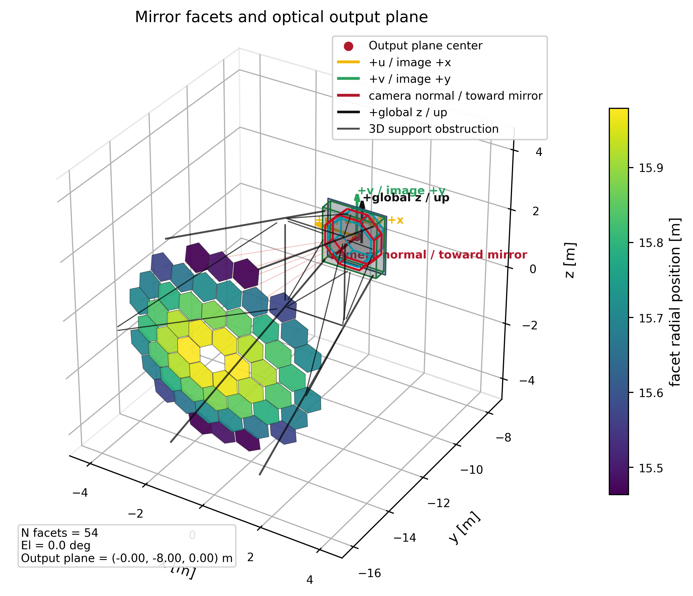
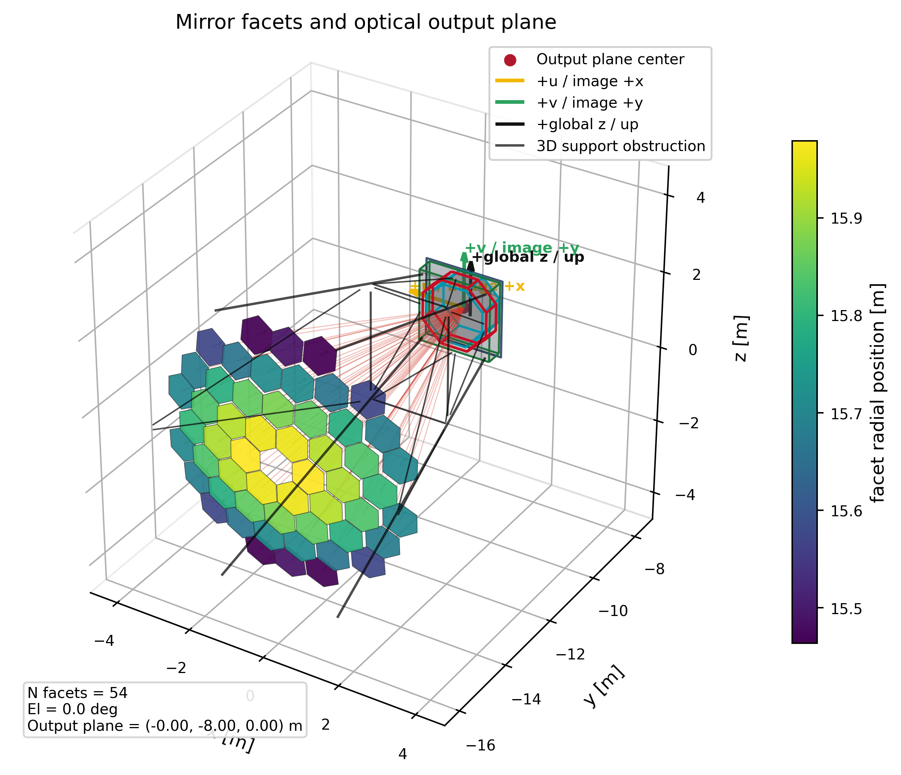

# LACT_sim Coordinate Systems

This document is the reference convention for CORSIKA/EventIO input, telescope
pointing, optical ray tracing, camera images, and array-layout plots.

For a Chinese explanation that explicitly separates input, ray-tracing, map,
and pyLAST display coordinates, see
[coordinate_systems_zh.md](coordinate_systems_zh.md).

## Short Answer

For CORSIKA/EventIO runs, LACT_sim keeps the CORSIKA horizontal coordinate
system as the canonical metadata frame:

```text
CORSIKA IACT frame = NWU
+x : magnetic North
+y : West
+z : Up
```

This is not the usual ENU frame. LACT_sim does not currently apply a magnetic
declination correction from magnetic north to geographic true north. Therefore
all CORSIKA/EventIO telescope positions, core positions, and CORSIKA provenance
tables use **magnetic-North-West-Up** coordinates.

For plots that should look like a conventional map, LACT_sim converts only at
the plotting layer:

```text
plot North =  CORSIKA x
plot East  = -CORSIKA y
plot Up    =  CORSIKA z
```

So the program is internally consistent with CORSIKA. If later you need true
geographic NEU/ENU, add one explicit rotation by the site magnetic declination
before comparing to GPS/geographic coordinates.

## Coordinate Frames

Open the [LACT coordinate diagnostic workbench](assets/lact-coordinate-system-3d.html).
It separates four views: coordinate definitions without an event; four real
parallel-light sky directions; an elevation series whose deformation, rays,
output plane, and camera change atomically; and a real CORSIKA event. In the
parallel-light view the telescope is fixed at azimuth 0 deg and elevation 70
deg. The sources are at `(az, el) = (0,71), (0,69), (-1,70), (+1,70)` deg.
Each case is a separate current-C++ run and retains its real mirror points,
incoming/reflected obstruction flags, output-plane coordinates, and camera
pixels. Diagnostic `obstruction.mark_only=true` preserves blocked rows without
counting them as physical output or camera hits. The program does not store the
exact primitive-intersection coordinate, so the page never fabricates one.
The four camera thumbnails also act as the single case selector: selecting one
switches the camera, 3D rays, mirror statistics, and diagnostics together. The
camera plot embeds every physical output-plane `u/v` row and every accepted
camera-hit `u/v` row; only the 3D ray paths are stratified samples for legibility.
The global and elevation pages default to a display-camera elevation of 0 deg
and azimuth of 180 deg, so the ground plane projects to one horizontal horizon
line. These display-camera angles do not modify telescope pointing. The
event-1909 view shows 240 sampled, zem-derived
emission positions per selected high-signal telescope as larger scatter marks.
The [interactive coordinate-system explorer](assets/coordinate-system-explorer.html)
provides the complementary switchable view of file fields and the final pyLAST
display orientation.

The current diagnostic workbench explicitly opts into
`configs/cameras/new_camera_1664.cfg`, backed by
`configs/cameras/new_camera_pixels_1664.csv`. The first 1616 pixel records are
byte-for-field identical to the previous geometry and the new layout adds 48
corner pixels (IDs 1617--1664). This does not change the project-wide camera
default for unrelated configurations. The workbench verifies that the
event-1909 ROOT `camera_pixels` geometry matches this CSV before embedding any
camera image.

The 3D HTML is generated from the real configuration by repository Python code:

```bash
python python/build_coordinate_diagnostics_html.py \
  --output docs/assets/lact-coordinate-system-3d.html
```

### Audited real CORSIKA example

The pale-yellow paths in the 3D page are actual `run_corsika_trace` output, not
schematic rays. The reproducible configuration is
`configs/examples/corsika_coordinate_north_example.cfg`: telescope azimuth 0
(magnetic North), elevation 70 deg, and `corsika_nwu_relative` input. CORSIKA
shower 1 itself arrives at azimuth 300.027133 deg North-to-East and altitude
88.282787 deg; event truth does not override the configured telescope pointing.

The run saved 3385 output-plane hits. The embedded sample selects 128 paths
uniformly from the 1557 saved hits for event 110, telescope 0. Every row retains
the raw NWU input, real local input anchor/direction, mirror hit, reflected
direction, output hit, and `u/v`. The same stream has 520 raw input bunches.
See
[`corsika-north-example-rays.csv`](assets/data/corsika-north-example-rays.csv),
[`corsika-north-example-raw-input.csv`](assets/data/corsika-north-example-raw-input.csv),
[`corsika-north-example-summary.csv`](assets/data/corsika-north-example-summary.csv),
and the hashes/command in
[`corsika-north-example-provenance.json`](assets/data/corsika-north-example-provenance.json).

The companion aligned whiteboard and camera runs use the same shower pointing.
Their selected event 117/telescope 0 has 1351 full output-plane hits, 18
non-zero pixels, and 1149 camera hits; see
[`corsika-aligned-camera-pixels.csv`](assets/data/corsika-aligned-camera-pixels.csv).

The main coordinate audit also corrected three inconsistencies: the CORSIKA
runner now logs the actual source-adapter basis instead of a generic layout
basis; whiteboard CSV adds unambiguous `input_dir_x/y/z` fields (the existing
`dir_x/y/z` fields are reflected output direction); and sky-up Python plots now
select the source adapter through one shared implementation. The static
coordinate-system wrapper also uses the source adapter by default.

### 1. CORSIKA / EventIO Array Frame

CORSIKA IACT photon bunches and EventIO telescope tables are interpreted in the
CORSIKA horizontal frame:

```text
x_N_m : magnetic North positive
y_W_m : West positive
z_U_m : Up positive
```

In HDF5 these are stored with explicit names:

```text
/telescopes/table:
  array_x_north_m
  array_y_west_m
  array_z_up_m

/events/corsika:
  core_x_north_m
  core_y_west_m
```

The legacy aliases `x_m,y_m,z_m` in `/telescopes/table` are kept for old
scripts, but new code should use the explicit `array_x_north_m`,
`array_y_west_m`, and `array_z_up_m` names.

### 2. EventIO Photon Bunch Frame

The hessio/CORSIKA bunch definitions are:

```text
struct bunch:
  x, y       photon arrival position relative to telescope [cm]
  cx, cy     direction cosines in the CORSIKA horizontal frame

struct bunch3d:
  x, y, z    photon arrival position relative to telescope [cm]
  cx, cy, cz direction cosines in the CORSIKA horizontal frame
```

Important point:

```text
Photon bunch x/y/z are already relative to the selected telescope center.
They are not absolute array coordinates.
```

For the usual 2D CORSIKA bunch format, LACT_sim reconstructs:

```text
cz = -sqrt(1 - cx^2 - cy^2)
```

The negative sign means the photon is travelling downward in the CORSIKA
vertical coordinate.

The EventIO bunch stores telescope-relative `x` and `y`, but no per-bunch `z`.
After rotating that anchor into telescope-local coordinates, the existing
scalar setting translates it to the optical model's local origin:

```ini
source.eventio_reference_z_m=-16
```

The scalar is applied internally as the telescope-local offset `(0,0,-16 m)`.
It preserves each bunch's physical x/y. The same setting applies to 2D and 3D
EventIO: 2D starts from its implicit `z=0`, while 3D retains its explicit z
before adding the offset.

The default is `-16 m`. This is the coordinate mapping for the current imported
LACT model: the mirror vertex is near `z=-16 m` and the camera near `z=-8 m`,
whereas sim_telarray's corresponding optical coordinates place the mirror
vertex near `z=0` and the camera near `z=+8 m`. It is not a statement that the
photons were created 16 m below the mirror, and it does not change CORSIKA's
global observation level.

`0` remains supported for coordinate diagnostics, but it is not an equivalent
origin for this imported geometry. Changing only this value keeps EventIO
`x`, `y`, direction, and time fixed and therefore defines a different parallel
line in the local optical model; different camera results are expected.

The default `source.eventio_2d_plane_mode=auto` treats every 2D EventIO bunch
as a complete incoming line. Mirror intersection may therefore have either
sign of `t`; the photon direction is still used to require front-face
incidence. Use `forward` only when the input position is known to be a real
upstream ray origin rather than a record-plane anchor.

CORSIKA telescope positions, including different telescope heights, remain
array/global metadata used for the shower wavefront and timing. Since bunch
`x,y` are already relative to each telescope, telescopes using the same optical
model all use the same local `-16 m` shift. Do not add a telescope's installation
height to this local value.

A six-column CSV cut from CORSIKA should retain raw `z_m=0` and set
`source.eventio_2d=true` in its cfg instead of rewriting the NWU z column.

### 3. Telescope Pointing In The CORSIKA Frame

For CORSIKA/EventIO mode, LACT_sim uses an azimuth convention compatible with
hessio/sim_telarray:

```text
pointing_az_deg = 0    points to +x, magnetic North
pointing_az_deg = 90   points to -y, East
pointing_az_deg = 180  points to -x, South
pointing_az_deg = 270  points to +y, West
pointing_el_deg        elevation above horizon
zenith_deg             90 - pointing_el_deg
```

The telescope optical-axis unit vector in CORSIKA NWU coordinates is:

```text
z_axis = ( cos(el) cos(az),
          -cos(el) sin(az),
           sin(el) )
```

For a CORSIKA file named or configured as `zenith=20 deg, azimuth=0 deg`, use:

```ini
telescope.pointing_az_deg=0
telescope.pointing_el_deg=70
```

Again, this azimuth zero is CORSIKA magnetic north unless an external
declination correction is explicitly applied.

### 4. Generic LACT Telescope Frame

`buildTelescopeFrame()` is used by `run_optical_sim` for synthetic sources,
PhotonCsv optical debugging, mirror geometry, output planes, and visualization
helpers. It now uses the same NWU convention as the CORSIKA adapter:

```text
x_axis = ( sin(az),          cos(az),        0       )
y_axis = (-sin(el) cos(az),  sin(el) sin(az), cos(el))
z_axis = ( cos(el) cos(az), -cos(el) sin(az), sin(el))
```

Therefore:

```text
global +X = North, global +Y = West, global +Z = Up
az = 0 deg points North; positive az rotates clockwise toward East
at az = 0 deg: local +x points West and local +y points sky-up
```

Pure-optical and CORSIKA entry paths therefore place the same telescope-local
mirror geometry in the same physical direction. `run_optical_sim` still
intentionally rejects `source.mode=EventIO`; that restriction concerns the
input reader, not the coordinate convention.

### 4.1 Explicit ENU East-Start Input Frame

PhotonCsv input may instead use an explicit East-North-Up frame:

```ini
source.coordinate_frame=enu_east_relative
# or
source.coordinate_frame=enu_east_global
```

Its axes and pointing convention are:

```text
+x : East
+y : North
+z : Up

pointing_az_deg = 0    points East
pointing_az_deg = 90   points North
pointing_az_deg = 180  points West
pointing_az_deg = 270  points South
```

The boresight is:

```text
z_axis = ( cos(el) cos(az),
           cos(el) sin(az),
           sin(el) )
```

The `_relative` variant interprets photon positions as already relative to the
selected telescope. The `_global` variant interprets positions as absolute ENU
array coordinates and subtracts `telescope.position_m` once.

To convert a CORSIKA NWU row and pointing into the same physical ENU row:

```text
x_ENU = -y_NWU
y_ENU =  x_NWU
z_ENU =  z_NWU

dir_x_ENU = -dir_y_NWU
dir_y_ENU =  dir_x_NWU
dir_z_ENU =  dir_z_NWU

az_ENU_east_start = 90 deg - az_NWU_north_to_east
```

Angles may be wrapped to `[0, 360)`. This is an axis/convention conversion
only; it does not apply magnetic declination.

### 5. Telescope-Local Optical Frame

The optical ray tracer works in a telescope-local frame:

```text
local +z : telescope optical axis, from mirror toward sky
local -z : on-axis incoming photon direction, from sky toward mirror
local +x : transverse horizontal axis, toward increasing azimuth
local +y : increasing elevation / sky-up axis
```

The figure below is a concrete visual check for the generic telescope frame at
`telescope.pointing_el_deg=0` and `telescope.pointing_az_deg=90`.  It marks the
global axes, the telescope-local optical axes, and the camera/output-plane
`u/v` axes.  In this edge-on pointing case, the local optical `+z` axis is
horizontal, while the plotted sky-up direction is the global `+Z`.



The second view includes the mirror, camera plane, and camera axes used by the
layout visualizer.  The optical code and the plotting code use the same
telescope-local basis; display-only plot rotations are applied only to make the
global sky/up direction appear upward in 2D figures.



正常的 CORSIKA 输入应显式选择既有的 CORSIKA 适配器：

```ini
source.coordinate_frame=corsika_nwu_relative
```

LACT_sim constructs this CORSIKA-NWU-to-local basis:

```text
local x_axis = (  sin(az),          cos(az),         0       )
local y_axis = ( -sin(el) cos(az),  sin(el) sin(az), cos(el) )
local z_axis = (  cos(el) cos(az), -cos(el) sin(az), sin(el) )
```

The three vectors form one right-handed optical basis:
`x_axis cross y_axis = z_axis`. At `az=0`, local `+x` is West and local `+y`
is sky-up.

Then each EventIO photon bunch is rotated by dot products:

```text
local_pos = ( dot(pos_NWU, x_axis),
              dot(pos_NWU, y_axis),
              dot(pos_NWU, z_axis) )

local_dir = ( dot(dir_NWU, x_axis),
              dot(dir_NWU, y_axis),
              dot(dir_NWU, z_axis) )
```

Because EventIO photon positions are already telescope-relative, the standard
`corsika_nwu_relative` mode does not subtract the EventIO telescope position. Telescope
positions are still written to HDF5 for provenance and array-level plotting.
This CORSIKA transform is used by `run_corsika_trace`.

其余 `source.coordinate_frame` 选项只控制输入行进入既有光追逻辑之前的
解释方式；不会重新定义镜面、输出平面、相机或画图坐标。

### 6. Array Layout Plots

Array-layout plots display generic `x/y` axes to avoid mixing plot labels with
stored CORSIKA `x/y` fields. The plotting coordinates are:

```text
plot x = -array_y_west_m
plot y =  array_x_north_m
```

Core positions are plotted the same way:

```text
core plot x = -core_y_west_m
core plot y =  core_x_north_m
```

The lower-left compass marks the physical North/East directions on top of these
generic plot axes. Telescope and event arrows use the same displayed `x/y`
coordinates.

## Core Position And MC_TELOFF

CORSIKA files with `CSCAT` can reuse one shower with several randomly shifted
array positions. EventIO stores those shifts in `MC_TELOFF`.

hessio defines `MC_TELOFF` as:

```text
offset of the detector array with respect to the shower core
```

Therefore `MC_TELOFF` is not the core position itself. To get the core position
in the same coordinate system as the input `TELESCOPE` positions:

```text
xcore_input = -xoff
ycore_input = -yoff
```

LACT_sim writes this corrected value to:

```text
/events/corsika/core_x_north_m
/events/corsika/core_y_west_m
```

The raw shower-header core is still preserved once per CORSIKA shower in:

```text
/events/corsika_showers
```

That table is mainly for provenance and debugging. For event-level analysis and
array plots, use `/events/corsika`.

Example for the default test file:

```text
event_id = 46889801
MC_TELOFF array_id=1: xoff = 586.0925 m, yoff = 92.5612 m

stored core:
  core_x_north_m = -586.0925 m
  core_y_west_m  =  -92.5612 m

plotted:
  North = -586.0925 m
  East  =   92.5612 m
```

## CORSIKA Direction Angles

The CORSIKA event header contains shower `THETA`, `PHI`, and `ARRANG`. LACT_sim
stores:

```text
theta_deg
phi_deg
array_rotation_deg
azimuth_north_to_east_deg
```

The hessio-compatible conversion used in the reader is:

```text
azimuth_north_to_east = ARRANG - PHI + 180 deg
```

This is an arrival/pointing convention in the CORSIKA frame. `ARRANG` is the
CORSIKA IACT array arrangement angle. It is not the telescope optical pointing
by itself. The optical trace uses:

```ini
telescope.pointing_az_deg
telescope.pointing_el_deg
```

to build the telescope-local optical frame.

## Camera / Whiteboard Plane

The whiteboard and pixel camera lie on the output plane in telescope-local
coordinates. The current LACT optical convention is:

```text
mirror facets are near z = -16 m
focal plane is near z = -8 m
camera normal points toward the mirror: (0, 0, -1)
```

Recommended configuration:

```ini
output.plane_point=0,0,-8
output.plane_normal=0,0,-1
output.plane_u_axis=-1,0,0
output.plane_v_axis=0,1,0
```

Camera configs normally include `configs/outputs/focal_plane_f8.cfg`; whiteboard
tests normally include `configs/outputs/whiteboard_f8.cfg`. They define the
same 8 m plane, but the names distinguish whether the plane is being used as a
real camera face or as a virtual diagnostic whiteboard.

The normal defines the camera front-face direction. Ray-plane intersection is
two-sided, and optical incidence uses `abs(dot(ray, normal))`, so changing only
the normal sign does not by itself change whether photons hit the plane.

The image coordinates are set by `u/v`:

```text
image x = hit.u_m = dot(hit_position - plane_point, plane_u_axis)
image y = hit.v_m = dot(hit_position - plane_point, plane_v_axis)
```

The camera pixel CSV uses the same output-plane coordinates, stored as:

```text
x_m, y_m
```

These are camera/image coordinates, not CORSIKA array coordinates.

At the LACT ROOT/pyLAST boundary, `LactEventSource` converts focal-plane image
coordinates to source-offset coordinates:

```text
pyLAST pix_x = -v
pyLAST pix_y = -u
```

The current `pylast.visualize.plot_camera_image()` then draws `pix_y` on the
horizontal Matplotlib axis and `pix_x` on the vertical axis. Therefore its
display axes are `horizontal=-u`, `vertical=-v` for the current two-main implementation. Use
`python/plot_photon_csv_root_pylast.py --coordinate-view lact-uv` to draw the
same pyLAST event with raw LACT_sim `u` horizontal and `v` vertical.

### Camera Handedness

The telescope-local optical frame is right-handed:

```text
local x cross local y = local z
```

The recommended camera/image axes keep the camera image coordinates aligned
with the telescope-local mirror coordinates:

```text
u = local +x
v = local +y
```

Therefore:

```text
u cross v = local +z
```

At the same time, the camera front-face normal is defined to point toward the
mirror:

```text
camera normal = local -z
```

So the ordered triple `(u, v, camera normal)` is **not** right-handed:

```text
u cross v = -camera normal
```

This is intentional. It keeps camera image `x/y` in the same direction as the
mirror-layout `x/y`, while the physical camera normal still points toward the
mirror. If a later module needs a right-handed camera-surface basis, use
`(u, v, -normal)` or explicitly flip one image axis and document the image
orientation change.

To inspect this visually for any cfg, use:

```bash
MPLBACKEND=Agg MPLCONFIGDIR=/tmp python3 python/plot_coordinate_system_3d.py \
  --config path/to/run.cfg \
  --output coordinate_system_3d.png
```

## Synthetic Parallel-Beam Angles

Analytic optical tests do not use CORSIKA coordinates. For:

```ini
source.mode=ParallelBeam
source.beam_theta_deg=...
source.beam_phi_deg=...
```

the angles are defined directly in the telescope-local optical frame. They
describe photon propagation direction:

```text
beam_direction = ( sin(theta) cos(phi),
                   sin(theta) sin(phi),
                  -cos(theta) )
```

So:

```text
theta = 0 deg  -> on-axis photons, direction (0, 0, -1)
phi = 0 deg    -> positive local x photon component
phi = 90 deg   -> positive local y photon component
phi = 180 deg  -> negative local x photon component
phi = 270 deg  -> negative local y photon component
```

The apparent sky offset is opposite the transverse photon propagation
component. The focal-plane image of a reflecting telescope is inverted relative
to the sky offset; with the recommended `u=+x, v=+y`, the image centroid has
the same sign as the transverse photon direction.

Example:

```ini
source.beam_theta_deg=3
source.beam_phi_deg=270
```

Photons travel with a negative local-y component, corresponding to a sky source
at positive local-y offset. The focal-plane centroid is expected at negative
camera `v`.

## Practical Rules

1. For CORSIKA/EventIO HDF5 metadata, read coordinates as NWU:
   `x=N`, `y=W`, `z=U`.
2. For array plots, display generic `x/y`; the lower-left compass marks N/E.
3. For event-level core positions, use `/events/corsika`, not
   `/events/corsika_showers`.
4. For CORSIKA files with `CSCAT`, core position is `-MC_TELOFF`.
5. For telescope pointing, use CORSIKA-compatible azimuth:
   `0=N`, `90=E=-y`.
6. For camera images, use output-plane `u/v`; these are not array coordinates.
7. Magnetic north is not automatically converted to true north. If a future
   analysis needs true geographic coordinates, apply a site magnetic
   declination rotation explicitly and document its sign and epoch.
